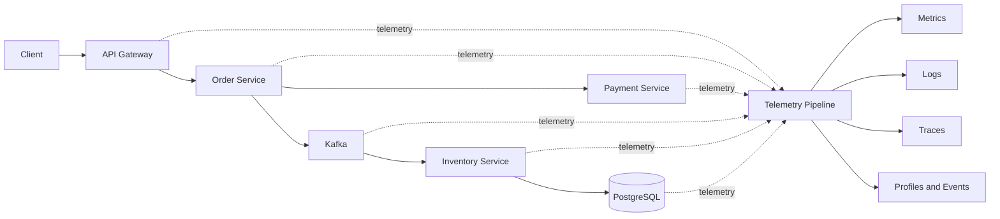
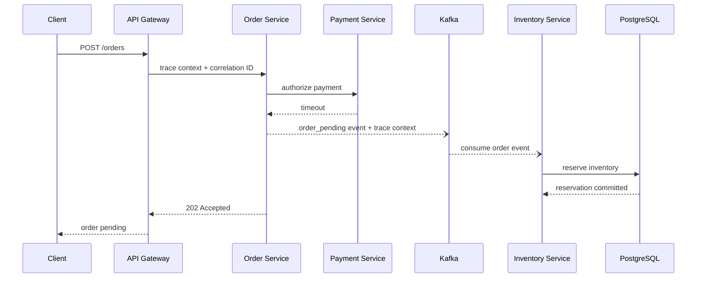

## 1. Executive Summary

Production systems rarely fail with a single obvious error. A checkout can remain available while one region, payment route, tenant, or deployment version becomes slow. **Monitoring** tells operators that a known condition crossed a threshold; **observability** provides enough correlated evidence to investigate failure modes that were not predicted when the dashboard was built.

An observable platform should answer five questions quickly:

1. What failed?
2. Where did it fail?
3. Why did it fail?
4. Which users or transactions were affected?
5. Which dependency caused the delay?

The architecture goal is not to buy five isolated tools. It is to preserve context across metrics, logs, traces, profiles, and events so responders can move from a customer-visible symptom to defensible evidence.

---

## 2. Problem It Solves

Monitoring is necessary for detection, but insufficient for diagnosis.

| Operational question | Monitoring alone | Correlated observability |
| :--- | :--- | :--- |
| Is checkout unhealthy? | Error-rate alert | Error rate by route, region, version, and dependency |
| Where is time spent? | Service latency chart | Critical-path spans and queue wait time |
| Why did payment fail? | Failed-request count | Trace-linked error event and gateway response class |
| Who was affected? | Aggregate outage estimate | Bounded tenant tier or tokenized transaction lookup |
| Did a release cause it? | Deployment annotation | Version attributes across every telemetry signal |

Observability does not eliminate the need for runbooks or domain knowledge. It reduces the search space and makes operational hypotheses testable.

---

## 3. Visual Architecture

The telemetry path must not become a synchronous dependency of the business path. Applications buffer and export asynchronously; collectors enforce backpressure, redaction, sampling, and routing.

---

## 4. Core Diagnostic Flow

During an incident:

- **Metrics** detect the symptom: payment timeout rate and order latency increased.
- **A trace** locates the slow hop: most critical-path time is in Payment Service's external gateway call.
- **Structured logs** explain the failure: the gateway returned a timeout after two retries.
- **Correlation and trace identifiers** connect the request, retry attempts, Kafka event, inventory work, and order outcome.
- **Profiles** can explain CPU or allocation pressure inside a hot process when spans alone cannot.
- **Events** place deployments, configuration changes, and autoscaling actions on the incident timeline.

---

## 5. Telemetry Signals

| Signal | Best for | Poor fit when used alone |
| :--- | :--- | :--- |
| Metrics | Trends, alerting, SLOs, capacity | Explaining one transaction |
| Logs | Discrete decisions, failures, audit evidence | Fleet-wide latency distributions |
| Traces | Cross-service paths and latency attribution | Long-term aggregate reporting |
| Profiles | CPU, allocation, lock, and runtime hotspots | Establishing customer impact |
| Events | Deployments and state changes | Continuous health measurement |

See [Metrics, Logs, Traces, Profiles, and Events](/microservices/08-observability/metrics-logs-and-traces/) for signal-selection guidance. No single signal is the source of truth for every question.

---

## 6. Architecture Standards

An architecture review should require a minimum telemetry contract for every production service:

| Standard | Required decision |
| :--- | :--- |
| Service identity | Stable service, environment, region, and deployment-version attributes |
| Request health | RED metrics for synchronous entry points and critical dependencies |
| Resource health | USE metrics for CPU, memory, queues, pools, brokers, and storage |
| Context | W3C trace context across HTTP/RPC and message metadata across async boundaries |
| Logs | Structured event names, severity, trace/span IDs, and bounded diagnostic fields |
| Time | UTC timestamps and synchronized hosts |
| Ownership | Service owner, dashboard owner, alert route, and runbook |

Naming conventions are platform contracts. If one team calls the same route `checkout`, another `CheckoutAPI`, and another `/orders/123`, cross-service queries become unreliable and cardinality grows without adding information.

---

## 7. Trade-offs

| Decision | Benefit | Cost or failure mode |
| :--- | :--- | :--- |
| Instrument every boundary | Complete dependency map | Runtime and ingestion overhead |
| Retain all raw telemetry | Maximum forensic depth | Unsustainable storage and compliance exposure |
| Aggressive sampling | Predictable cost | Rare failures may disappear |
| Vendor-specific agents | Faster access to advanced features | Lock-in and inconsistent semantics |
| OpenTelemetry-first | Portable instrumentation and routing | Collector and semantic-convention governance |
| Central platform defaults | Consistency across teams | Defaults may miss domain-specific evidence |

Observability is a reliability subsystem with its own capacity, availability, and degradation strategy—not an unlimited stream of debug data.

---

## 8. Failure Scenarios

| Failure | Operational consequence | Architecture response |
| :--- | :--- | :--- |
| Trace context dropped at Kafka | Async work looks unrelated | Standard message headers and propagation tests |
| Collector queues fill | Recent incident evidence is lost | Bounded queues, retry policy, load shedding, drop metrics |
| User IDs become metric labels | Backend cost and query latency spike | Bounded dimensions; investigate users through secure logs/traces |
| Telemetry export blocks requests | Observability causes an outage | Asynchronous export with strict memory and timeout limits |
| PII copied into baggage | Sensitive data crosses every service | Allowlist baggage and redact at SDK plus collector |
| Different retention for no reason | Cost grows and investigations stay slow | Signal-specific hot, warm, and archive tiers |

---

## 9. Security and Governance

Telemetry frequently contains URLs, database statements, payload fragments, identity claims, and infrastructure metadata. Treat it as production data:

- Never record secrets, access tokens, credentials, or raw payment data.
- Prefer allowlists over denylist-only redaction.
- Tokenize sensitive transaction identifiers when lookup is operationally necessary.
- Restrict baggage because it propagates beyond the originating service.
- Separate application access from audit and security-log access.
- Encrypt data in transit and at rest; apply tenant isolation and regional routing.
- Define retention by investigation, legal, and compliance requirements—not a universal default.

High-cardinality identifiers belong in access-controlled logs or sampled traces, not metric labels.

---

## 10. Architect Interview Answer

> Monitoring detects expected symptoms through predefined dashboards and alerts; observability gives us correlated evidence to investigate unknown failure modes. I standardize RED metrics at service boundaries, USE metrics for constrained resources, structured event logs, and distributed tracing with context propagated across HTTP and messaging. Metrics show customer impact, traces isolate the slow dependency, and trace-linked logs explain the decision or exception. I also design the telemetry pipeline for sampling, backpressure, redaction, retention, cost, ownership, and its own availability objectives.

---

## 11. Module Roadmap

Start with [Telemetry Signals](/microservices/08-observability/metrics-logs-and-traces/) and [Correlation IDs and Context Propagation](/microservices/08-observability/correlation-and-context-propagation/). Apply the [RED and USE Diagnostic Workflow](/microservices/08-observability/red-use-diagnostic-workflow/) before designing the [OpenTelemetry Architecture](/microservices/08-observability/opentelemetry-architecture/) and individual signals. Then define [SLO-driven alerting](/microservices/08-observability/alerting-slos-and-error-budgets/), select a platform using explicit [stack criteria](/microservices/08-observability/choosing-observability-stack/), rehearse [production failures](/microservices/08-observability/production-failure-scenarios/), assess [organizational maturity](/microservices/08-observability/observability-maturity-model/), and finish with the [Architect Checklist](/microservices/08-observability/architect-checklist/).

Related material:

- [System Design — Observability Fundamentals](/system-design/observability-fundamentals/) for interview revision
- [Distributed Logging System](/system-design/distributed-logging-system/) for a logging-platform case study
- [Reliability Engineering](/microservices/10-production-playbook/reliability-engineering/) for SLO operations
- [Kubernetes — OpenTelemetry](/kubernetes-handbook/opentelemetry/) for platform instrumentation
