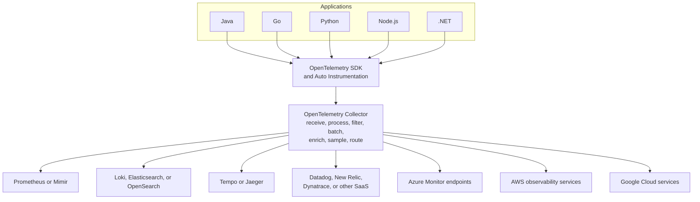
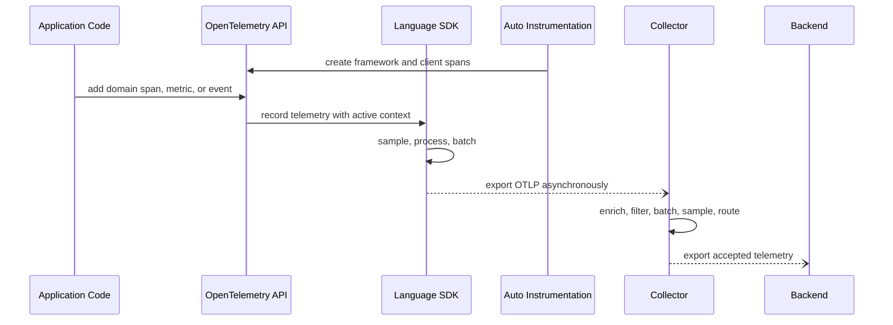

## 1. Executive Summary

OpenTelemetry standardizes how applications create, describe, propagate, and export telemetry. Its architecture separates **instrumentation** from **telemetry processing and backend selection**:

- The **API** is the application-facing contract used by application code and instrumentation libraries.
- The **SDK** implements sampling, processors, resource configuration, and export for a language runtime.
- **Automatic instrumentation** covers supported frameworks and libraries with little or no source change.
- **Manual instrumentation** adds domain-specific spans, metrics, events, and attributes where generic libraries lack business context.
- The **OpenTelemetry Collector** receives, processes, and exports telemetry outside the application process.

OpenTelemetry reduces instrumentation lock-in; it does not make storage schemas, queries, dashboards, pricing, or advanced backend features portable automatically.

---

## 2. Problem It Solves

Direct vendor integration appears simple until every service owns credentials, retry behavior, exporter configuration, redaction, and a different version of a proprietary agent.

| Direct application responsibility | Architecture consequence |
| :--- | :--- |
| Backend credentials in every workload | Larger secret-rotation and compromise surface |
| Vendor endpoint coupled to application config | Expensive migration and inconsistent rollout |
| Retries and queues inside each process | Business memory competes with telemetry buffering |
| Per-service filtering and enrichment | Policy drift and duplicated implementation |
| Multiple exporters per signal | Higher application CPU, memory, and failure complexity |
| No centralized sampling | Cost controls differ by team and miss complete traces |

The Collector moves common processing into an independently operated telemetry plane. Applications still need safe SDK configuration because telemetry can be dropped before it reaches a Collector.

---

## 3. Reference Architecture



Backend support depends on the selected Collector distribution, exporter, protocol, and backend endpoint. Treat the diagram as a routing architecture—not a claim that every exporter ships in every Collector distribution.

---

## 4. Instrumentation Flow



Automatic instrumentation should establish broad coverage first: inbound requests, outbound clients, database calls, and supported messaging libraries. Manual instrumentation should describe critical business operations such as `payment.authorize` or `inventory.reserve`, not duplicate spans already emitted by libraries.

---

## 5. API, SDK, Resources, and Semantics

| Component | Owns | Architect decision |
| :--- | :--- | :--- |
| API | Creating and correlating telemetry | Libraries should depend on the API rather than configure exporters |
| SDK | Sampling, processors, readers, resource data, export | Platform defaults and service-level override policy |
| Resource | Entity producing telemetry | Stable `service.name`, environment, region, instance, and version |
| Instrumentation scope | Library/module producing telemetry | Versioned ownership and schema diagnosis |
| Semantic conventions | Common operation and attribute names | Adoption version and migration policy |
| OTLP | Telemetry transport and data model | Secure application-to-Collector protocol and endpoint |

Resource attributes describe the producer and should remain stable for its lifetime. Span or metric attributes describe an operation or measurement. Avoid copying high-cardinality request context into resources.

Semantic conventions make cross-language queries possible, but conventions evolve. Pin instrumentation versions, review convention changes, and avoid maintaining a competing internal name for a concept already standardized.

---

## 6. Context Propagation and Baggage

Trace context preserves parent-child relationships across process boundaries. Configure compatible propagators across Java, Go, Python, Node.js, and .NET, including HTTP/RPC clients and messaging libraries.

Baggage is a separate propagated key-value store. It does not become a span, metric, or log attribute unless instrumentation explicitly copies it. Apply these controls:

- Allowlist keys and define their owner and purpose.
- Reject or truncate excessive key counts and value sizes.
- Never propagate credentials, tokens, raw PII, or authorization proof.
- Remove internal baggage before calls to untrusted external services.
- Treat incoming baggage as untrusted input without integrity guarantees.

See [Correlation IDs and Context Propagation](/microservices/08-observability/correlation-and-context-propagation/) for identifier and async-boundary policy.

---

## 7. Why the Collector Exists

Collector pipelines are composed from **receivers**, optional **processors**, and **exporters**. Connectors can join pipelines when one signal is derived from or routed into another pipeline.

```text
receiver → processors → exporter
```

| Collector responsibility | Architectural value |
| :--- | :--- |
| Receive OTLP and approved legacy formats | Decouple application export from backend protocol |
| Batch and compress | Reduce backend request overhead |
| Retry with bounded queues | Absorb short backend or network failures |
| Detect/enrich resources | Apply consistent platform metadata |
| Filter and transform | Remove noise and sensitive attributes centrally |
| Tail sample traces | Retain slow, failed, or policy-relevant complete traces |
| Route to multiple backends | Support migration, residency, or signal-specific platforms |
| Centralize credentials | Keep backend secrets out of application workloads |

The Collector cannot guarantee delivery without bounds. Memory queues can be lost on restart; persistent queues consume disk and can still fill; retries eventually expire. Define what is dropped first and expose accepted, refused, queued, retried, failed, and exported telemetry metrics.

---

## 8. Deployment Models

| Model | Best fit | Advantages | Primary risks |
| :--- | :--- | :--- | :--- |
| Agent | Host-local collection and low-latency forwarding | Local discovery, small failure domain | Configuration replicated across hosts |
| Gateway | Central policy, credentials, routing, and backend egress | Independently scalable processing | Network dependency and larger blast radius |
| Hybrid agent-to-gateway | Large Kubernetes or multi-environment estates | Local collection plus centralized heavy processing | Two tiers, more capacity and failure analysis |
| Sidecar | Workload isolation or exceptional per-pod policy | Strong local ownership | High resource overhead and upgrade count |
| Direct to backend | Small/simple deployment with native OTLP | Fewest moving parts | Application-side credentials, policy, and retry coupling |

In Kubernetes:

- Use a **DaemonSet agent** for node-local host metrics and file-based log collection.
- Use a **Deployment gateway** behind a stable service for centralized processing and egress.
- Run cluster-wide receivers with deliberate singleton or sharding behavior to avoid duplicate collection.
- Use sidecars only when isolation requirements outweigh per-pod CPU, memory, configuration, and lifecycle cost.

Deployment shape follows receiver state. A Prometheus-style scraper or cluster-wide receiver cannot be replicated blindly without duplicate collection or explicit target allocation.

---

## 9. Sampling, Availability, and Backpressure

### Sampling

| Strategy | Decision point | Strength | Risk |
| :--- | :--- | :--- | :--- |
| Head sampling | At trace start | Protects applications and pipeline early | Cannot know final latency or error outcome |
| Consistent probability | At trace start using trace identity | Representative whole traces at a known rate | Rare critical classes need separate policy |
| Tail sampling | After enough of the trace arrives | Keep errors, slow traces, or policy classes | Stateful, memory-intensive, delayed, trace-affinity required |

Tail sampling behind multiple gateways requires spans for the same trace to reach the same sampling instance. Use trace-aware load balancing and capacity for incomplete traces; ordinary round-robin routing can fragment decisions.

### Availability and backpressure

- Deploy gateway replicas across failure domains and regions.
- Prefer regional ingestion so application telemetry does not depend on a cross-region link.
- Bound SDK and Collector queues so telemetry cannot exhaust business workloads.
- Use memory limiting before memory-intensive processing.
- Configure retries for transient failures and explicitly cap retry duration.
- Consider persistent queues where loss tolerance and disk operations justify them.
- Load test the pipeline for peak spans, logs, metric points, and backend throttling.
- Monitor Collector CPU, memory, queue occupancy, refusals, export failures, and dropped data.

When overloaded, preserving business traffic takes priority. The degradation order should be documented—for example, drop verbose logs before SLO metrics and security audit evidence.

---

## 10. Architecture Trade-offs

| Decision | Choose when | Accept |
| :--- | :--- | :--- |
| OpenTelemetry API/SDK and OTLP | Portability and common governance matter | Collector/platform ownership and convention migrations |
| Vendor-specific SDK | A differentiated feature has material operational value | Lock-in, dual-instrumentation risk, and migration work |
| OTel plus vendor distribution | Standard data model with supported packaging is desired | Distribution-specific release and extension choices |
| One backend | Operational simplicity outweighs specialized capability | Larger migration blast radius |
| Multiple backends | Residency, transition, or distinct signal needs justify it | Duplicate ingestion cost and routing complexity |
| Regional gateways | Data residency and fault isolation matter | Per-region capacity, configuration, and backend routing |
| Central global gateway | Small estate with simple policy | Cross-region latency and global failure domain |

Vendor neutrality is not the only criterion. Evaluate runtime overhead, diagnostic depth, backend compatibility, security, support model, engineering ownership, and total telemetry cost. Use proprietary enrichment only where its value exceeds the exit cost, and keep the baseline telemetry contract portable.

---

## 11. Architect Checklist

### Instrumentation

- Are API and SDK versions governed per language?
- Does automatic instrumentation cover supported boundaries without duplicate spans?
- Is manual instrumentation reserved for critical domain operations?
- Are resource attributes and semantic conventions consistent?
- Is propagation verified across HTTP, RPC, Kafka, and scheduled work?

### Collector platform

- Is the agent, gateway, hybrid, or sidecar choice justified per receiver and environment?
- Are gateway replicas failure-domain aware and region-local?
- Are queues, retries, memory limits, batching, and data-loss behavior explicit?
- Does tail sampling preserve trace affinity?
- Are credentials centralized and sensitive attributes removed before export?
- Are Collector health, queue, refusal, drop, and export-failure metrics monitored?
- Is backend migration or dual routing tested without uncontrolled duplicate cost?

Official references: [OpenTelemetry components](https://opentelemetry.io/docs/concepts/components/), [Collector deployment patterns](https://opentelemetry.io/docs/collector/deploy/), [sampling](https://opentelemetry.io/docs/concepts/sampling/), and [semantic conventions](https://opentelemetry.io/docs/concepts/semantic-conventions/).
> Advanced kernel-derived visibility can complement this application context. See [eBPF-Based Observability](/microservices/08-observability/advanced/ebpf-observability/); eBPF is not a replacement for semantic OpenTelemetry instrumentation.
