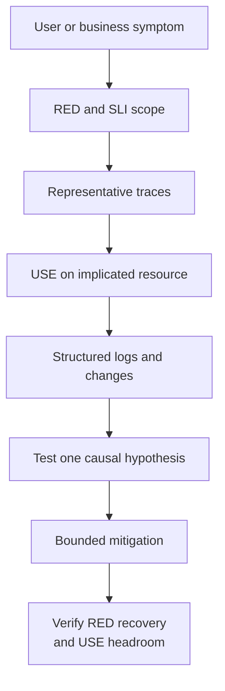

## 1. Executive Summary

Production diagnosis should move from customer impact to causal evidence:

1. Confirm the symptom with RED or a business SLI.
2. Scope the affected operation, outcome, region, version, dependency, and workload class.
3. Use traces to locate the slow or failing boundary.
4. Apply USE to the implicated resource, queue, pool, or host.
5. Confirm the hypothesis with structured logs and change events.
6. Mitigate without moving saturation downstream.
7. Verify customer recovery and resource headroom.

The scenarios below are starting hypotheses, not automatic diagnoses. A high CPU graph does not prove CPU caused latency; a slow database span does not prove storage is responsible; and a falling error rate can reflect lost traffic rather than recovery.

---

## 2. Diagnostic Evidence Model

Before changing production, capture the alert window, dashboards, representative trace IDs, relevant log queries, deployment/configuration events, and baseline. Prefer reversible mitigations and record their time so telemetry can show whether they worked.

---

## 3. API and Dependency Failures

### Scenario 1 — High API Latency

| Evidence or action | Operational guidance |
| :--- | :--- |
| User symptom | Pages/actions are slow; clients approach or exceed deadlines |
| RED indicators | Duration P95/P99 rises; rate may be normal; timeout/retry rate can follow |
| USE indicators | Check service CPU/run queue, pools, queues, disk, network, and downstream capacity |
| Trace evidence | Critical-path span, queue gap, repeated attempts, or serial dependency calls dominate |
| Log evidence | Deadline, slow-operation class, retry decision, version/config change |
| Likely root causes | Saturation, slow dependency, lock contention, queueing, expensive payload/query, network delay |
| First validation | Segment latency by route, outcome, region, version, and dependency; inspect several slow traces |
| Immediate mitigation | Roll back regression, shed noncritical load, reduce expensive work, scale only the validated constraint |
| Long-term fix | Optimize critical path, bound concurrency, repair query/dependency, set latency budgets |
| Architecture prevention | Per-hop deadlines, load tests, SLO burn alerts, capacity model, graceful degradation |

### Scenario 2 — High HTTP Error Rate

| Evidence or action | Operational guidance |
| :--- | :--- |
| User symptom | Requests fail, actions are rejected, or incomplete responses appear |
| RED indicators | Error ratio/count rises by route and error class; rate and duration reveal overload versus fast failure |
| USE indicators | Check saturation only after locating the failing service/dependency |
| Trace evidence | Error status and final successful span identify the boundary that owns the failure |
| Log evidence | Stable `error_type`, response class, dependency outcome, deployment/config event |
| Likely root causes | Bad release/config, dependency outage, capacity rejection, auth/certificate failure, invalid data |
| First validation | Separate `5xx`, timeouts, `429`, cancellations, expected `4xx`, and business failures |
| Immediate mitigation | Roll back, route around dependency, disable faulty feature, shed load, restore credentials/certificate |
| Long-term fix | Contract tests, safer rollout, dependency isolation, validation and configuration governance |
| Architecture prevention | Error-budget alerts, canaries, circuit breakers, bounded retries, synthetic critical journeys |

### Scenario 9 — Downstream Dependency Timeout

| Evidence or action | Operational guidance |
| :--- | :--- |
| User symptom | Requests hang then fail or fall back; partial workflows remain pending |
| RED indicators | Caller duration and timeout ratio rise; retries amplify dependency attempt rate |
| USE indicators | Caller pool waiters may rise; inspect downstream CPU, queues, pools, storage, and network |
| Trace evidence | Downstream client span reaches deadline; attempts and backoff consume critical path |
| Log evidence | Dependency, operation, configured timeout, attempt, final outcome, breaker state |
| Likely root causes | Downstream saturation/outage, network loss, DNS, unrealistic timeout, retry storm |
| First validation | Compare caller timeout with downstream latency and health; measure attempts per logical operation |
| Immediate mitigation | Stop/reduce retries, open breaker, use safe fallback, reroute, increase timeout only with verified capacity |
| Long-term fix | Per-hop latency budgets, bulkheads, idempotency, backpressure, dependency SLO |
| Architecture prevention | Failure isolation, retry budgets, deadline propagation, chaos tests, degraded-mode design |

---

## 4. Compute, Memory, and Isolation Failures

### Scenario 3 — Kubernetes CPU Throttling

| Evidence or action | Operational guidance |
| :--- | :--- |
| User symptom | Tail latency rises although nodes show available CPU |
| RED indicators | P95/P99 increases for pods under load; errors/timeouts may follow |
| USE indicators | Container throttled periods/time high; CPU use approaches limit; run queue may rise |
| Trace evidence | Service span is slow while child dependency spans remain normal |
| Log evidence | Usually little direct evidence; correlate deployment/resource-limit changes |
| Likely root causes | CPU limit too low, bursty workload, expensive release, uneven pod traffic |
| First validation | Compare per-pod throttling, limits, usage, latency, version, and request distribution |
| Immediate mitigation | Raise/remove restrictive limit within policy, scale out, roll back expensive code |
| Long-term fix | Right-size requests/limits from load tests; optimize hot code; improve load balancing |
| Architecture prevention | Throttling dashboards, per-pod RED, capacity margin, progressive delivery |

### Scenario 4 — OOMKilled Containers

| Evidence or action | Operational guidance |
| :--- | :--- |
| User symptom | Intermittent errors, lost in-flight work, reconnects, or consumer reprocessing |
| RED indicators | Errors/timeouts spike around restarts; throughput may dip |
| USE indicators | Working set approaches limit; reclaim/pressure rises; OOM kill and restart counters increment |
| Trace evidence | Traces terminate abruptly; missing final spans can indicate process death/export loss |
| Log evidence | Kubernetes termination reason, runtime memory diagnostics, last GC/allocation events |
| Likely root causes | Leak, unbounded cache/buffer, large payload, batch spike, undersized limit, native memory |
| First validation | Confirm OOM reason; compare heap/native/container memory and version; inspect allocation profile |
| Immediate mitigation | Roll back, raise limit with node headroom, reduce batch/cache/concurrency, shed load |
| Long-term fix | Fix leak, bound memory structures, stream payloads, tune runtime/container limits |
| Architecture prevention | Memory budgets, load/soak tests, queue bounds, graceful checkpointing, OOM alerts |

### Scenario 13 — Noisy-Neighbour Problem

| Evidence or action | Operational guidance |
| :--- | :--- |
| User symptom | One tenant, pod, node, shard, or zone has unpredictable latency/errors |
| RED indicators | Fleet aggregate may look healthy; per-instance/zone/tenant-tier tail latency degrades |
| USE indicators | Shared CPU steal/throttling, I/O/network queues, cache/pool contention on affected placement |
| Trace evidence | Slow requests cluster by node, shard, zone, or shared dependency |
| Log evidence | Placement, throttling, quota, eviction, or tenant workload change events |
| Likely root causes | Resource overcommit, hot tenant/shard, shared disk/network, missing isolation |
| First validation | Compare healthy and affected placements with identical versions and request classes |
| Immediate mitigation | Reschedule, rebalance shard, rate-limit offender, isolate critical workload |
| Long-term fix | Resource quotas, workload classes, dedicated pools/nodes, fair scheduling, partition repair |
| Architecture prevention | Per-tenant/placement SLO views with bounded labels, isolation policy, admission control |

---

## 5. Pool and Concurrency Exhaustion

### Scenario 5 — Database Connection Pool Exhaustion

| Evidence or action | Operational guidance |
| :--- | :--- |
| User symptom | API requests wait and time out although database/host CPU can be low |
| RED indicators | Duration and acquisition-timeout errors rise; throughput can flatten |
| USE indicators | Pool use reaches maximum; waiters and acquisition duration rise |
| Trace evidence | Connection acquisition dominates database operation; queries may be normal or slow |
| Log evidence | Acquisition timeout, long transaction, leak warning, DB connection rejection |
| Likely root causes | Slow queries/transactions, leak, traffic burst, database limit reduction, oversized concurrency |
| First validation | Separate acquisition from query time; check DB active sessions/limits and transaction age |
| Immediate mitigation | Reduce concurrency, stop retries, terminate verified stuck work, scale only with DB headroom |
| Long-term fix | Repair query/transaction/leak; right-size pool across all replicas; apply backpressure |
| Architecture prevention | Pool USE metrics, query deadlines, leak detection, global connection budget, load tests |

### Scenario 6 — Thread Pool Exhaustion

| Evidence or action | Operational guidance |
| :--- | :--- |
| User symptom | Requests or background tasks stall; health checks may also time out |
| RED indicators | Duration rises, throughput plateaus, rejections/timeouts appear |
| USE indicators | Active workers at maximum; queue depth/age and task wait rise; rejections increment |
| Trace evidence | Gap before work starts or spans blocked on downstream I/O/locks |
| Log evidence | Executor rejection, blocked-thread warning, deadlock or long-task event |
| Likely root causes | Blocking I/O in shared pool, unbounded queue, deadlock, slow dependency, task flood |
| First validation | Inspect worker state, queue age, thread dumps/profiles, and dependency spans |
| Immediate mitigation | Shed work, disable producer, isolate critical pool, roll back, relieve downstream bottleneck |
| Long-term fix | Separate workload pools, async/nonblocking I/O, bounded queues, deadlines, concurrency limits |
| Architecture prevention | Pool USE telemetry, bulkheads, admission control, starvation tests, health-check isolation |

---

## 6. Messaging and Traffic Amplification

### Scenario 7 — Kafka Consumer Lag

| Evidence or action | Operational guidance |
| :--- | :--- |
| User symptom | Orders/events update late; asynchronous objective is missed |
| RED indicators | Consumer processing duration/errors rise; completion throughput falls below production rate |
| USE indicators | Lag and oldest-message age rise; inspect consumer CPU, pools, downstream DB, broker I/O |
| Trace evidence | Queue delay grows before consumer span; processing or dependency span identifies bottleneck |
| Log evidence | Rebalance, deserialization, commit, retry, poison-message, partition-assignment events |
| Likely root causes | Slow consumer/dependency, partition skew, insufficient consumers, rebalance loop, poison event |
| First validation | Compare produce/consume rates, age, per-partition lag, assignment, processing duration, errors |
| Immediate mitigation | Add consumers within partition limit, pause poison partition, scale dependency, reduce producer load |
| Long-term fix | Increase/rekey partitions, optimize handler, batch safely, DLQ policy, autoscale on age/lag |
| Architecture prevention | End-to-end processing SLO, per-partition views, replay capacity, idempotent consumers |

### Scenario 8 — Retry Storm

| Evidence or action | Operational guidance |
| :--- | :--- |
| User symptom | Latency/errors spread after a partial dependency failure; recovery is delayed |
| RED indicators | Dependency attempt rate exceeds logical request rate; errors and duration rise together |
| USE indicators | Caller pools/CPU and downstream queues/connections saturate |
| Trace evidence | Many repeated client spans and backoff delays per logical operation |
| Log evidence | Retry attempt, reason, delay, exhaustion, breaker transition; avoid one full stack per attempt |
| Likely root causes | Unbounded retries, synchronized backoff, layered retries, slow recovery, no retry budget |
| First validation | Calculate attempts per operation across every layer; inspect timeout and backoff alignment |
| Immediate mitigation | Disable/reduce retries, open breaker, shed load, increase jitter, prioritize critical traffic |
| Long-term fix | One retry owner, bounded budget, exponential backoff/jitter, idempotency, deadline propagation |
| Architecture prevention | Retry amplification alerts, failure drills, adaptive concurrency, recovery load tests |

---

## 7. Storage and Network Failures

### Scenario 10 — Disk I/O Saturation

| Evidence or action | Operational guidance |
| :--- | :--- |
| User symptom | Reads/writes, databases, logs, or queues become slow and time out |
| RED indicators | Storage-dependent route duration/timeouts rise; throughput may plateau |
| USE indicators | Device busy time, I/O queue, await latency, throttling, and errors rise; CPU can remain normal |
| Trace evidence | Database/file spans dominate and correlate with affected volume/node |
| Log evidence | I/O timeout/error, filesystem, throttling, compaction/checkpoint, volume events |
| Likely root causes | IOPS/throughput limit, noisy neighbour, compaction, large scan, full disk, failing device |
| First validation | Compare queue, latency, throughput, limits, capacity, operation type, and recent batch work |
| Immediate mitigation | Pause noncritical I/O, route/read replica, provision capacity, reduce concurrency, free safe space |
| Long-term fix | Query/index repair, workload isolation, storage tier/right-sizing, scheduled maintenance work |
| Architecture prevention | Storage USE alerts, capacity forecasts, I/O load tests, independent telemetry buffer limits |

### Scenario 11 — DNS or Service Discovery Failure

| Evidence or action | Operational guidance |
| :--- | :--- |
| User symptom | Intermittent connection failures or broad dependency unavailability |
| RED indicators | Client errors/timeouts rise across several dependencies; request rate may fall |
| USE indicators | DNS query latency, resolver queue, cache miss, packet loss, connection errors |
| Trace evidence | Client spans fail before connection or show name-resolution/network delay |
| Log evidence | Resolution failure, stale endpoint, NXDOMAIN/SERVFAIL, registry/watch/certificate event |
| Likely root causes | Resolver outage/saturation, bad record, TTL/cache issue, discovery control-plane failure, network policy |
| First validation | Resolve from affected and healthy instances; inspect records, TTL, resolver health, endpoints, routes |
| Immediate mitigation | Restore record/resolver, fail over, use safe cached endpoints, roll back discovery config |
| Long-term fix | Redundant resolvers/control plane, bounded caching, health-aware discovery, change validation |
| Architecture prevention | Synthetic resolution/connectivity tests, resolver SLOs, staged DNS changes, stale-cache policy |

---

## 8. Cache Failure

### Scenario 12 — Cache Stampede

| Evidence or action | Operational guidance |
| :--- | :--- |
| User symptom | Sudden latency/error spike when popular data expires or cache recovers |
| RED indicators | Cache misses and backend request rate surge; API duration/errors rise |
| USE indicators | Cache connections and origin DB/CPU/pools/queues saturate |
| Trace evidence | Many concurrent identical cache misses followed by the same expensive origin call |
| Log evidence | Eviction/expiry wave, cache outage/reconnect, failed refresh, hot-key evidence |
| Likely root causes | Synchronized TTL, cold cache, hot key, cache outage, no request coalescing |
| First validation | Compare miss rate, key class, expiry timing, origin amplification, eviction and memory pressure |
| Immediate mitigation | Rate-limit/coalesce refresh, serve safe stale data, warm hot keys, shed noncritical requests |
| Long-term fix | TTL jitter, single-flight locks, refresh-ahead, stale-while-revalidate, tiered cache |
| Architecture prevention | Origin capacity budget, cache-failure game days, hot-key metrics without raw-key labels |

---

## 9. Observability Platform Failure

### Scenario 14 — Telemetry Pipeline Overload

| Evidence or action | Operational guidance |
| :--- | :--- |
| User symptom | Operators see gaps, delayed dashboards, missing traces/logs, or false alert recovery |
| RED indicators | Business RED may be healthy or failing; telemetry ingestion/export errors and latency rise |
| USE indicators | SDK/Collector queues, memory, CPU, network, disk buffer, backend throttling saturate |
| Trace evidence | Recent traces are incomplete or absent; do not infer service health from missing data |
| Log evidence | Export timeout, queue full, refused/dropped records, backend `429`, parse/schema rejection |
| Likely root causes | Incident log storm, cardinality explosion, 100% tracing, backend outage, undersized collectors |
| First validation | Check accepted/refused/dropped/exported rates per signal and stage; identify volume source/change |
| Immediate mitigation | Drop debug/noisy data, reduce trace sampling, block unsafe metric attributes, add bounded capacity |
| Long-term fix | Per-signal budgets, admission controls, persistent queues where justified, regional HA, load tests |
| Architecture prevention | Telemetry platform SLO, independent canaries, degradation order, quota/change governance |

Never allow telemetry backpressure to exhaust business-process memory, threads, or disk. Preserve SLO metrics, critical security/audit evidence, and platform health according to a documented degradation priority.

---

## 10. Mitigation Priority Matrix

| Incident class | First safe objective | Avoid |
| :--- | :--- | :--- |
| Overload | Reduce admitted work and amplification | Blindly increasing queues and retries |
| Pool exhaustion | Bound concurrency and shorten held resources | Increasing pool beyond downstream capacity |
| Resource saturation | Relieve the validated constraint | Scaling unrelated resources |
| Bad deployment/config | Stop exposure and roll back | Diagnosing indefinitely while impact grows |
| Dependency outage | Isolate, fail over, or degrade safely | Synchronized retry loops |
| Data/storage risk | Preserve correctness and durability | Aggressive restart/failover without integrity checks |
| Telemetry blindness | Restore minimum trustworthy evidence | Treating missing telemetry as recovery |

After every mitigation, verify:

- Customer-facing RED or business SLI recovered.
- Traffic did not disappear unexpectedly.
- The implicated USE saturation fell.
- Saturation did not move to a downstream dependency.
- Error budget burn returned to an acceptable rate.
- Temporary mitigation has an owner and expiry.

---

## 11. Architect Checklist

- Can every critical user journey be scoped by route, outcome, region, zone, and version?
- Can metric symptoms pivot to representative traces and trace-linked logs?
- Do CPU, memory, disk, network, pools, queues, Kafka, DNS, cache, and Collectors expose USE?
- Are logical operations separated from retry attempts?
- Are queue wait, connection acquisition, and processing duration measured separately?
- Do runbooks identify first validation steps before recommending scaling or restart?
- Are mitigations reversible and checked for downstream saturation?
- Are deployment, configuration, certificate, feature-flag, and scaling events correlated?
- Does the observability platform have its own SLO, capacity model, and degradation order?
- Do incident reviews convert missing evidence and unsafe defaults into architecture work?

Related workflow: [RED and USE Diagnostic Workflow](/microservices/08-observability/red-use-diagnostic-workflow/) and [Alerting, SLOs, and Error Budgets](/microservices/08-observability/alerting-slos-and-error-budgets/).
Database incidents can require query, plan, lock, pool, and storage evidence described in [Database Observability](/microservices/08-observability/advanced/database-observability/).
