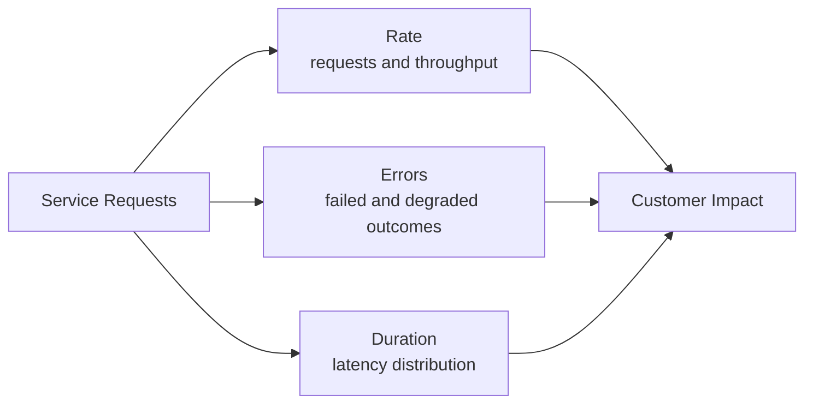

## 1. Executive Summary

The RED method measures **Rate**, **Errors**, and **Duration** for request-driven services. It begins with user-visible service behavior rather than host health: how much work arrived, how much failed, and how long successful and failed work took.

RED is most useful at synchronous boundaries such as HTTP, gRPC, GraphQL, and request/reply messaging. It can also describe bounded asynchronous operations, but resource diagnosis belongs to the [USE Method](/microservices/08-observability/use-method/).

---

## 2. Problem It Solves

A service can report low CPU and healthy pods while customers experience timeouts. Infrastructure-only dashboards miss dependency delays, retry amplification, partial route failures, and latency isolated to one result class.

```text
POST /payments

Rate:       200 requests/second
Error rate: 3%
P50:        40 ms
P95:        250 ms
P99:        800 ms
```

The median user sees 40 ms, but one request in 100 takes at least 800 ms. At 200 requests/second, that tail represents roughly two requests every second—not an edge case.

---

## 3. RED Signal Model



| Signal | Core question | Typical measurements |
| :--- | :--- | :--- |
| Rate | How much demand is the service handling? | Requests/s, operations/s, messages/s, bytes/s |
| Errors | What proportion produced an unacceptable result? | Error ratio, timeout ratio, rejected requests, failed business outcomes |
| Duration | How long does work take? | Histogram, P50, P95, P99, maximum bounded by policy |

---

## 4. Rate

Rate is workload over time. Measure both incoming demand and completed throughput; the difference can expose queues, cancellations, or in-flight accumulation.

Useful breakdowns are bounded dimensions such as:

- Service and operation or route template
- Response class such as `2xx`, `4xx`, and `5xx`
- Region, availability zone, and deployment version
- Dependency name and call outcome
- Bounded customer tier where operationally justified

Do not use raw URLs, request IDs, user IDs, or unbounded tenant IDs as metric labels. A route such as `/orders/{order_id}` is safe; `/orders/98d4...` creates a new series for every order.

Rate must be interpreted with demand. Falling latency during an unexpected traffic collapse is not an improvement.

---

## 5. Errors

An error is an outcome that violates the service contract, not merely an exception or HTTP `500`.

| Outcome | Count as error? | Reason |
| :--- | :---: | :--- |
| HTTP `500` | Yes | Server failed the request |
| Deadline exceeded | Yes | Caller did not receive the result in time |
| HTTP `429` | Usually | Capacity or policy rejected demand; classify separately |
| Valid HTTP `404` lookup | Depends | May be expected domain behavior |
| HTTP `200` with payment declined | Business-dependent | Transport succeeded; business SLI may still fail |
| Fallback response | Track separately | Availability may pass while quality degrades |

Track error count and error ratio. Counts convey incident volume; ratios remain comparable as traffic changes. Separate timeouts, cancellations, validation failures, dependency failures, and business rejection classes so one aggregate does not hide the dominant failure mode.

---

## 6. Duration and Percentiles

Duration must be recorded as a distribution. An average hides skew:

```text
99 requests at 40 ms + 1 request at 4,000 ms
Average: 79.6 ms
P50:     40 ms
P99:     approximately 4,000 ms
```

- **P50** represents typical experience.
- **P95** exposes a materially slow minority.
- **P99** exposes tail behavior affecting high-volume systems.
- **Maximum** is unstable and usually unsuitable for alerting by itself.

Measure successful and failed requests separately where failure returns quickly. Otherwise, a fast rejection can make aggregate latency appear healthier during an outage. Percentiles are not safely averaged across instances; use an aggregatable histogram or a backend-supported distribution model.

---

## 7. Timeouts and Retries

Retries create additional attempts, so distinguish **logical operations** from **attempts**.

```text
100 client operations
130 downstream attempts
20 timeout responses
10 operations recovered after retry
```

The final operation error rate may be 10%, while the dependency attempt failure rate is higher and load amplification is 1.3 attempts per operation. Record:

- Timeout count and ratio
- Retry attempts and operations retried
- Attempts per logical operation
- Retry success and exhaustion
- End-to-end duration including retry delays

Without both levels, dashboards can report acceptable success while retries silently consume latency and downstream capacity.

---

## 8. Aggregation Strategy

Start at the operation boundary, then roll up deliberately.

| View | Use | Risk |
| :--- | :--- | :--- |
| Endpoint/operation | Locate one failing contract | Too many raw routes create cardinality |
| Service | Summarize ownership and customer impact | Healthy routes can dilute one critical route |
| Critical journey | Measure checkout, login, or payment outcome | Requires cross-service/business instrumentation |
| Dependency | Find external or internal downstream degradation | Caller retries may distort attempt volume |

Alert on the narrowest stable SLI representing customer impact, while retaining lower-level RED views for diagnosis.

---

## 9. Failure Scenarios

| RED pattern | Likely interpretation | Next check |
| :--- | :--- | :--- |
| Rate normal, errors normal, duration high | Capacity or dependency latency | USE saturation and trace critical path |
| Rate rising, errors rising, duration rising | Overload or retry amplification | Queues, pools, throttling, attempts/operation |
| Rate falling unexpectedly | Upstream failure or lost traffic | Gateway, DNS, discovery, client metrics |
| Errors high, duration low | Fast rejection, validation, breaker open | Error classes and dependency health |
| P50 stable, P99 rising | Tail-only contention or slow dependency shard | Per-instance/resource USE and slow traces |

Use [RED and USE Diagnostic Workflow](/microservices/08-observability/red-use-diagnostic-workflow/) to connect symptoms to constrained resources.

---

## 10. Architect Interview Answer

> RED measures Rate, Errors, and Duration at service boundaries. I instrument route templates and dependency operations, track both counts and ratios, and use histograms for P50, P95, and P99 because averages hide tail latency. I separate successful, failed, timed-out, and degraded outcomes, and distinguish logical requests from retry attempts. RED tells me which customer-facing service behavior is unhealthy; I then use traces and USE metrics to locate the dependency or saturated resource causing it.

---

## 11. Architecture Checklist

- Are RED metrics present on every synchronous service boundary?
- Are operations named from bounded route or RPC templates?
- Are successful, failed, timed-out, rejected, and degraded outcomes distinguishable?
- Are P50, P95, and P99 derived from an aggregatable distribution?
- Are retry attempts separated from logical operations?
- Can service-level views drill down by operation, region, and version?
- Do alerts represent customer symptoms rather than one transient instance?

Next: [USE Method for Resource Diagnosis](/microservices/08-observability/use-method/).
