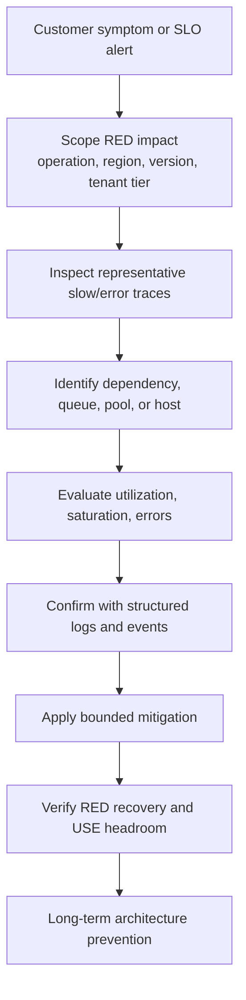
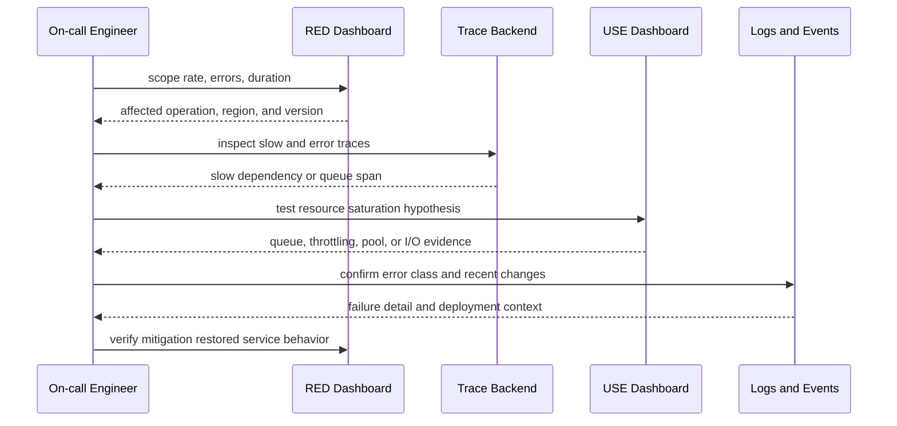

## 1. Executive Summary

RED detects which service behavior is unhealthy; USE tests whether a constrained resource explains that symptom. Traces connect the affected request to a dependency or queue, and structured logs explain discrete failures or decisions.

The workflow is evidence-driven: establish impact, narrow the affected population, follow the critical path, test resource hypotheses, mitigate safely, and then preserve the evidence for prevention.

---

## 2. Problem It Solves

Jumping from an alert directly to a familiar cause creates costly mistakes:

- Scaling application pods does not fix a saturated database pool.
- Increasing a pool can overload the database it protects.
- Adding retries worsens a throttled dependency.
- Restarting pods destroys evidence and may provide only temporary relief.
- High CPU can be a consequence of retry or serialization load rather than the initiating cause.

RED and USE create a consistent investigation order without pretending every incident follows one script.

---

## 3. Diagnostic Architecture



Start with customer impact unless a platform integrity alert requires immediate action, such as imminent disk exhaustion or telemetry loss.

---

## 4. Core Investigation Flow



Use several representative traces. One trace is evidence for one transaction, not proof of fleet-wide causality.

---

## 5. Workflow Steps

1. **Confirm the symptom:** validate the alert against RED and a customer or business SLI.
2. **Scope impact:** operation, outcome, region, zone, version, dependency, and bounded customer segment.
3. **Check traffic shape:** distinguish demand spikes, traffic loss, and retry amplification.
4. **Inspect traces:** find where time or errors accumulate on affected paths.
5. **Apply USE:** inspect the implicated resource and its queueing, throttling, and errors.
6. **Correlate changes:** deployments, configuration, feature flags, certificates, failovers, and scaling events.
7. **Mitigate safely:** shed load, disable retries, route traffic, roll back, or add bounded capacity.
8. **Verify recovery:** RED symptoms recover and USE headroom stabilizes without shifting saturation downstream.

---

## 6. Example 1 — CPU Saturation

```text
RED:
- Rate normal
- Errors normal
- Duration high

USE:
- CPU high
- Run queue high

Likely cause:
- CPU saturation
```

| Evidence | Action |
| :--- | :--- |
| Trace | Confirm time is spent inside the service rather than downstream |
| Profile | Locate CPU-heavy serialization, encryption, loop, or GC work |
| Logs/events | Check rollout, payload mix, and feature-flag changes |
| Immediate mitigation | Add capacity, reduce expensive work, or roll back a regression |
| Prevention | Performance budget, capacity model, load shedding, representative profiling |

High CPU alone is not enough. The run queue and request latency establish that demand is waiting for CPU.

---

## 7. Example 2 — Storage Bottleneck

```text
RED:
- Duration high
- Timeout rate increasing

USE:
- Disk queue high
- CPU normal

Likely cause:
- Storage bottleneck
```

Validate that slow traces contain database or file operations on the affected storage. Check I/O latency, throughput limits, burst-credit exhaustion, compaction, checkpointing, and noisy-neighbor activity.

Immediate mitigation may reduce write concurrency, route reads to healthy replicas, pause noncritical batch work, or provision IOPS. Long-term prevention requires workload isolation, storage capacity testing, query/index design, and alerts on queueing before timeout budgets are consumed.

---

## 8. Example 3 — Connection Pool Exhaustion

```text
RED:
- Error rate high
- Duration high

USE:
- CPU low
- Memory normal
- DB connection pool saturated

Likely cause:
- Connection pool exhaustion
```

Look for spans dominated by connection acquisition rather than query execution. Logs should distinguish acquisition timeout from database query timeout.

Potential causes include slow queries, long transactions, leaked connections, sudden concurrency, or a reduced database connection limit. Increasing the application pool without checking database capacity can turn local queueing into a database-wide outage. Prefer bounded concurrency, leak detection, transaction reduction, query repair, and backpressure.

---

## 9. Additional Diagnostic Patterns

| RED symptom | USE evidence | Likely direction |
| :--- | :--- | :--- |
| P99 high, P50 stable | One pod throttled or one shard queued | Hot partition, noisy neighbor, uneven load |
| Errors rise after duration | Pool waiters and queue age rise | Progressive exhaustion |
| Rate rises above demand | Dependency attempts rise | Retry amplification |
| Rate drops suddenly | Resources healthy | Gateway, DNS, discovery, upstream traffic loss |
| Duration high, all local USE healthy | Downstream span slow | External dependency or network path |
| Errors high, duration low | No saturation | Fast rejection, breaker, auth, configuration |

If no resource hypothesis survives validation, revisit the trace path, data correctness, client behavior, and telemetry integrity.

---

## 10. Mitigation and Verification

| Mitigation | Use carefully when | Verification |
| :--- | :--- | :--- |
| Scale out | Work is parallelizable and downstream has capacity | RED latency/errors fall; downstream USE remains safe |
| Shed load | Service is beyond safe capacity | Critical traffic succeeds; rejection is controlled |
| Disable/reduce retries | Attempts amplify dependency failure | Attempts/operation and saturation decline |
| Roll back | Regression correlates with version/change | New-version errors disappear without new failure |
| Increase pool/queue | Protected dependency has verified headroom | Wait time falls; downstream saturation does not rise |
| Fail over | Alternate region/dependency is healthy | Routing succeeds and alternate capacity remains safe |

Recovery means customer symptoms are resolved and the system has stable headroom. A falling alert caused by traffic loss is not recovery.

---

## 11. Architect Checklist

- Do alerts start from customer-visible RED or SLO symptoms?
- Can responders segment by operation, region, zone, and version?
- Can metrics pivot to representative traces and trace-linked logs?
- Does every important queue, pool, broker, node, and storage resource expose USE?
- Do runbooks warn against shifting saturation downstream?
- Are retries visible as attempts per logical operation?
- Does mitigation verification check both RED recovery and USE headroom?
- Do incident reviews convert missing evidence into instrumentation work?

Return to [Observability Architecture](/microservices/08-observability/observability/) for the module-wide telemetry contract.
