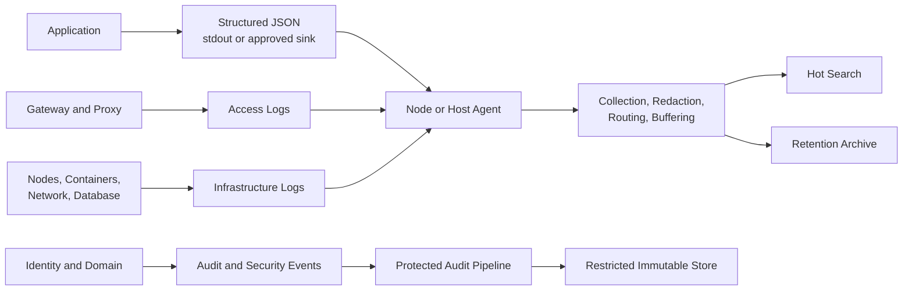

## 1. Executive Summary

Production logs are discrete event records, not a transcript of every line of execution. A useful log communicates a stable event name, time, severity, service identity, deployment context, trace relationship, outcome, and bounded diagnostic evidence in a machine-queryable schema.

The architecture objective is to preserve enough evidence to explain important decisions and failures without turning logs into an uncontrolled copy of production data. Logging therefore needs the same design rigor as an API: schema ownership, compatibility, access control, retention, volume budgets, and explicit handling of personal data and secrets.

---

## 2. Problem It Solves

Free-text logging works on one developer machine but fails across hundreds of service instances:

```text
Payment failed
Something went wrong for order 83921
Retrying...
```

These lines do not identify the service version, operation, failure class, attempt, trace, or whether the retry eventually succeeded. They also tempt operators to search raw customer values across unrestricted indexes.

| Weak practice | Production consequence |
| :--- | :--- |
| Message text is the only structure | Queries depend on fragile parsing and wording |
| Every layer logs the same exception | Volume multiplies without new evidence |
| Payloads logged for debugging | PII, tokens, and credentials enter long-lived storage |
| Debug enabled fleet-wide | Ingestion spikes during the incident it should diagnose |
| No trace or correlation identifier | Cross-service reconstruction becomes timestamp guesswork |
| Audit and application logs mixed | Retention, immutability, and access policies conflict |

---

## 3. Logging Architecture



Applications should not synchronously call a central log backend on the request path. Write to a local nonblocking sink, then use platform collection and bounded buffering. Audit requirements may justify a separate durable path, but business operations still need defined behavior when that path is impaired.

---

## 4. Recommended Event Schema

```json
{
  "timestamp": "2026-07-17T10:30:00Z",
  "level": "ERROR",
  "service": "payment-service",
  "environment": "production",
  "region": "ap-south-1",
  "deployment_version": "2026.07.17.2",
  "trace_id": "abc123",
  "span_id": "def456",
  "correlation_id": "req-7f3a9c2e",
  "event": "payment_authorization_failed",
  "operation": "payment.authorize",
  "outcome": "failure",
  "order_id": "masked-or-tokenized",
  "error_type": "GatewayTimeoutException",
  "message": "Payment gateway timed out"
}
```

| Field | Contract |
| :--- | :--- |
| `timestamp` | UTC, unambiguous precision, generated at event time |
| `level` | Governed severity semantics, not team preference |
| `service`, `environment`, `region` | Stable resource identity |
| `deployment_version` | Release or artifact identifier used in rollout analysis |
| `trace_id`, `span_id` | Active trace relationship when available |
| `correlation_id` | Validated operational handle where required |
| `event` | Stable machine-oriented event name |
| `operation`, `outcome` | Normalized action and result |
| `error_type` | Bounded classification, not full exception text |
| `message` | Concise human explanation; not the primary query contract |

Optional fields require the same ownership and sensitivity review as required fields. Absence should be represented consistently; avoid strings such as `unknown`, `n/a`, and empty values becoming separate accidental categories.

---

## 5. Event Names, Messages, and Severity

Stable event names support dashboards, alerts, and queries across message wording changes:

```text
event=payment_authorization_failed
message="Payment gateway timed out"
```

The event name is the contract. The message helps a human understand the instance. Do not embed dynamic values in the event name:

```text
# Unsafe event-name explosion
event=payment_failed_for_order_83921

# Stable
event=payment_authorization_failed
order_id=tokenized-value
```

| Level | Use | Avoid |
| :--- | :--- | :--- |
| `DEBUG` | Temporary diagnostic detail under controlled enablement | Normal production workflow at fleet scale |
| `INFO` | Meaningful lifecycle or business transition | Logging every method entry and exit |
| `WARN` | Degraded or recoverable condition requiring attention | Expected validation or harmless retries |
| `ERROR` | Operation failed or required intervention | Logging an exception already handled successfully |
| `FATAL` | Process cannot continue safely, if supported | Routine dependency failure |

Severity must reflect the local outcome. A downstream timeout logged as `ERROR` by five layers creates five apparent failures for one incident.

---

## 6. Boundary and Exception Logging

Log where the code has enough context to make a useful statement:

- At an ingress boundary, record the normalized operation, outcome, duration class, and correlation context when access logging does not already own it.
- At a dependency boundary, record a final failure after retry policy is exhausted, including dependency, operation, attempt count, and bounded error type.
- At a message consumer, record processing outcome, delivery attempt, topic/stream, consumer identity, and retry or dead-letter decision.
- At a domain boundary, record important state transitions without copying the entire aggregate or command payload.

### Structured exceptions

| Field | Purpose |
| :--- | :--- |
| `error_type` | Stable failure class used for grouping |
| `error_code` | Domain or dependency code when bounded and safe |
| `error_message` | Sanitized diagnostic description |
| `stack_trace` | Full diagnostic stack, restricted by policy |
| `cause_type` | Bounded root-cause class when available |
| `retryable` | Decision made by policy, not inferred later from text |
| `attempt` | Current attempt and configured maximum |

Log an exception once at the layer that owns the outcome. Lower layers may enrich and rethrow; upper layers may translate to a response. Additional logs are justified only when they add a distinct decision, security event, or independently owned boundary.

---

## 7. Log Classes and Ownership

| Log class | Primary purpose | Typical owner | Key constraints |
| :--- | :--- | :--- | :--- |
| Application | Domain decisions, lifecycle, failures | Service team | Schema, correlation, volume budget |
| Access | Request metadata at gateway/proxy/server | Platform or edge team | IP/identity minimization and sampling policy |
| Audit | Who changed what, when, and under which authority | Compliance/domain owner | Integrity, completeness, restricted access, retention |
| Security | Authentication, authorization, threat, policy events | Security operations | Detection quality, tamper resistance, sensitive context |
| Infrastructure | Host, container, network, database, control-plane events | Platform team | Source normalization and high-volume control |

Do not use an application log as an audit trail merely because it contains a username. Audit records need a defined subject, actor, action, target, result, authority, timestamp, integrity model, and failure handling.

Access logs and application logs frequently overlap. Decide which layer owns request completion so every hop does not emit an identical high-volume record.

---

## 8. Volume, Sampling, and Debug Control

Log cost grows with event rate, average event size, replicas, retention, indexing, and query patterns:

```text
20,000 requests/s × 2 request logs × 1.2 KB
= 48 MB/s before indexing and replication
≈ 4.1 TB/day
```

Controls should be applied in this order:

1. Remove events that do not support an operational, security, audit, or business question.
2. Prevent duplicate boundary and exception logging.
3. Reduce repeated fields and oversized stack traces or payload fragments.
4. Apply dynamic suppression or aggregation to repeated low-value events.
5. Sample eligible high-volume success and debug events.
6. Route classes to different indexes and retention tiers.

Never sample records whose completeness is required for audit, security, financial reconciliation, or legal obligations unless the governing requirement explicitly permits it.

Debug logging in production should be scoped by service instance, bounded tenant tier or tokenized transaction, operation, and duration. It needs automatic expiry, a volume guardrail, an approver, and an audit record of who enabled it. A fleet-wide configuration toggle without expiry is an outage risk.

---

## 9. Retention and Lifecycle

| Tier | Content | Typical purpose | Design consideration |
| :--- | :--- | :--- | :--- |
| Hot | Recent indexed operational events | Active incidents and fast search | Highest query and indexing cost |
| Warm | Older, less frequently queried events | Trend and investigation follow-up | Slower query accepted |
| Archive | Compressed or object-stored records | Compliance or rare forensic retrieval | Restore procedure and retrieval time |
| Restricted | Audit and security evidence | Regulated investigation | Separate access, integrity, and deletion policy |

Retention is selected by investigation window, regulation, contractual need, and cost—not one global number. Define:

- Indexing duration versus storage duration
- Region and residency
- Encryption and key ownership
- Legal hold and deletion behavior
- Schema migration and old-event readability
- Restore time and proof that archived records can be retrieved
- Disposal verification at the end of retention

Long retention does not compensate for missing fields or unqueryable schemas.

---

## 10. Security, Privacy, and Failure Modes

### Never log

- Passwords, private keys, client secrets, database credentials, or signing material
- Access, refresh, session, or API tokens
- Authorization headers, cookies, or full connection strings
- Raw payment card or bank-account data
- Complete request or response bodies by default
- Sensitive identity claims or health data without an approved purpose

Masking should be deterministic enough for approved correlation but irreversible to ordinary operators. Prefer allowlisted fields over attempting to redact every possible secret after serialization.

| Failure mode | Consequence | Control |
| :--- | :--- | :--- |
| Token appears in exception or URL | Credential compromise through log access | Source allowlists, URL sanitization, collector redaction |
| Logger blocks request threads | Logging causes customer outage | Nonblocking local sink, bounded queue, drop policy |
| Buffer fills during backend outage | Memory/disk exhaustion or record loss | Backpressure limits, spill policy, drop metrics |
| Schema changes silently | Queries, detections, and dashboards fail | Versioned contract and compatibility window |
| Clock skew | Incorrect incident ordering | UTC synchronization and trace durations |
| Sensitive debug mode persists | Ongoing exposure and cost | Scoped activation, automatic expiry, audit trail |
| Audit pipeline unavailable | Required evidence missing | Defined fail-open/fail-closed behavior per action |

Monitor the logging pipeline itself: queue occupancy, dropped events, parse failures, redaction failures, ingestion delay, index rejection, storage capacity, and archive failures.

---

## 11. Architect Checklist

### Schema and correlation

- Are timestamp, severity, service, environment, region, version, event, operation, and outcome standardized?
- Are trace, span, and validated correlation identifiers present where applicable?
- Are event names stable and separate from human messages?
- Are exception types bounded and stack traces structured?
- Is each failure logged once by the layer owning the outcome?

### Governance and operations

- Are application, access, audit, security, and infrastructure logs separated by purpose?
- Does every log class have an owner, access policy, volume budget, and retention tier?
- Are secrets and sensitive fields prevented through source allowlists and collector controls?
- Is production debug enablement scoped, approved, audited, and automatically expired?
- Are sampling exclusions defined for audit, security, and reconciliation records?
- Is logging nonblocking with documented queue, spill, and drop behavior?
- Are dropped, delayed, rejected, malformed, and failed-redaction events monitored?
- Can archived logs be restored within the required investigation window?

Related foundations: [Telemetry Signals](/microservices/08-observability/metrics-logs-and-traces/) and [Correlation IDs and Context Propagation](/microservices/08-observability/correlation-and-context-propagation/).
