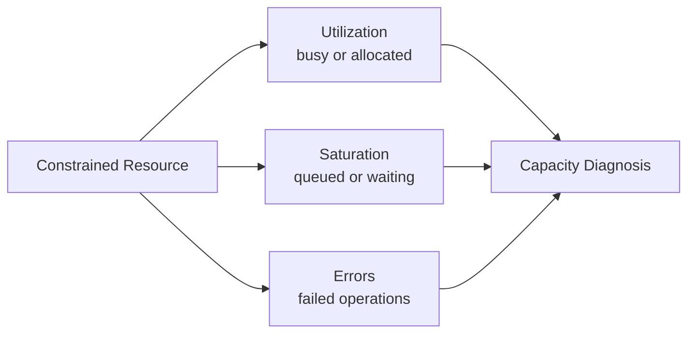

## 1. Executive Summary

The USE method examines every constrained resource through **Utilization**, **Saturation**, and **Errors**. It answers whether a resource is busy, whether work is waiting because capacity is exhausted, and whether the resource is failing.

USE is resource-oriented. Apply it after RED or Golden Signals identify a customer-visible symptom, or proactively during capacity planning. A utilization percentage alone is not enough: CPU can be moderately utilized while a cgroup is throttled, and a connection pool can be fully allocated even when host CPU is low.

---

## 2. Problem It Solves

Operations teams often collect “usage” but omit queueing and errors. That creates false confidence:

- CPU averages hide a hot core or container throttling.
- Free memory hides reclaim pressure, swap, or imminent OOM termination.
- Disk capacity hides I/O queue latency.
- Database health checks pass while callers wait for connections.
- Kafka brokers remain healthy while consumers accumulate lag.

USE turns a generic resource dashboard into a systematic search for bottlenecks.

---

## 3. USE Signal Model

| Term | Meaning | Examples |
| :--- | :--- | :--- |
| Utilization | Proportion of capacity busy or allocated | CPU busy, memory working set, pool connections in use |
| Saturation | Excess work waiting or being throttled | Run queue, I/O queue, pool waiters, consumer lag |
| Errors | Failed operations attributable to the resource | Disk errors, packet drops, allocation failure, rejected tasks |

Utilization near 100% often causes saturation, but the relationship is resource-specific and sometimes nonlinear.

---

## 4. Host and Infrastructure Resources

| Resource | Utilization | Saturation | Errors |
| :--- | :--- | :--- | :--- |
| CPU | CPU busy by mode | Run queue, steal, throttling | Machine checks or hardware faults |
| Memory | Working set, committed memory | Reclaim, swap, OOM pressure | Allocation failures, OOM kills |
| Disk | Device busy time, throughput | I/O queue, await latency | Read/write and filesystem failures |
| Network | Bandwidth, connection use | Queueing, retransmits, drops | Interface errors, failed connections |

Interpret utilization relative to limits, not just physical capacity. In virtualized environments, CPU steal and storage throttling can cause saturation outside the guest's direct control.

---

## 5. Application Pools and Queues

Pools are resources even though they are implemented in software.

| Resource | Utilization | Saturation | Errors |
| :--- | :--- | :--- | :--- |
| Worker/thread pool | Active workers / maximum | Queue depth, task wait time | Rejections, uncaught worker failures |
| Database pool | Checked-out / maximum connections | Acquisition waiters and wait duration | Acquisition timeout, invalid connection |
| HTTP client pool | Active connections / limit | Pending requests | Connect errors, pool timeout |
| Queue/buffer | Occupied capacity | Producer blocking and oldest-item age | Drops, rejected enqueue, overflow |

Measure wait duration as well as queue length. A queue of 100 may be harmless at 10,000 operations/second and severe at 10 operations/second.

---

## 6. Kafka Resources

Kafka requires USE views at broker, partition, and consumer levels:

- Broker utilization: CPU, disk throughput, network bandwidth, request-handler use.
- Broker saturation: request queues, disk latency, under-replicated or unavailable partitions.
- Broker errors: produce/fetch failures, replication errors, authentication failures.
- Consumer utilization: processing throughput relative to assigned work.
- Consumer saturation: lag and **oldest-message age**, not lag count alone.
- Consumer errors: deserialization failure, processing rejection, rebalance churn, commit failure.

Lag may increase because incoming rate rose, processing slowed, partitions are skewed, or a consumer stopped. Compare production rate, consumption rate, partition distribution, and processing duration before scaling blindly.

---

## 7. Kubernetes and Containers

| Scope | Utilization | Saturation | Errors |
| :--- | :--- | :--- | :--- |
| Container CPU | Usage versus CPU limit/request | CFS throttled time/periods | Runtime or node CPU faults |
| Container memory | Working set versus limit | Reclaim and memory pressure | OOMKilled, allocation failure |
| Pod | Resource and ephemeral-storage use | Pending time, throttling, queue wait | Restarts, eviction, volume/network errors |
| Node | CPU, memory, disk, pod capacity | PID, memory, disk, and scheduling pressure | Node conditions and device errors |
| Cluster | Allocated versus allocatable capacity | Unschedulable pods and provisioning delay | Scheduler/autoscaler failures |

CPU limit throttling can occur while node CPU looks healthy. Conversely, high CPU utilization without queueing, throttling, latency, or errors may represent efficient operation rather than an incident.

---

## 8. Design Options and Trade-offs

| Decision | Benefit | Risk |
| :--- | :--- | :--- |
| Per-instance USE metrics | Locates hot shards and noisy neighbors | More time series and dashboard complexity |
| Fleet-only aggregation | Low-cost overview | Hides localized saturation |
| Resource requests without limits | Reduces throttling surprises | Weak containment under contention |
| Tight pools | Protects dependencies | Callers saturate earlier and need backpressure |
| Large queues | Absorbs short bursts | Hides overload and increases tail latency |
| Autoscale on saturation signal | Responds to pressure directly | Signal delay and downstream capacity constraints |

Capacity controls move waiting somewhere; they do not remove it. The architecture must choose where work queues, how long it waits, and how overload is rejected.

---

## 9. Failure Scenarios

| USE pattern | Likely interpretation | Validation |
| :--- | :--- | :--- |
| CPU high, run queue high | CPU saturation | Per-core load, throttling, profiles |
| CPU normal, throttling high | Container limit too restrictive | Cgroup limit and throttled periods |
| Disk busy and queue high | Storage bottleneck | I/O latency, throughput limit, noisy neighbor |
| Pool use 100%, waiters rising | Pool or downstream saturation | Query/call latency, leaks, transaction duration |
| Memory rising, reclaim/OOM | Leak, cache growth, or undersized limit | Allocation profile, working set, eviction events |
| Kafka lag rising, broker normal | Consumer processing bottleneck | Processing duration, partition skew, errors |

Use traces to confirm that the saturated resource lies on the affected request path.

---

## 10. Architect Interview Answer

> USE measures Utilization, Saturation, and Errors for every constrained resource. I apply it to CPU, memory, disk, network, thread pools, connection pools, Kafka consumers, containers, pods, nodes, and cluster capacity. I never treat utilization alone as proof of a bottleneck; I look for queueing, throttling, wait duration, or rejected work and correlate those signals with RED latency or error symptoms. That avoids scaling healthy resources while the real constraint is a downstream pool, partition, or storage device.

---

## 11. Architecture Checklist

- Does every constrained resource expose utilization, saturation, and error evidence?
- Are container limits distinguished from node capacity?
- Are queue age and wait duration measured alongside queue depth?
- Are database and HTTP connection pools treated as resources?
- Are Kafka consumer lag, oldest-message age, and processing rate correlated?
- Can fleet views drill into instance, partition, pod, node, and zone?
- Are capacity limits, rejection behavior, and ownership documented?

Next: [Golden Signals](/microservices/08-observability/golden-signals/).
For node-level network, process, and kernel evidence that resource metrics cannot explain, see [eBPF-Based Observability](/microservices/08-observability/advanced/ebpf-observability/).
