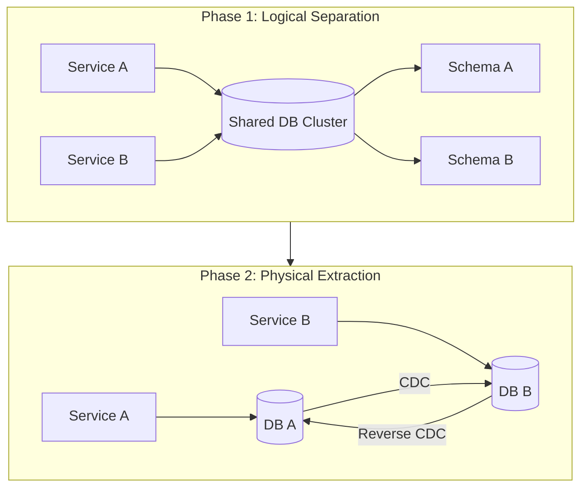

## Executive Summary

**Database decomposition** breaks the shared-database anti-pattern by splitting schemas along **bounded contexts** into **database-per-service**. Never big-bang `pg_dump` — use **logical schema separation**, **CDC mirroring** (Debezium/WAL), phased **read flip** and **write flip**, and **reverse sync** so legacy remains a rollback path until parity is proven.

- **Video reference:** [Monolithic Database Decomposition Explained](https://www.youtube.com/watch?v=126ALse1rWA)

---

## Problem It Solves

| Anti-pattern | Symptom |
| :--- | :--- |
| Shared tables across squads | Cannot deploy service without coordinating DB migration |
| Cross-schema JOINs in monolith | Hidden coupling blocks extraction |
| Big-bang dump/restore | Hours downtime; no safe rollback |
| Dual-write from app code | DB and broker disagree on state |

One database behind twelve services is still a **distributed monolith** — decomposition without data ownership fails.

---

## Where It Fits

After [Monolith Decomposition](/microservices/09-migration-modernization/monolith-decomposition/) identifies bounded contexts and **before** declaring database-per-service complete. Requires [Outbox & CDC](/microservices/03-data-management/outbox-and-cdc/) literacy.

---

## Architecture Diagram



---

## Internal Working

### Five-phase migration strategy

| Phase | Action | Rollback |
| :--- | :--- | :--- |
| **1 — Logical schemas** | Separate DB users/roles per bounded context | Revert code paths only |
| **2 — CDC mirror** | Stream WAL to new target DB (Debezium) | Stop CDC; legacy is source of truth |
| **3 — Read flip** | Route reads to new service/DB via feature flag | Revert read routing |
| **4 — Write flip** | Writes to new DB; reverse-sync to legacy | Reverse CDC keeps fallback |
| **5 — Decommission** | Drop legacy tables after stabilization window | Requires parity audit |

**Logical separation:** Assign distinct DB roles to schemas/namespaces in one cluster — enforce in code reviews: no cross-schema queries.

**Physical extraction:** New service writes to isolated engine; CDC keeps legacy in sync until cutover. Replace JOINs with **API calls** or **denormalized read models**.

### Cutover gate

```text
  Pre-cutover checklist:
    ✓ CDC replication lag < 500ms for 24h
    ✓ Row-count parity audit (old vs new)
    ✓ Hash sample validation on critical tables
    ✓ Feature flag for instant read/write revert
    ✓ Reverse-sync pipeline tested (new → old)

  Cutover sequence:
    1. Brief write pause OR controlled dual-write window
    2. Verify lag = 0
    3. Flip write path to new DB
    4. Monitor error rates 48h
    5. Decommission legacy tables
```

---

## Design Decisions

| Decision | Senior choice |
| :--- | :--- |
| Cutover style | CDC phased — never offline dump-only |
| Cross-context data | API + events — not federated JOIN |
| Referential integrity | Application-level; sagas for cleanup |
| Orphan handling | Soft-delete contracts between services |

---

## Tradeoffs

| Pros | Cons |
| :--- | :--- |
| True deploy independence | JOINs become network calls |
| Per-domain scaling | Eventual consistency |
| Blast-radius isolation | CDC ops + lag monitoring |

---

## Scalability

Shard **after** ownership is clear — sharding a shared monolith DB without boundary discipline multiplies pain.

---

## Reliability

| Failure | Mitigation |
| :--- | :--- |
| CDC lag at cutover | Lag gate; do not flip until threshold met |
| Orphaned foreign keys | Saga compensation; soft-delete |
| Dual-write divergence | Reconciliation job + idempotent sync |
| Cross-schema JOIN remnant | API proxy replaces every cross-schema query |

---

## Security Considerations

- Per-service DB credentials with schema-scoped grants only.
- Encrypt CDC streams in transit; mask PII in mirror topics if logged.

---

## Observability

- Metrics: `cdc_lag_seconds`, `replication_slot_lag_bytes`, row-count drift alerts.
- Audit jobs comparing checksums on sample keys pre/post cutover.

---

## Production Lessons

Replace `pg_dump → restore → pray` with **logical schemas → CDC mirror → read flip → write flip → decommission**.

---

## Common Failures

- Big-bang migration window with no reverse path.
- Flipping writes while CDC lag is non-zero → split brain.
- Keeping shared read replicas that still JOIN across contexts.

---

## Common Mistakes

- Splitting services before splitting schemas (network tax, same coupling).
- Deleting legacy tables before 30-day parity window.

---

## Interview Questions

1. Why is database decomposition harder than service extraction?
2. Walk through the five phases with rollback at each step.
3. How do you replace a cross-schema JOIN?
4. What is a lag gate and when do you refuse cutover?
5. Compare dual-write vs CDC mirroring.

> **60-second answer:** Split the monolith database by bounded context using phased migration — not a big-bang dump. Start with logical schemas and enforced access roles, mirror changes with CDC, flip reads then writes behind feature flags, and keep reverse sync to legacy until parity audits pass. Cross-table JOINs become APIs or denormalized reads; referential integrity moves to application sagas. Cut over only when replication lag stays under your SLO for a sustained window.

---

## Architect Notes

Pairs with [Database Per Service](/microservices/03-data-management/database-per-service/) and [Saga Pattern](/microservices/03-data-management/saga/). CDC tooling depth: [PostgreSQL Handbook](/postgresql-cheatsheet/) / [MongoDB Handbook](/mongodb-cheatsheet/) as appropriate.
