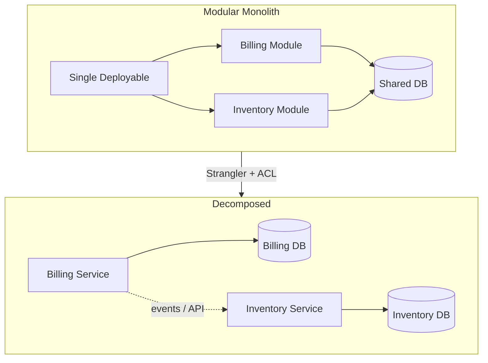

## Executive Summary

**Monolith decomposition** splits a single deployable into independently deployable services aligned to **bounded contexts** and **team ownership** — not CPU graphs. Microservices solve **organizational** bottlenecks first: when squads block each other on release cadence, when domains need independent scale, and when stable APIs exist between contexts. Start from a **modular monolith** with clear package seams; extract the **hottest or most isolated** context first via the [Strangler Pattern](/microservices/09-migration-modernization/strangler-pattern/); split databases **last** with [Database Decomposition](/microservices/09-migration-modernization/database-decomposition/).

- **Video reference:** [Monolith vs Microservices Explained](https://www.youtube.com/watch?v=pJ83mmqcvoQ)

---

## Problem It Solves

| Business pain | Technical symptom |
| :--- | :--- |
| Slow time-to-market from tight coupling | One change ripples across teams and releases |
| Outages spread across domains | Shared runtime or DB becomes blast-radius multiplier |
| Hard to scale one hot capability | Monolithic scaling pays for idle components |
| Unclear ownership | "Everyone owns" the same module and schema |

Decomposition without domain clarity produces a **distributed monolith** — many repos, one shared database, same coupling with network tax added.

---

## Where It Fits

- **After** product/market fit and **before** org-wide microservices mandate.
- **Parallel** with strangler routing for traffic migration.
- **Before** physical database-per-service cutover.

---

## Architecture Diagram



### Conway's Law alignment

```text
  "Organizations design systems that mirror their communication structures." — Conway

  Small team (~5 engineers)     → Modular monolith (one deploy, clear packages)
  Multiple squads (50+ engineers) → Services per autonomous squad

  Decompose for ORGANIZATIONAL bottlenecks first — not because a diagram has more boxes.
```

---

## Internal Working

### Decomposition sequence (senior migration path)

```text
  1. Modular monolith     — enforce package boundaries; no cross-module DB access
  2. Strangler extract    — route traffic for one capability to new service
  3. Anti-corruption layer — translate legacy models at the boundary
  4. API stabilization    — versioned contracts before team split
  5. Database split       — hardest step; CDC + phased cutover
  6. Remove legacy path   — delete strangler fallback after parity window
```

### Step-by-step extraction

1. **Event storming / domain mapping** — identify bounded contexts (Order, Billing, Catalog, Notifications).
2. **Find seams in code** — Maven modules, Gradle projects, packages with few inbound dependencies.
3. **Define public API** per context — REST/gRPC/events; no shared entity JARs across contexts.
4. **Assign team ownership** — one squad per extracted service (Conway's Law).
5. **Extract first candidate** — prefer isolated + high-churn or scale-sensitive domain (notifications, search, PDF generation).
6. **Anti-corruption layer (ACL)** — new service speaks clean domain language; adapter translates legacy tables/APIs.

### When to stay monolithic

```text
  Stay monolithic when:
    ✓ Product/market fit still evolving
    ✓ Team fits in one room (< 10 engineers)
    ✓ No independent scaling per domain
    ✓ No platform depth for K8s, tracing, on-call for distributed systems

  Decompose when:
    ✓ Teams block each other on deploy cadence
    ✓ Domains need independent scale (billing 10× inventory traffic)
    ✓ Bounded contexts have stable APIs
    ✓ Platform team can operate mesh, CDC, SLO tooling
```

### Architecture decision matrix

| Dimension | Modular monolith | Distributed microservices |
| :--- | :--- | :--- |
| Inter-domain calls | In-memory | Network + serialization |
| Transactions | Single-DB ACID | Saga / eventual consistency |
| Deploy unit | One artifact | Many services |
| Operational tax | Low | High (K8s, mesh, tracing) |
| Failure blast radius | Whole app | Per-service isolation |
| Best fit | Early product, small team | Large org, independent scale |

---

## Design Decisions

| Decision | Recommendation |
| :--- | :--- |
| **First service to extract** | Highest churn + clearest boundary — not "user service because everyone needs users" |
| **Shared library** | Thin SDK only; never shared domain entities across contexts |
| **Data during extraction** | Strangler + ACL; avoid big-bang rewrite |
| **Team topology** | Align service boundaries to squad boundaries before splitting repos |

Decompose by **organizational bottleneck** and **domain heat**, not by noun-counting (`UserService`, `OrderService` on day one).

---

## Tradeoffs

| Pros | Cons | When NOT to use |
| :--- | :--- | :--- |
| Independent deploy per squad | Network latency + serialization tax | Pre-PMF startup |
| Blast-radius isolation | Distributed debugging | No SRE/platform capacity |
| Per-domain scaling | Saga/outbox complexity | Shared DB still in use |

**Premature decomposition** adds network tax **without** team autonomy benefit — the worst of both worlds.

---

## Scalability

Extract services that need **independent horizontal scale** first: notifications, search indexing, image processing, rate-limited partner APIs. Keep CRUD core on monolith until boundaries are proven.

---

## Reliability

Each extraction adds **failure domains**. Before the second extracted service goes live:

- Distributed tracing (mandatory).
- SLOs per service; error budgets.
- Runbooks for cross-service timeouts.

| Failure mode | Monolith | Microservices |
| :--- | :--- | :--- |
| Memory leak in module | Whole process dies | Isolated pod |
| Cross-domain bug | Single stack trace | Distributed trace |
| Network partition | N/A internally | Cascading timeouts |

---

## Security Considerations

As contexts split, define **service-to-service authentication** (mTLS, JWT service accounts) before exposing internal APIs beyond the monolith process boundary.

---

## Observability

- Trace from strangler router through ACL into new service.
- Compare error rates and latency **before/after** extraction per route.
- Dashboard: `% traffic on new vs legacy path`.

---

## Production Lessons

- Keep **anti-corruption layers** at legacy boundaries — do not leak legacy table shapes into new domain models.
- Extract **read-heavy** paths before write-heavy financial paths when possible.
- Never microservice-ize before Conway's Law **forces** it.

---

## Common Failures

| Failure | Symptom |
| :--- | :--- |
| **Distributed monolith** | 12 services, one shared database, coordinated releases |
| **Big-bang rewrite** | 18-month project, no production value |
| **Extract without API** | Direct DB reads across contexts |

---

## Common Mistakes

- Choosing microservices for résumé-driven architecture on a 4-person team.
- Extracting `UserService` first because every domain references users — creates hub dependency.
- Deleting modular monolith discipline before new services are stable.

---

## Interview Questions

1. How do you choose the **first** service to extract?
2. What is a distributed monolith and how is it different from a modular monolith?
3. Explain Conway's Law with a real org example.
4. Why is database decomposition the hardest step?
5. What is an anti-corruption layer?

> **60-second answer:** Decompose a monolith along bounded contexts when teams and scale force independence — not at project start. Begin with a modular monolith and clear package seams, then strangler-extract one context with an anti-corruption layer at the legacy boundary. Align service boundaries to team ownership per Conway's Law. Split databases last using CDC and phased cutover. Premature decomposition gives you network overhead without autonomy — the distributed monolith anti-pattern.

---

## Implementation




```java
// Anti-corruption layer: translate legacy monolith OrderRow → domain Order
public final class LegacyOrderAdapter implements OrderPort {

    private final LegacyOrderDao legacy;

    @Override
    public Order findById(OrderId id) {
        LegacyOrderRow row = legacy.find(id.value());
        return Order.builder()
            .id(id)
            .status(mapStatus(row.getStatusCode())) // legacy int → enum
            .total(Money.of(row.getCents(), row.getCurrency()))
            .build();
    }
}
```




```go
// Strangler router: feature flag sends % traffic to new service
func (r *CheckoutRouter) Handle(w http.ResponseWriter, req *http.Request) {
    if r.flags.UseNewCheckout(req.Context(), req.Header.Get("X-User-Id")) {
        r.newService.Proxy(w, req)
        return
    }
    r.legacyMonolith.Proxy(w, req)
}
```




```python
def should_extract_metrics(module_name: str, coupling: ModuleCoupling) -> bool:
    """Heuristic: high churn + low fan-in = good first extract."""
    return coupling.inbound_dependencies < 3 and coupling.quarterly_commits > 50
```




```text
FOR each candidate bounded context:
  SCORE = isolation + team_ownership_clarity + scale_need - shared_db_coupling
PICK highest SCORE context
DEFINE versioned API + ACL
STRANGLER route incremental traffic
ONLY THEN plan database decomposition
```




---

## Architect Notes

Pairs with [Strangler Pattern](/microservices/09-migration-modernization/strangler-pattern/) and [Database Decomposition](/microservices/09-migration-modernization/database-decomposition/). For saga coordination after split see [Saga Pattern](/microservices/03-data-management/saga/).
