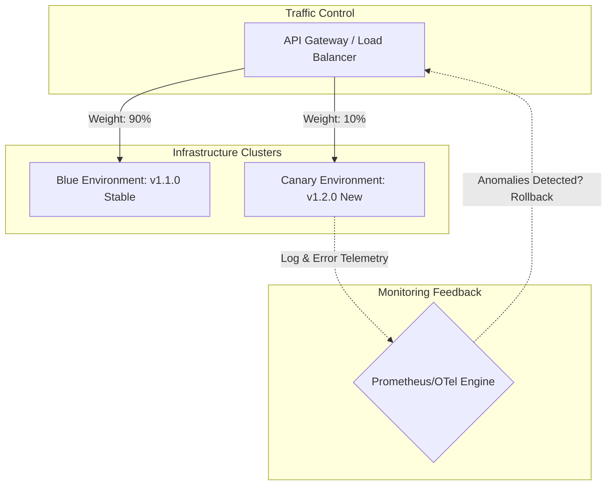

## Executive Summary

Zero-Downtime Deployment Topologies (Blue-Green Deployment vs. Canary Deployment) protects production environments from defective code releases by isolating new deployments within separate network paths, allowing updates to be validated and incrementally rolled out with minimal user impact.

- **Video Reference:** [Zero-Downtime Deployments Explained](https://www.youtube.com/watch?v=4o9dUAp7xxk)

---

## Architecture Diagram



## Internal Working

**Blue-Green Architecture:** Two identical, independent environments coexist. "Blue" hosts the current production traffic. The new code is deployed to "Green." Once fully tested, the edge load balancer or service mesh control plane rewrites its internal routing rules to immediately flip 100% of incoming traffic to Green.

**Canary Architecture:** The new version is deployed alongside live production nodes. The service mesh or ingress controller manipulates weights (e.g., using Envoy weighted cluster routing configurations) to direct a small, controlled percentage of traffic (e.g., 2% → 5% → 20%) to the new version.

### State Management & Database Compatibility

All running application versions must interface with the same live database layer simultaneously during the rollout phase.

See also: [Kubernetes Patterns](/microservices/07-platform-patterns/kubernetes-patterns/), [Zero-Downtime Migration Frameworks](/database-handbook/zero-downtime-migration-frameworks/), and [Sidecar & Service Mesh](/microservices/07-platform-patterns/sidecar-and-service-mesh/).

---

### Blue-Green vs. Canary Comparison

| Dimension | Blue-Green | Canary |
| :--- | :--- | :--- |
| **Traffic shift** | Instant 100% flip | Progressive weight increase |
| **Infrastructure cost** | 2× environment footprint | Shared pool; incremental pods |
| **Rollback speed** | Instant flip back to Blue | Reduce canary weight to 0% |
| **Risk exposure** | All users at once after flip | Limited blast radius during ramp |
| **Validation window** | Pre-flip smoke tests on Green | Live production metrics on subset |

---

## Tradeoffs

### Network & Latency

The deployment proxies add minimal routing overhead, but managing blue-green infrastructure requires **doubling your environment footprint**, which significantly increases cloud infrastructure costs.

### Data Consistency

**Database Schema Forward-Compatibility** is an absolute requirement. If version $N+1$ introduces a destructive database schema change (like dropping or renaming a column), version $N$ nodes still handling live traffic will instantly crash.

## Common Failures

**Saturated Canary Feedback Loops:** If automated canary analysis (ACA) tools evaluate health metrics using insufficient sample sizes over too short a window, silent errors like memory leaks or slow resource exhaustion can slip past the canary layer and infect the entire production environment.

| Failure Mode | Symptom | Mitigation |
| :--- | :--- | :--- |
| **Destructive migration at startup** | vN pods crash during rolling deploy | Expand-contract schema changes only |
| **Premature 100% canary ramp** | Full outage from bad release | Gradual weights; error budget gates |
| **Insufficient ACA sample** | Memory leak passes canary | Longer observation window; SLO-based gates |
| **Blue-green without DB compat** | Green works; Blue breaks on shared DB | Forward-compatible schema only |
| **No rollback path** | Extended outage during bad deploy | Instant traffic revert + PDB protection |

---

### Expand-Contract Schema Migration (5 Steps)

```text
  Step 1: ADD new column (nullable)          ← both vN and vN+1 safe
  Step 2: DEPLOY code writing BOTH columns   ← dual-write phase
  Step 3: BACKFILL legacy rows (background)  ← data migration job
  Step 4: DEPLOY code reading NEW column     ← read flip
  Step 5: DROP old column                    ← contract phase (after stable)

  Rollback possible at any step before Step 5
```

---

### Canary Progression Example

```text
  Traffic weights over time:
    2%  canary  (15 min, error rate < 0.1%)
    5%  canary  (30 min, P99 within SLO)
    20% canary  (1 hour, no memory growth)
    50% canary  (2 hours)
    100% promote → retire old version

  Anomaly at any stage → weight → 0%, alert on-call
```

---

## Interview Questions

### The "Junior" Mistake

Releasing code updates with simple "rolling updates" that execute database migrations at startup, which can break compatibility with running nodes and trigger immediate cluster-wide outages.

### The "Senior" Counter-Measure

Enforce a strict **Expand and Contract** pattern for all data mutations across deployments. Break database changes down into independent, backward-compatible steps: 1) Deploy the database change to add the new column while leaving the old one intact, 2) Deploy code that writes to both columns but reads from the old one, 3) Run a background data migration script to backfill legacy rows, 4) Flip the code to read entirely from the new column, and 5) Remove the old column from the schema once the system stabilizes. This decoupling ensures safe rollbacks at any point in the cycle.

```text
  Zero-downtime deploy checklist:

    ✓ Schema changes are expand-contract (never drop-first)
    ✓ vN and vN+1 run simultaneously during rollout
    ✓ Readiness probes gate traffic to warming pods
    ✓ PodDisruptionBudget protects minimum replicas
    ✓ Canary metrics: error rate, P99, memory slope
    ✓ One-click traffic rollback configured
```

---


---

## Where It Fits

Release engineering for microservices fleets — complements [Deployment Strategies](/microservices/10-production-playbook/deployment-strategies/) in the Production Playbook module.

---

## Security Considerations

Apply zero-trust between services, mTLS in mesh, and least-privilege credentials per service identity.

---

## Observability

Export RED metrics, structured logs with `trace_id`, and distributed traces on every cross-service hop. See [Observability](/microservices/08-observability/observability/).

---

## Architect Notes

Expanded from legacy playbook content. See related modules in the curriculum sidebar for adjacent patterns.
