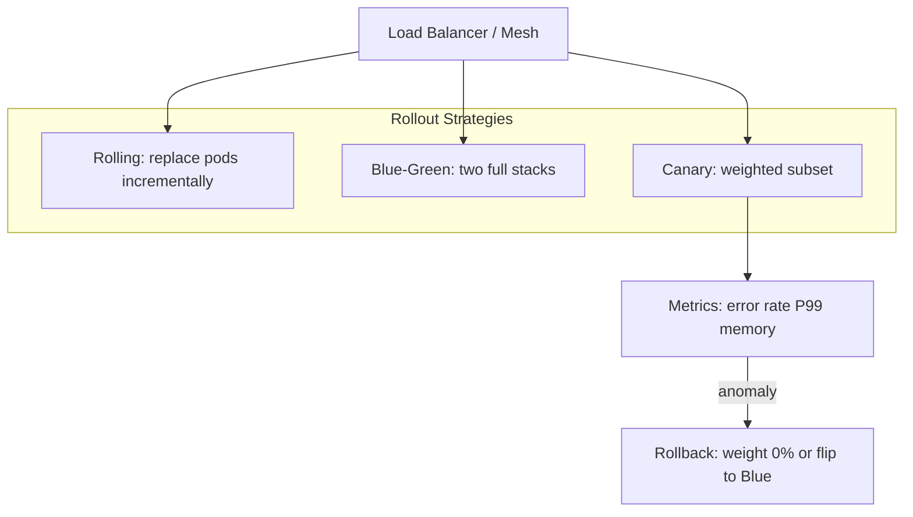
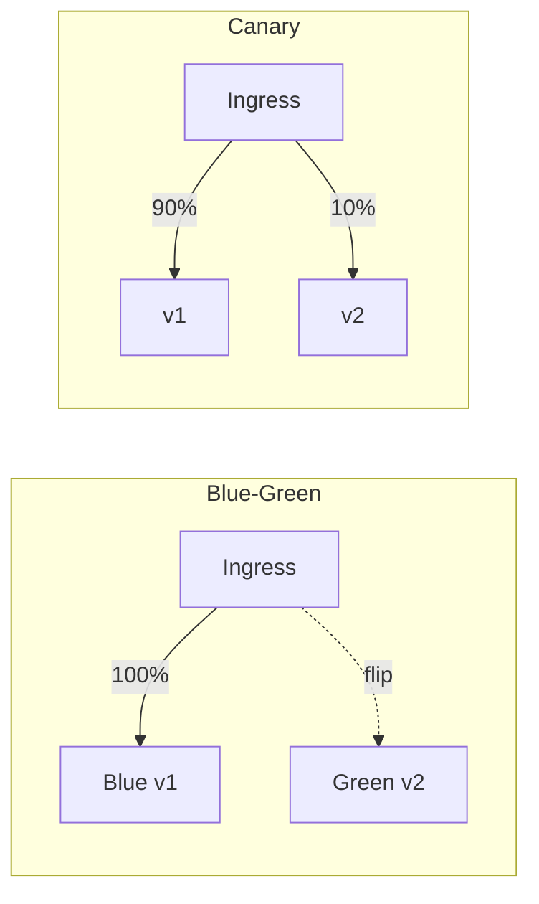

## Executive Summary

Microservices multiply **deploy surfaces** — each service can roll independently, but **shared databases**, **API contracts**, and **async consumers** still couple releases. Choose strategy by **blast radius** and **observability maturity**: **rolling** for stateless fast iterations; **blue-green** for instant rollback; **canary** for metric-gated progressive exposure; **feature flags** for decoupling deploy from release. All strategies require **expand-contract** schema changes when vN and vN+1 run simultaneously.

- **Video reference:** [Zero-Downtime Deployments Explained](https://www.youtube.com/watch?v=4o9dUAp7xxk)

---

## Problem It Solves

| Pain | Without deliberate strategy |
| :--- | :--- |
| Bad release takes down all users | Rolling deploy with destructive migration at startup |
| Cannot validate in production | Big-bang flip with no canary metrics |
| Rollback takes hours | Schema already dropped; data loss |
| "Deployed but not ready" | Traffic hits pods before JVM/cache warm |

---

## Where It Fits

Platform engineering + product squads — every stateless service on Kubernetes or VM fleets. Pairs with [Zero-Downtime Deployments](/microservices/09-migration-modernization/zero-downtime-deployments/) for migration context and [Kubernetes Probes](/kubernetes-handbook/probes/) for traffic gating.

---

## Architecture Diagram



### Blue-green vs canary



---

## Internal Working

### Strategy comparison

| Strategy | Traffic shift | Infra cost | Rollback | Best for |
| :--- | :--- | :--- | :--- | :--- |
| **Rolling** | Pod-by-pod replace | Baseline | Redeploy previous image | Stateless APIs, frequent deploys |
| **Blue-green** | Instant 100% flip | ~2× environment | Flip back to blue | High-stakes releases, smoke-tested green |
| **Canary** | 2% → 5% → 20% → 100% | Shared pool + extra pods | Reduce canary weight | Metric-driven validation |
| **Feature flag** | Code path toggle | Flag service | Disable flag | Decouple deploy from user exposure |
| **Recreate** | Stop all → start new | Low | Redeploy | Dev only — not production |

### Rolling deployment mechanics

1. New ReplicaSet created with updated image.
2. Kubernetes terminates one old pod → starts one new pod.
3. **Readiness probe** must pass before pod receives traffic.
4. **PodDisruptionBudget** ensures minimum replicas during roll.
5. Repeat until all pods on vN+1.

**Risk:** If vN+1 requires **destructive DB migration** at startup, remaining vN pods break on shared schema — use expand-contract only.

### Blue-green mechanics

- **Blue** = current production; **Green** = identical stack with new version.
- Deploy and smoke-test Green with synthetic traffic or internal-only route.
- Flip load balancer / DNS / mesh route **100%** to Green.
- Keep Blue warm for instant rollback window.

**Cost:** Double compute during overlap — schedule shorter overlap windows.

### Canary mechanics

```text
  Traffic weights (example):
    2%  canary  (15 min, error rate < 0.1%)
    5%  canary  (30 min, P99 within SLO)
    20% canary  (1 hour, no memory slope)
    50% → 100% promote

  Anomaly at any stage → weight 0%, page on-call
```

Use **Automated Canary Analysis (ACA)** on: error rate, P99 latency, memory growth slope — not just HTTP 200 count.

### Feature flags vs deploy

| | Deploy | Feature flag |
| :--- | :--- | :--- |
| **Changes** | Binary running in prod | Branch in running binary |
| **Rollback** | Redeploy / traffic shift | Toggle off |
| **Use** | Bug fixes, perf | Gradual UX experiments |

Flags do **not** replace schema compatibility — expand-contract still required.

### Expand-contract schema (mandatory for shared DB phase)

```text
  1. ADD new column (nullable)           ← vN and vN+1 safe
  2. DEPLOY code writing BOTH columns    ← dual-write
  3. BACKFILL legacy rows (background)
  4. DEPLOY code reading NEW column      ← read flip
  5. DROP old column                     ← after stable window
```

Rollback possible before step 5. See [Database Decomposition](/microservices/09-migration-modernization/database-decomposition/).

### Connection draining

Before terminating a pod: mark **DRAINING** → stop new connections → allow in-flight requests to complete (30–60s) → then SIGTERM. Prevents 502 on long uploads/checkouts.

---

## Tradeoffs

| Pros | Cons | When NOT to use |
| :--- | :--- | :--- |
| Independent service deploy | Schema coupling across fleet | Single monolith DB without expand-contract |
| Canary limits blast radius | Complex metric gates | Team lacks observability baselines |
| Blue-green instant rollback | 2× infra cost | Cost-constrained environments |

---

## Reliability

| Failure | Mitigation |
| :--- | :--- |
| Destructive migration at startup | Expand-contract only; never drop-first |
| Cold pod stampede | Slow-start on load balancer; readiness gates |
| Insufficient canary sample | Longer windows; SLO-based promotion |
| ACA false green | Memory leak detectors; business KPIs |

---

## Security Considerations

- Canary routes must enforce **same auth** as stable — no "canary bypasses auth for testing."
- Feature flags are **authorization-sensitive** — protect flag admin API.

---

## Observability

Metrics per version label (`version=v1.2.0`): request rate, error ratio, P99, heap slope. Alert on canary vs stable **relative** error rate, not absolute alone.

---

## Production Lessons

- **Deploy ≠ release** when using flags — communicate to product which is which.
- One-click rollback must be **tested quarterly** — not documented only.
- Contract-test consumers **before** canary promotion.

---

## Common Mistakes

- Rolling deploy + `DROP COLUMN` migration in same release.
- Promoting canary to 100% on traffic volume alone (no error budget check).
- Gateway monolith deploy blocking all teams.

---

## Interview Questions

1. Compare rolling, blue-green, and canary for a payment service.
2. Why is expand-contract required during rolling deploys?
3. What metrics would block canary promotion?
4. Feature flag vs canary — when to use each?
5. How do PDB and readiness probes interact during rollout?

> **60-second answer:** Rolling replaces pods incrementally — fast but requires backward-compatible schema. Blue-green runs two full stacks and flips traffic instantly for rollback. Canary sends a small percentage to the new version and promotes based on error rate, latency, and resource slope. Feature flags decouple code deploy from user exposure. All strategies need expand-contract migrations when old and new versions share a database, plus readiness probes and connection draining to avoid 502s.

---

## Architect Notes

Implementation: Kubernetes Deployments, Argo Rollouts, Flagger, Istio weighted routes, LaunchDarkly/Unleash for flags. Deep K8s: [Deployment Strategies in K8s handbook](/kubernetes-handbook/) and [Probes](/kubernetes-handbook/probes/).
