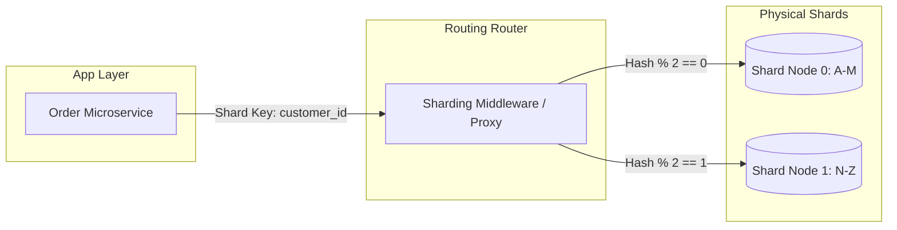

## Executive Summary

Database Sharding (Horizontal Partitioning) solves the physical compute, memory, and storage limits of a single database machine by breaking up a single logical dataset across multiple independent database engines, ensuring horizontal scalability for high-throughput write operations.

- **Video Reference:** [Database Sharding Explained](https://www.youtube.com/watch?v=xv0Be4QfkH0)

---

## Architecture Diagram



## Internal Working

Application client or database proxy layers (e.g., Vitess for MySQL, Citus for Postgres) intercept data requests and evaluate a specific **Shard Key** (e.g., `customer_id` or `tenant_id`).

**Deterministic Routing:** The system passes the shard key through a cryptographic or uniform hashing algorithm (like MurmurHash3) combined with a modulo operation or consistent hashing ring:

$$\text{Shard ID} = \text{Hash}(\text{Shard Key}) \pmod{\text{Total Shards}}$$

The proxy then routes the raw query directly to the connection pool of the target database node containing that specific data partition.

See also: [Config Server Assemblies & Shard Key Cardinality](/system-design/database-sharding-provisioning-and-chunk-routing/), [Consistent Hashing Rings with Virtual Nodes](/microservices/consistent-hashing-rings-virtual-nodes/), and [Database Replication & Scaling](/microservices/database-replication-scaling/).

---

### Modulo Sharding vs. Consistent Hashing

| Approach | Resharding cost | Load balance | When to use |
| :--- | :--- | :--- | :--- |
| **Modulo** `hash % N` | High — most keys move on N change | Good with uniform hash | Fixed shard count; early prototypes |
| **Consistent hashing** | Low — only adjacent ring segments move | Improved with virtual nodes | Live cluster expansion/contraction |
| **Range sharding** | Medium — boundary splits | Risk of hot ranges | Time-series with predictable access |

---

## Tradeoffs

### Network & Latency

Single-shard operations targeting a specific shard key execute at native speeds. However, running queries that lack a shard key forces a **Scatter-Gather** operation—the proxy must broadcast the query across every single shard node over the network, wait for all nodes to reply, and merge the datasets in memory, causing severe p99 latency spikes.

### Data Consistency

Joins across separate physical shards are impossible at the database layer. Cross-shard transactional guarantees are abandoned; implementing multi-shard updates requires managing complex application-layer coordination or introducing distributed transaction engines, both of which degrade throughput.

## Common Failures

**Hot Sharding / Uneven Data Distribution:** If a single shard key accounts for a disproportionate amount of system traffic (e.g., a high-volume enterprise customer), that specific physical shard node will experience resource exhaustion, degrading performance for neighboring tenants on the same node while other shards sit idle.

| Failure Mode | Symptom | Mitigation |
| :--- | :--- | :--- |
| **Low-cardinality shard key** | Empty shards + overloaded shards | High-cardinality key (`user_id`, `tenant_id`) |
| **Scatter-gather query** | P99 latency explosion | Always include shard key in queries |
| **Cross-shard JOIN** | Not supported at DB layer | Denormalize or application-layer merge |
| **Hot tenant on shard** | Noisy neighbor resource exhaustion | Sub-shard salt for hot keys; dedicated shard |
| **Naive resharding** | Massive data movement downtime | Consistent hashing + virtual nodes |

---

### Scatter-Gather vs. Targeted Shard Query

```text
  Targeted query (fast):
    SELECT * FROM orders WHERE customer_id = 'cust_42'
    → hash(cust_42) % N → Shard 2 only

  Scatter-gather (slow):
    SELECT COUNT(*) FROM orders WHERE status = 'PENDING'
    → no shard key → broadcast to ALL shards → merge in proxy
```

Design schemas and APIs so hot paths always carry the shard key.

---

## Interview Questions

### The "Junior" Mistake

Selecting a generic, low-cardinality column (like `status` or `country`) as the sharding key, or assuming that resharding a live database cluster to add more nodes is a simple operational task.

### The "Senior" Counter-Measure

Advocate for **Consistent Hashing** paired with **virtual nodes** over raw modulo sharding. This minimizes data movement when scaling the cluster up or down. When selecting a shard key, justify picking a high-cardinality attribute (such as `user_id` or `organization_id`) that matches the primary access patterns of your domain, ensuring even data distribution across the entire infrastructure fleet.

```text
  Shard key selection checklist:

    ✓ High cardinality (millions of distinct values)
    ✓ Matches primary query filter (every hot path includes it)
    ✓ Even distribution (not monotonic time-only keys)
    ✓ Consistent hashing for live resharding
    ✓ Virtual nodes for heterogeneous hardware
    Γ£ù Never shard by status, country, or boolean flags alone
```

---


---

## Where It Fits

Apply at service boundaries within the microservices fleet. Cross-link to domain handbooks for broker, database, and cache engine internals.

---

## Security Considerations

Apply zero-trust between services, mTLS in mesh, and least-privilege credentials per service identity.

---

## Observability

Export RED metrics, structured logs with `trace_id`, and distributed traces on every cross-service hop. See [Observability](/microservices/08-observability/observability/).

---

## Architect Notes

Expanded from legacy playbook content. See related modules in the curriculum sidebar for adjacent patterns.
