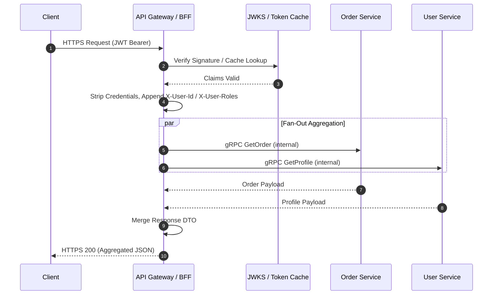

### Core Microservices Pattern & Architectural Intent

The API Gateway & Backends for Frontends (BFF) pattern provides a unified entry point that abstracts downstream microservice topology from clients, handling cross-cutting concerns like edge security, request routing, rate limiting, and payload aggregation.

- **Video Reference:** [API Gateway & BFF Pattern Explained](https://www.youtube.com/watch?v=d2z78guUR4g)

---

### Production-Grade Implementation & Data Mechanics



#### Runtime Execution Path & Wire Protocols

**Client ingress:** Requests enter via TLS-terminated HTTPS/REST or WebSockets. The gateway handles TLS termination, decrypts headers, parses JWT tokens, and routes traffic internally over a high-speed corporate private network using gRPC/Protobuf or internal HTTP/2.

**Non-blocking I/O:** Performance-critical gateways use asynchronous, non-blocking I/O event loops (e.g., Netty-based Spring Cloud Gateway, Envoy, Kong, or Nginx architecture) to keep thread counts minimal while managing thousands of concurrent open client connections.

**Coordination & Security Mechanics:**

* **Token verification** occurs at the edge via a local cache or a fast cryptographic signature check against a pre-fetched JSON Web Key Set (JWKS). The gateway then strips client credentials and appends sanitized user contexts into internal request headers (e.g., `X-User-Id`, `X-User-Roles`) before forwarding requests downstream.

See also: [Layer 4 vs. Layer 7 Multi-Tier Ingress](/system-design/layer4-layer7-multi-tier-ingress-routing/) and [Forward vs. Reverse Proxy Topologies](/system-design/proxy-servers-forward-vs-reverse/).

---

### API Gateway vs. BFF Responsibilities

| Concern | API Gateway | BFF (Backend for Frontend) |
| :--- | :--- | :--- |
| **Primary role** | Cross-cutting ingress — auth, routing, rate limits | Client-optimized aggregation and payload shaping |
| **State** | Stateless; no business logic | Stateless; may compose multiple service calls |
| **Deployment scope** | Platform-wide, shared infrastructure | Per client surface (mobile, web, partner API) |
| **Team ownership** | Platform / SRE | Product or client-facing feature teams |
| **Typical stack** | Envoy, Kong, AWS API Gateway | Dedicated Spring/Node service behind gateway |

---

### Critical System Design Trade-offs & Operational Realities

#### Network & Latency Impact

Adds a proxy hop to every inbound request. Gateways doing data aggregation (calling 5 services to construct 1 response) face the **fan-out latency penalty**: the slowest downstream service dictates total response time.

#### Data Consistency & Isolation

Minimal direct database state impact, but gateway routing rules must be kept synchronized with service registries (e.g., Consul or Kubernetes DNS). Mismatches result in stale routing tables, causing intermittent HTTP 503 Service Unavailable or HTTP 404 Not Found errors.

#### Failure Modes & Cascading Risk

Represents a **single point of failure (SPOF)** for incoming traffic. If the gateway's worker pool is exhausted by slow responses from a degraded downstream service, the entire platform goes down. Mitigation requires placing strict, short read timeouts on downstream proxies and enforcing Token Bucket/Leaky Bucket rate limiters at the ingress layer.

| Failure Mode | Symptom | Mitigation |
| :--- | :--- | :--- |
| **Gateway thread exhaustion** | Platform-wide ingress outage | Short downstream timeouts; circuit breakers; async I/O |
| **Stale service registry** | Intermittent 503/404 on healthy services | Health-check-driven discovery; config sync watches |
| **Fan-out tail latency** | P99 spikes on aggregated endpoints | Parallel calls + per-service timeouts; partial response fallbacks |
| **JWKS fetch failure** | Auth rejects all traffic | Local JWKS cache with TTL; graceful degradation policy |
| **Gateway as monolith** | Cross-team deploy friction; logic sprawl | Split into lean gateway + client-specific BFFs |

---

### Interview Failure Modes & Pro-Tips

#### The "Junior" Mistake

Designing a heavy gateway that executes complex business logic, orchestrates data transformations, or queries core databases directly, turning the gateway into a **distributed monolith anti-pattern**.

#### The "Senior" Counter-Measure

Advocate for an **ultra-lean, stateless gateway layer**. Suggest splitting the gateway into multiple client-specific BFF (Backends for Frontends) instances (e.g., a Mobile Gateway vs. a Web Gateway) to keep deployment scopes isolated and prevent cross-team code deployment friction.

```text
  Internet
      │
      ▼
  ┌─────────────────┐
  │  API Gateway    │  ← TLS, JWT, rate limits, routing ONLY
  └────────┬────────┘
           │
     ┌─────┴─────┐
     ▼           ▼
  Mobile BFF   Web BFF     ← Client-specific aggregation
     │           │
     └─────┬─────┘
           ▼
    Downstream Microservices
```

---
