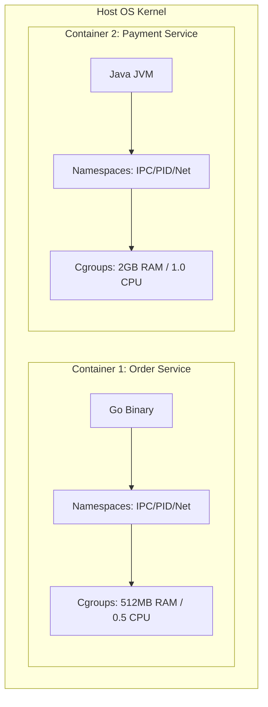

### Core Microservices Pattern & Architectural Intent

Application Containerization and OS-level Virtualization packages a microservice along with its exact runtime, binaries, libraries, and configurations into a single immutable image, solving the "works on my machine" problem and enabling predictable deployments across varied infrastructure.

- **Video Reference:** [Docker Containerization Explained](https://www.youtube.com/watch?v=sh2nwXJLDkE)

---

### Production-Grade Implementation & Data Mechanics



#### Runtime Isolation Mechanics

**Linux Namespaces:** Isolates the workspace per container. Elements like `pid` (processes), `net` (network interfaces), `mnt` (file system mount points), and `ipc` (inter-process communication) are partitioned so a container cannot see or interfere with the host or neighboring containers.

**Control Groups (cgroups):** Enforces hard limits on resource consumption (CPU, Memory, Disk I/O, Network bandwidth), preventing a compromised or leaking microservice from starving host resources.

#### Storage Layer Mechanics

**Union File System (UnionFS):** Containers use overlay storage drivers (e.g., `overlay2`) to stack immutable image layers. Ephemeral writes occur in a thin, mutable top layer. High-throughput state or logs must bypass this layer via direct volume mounts to avoid severe file system write penalties.

See also: [Declarative Container Orchestration (Kubernetes)](/microservices/declarative-container-orchestration-kubernetes/) and [Zero-Downtime Deployment Topologies](/microservices/zero-downtime-deployment-topologies/).

---

### Namespace & Cgroup Responsibility Matrix

| Linux primitive | Isolates | Production tuning |
| :--- | :--- | :--- |
| **pid** | Process tree visibility | Use `tini` or `dumb-init` as PID 1 |
| **net** | Network interfaces, ports | Bridge vs host networking trade-off |
| **mnt** | Filesystem mount points | Read-only root + volume mounts for state |
| **ipc** | Shared memory segments | Isolate high-security workloads |
| **cgroups v2** | CPU, memory, I/O quotas | Set `memory.limit` below JVM heap + overhead |

---

### Critical System Design Trade-offs & Operational Realities

#### Network & Latency Impact

Using a default bridged network interface introduces a minor packet-forwarding and NAT overhead as traffic crosses from the host network to the virtual container interface. For ultra-low latency setups, systems must switch to **host networking** or utilize high-performance CNI (Container Network Interface) plugins.

#### Data Consistency & Isolation

Container file systems are **ephemeral by design**. If a container crashes and restarts, any data written inside its local layer is lost. State must be decoupled completely, routing data to external managed databases or persistent cloud block volumes.

#### Failure Modes & Cascading Risk

**Zombie Processes:** Containers running a generic entrypoint app as PID 1 without a proper init system (like `tini`) fail to reap orphaned child processes, resulting in gradual process table exhaustion.

**OOM Kills:** If an internal application runtime (like a Java JVM) is not configured to recognize cgroup boundaries, it may allocate memory past the cgroup threshold, causing the host kernel to instantly terminate the container with an Out-Of-Memory error (`OOMKilled`).

| Failure Mode | Symptom | Mitigation |
| :--- | :--- | :--- |
| **Zombie PID 1** | Process table exhaustion over days | `tini` / `dumb-init` as entrypoint wrapper |
| **JVM OOMKilled** | Random container restarts under load | `-XX:MaxRAMPercentage` aligned to cgroup limit |
| **Overlay write penalty** | Slow log/state writes | Mount volumes for high-I/O paths |
| **Fat image layers** | Slow deploys; large attack surface | Multi-stage builds; distroless final stage |
| **Root container** | Host privilege escalation risk | `USER nonroot` in Dockerfile; drop capabilities |

---

### Multi-Stage Build Pattern

```dockerfile
# Stage 1: Build
FROM eclipse-temurin:21-jdk AS builder
WORKDIR /app
COPY . .
RUN ./mvnw -q package -DskipTests

# Stage 2: Runtime (minimal)
FROM gcr.io/distroless/java21-debian12:nonroot
COPY --from=builder /app/target/order-service.jar /app.jar
USER nonroot
ENTRYPOINT ["/usr/bin/java", "-XX:MaxRAMPercentage=75.0", "-jar", "/app.jar"]
```

Build tools, source code, and package managers never ship in the production image.

---

### Interview Failure Modes & Pro-Tips

#### The "Junior" Mistake

Packaging heavy tools, debugging utilities, and secrets directly into the Docker image, leading to massive, slow-to-pull image layers that pose severe security and vulnerability risks.

#### The "Senior" Counter-Measure

Advocate for **Multi-Stage Builds** paired with minimalistic base images (e.g., distroless or minimal Alpine layers). Ensure the final image contains only the compiled binary or runtime stripped of target package managers. Explicitly address running containers as a **non-root user ID** to prevent host privilege escalation vulnerabilities.

```text
  Production image checklist:

    ✓ Multi-stage build (build deps excluded)
    ✓ Distroless or scratch final base
    ✓ Non-root USER directive
    ✓ Secrets via runtime injection (K8s Secrets / Vault)
    ✓ Read-only root filesystem where possible
    ✓ cgroup-aware JVM/runtime memory limits
```

---
