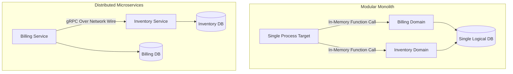

### Core Microservices Pattern & Architectural Intent

Modular Monolith vs. Distributed Microservices evaluates the alignment of system design with business organizational structures, balancing the simplicity, low latency, and single-database transactional integrity of a monolith against the independent scalability, team autonomy, and isolated deployment scopes of a microservices fleet.

- **Video Reference:** [Monolith vs. Microservices Explained](https://www.youtube.com/watch?v=pJ83mmqcvoQ)

---

### Production-Grade Implementation & Data Mechanics



#### Runtime Execution Paths & Boundary Mechanics

**Modular Monolith Execution:** Domain boundaries exist strictly at the code organization layer (e.g., separate language modules or packages). Inter-domain calls are compiled as highly efficient, in-memory function calls executed within a single OS process boundary.

**Microservices Execution:** Every domain boundary is mapped directly to a network boundary. Inter-domain coordination requires passing data payloads over the wire via gRPC/HTTP or event brokers, moving from a single runtime context to a fully distributed system.

See also: [Strangler Fig Application Pattern](/microservices/strangler-fig-application-pattern/), [Database Per Microservice](/microservices/database-per-microservice/), and [Saga Pattern](/microservices/saga-pattern-distributed-transactions/).

---

### Architecture Decision Matrix

| Dimension | Modular Monolith | Distributed Microservices |
| :--- | :--- | :--- |
| **Inter-domain calls** | In-memory function calls | gRPC/HTTP/event broker hops |
| **Transactions** | Single-DB ACID | Saga / eventual consistency |
| **Deploy unit** | One artifact | Many independent services |
| **Team model** | Single team or small group | Multiple autonomous teams |
| **Operational tax** | Low (one process, one DB) | High (K8s, mesh, tracing, CDC) |
| **Failure blast radius** | Whole application | Per-service isolation |
| **Best fit** | Early product, small team | Large org, independent scale needs |

---

### Critical System Design Trade-offs & Operational Realities

#### Network & Latency Impact

Monoliths feature ultra-low latency because they bypass network overhead for internal operations. Microservices introduce a structural network penalty for every cross-domain boundary action, alongside extra CPU costs for data serialization (Protobuf/JSON) and network packet handling.

#### Data Consistency & Isolation

Monoliths provide immediate **ACID consistency** via a unified database engine. Microservices enforce strict database isolation, turning multi-domain updates into complex eventual consistency problems that must be handled in application code.

#### Failure Modes & Cascading Risk

In a monolith, a memory leak or process crash in one module brings down the entire application. In a microservices architecture, individual components fail independently, but the system is exposed to complex distributed failure patterns like network partitions, routing loops, and cascading timeouts.

| Failure Mode | Monolith | Microservices |
| :--- | :--- | :--- |
| **Memory leak in one module** | Entire process dies | Isolated to one pod/service |
| **Cross-domain bug** | In-process stack trace | Distributed trace across hops |
| **Deploy regression** | Full rollback | Per-service rollback (if bounded) |
| **Network partition** | N/A internally | Split-brain, timeout cascades |
| **Premature decomposition** | N/A | Org tax without scale benefit |

---

### Conway's Law Alignment

```text
  "Organizations design systems that mirror their communication structures."
                                                                    — Conway's Law

  Small team (5 engineers)     → Modular monolith (one deploy, clear packages)
  Multiple squads (50+ engineers) → Microservices (independent deploy per squad)

  Microservices solve ORGANIZATIONAL bottlenecks first, not CPU bottlenecks.
```

---

### When to Decompose (Decision Checklist)

```text
  Stay monolithic when:
    ✓ Product/market fit still evolving
    ✓ Team fits in one room (< 10 engineers)
    ✓ No independent scaling requirements per domain
    ✓ Operational maturity: no K8s/mesh/on-call depth yet

  Decompose when:
    ✓ Teams block each other on deploy cadence
    ✓ Domains need independent scale (billing 10× inventory traffic)
    ✓ Clear bounded contexts with stable APIs
    ✓ Platform team can operate distributed infrastructure
```

---

### Interview Failure Modes & Pro-Tips

#### The "Junior" Mistake

Recommending a microservices architecture right at the start of a new, loosely defined product design scenario, under the false assumption that microservices are always superior to monoliths regardless of the team's size, operational maturity, or business requirements.

#### The "Senior" Counter-Measure

Defend the **Conway's Law Alignment Strategy**. Explain that microservices are primarily a tool to solve organizational development bottlenecks, allowing large engineering teams to build and deploy code independently without stepping on each other's toes. For early-stage products or small engineering teams, advocate for starting with a clean **Modular Monolith** with well-defined internal package boundaries. This approach allows the team to iterate quickly on the domain model without incurring the distributed systems operational tax until the product's scale and team size genuinely demand separation.

```text
  Senior migration path:

    1. Modular monolith (clear package boundaries)
    2. Extract read-heavy domains first (Strangler Fig)
    3. Split databases last (hardest step)
    4. Never microservice-ize before Conway's Law forces it
```

---
