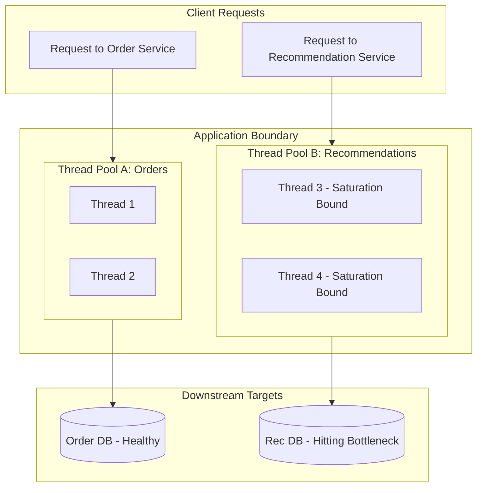

### Core Microservices Pattern & Architectural Intent

The Bulkhead Isolation Pattern isolates application computing resources (such as CPU, memory, and thread pools) into distinct, independent compartments, ensuring that a performance degradation or resource leak within one specific downstream dependency cannot consume all system resources and bring down unrelated services.

- **Video Reference:** [Bulkhead Pattern Explained](https://www.youtube.com/watch?v=fFHl7psnvz0)

---

### Production-Grade Implementation & Data Mechanics



#### Runtime Execution Path & Thread Isolation

**Thread-Pool Isolation Strategy:** Outbound client libraries partition execution contexts into isolated, size-bounded thread pools (e.g., using frameworks like Resilience4j). Requests targeting the Order API run exclusively within Thread Pool A, while requests targeting the Recommendation API are restricted to Thread Pool B.

**Semaphore Isolation Alternative:** For low-latency microservices that avoid the overhead of context switching between different thread pools, a bounded **Semaphore** can count and limit the number of concurrent executions allowed into a specific code module, rejecting incoming requests immediately once the limit is reached.

#### Data & Queue Mechanics

Each thread pool is configured with a strict, maximum task queue capacity. When downstream latency increases, the queue fills up; once saturated, additional incoming tasks are **rejected immediately** to protect system stability.

See also: [Circuit Breaker Pattern](/microservices/circuit-breaker-pattern/), [Transient Fault Handling](/microservices/transient-fault-handling-timeouts-retries/), and [Distributed Rate Limiting & Throttling](/microservices/distributed-rate-limiting-throttling/).

---

### Thread Pool vs. Semaphore Isolation

| Approach | Isolation mechanism | Overhead | Best fit |
| :--- | :--- | :--- | :--- |
| **Thread pool bulkhead** | Dedicated worker threads per dependency | Context-switch cost | Untrusted/slow external APIs |
| **Semaphore bulkhead** | Concurrent execution counter | Minimal CPU overhead | Trusted low-latency internals (Redis) |
| **Connection pool limit** | Max open sockets per host | Network FD bound | Database connection protection |
| **Global shared pool** | None | Lowest overhead | Anti-pattern at scale |

---

### Critical System Design Trade-offs & Operational Realities

#### Network & Latency Impact

Implementing thread-pool bulkheads introduces minor operating system context-switching and scheduling overhead as requests shift from the main ingress threads to dedicated dependency worker pools.

#### Data Consistency & Isolation

High structural isolation. If a downstream recommendation service experiences severe database locking and slows down, its assigned thread pool will saturate and reject new requests. However, the order processing pool remains unbothered, preserving critical transactional revenue paths.

#### Failure Modes & Cascading Risk

**Improper Queue Sizing:** Configuring oversized task queues in front of bulkheads can render the pattern ineffective. If the queue size is too large, hundreds of requests will sit waiting in memory, increasing overall latency and running the risk of an Out-Of-Memory application crash before the bulkhead's fail-fast rejection logic ever kicks in.

| Failure Mode | Symptom | Mitigation |
| :--- | :--- | :--- |
| **Global thread pool** | One slow dependency halts platform | Per-dependency bulkhead pools |
| **Oversized queue** | Latency spike; OOM before rejection | Small bounded queue + fail-fast |
| **No timeout on bulkhead thread** | Workers blocked indefinitely | Per-pool execution deadline |
| **Semaphore on slow external API** | Threads still blocked on I/O | Thread pool for network-bound deps |
| **Missing fallback** | Hard reject with no degraded UX | Circuit breaker + cached fallback |

---

### Resilience4j Bulkhead Configuration Sketch

```java
Bulkhead bulkhead = Bulkhead.of("recommendation-service",
    BulkheadConfig.custom()
        .maxConcurrentCalls(10)
        .maxWaitDuration(Duration.ofMillis(0))  // fail fast, no queue wait
        .build());

// Wrap outbound call
Supplier<String> decorated = Bulkhead.decorateSupplier(bulkhead, () ->
    recommendationClient.fetch(userId));
```

`maxWaitDuration = 0` enforces immediate rejection when the pool is full — critical for fail-fast bulkhead behavior.

---

### Bulkhead + Circuit Breaker Stack

```text
  Outbound call to Recommendation Service:

    Ingress thread
        │
        ▼
    Bulkhead (max 10 concurrent)     ← resource isolation
        │
        ▼
    Timeout (500ms)                  ← bounded wait
        │
        ▼
    Circuit breaker (fail fast)      ← sustained failure containment
        │
        ▼
    Fallback (cached popular items)  ← graceful degradation
```

---

### Interview Failure Modes & Pro-Tips

#### The "Junior" Mistake

Relying on a single global thread pool or client connection pool for all outbound microservice interactions, allowing a single slow downstream dependency to exhaust all available system threads and halt the entire platform.

#### The "Senior" Counter-Measure

Justify your choice between **Thread-Pool vs. Semaphore Isolation**. Use thread pools when you need to isolate untrusted downstream dependencies that may suffer from unpredictable network delays, as this setup allows you to enforce explicit timeout overrides on worker threads. Opt for semaphores when interfacing with highly trusted, low-latency internal components (such as an in-memory Redis cluster), as this minimizes CPU context-switching overhead while still setting a ceiling on maximum concurrent request executions.

```text
  Bulkhead sizing heuristics:

    ✓ Size pool from downstream SLA + timeout budget
    ✓ Queue depth = 0 or very small (fail fast > buffer)
    ✓ Critical path (orders/payments) gets dedicated large pool
    ✓ Non-critical path (recommendations) gets small pool + fallback
    ✓ Monitor bulkhead rejection rate as early warning signal
```

---
