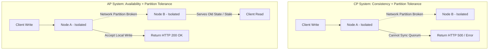

### Core Microservices Pattern & Architectural Intent

The CAP Theorem (Consistency vs. Availability during a Partition) and the PACELC extension dictates how distributed data systems operate under an inevitable network partition, defining whether a cluster prioritizes returning fresh, strongly consistent data across all nodes or ensuring the system remains responsive even if some nodes serve stale data.

- **Video Reference:** [CAP Theorem & PACELC Explained](https://www.youtube.com/watch?v=ms0qYCWJmfc)

---

### Production-Grade Implementation & Data Mechanics



#### Runtime Execution Path & Protocol Trade-offs

**CP Systems (Consistency + Partition Tolerance):** When a network partition occurs, the distributed storage engine (e.g., etcd, ZooKeeper, or MongoDB configured with a majority write concern) rejects writes on the minority side of the partition. It forces connections to block or fail because it cannot safely reach a cluster consensus quorum (e.g., via the Raft or Paxos protocols).

**AP Systems (Availability + Partition Tolerance):** During a partition, nodes on both sides of the network split continue to accept local read and write requests (e.g., Apache Cassandra or DynamoDB). Data updates are saved locally and synced across the cluster asynchronously using gossip protocols once the network heals.

**PACELC Real-World Extension:** If there is **Else** (no partition), the system must still choose between **Latency** vs. **Consistency**. Prioritizing consistency requires cross-node round-trip acknowledgments on every write, adding a structural latency penalty to the hot path.

See also: [CRDTs & Multi-Master Conflict Resolution](/system-design/crdts-and-multi-master-conflict-resolution/), [Distributed Consistency Primitives](/database-handbook/distributed-consistency-primitives/), and [Database Replication & Scaling](/microservices/database-replication-scaling/).

---

### CAP During Partition vs. PACELC During Normal Operation

| Framework | When it applies | Trade-off axis | Example systems |
| :--- | :--- | :--- | :--- |
| **CAP — CP** | Network partition | Consistency over availability | etcd, ZooKeeper, Spanner (strong) |
| **CAP — AP** | Network partition | Availability over consistency | Cassandra, DynamoDB, Riak |
| **PACELC — PC/EL** | No partition (normal ops) | Consistency over low latency | MongoDB majority writes, sync replicas |
| **PACELC — PA/EL** | No partition (normal ops) | Low latency over consistency | Cassandra ONE, async replicas |

There is no "CA" system in production — partitions are inevitable; **P** (partition tolerance) is non-negotiable.

---

### Critical System Design Trade-offs & Operational Realities

#### Network & Latency Impact

Strong consistency requires synchronous network handshakes across a quorum of replica nodes, which raises p99 latency to match the speed of the slowest responding network hop. AP systems achieve sub-millisecond latencies by performing local operations immediately, trading away real-time data accuracy.

#### Data Consistency & Isolation

AP systems operate on an **eventual consistency** model. This introduces read-side lag and split-brain windows where different nodes return conflicting states for the same entity key. Relieving this requires implementing conflict resolution strategies at the application layer.

#### Failure Modes & Cascading Risk

**Divergent Data Profiles:** If an AP cluster runs with a network split for an extended period, the isolated partitions will drift significantly out of sync. Once the network heals, the system can face automated reconciliation failures or data overwrites if conflict tracking mechanics are misconfigured.

| Failure Mode | Symptom | Mitigation |
| :--- | :--- | :--- |
| **Claiming "CA" system** | Design ignores partition reality | Always assume P; choose C or A under partition |
| **CP on user-facing feed** | 503s during minor network blip | AP/EL for feeds; CP for ledger only |
| **AP on billing** | Double-spend / balance corruption | CP with quorum writes; reject on partition |
| **Long partition drift** | Irreconcilable conflict on heal | Vector clocks, CRDTs, last-write-wins policy |
| **Ignoring PACELC** | Surprise latency on "available" system | Evaluate EL vs EC even without partitions |

---

### Domain-Driven CAP/PACELC Mapping

```text
  CP / PC (reject or block on partition):
    • Financial ledger, billing, inventory holds
    • Service registry (etcd), distributed locks
    • "Better error than wrong balance"

  AP / EL (accept writes, serve stale reads):
    • Product recommendations, social feeds
    • Analytics counters, notification queues
    • "Better stale feed than blank page"
```

---

### AP Conflict Resolution Strategies

| Strategy | Mechanism | Trade-off |
| :--- | :--- | :--- |
| **Last-write-wins (LWW)** | Wall-clock timestamp wins | Simple; clock skew data loss |
| **Vector clocks** | Detect concurrent forks | App must resolve conflicts |
| **CRDTs** | Mathematically mergeable types | Limited data structure set |
| **Operational transform** | Ordered operation log merge | Complex; collaborative editing |

See [CRDTs & Multi-Master Conflict Resolution](/system-design/crdts-and-multi-master-conflict-resolution/) for production merge semantics.

---

### Interview Failure Modes & Pro-Tips

#### The "Junior" Mistake

Treating a system as "CA" (Consistency + Availability), forgetting that network partitions are an unavoidable reality of distributed hardware. Juniors also tend to quote CAP definitions without acknowledging the PACELC extension, which governs how databases behave during normal, non-partitioned operations.

#### The "Senior" Counter-Measure

Map your CAP choices directly to **specific business domains**. For example, explain that a Financial Ledgering or Billing Service must be designed as a **CP system**; if a network partition hits, it is safer to reject incoming transactions and return an error than to risk double-spending or corrupting financial balances. Conversely, a Product Recommendation or Social Notification Feed should be built as an **AP/EL system**, where serving a slightly stale feed to keep the app responsive is far better than showing a broken page to the user. Address conflict resolution explicitly using techniques like **Vector Clocks** or **Conflict-Free Replicated Data Types (CRDTs)**.

```text
  Interview answer template:

    1. "Partitions are inevitable → we choose CP or AP per domain"
    2. "Even without partitions, PACELC: latency vs consistency on writes"
    3. "Billing = CP/PC; feeds = AP/EL"
    4. "AP domains need explicit conflict resolution (CRDT / vector clock)"
```

---
