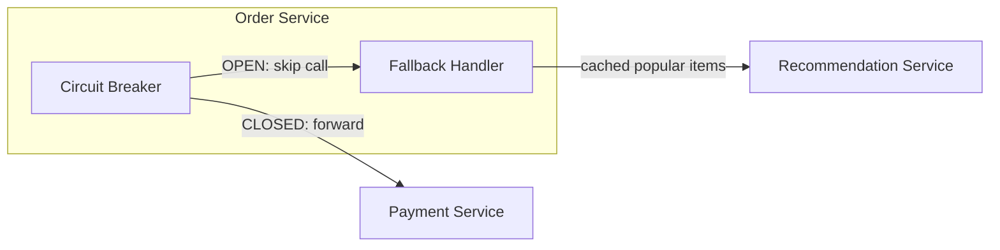
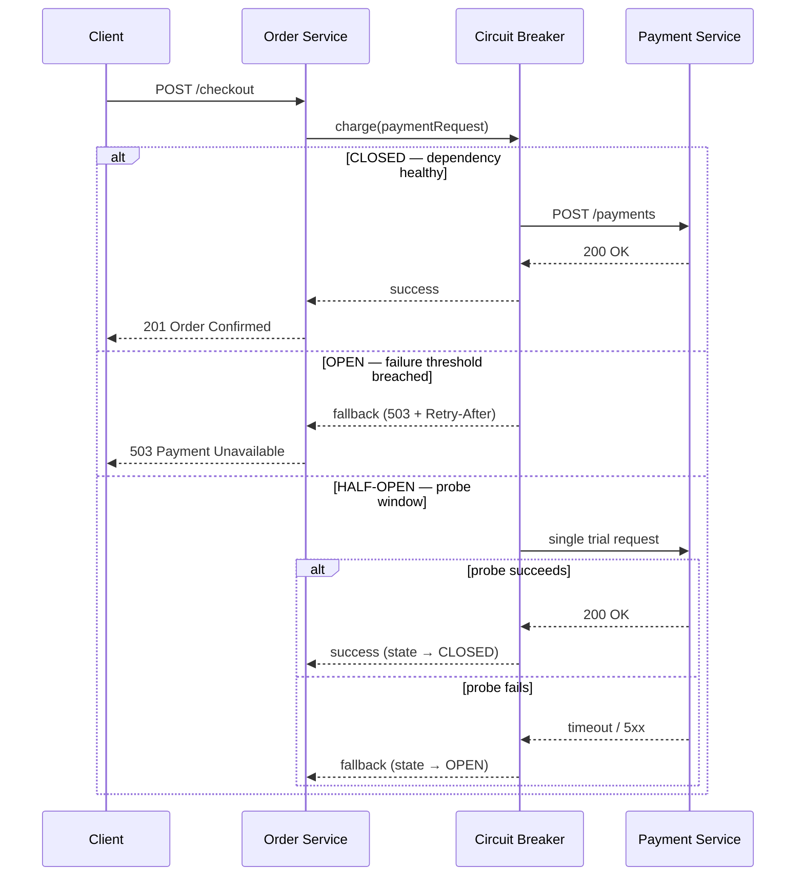

## 1. Executive Summary

The Circuit Breaker Pattern wraps outbound network calls in a **state machine** that tracks failure rates. When a downstream dependency is unhealthy, the breaker **trips to OPEN** and fails fast — returning a fallback or structured error without tying up threads on doomed requests. This stops one slow or failing service from exhausting the caller's thread pool and causing a **cascade outage** across the platform.

- **Video reference:** [Circuit Breaker Pattern Explained](https://www.youtube.com/watch?v=6W8FCW2rWNQ)

---

## 2. Problem It Solves

Without a circuit breaker, a degraded downstream service causes every caller to **block until timeout**. Under load, thread pools fill, connection queues grow, and healthy services starve — classic **cascading failure**.

| Symptom without breaker | Root cause |
| :--- | :--- |
| Thread pool exhaustion | Every request waits on a sick dependency |
| Latency spikes platform-wide | Backpressure propagates up the call chain |
| Retry storms | Clients retry into an already overloaded service |
| False "healthy" dashboards | HTTP 200 from timeout wrappers masking failures |

The breaker converts sustained failure into **immediate, bounded responses** so the rest of the system stays alive.

---

## 3. Visual Architecture

```mermaid
stateDiagram-v2
    [*] --> Closed : System Healthy
    Closed --> Open : Failure Rate > Threshold
    Note over Open: Fail Fast / Execute Fallback
    Open --> HalfOpen : Sleep Window Expires
    HalfOpen --> Closed : Probe Successes Met
    HalfOpen --> Open : Probe Failure Detected
```



---

## 4. Core Flow



Remote gRPC/HTTP calls pass through a breaker interceptor (e.g., Resilience4j). The wrapper monitors outcomes over a **rolling time window** using thread-safe circular buffers. State changes are exported to Prometheus so on-call engineers see trips in real time.

See also: [Transient Fault Handling](/microservices/transient-fault-handling-timeouts-retries/), [Bulkhead Isolation](/microservices/bulkhead-isolation-pattern/), and [Communication Topologies](/microservices/microservices-communication-topologies/).

---

## 5. Real-World Example

**BFSI retail banking — card payment during checkout**

A customer places an order on a fintech e-commerce app. The Order Service calls the Payment Service to authorize the card.

| Dependency state | Breaker behavior | Customer experience |
| :--- | :--- | :--- |
| Payment healthy | CLOSED — call proceeds | Normal checkout |
| Payment degraded (50%+ errors) | OPEN — fail fast | "Payments temporarily unavailable — try again in 60s" |
| Payment recovering | HALF-OPEN — 3 probe calls | Gradual traffic restoration |

**Recommendation engine (read path):** When the breaker is OPEN, return a static "Popular Items" list from Redis — degraded UX, not a blank 503 page.

**Payment (write path):** Never fake a successful charge. Return `503` + `Retry-After` — writes cannot be silently dropped.

---

## 6. Design Options / Patterns

### Implementation choices

| Option | Layer | Best for |
| :--- | :--- | :--- |
| **Resilience4j** | Application library (Spring Boot) | Fine-grained per-dependency config in code |
| **Istio outlier detection** | Service mesh (Envoy sidecar) | Platform-wide policy without code changes |
| **API gateway breaker** | Edge (Kong, APISIX) | Protecting backend pools from external traffic |
| **Hystrix** (legacy) | Application library | Deprecated — prefer Resilience4j |

### Configuration knobs

| Parameter | Typical value | Purpose |
| :--- | :--- | :--- |
| **Failure rate threshold** | 50% over sliding window | Trip condition for OPEN state |
| **Slow call threshold** | P95 > 2s counts as failure | Catch latency degradation, not just errors |
| **Wait duration (open)** | 30–60 seconds | Sleep window before HALF-OPEN probe |
| **Permitted calls (half-open)** | 3–10 trial requests | Bounded recovery test traffic |
| **Upstream read timeout** | < downstream timeout | Ensures breaker sees failures before client abandons |

---

## 7. Trade-offs

| Pros | Cons | When NOT to use |
| :--- | :--- | :--- |
| Stops cascading thread exhaustion | Planned feature degradation when OPEN | Internal in-process calls (no network) |
| Fast failure improves perceived latency vs hanging | Misconfigured thresholds cause flapping | When you have no fallback strategy defined |
| Pairs well with bulkhead isolation | Does not fix the root cause of outage | Single monolith with no remote dependencies |
| Observable state transitions (metrics/alerts) | Write paths need explicit retry/queue contracts | Latency-sensitive paths where any fallback is unacceptable |

---

## 8. Failure Scenarios

| Failure Mode | Symptom | Mitigation |
| :--- | :--- | :--- |
| **Timeout misalignment** | Breaker never trips; thread exhaustion | `downstream_timeout < upstream_timeout < client_timeout` |
| **No fallback defined** | Hard 503 with no degraded UX | Pre-cached static responses per dependency |
| **Flapping half-open** | Oscillating OPEN/CLOSED under load | Increase wait duration; require N successes to close |
| **Breaker as root-cause fix** | Outage persists after recovery | Breaker contains blast radius; fix dependency separately |
| **Dropped writes on OPEN** | Lost mutations without queue | Explicit async queue or idempotent client retry contract |

Misconfigured timeouts are the most common production bug: if the breaker timeout is **longer than the upstream client's timeout**, the breaker never trips and thread pools remain exposed.

---

## 9. Best Practices

**Resilience stack per downstream dependency:**

1. **Bulkhead** — isolated thread pool per dependency
2. **Timeout** — bounded wait on every outbound call
3. **Circuit breaker** — fail fast on sustained failure
4. **Fallback** — cached / static / structured error (never fake writes)
5. **Retry** (optional) — only on idempotent reads, with jitter

| Practice | Detail |
| :--- | :--- |
| Align timeouts | Breaker must observe failures before the caller gives up |
| Separate read vs write fallbacks | Reads degrade to cache; writes return structured errors |
| Export breaker state metrics | `circuitbreaker_state`, `calls_not_permitted_total` |
| Pair with bulkhead | One broken dependency cannot monopolize the container |
| Test HALF-OPEN in staging | Verify probe traffic volume is bounded |

---

## 10. Interview Answer

> "A circuit breaker is a state machine wrapped around outbound calls — CLOSED, OPEN, and HALF-OPEN. In CLOSED, calls pass through normally while the breaker tracks failure rate in a sliding window. When failures exceed a threshold — say 50% over 10 seconds — it trips to OPEN and immediately returns a fallback or error without hitting the network. After a sleep window, it allows a few probe requests in HALF-OPEN; if they succeed, it closes again.
>
> In a fintech checkout, if the payment service is down, I'd fail fast with a 503 and Retry-After rather than hanging every checkout thread. For a recommendation service, I'd serve cached popular items. The breaker doesn't fix the outage — it **contains blast radius** so one dependency doesn't take down the whole platform. I'd always pair it with timeouts, bulkheads, and aligned timeout chains."

---

## 11. Implementation




**Spring Boot + Resilience4j:**

```java
@Service
public class PaymentClient {

    @CircuitBreaker(name = "payment", fallbackMethod = "paymentFallback")
    @Bulkhead(name = "payment")
    @TimeLimiter(name = "payment")
    public CompletableFuture<PaymentResult> charge(Order order) {
        return CompletableFuture.supplyAsync(() ->
            restClient.post("/payments", order, PaymentResult.class));
    }

    private CompletableFuture<PaymentResult> paymentFallback(Order order, Throwable t) {
        return CompletableFuture.failedFuture(
            new PaymentUnavailableException("Payment service unavailable", t));
    }
}
```

**application.yml:**

```yaml
resilience4j.circuitbreaker:
  instances:
    payment:
      slidingWindowSize: 20
      failureRateThreshold: 50
      waitDurationInOpenState: 30s
      permittedNumberOfCallsInHalfOpenState: 5
```




**sony/gobreaker pattern:**

```go
type PaymentClient struct {
    breaker *gobreaker.CircuitBreaker
    http    *http.Client
}

func NewPaymentClient() *PaymentClient {
    settings := gobreaker.Settings{
        Name:        "payment",
        MaxRequests: 5,
        Interval:    10 * time.Second,
        Timeout:     30 * time.Second,
        ReadyToTrip: func(counts gobreaker.Counts) bool {
            failureRatio := float64(counts.TotalFailures) / float64(counts.Requests)
            return counts.Requests >= 10 && failureRatio >= 0.5
        },
    }
    return &PaymentClient{
        breaker: gobreaker.NewCircuitBreaker(settings),
        http:    &http.Client{Timeout: 2 * time.Second},
    }
}

func (c *PaymentClient) Charge(ctx context.Context, order Order) (PaymentResult, error) {
    result, err := c.breaker.Execute(func() (interface{}, error) {
        return c.doCharge(ctx, order)
    })
    if err != nil {
        return PaymentResult{}, fmt.Errorf("payment unavailable: %w", err)
    }
    return result.(PaymentResult), nil
}
```




**pybreaker pattern:**

```python
import pybreaker
import httpx

payment_breaker = pybreaker.CircuitBreaker(
    fail_max=5,
    reset_timeout=30,
    exclude=[httpx.TimeoutException],
)

@payment_breaker
def charge(order: dict) -> dict:
    response = httpx.post(
        "http://payment-service/payments",
        json=order,
        timeout=2.0,
    )
    response.raise_for_status()
    return response.json()

def charge_with_fallback(order: dict) -> dict:
    try:
        return charge(order)
    except pybreaker.CircuitBreakerError:
        raise PaymentUnavailableError("Payment service circuit is OPEN")
```




```text
STATE closed:
  result = CALL downstream(request)
  IF result.failed: INCREMENT failure_count
  IF failure_rate > THRESHOLD: STATE = open
  RETURN result

STATE open:
  IF sleep_window_elapsed: STATE = half_open
  ELSE: RETURN fallback() WITHOUT calling downstream

STATE half_open:
  IF probe_call succeeds enough times: STATE = closed
  IF probe_call fails: STATE = open
```



