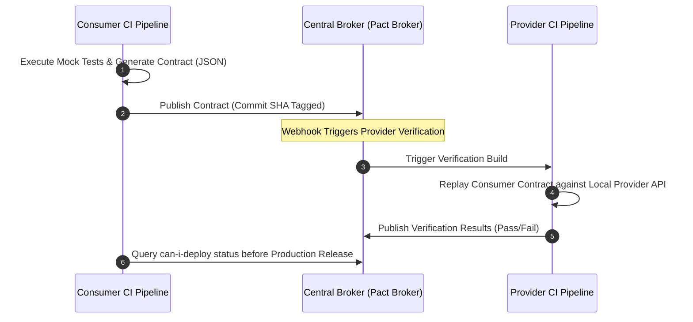

### Core Microservices Pattern & Architectural Intent

Consumer-Driven Contract Testing (CDCT) decouples microservice release lifecycles by shifting integration testing left, defining explicit, executable API contracts between upstream "consumers" and downstream "providers" to prevent breaking changes without relying on heavy end-to-end integration environments.

- **Video Reference:** [Consumer-Driven Contract Testing Explained](https://www.youtube.com/watch?v=HV5u-HjEFvY)

---

### Production-Grade Implementation & Data Mechanics



#### Runtime Execution Path & Verification Mechanics

**Contract Generation:** The consumer test suite runs locally using a framework like Pact. It records expected gRPC/HTTP request payloads and matching mock responses, serializing the interactions into an immutable contract file (JSON).

**Broker Synchronization:** The consumer pipeline pushes this artifact to a centralized Contract Broker. When the provider service runs its CI pipeline, it fetches all active contracts bound to its service name and replays those exact payloads against its local code.

#### State Management & Test Isolation

Providers use specific **state hooks** (e.g., `@State("user 123 exists")`) to set up mock database fixtures locally before the contract framework fires the replayed request, isolating testing states from live database engines.

See also: [API Gateway & BFF Pattern](/microservices/api-gateway-bff-pattern/) and [Microservices Communication Topologies](/microservices/microservices-communication-topologies/).

---

### CDCT vs. E2E Integration Testing

| Dimension | Consumer-Driven Contracts (Pact) | Full E2E Integration Cluster |
| :--- | :--- | :--- |
| **Scope** | Interface structure + semantics | Full stack including infra |
| **Speed** | Seconds per service pair | Minutes to hours |
| **Flakiness** | Low — local replay | High — network, data, timing |
| **Release coupling** | Decoupled via broker gates | Tightly coupled deploy windows |
| **Infra validated** | No (proxy timeouts, LB quirks) | Yes |

---

### Critical System Design Trade-offs & Operational Realities

#### Network & Latency Impact

Zero network overhead on the production hot path. The trade-off is shifted to the **CI/CD pipeline execution times**, where the contract broker introduces an external dependency that must be highly available to prevent blocking deployment pipelines.

#### Data Consistency & Isolation

High structural isolation, but contract testing does not validate multi-service operational state dependencies or cross-network infrastructure quirks (e.g., load balancer timeouts, proxy header stripping). It acts purely as a **semantic and structural type-checking layer** for system interfaces.

#### Failure Modes & Cascading Risk

**Stale Contract Drift:** If a consumer updates its contract but fails to tag or version it correctly in the broker, providers verify against stale specifications, masking breaking API changes until they collide in production.

| Failure Mode | Symptom | Mitigation |
| :--- | :--- | :--- |
| **Stale contract in broker** | Provider passes; production breaks | Tag contracts with consumer commit SHA |
| **Broker outage blocks CI** | Deploy pipelines frozen | Broker HA; local contract cache fallback |
| **Missing provider state hook** | False verification failures | `@State` fixtures for every contract scenario |
| **E2E-only testing** | Slow, flaky CI; delayed releases | Testing pyramid — contracts replace 90% of cross-boundary tests |
| **can-i-deploy skipped** | Consumer deploys against unverified provider | Mandatory broker gate before production |

---

### Testing Pyramid with Contract Gates

```text
                    ┌─────────┐
                    │  E2E    │  ← few smoke tests (staging infra)
                    │  smoke  │
                   ┌┴─────────┴┐
                   │  Contract │  ← Pact: consumer ↔ provider interfaces
                   │   tests   │
                  ┌┴───────────┴┐
                  │  Unit tests │  ← domain logic per service
                  └─────────────┘
```

Contracts sit between unit and E2E — fast enough for every PR, precise enough to catch breaking API changes.

---

### Pact Workflow Checklist

```text
  Consumer PR:
    1. Run Pact consumer tests (mock provider)
    2. Publish contract to broker (tag: feature-branch)

  Provider PR:
    3. Broker webhook triggers provider verification
    4. Provider replays all consumer contracts locally
    5. Publish verification result (pass/fail)

  Production deploy:
    6. Consumer queries can-i-deploy(consumer, provider, environment)
    7. Deploy only if all bound contracts verified
```

---

### Interview Failure Modes & Pro-Tips

#### The "Junior" Mistake

Relying entirely on spinning up a full Docker Compose or Kubernetes integration cluster in CI to execute end-to-end (E2E) UI-to-database integration tests for every minor code change, creating slow, flaky, and hard-to-debug pipelines.

#### The "Senior" Counter-Measure

Implement the **Testing Pyramid with Contract Gates**. Explain how unit tests validate core business domain logic, contract tests replace 90% of cross-boundary integration tests by validating structural interface compatibility, and a highly targeted, minimal set of end-to-end smoke tests runs in a staging environment purely to verify underlying cloud infrastructure topology.

```text
  What contracts DO validate:
    ✓ Request/response schema compatibility
    ✓ HTTP status codes and header expectations
    ✓ Provider behavior for declared consumer states

  What contracts DO NOT validate:
    ✗ Load balancer timeout behavior
    ✗ Cross-service database transactional state
    ✗ Production network partition scenarios
```

---
