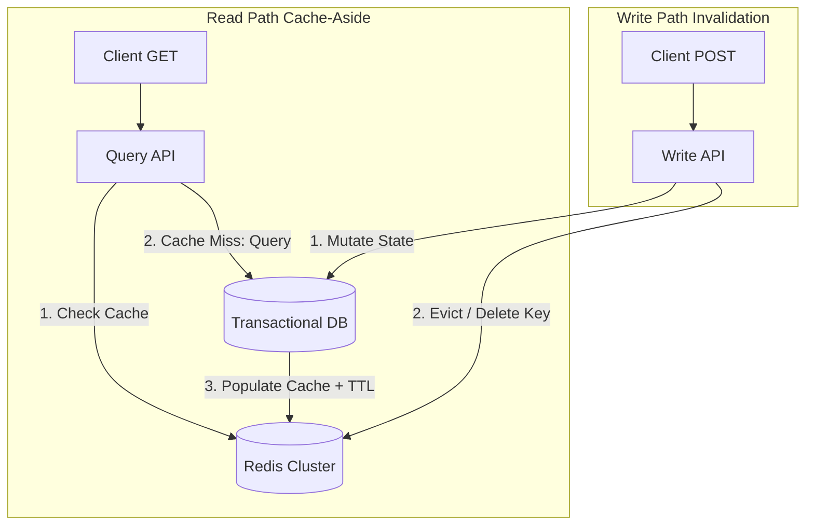

### Core Microservices Pattern & Architectural Intent

Distributed Cache with Invalidation Strategy (Cache-Aside vs. Write-Through vs. Refresh-Ahead) reduces read-side latency and isolates back-end transactional databases from repetitive query loads by storing heavily requested, slow-moving data in an in-memory storage engine.

- **Video Reference:** [Distributed Caching Explained](https://www.youtube.com/watch?v=KF-3jtGH6Yk)

---

### Production-Grade Implementation & Data Mechanics



#### Runtime Execution Path & Wire Path Mechanics

**Cache-Aside Loop:** The microservice intercepts a read query → calls Redis/Memcached via low-latency binary TCP sockets → on a cache hit, returns immediately. On a cache miss, it executes the query against the main database, updates the cache with a defined Time-To-Live (TTL), and returns.

**Atomic Eviction:** On data mutations, the service writes updates to the database first, and then explicitly fires a cache eviction (Delete Key) operation over the network to force the next read request to fetch fresh data.

See also: [CDC-Based Cache Invalidation](/system-design/cdc-based-cache-invalidation/) and [Cache Stampede & Penetration Mitigation](/system-design/cache-stampede-and-penetration-mitigation/).

---

### Cache Strategy Comparison

| Strategy | Read path | Write path | Consistency | Complexity |
| :--- | :--- | :--- | :--- | :--- |
| **Cache-aside** | App checks cache; loads on miss | App writes DB, then evicts cache | Eventual (eviction can fail) | Low |
| **Write-through** | App reads cache (always populated) | App writes cache + DB together | Stronger on write | Medium |
| **Write-behind** | Cache-aside read | App writes cache; async flush to DB | Risky — data loss window | High |
| **Refresh-ahead** | Proactive reload before TTL expiry | Same as cache-aside | Reduces miss spikes | Medium |

---

### Critical System Design Trade-offs & Operational Realities

#### Network & Latency Impact

Read-path latencies drop from double-digit milliseconds (disk-backed database) to sub-millisecond ranges. However, caching introduces extra operational infrastructure nodes, connection pool overhead, and dual-network write coordination to the codebase.

#### Data Consistency & Isolation

The system faces unavoidable **eventual consistency** windows. If the database write succeeds but the subsequent cache eviction call fails (due to a network drop or app crash), the cache will serve stale, incorrect data until its TTL naturally expires.

#### Failure Modes & Cascading Risk

**Cache Stampede (Thundering Herd):** When a highly requested key expires under heavy traffic, thousands of concurrent threads will detect the cache miss simultaneously and hit the back-end database at the same time, causing resource exhaustion and localized database outages. Prevent this by applying probabilistic early expiration or mutual exclusion locks (`SETNX`) during cache reloads.

| Failure Mode | Symptom | Mitigation |
| :--- | :--- | :--- |
| **Failed post-write eviction** | Stale cache until TTL expires | CDC-driven eviction; shorter TTL safety net |
| **Cache stampede** | DB overload on hot key expiry | `SETNX` lock + single-flight reload |
| **Dual-write race** | Cache holds older value after concurrent writes | Versioned cache values; last-write-wins policy |
| **Unbounded cache growth** | Redis memory exhaustion | TTL on all keys; eviction policy (`allkeys-lru`) |
| **Cache-aside without TTL** | Permanent stale data on missed eviction | Always set TTL even with explicit eviction |

---

### Stampede Prevention (Single-Flight Reload)

```text
  Cache miss on hot key "product:42"
        │
        ▼
  SETNX lock:product:42 (TTL 5s)
        │
        ├── Lock acquired  → ONE thread queries DB → populates cache → DEL lock
        │
        └── Lock held      → other threads wait/retry cache read (not DB)
```

---

### CDC-Driven Invalidation Architecture

```text
  DB Write (WAL) ──► Debezium ──► Kafka ──► Eviction Worker ──► DEL redis:key

  Benefits:
    ✓ Write path not blocked by cache network call
    ✓ Eviction survives app crash after DB commit
    ✓ Decouples cache coherence from application dual-write logic
```

See [CDC-Based Cache Invalidation](/system-design/cdc-based-cache-invalidation/) for pipeline failure modes and binlog lag windows.

---

### Interview Failure Modes & Pro-Tips

#### The "Junior" Mistake

Blindly stating that they will "just update the cache right after updating the database," without considering what happens if network calls fail mid-execution or how concurrent writes cause race conditions that fill the cache with invalid data.

#### The "Senior" Counter-Measure

Champion **CDC-Driven Cache Invalidation**. To decouple the write hot path and guarantee cache eviction, use a Change Data Capture engine (e.g., Debezium) to monitor the database transaction log. When a row changes, the CDC pipeline automatically streams an eviction event to a specialized worker that invalidates the corresponding Redis keys, eliminating application-level dual-write issues.

```text
  Cache invalidation hierarchy (best → acceptable):

    1. CDC-driven eviction (source of truth = DB WAL)
    2. Explicit DELETE after successful DB write + TTL safety net
    3. TTL-only expiry (acceptable for low-stakes reads only)
    ✗ Never rely on cache update without eviction on mutation
```

---
