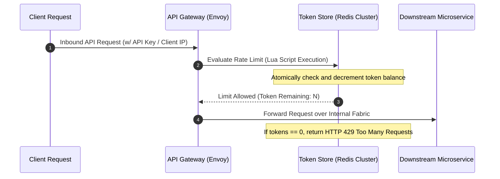

### Core Microservices Pattern & Architectural Intent

Distributed Rate Limiting and Traffic Throttling protects downstream microservice clusters from being overwhelmed by unexpected traffic spikes, malicious DDoS attacks, or runaway client loops by enforcing strict algorithmic limits on request frequencies at the system ingress.

- **Video Reference:** [Distributed Rate Limiting Explained](https://www.youtube.com/watch?v=TV-xsNjbx_g)

---

### Production-Grade Implementation & Data Mechanics



#### Runtime Execution Path & Algorithmic Configurations

**Ingress Interception:** Inbound requests pass through an API Gateway or Reverse Proxy (e.g., Envoy, Kong), which extracts identification keys such as an API key, JWT claims, or client IP addresses.

**Atomic Counter Evaluation:** The gateway evaluates the request using an algorithm like the **Token Bucket**, **Leaky Bucket**, or **Fixed/Sliding Window Log**. To handle distributed traffic accurately, the rate-limiting state is stored in a centralized, ultra-low-latency in-memory data store like Redis.

#### State Mechanics

To minimize network round-trips between the gateway and Redis, evaluation logic is bundled into atomic **Redis Lua scripts**. These scripts execute token evaluations and capacity decrements in a single atomic database operation, eliminating race conditions from concurrent client requests.

See also: [API Gateway & BFF Pattern](/microservices/api-gateway-bff-pattern/), [Distributed Rate Limiting & L7 DDoS](/security-architecture/distributed-rate-limiting-l7-ddos/), and [Bulkhead Isolation Pattern](/microservices/bulkhead-isolation-pattern/).

---

### Rate Limiting Algorithm Comparison

| Algorithm | Burst tolerance | Memory cost | Best fit |
| :--- | :--- | :--- | :--- |
| **Token bucket** | Allows short bursts up to bucket size | Low (counter + refill timestamp) | API quotas with burst headroom |
| **Leaky bucket** | Smooths traffic to fixed output rate | Low | Steady downstream protection |
| **Fixed window** | Burst at window boundary | Very low | Simple per-minute caps |
| **Sliding window log** | Precise per-request timestamps | High (stores event log) | Strict fairness requirements |

---

### Critical System Design Trade-offs & Operational Realities

#### Network & Latency Impact

Adds a mandatory network lookaside step to the critical path of every incoming request. Even with Redis optimized via persistent connection pools, this check adds **1–3 milliseconds** of network latency to the API ingress layer.

#### Data Consistency & Isolation

If the central Redis cluster fails or undergoes a network partition, the rate limiter faces a choice: **Fail-Open** or **Fail-Closed**. Failing open prioritizes availability but leaves downstream services vulnerable to traffic spikes. Failing closed protects infrastructure but can block legitimate user traffic during a component outage.

#### Failure Modes & Cascading Risk

**Redis CPU Saturation:** Under massive, distributed traffic attacks, the rate-limiting store itself can become a bottleneck. Running complex sliding-window log calculations can consume substantial CPU resources, causing Redis connection timeouts that slow down the entire API gateway layer.

| Failure Mode | Symptom | Mitigation |
| :--- | :--- | :--- |
| **Per-pod in-memory limits** | Uneven limits under autoscale | Centralized Redis + Lua atomic scripts |
| **Redis outage fail-open** | DDoS reaches downstream services | Tiered limits; circuit breakers downstream |
| **Redis outage fail-closed** | All legitimate traffic blocked | Redis HA cluster; local fallback bucket |
| **Sliding window CPU spike** | Gateway latency inflation | Prefer token bucket over window log |
| **Missing Retry-After** | Client retry storms amplify load | HTTP 429 + `Retry-After` header always |

---

### Hybrid Tiered Rate-Limiting Architecture

```text
  Internet
      │
      ▼
  Tier 1: Edge WAF (Cloudflare / AWS Shield)
          → block obvious volumetric attacks
      │
      ▼
  Tier 2: API Gateway + Redis (per API key / tenant quota)
          → Token bucket, Lua atomic decrement
      │
      ▼
  Tier 3: Service-local leaky bucket (final defense)
          → protects individual service thread pools
      │
      ▼
  Downstream microservices
```

---

### HTTP 429 Response Contract

```http
HTTP/1.1 429 Too Many Requests
Retry-After: 12
X-RateLimit-Limit: 1000
X-RateLimit-Remaining: 0
X-RateLimit-Reset: 1719590400

{"error": "rate_limit_exceeded", "message": "Quota exceeded. Retry after 12 seconds."}
```

Clients that honor `Retry-After` prevent retry storms; clients that ignore it need exponential backoff on the client SDK.

---

### Interview Failure Modes & Pro-Tips

#### The "Junior" Mistake

Proposing local, in-memory rate-limiting maps inside individual microservice application containers without explaining how to handle distributed sync across dynamically auto-scaling service instances.

#### The "Senior" Counter-Measure

Implement a **Hybrid Tiered Rate-Limiting Architecture**. Enforce broad, low-cost rate limits at the edge cloud layer (such as Cloudflare WAF) to block obvious high-volume attacks before they hit your infrastructure. Next, apply targeted Token Bucket limits at the API Gateway using Redis to manage client-specific quotas, and back this up with local, memory-efficient leaky-bucket limits within individual services as a final line of defense. When a limit is breached, always return an **HTTP 429 Too Many Requests** header containing a clear `Retry-After` timestamp to help clients back off gracefully.

```text
  Rate limit key dimensions:

    ✓ Per API key / JWT subject (tenant fairness)
    ✓ Per client IP (anonymous abuse)
    ✓ Per endpoint (protect expensive operations)
    ✓ Per user tier (free vs enterprise quotas)
```

---
