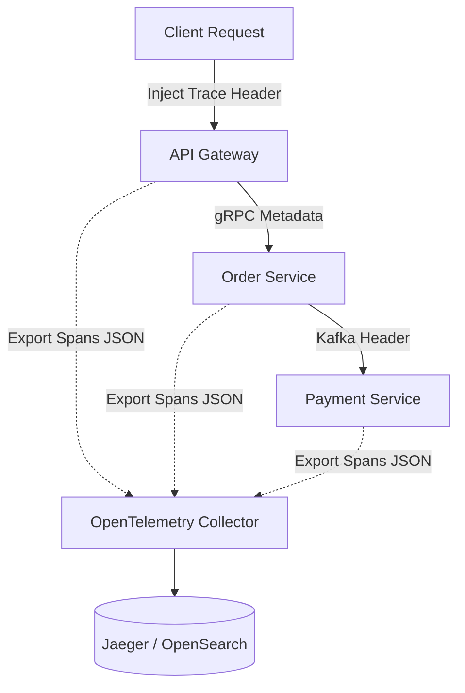

### Core Microservices Pattern & Architectural Intent

Distributed Tracing and Centralized Log Aggregation solves the visibility challenge in complex distributed systems by injecting unique correlation IDs into request lifecycles, enabling engineers to trace and reconstruct individual execution paths across multiple isolated microservices.

- **Video Reference:** [Distributed Tracing Explained](https://www.youtube.com/watch?v=JNmiOw26PGg)

---

### Production-Grade Implementation & Data Mechanics



#### Runtime Execution Path & Protocol Specifications

**Header Injection & Extraction:** At the API ingress, an OpenTelemetry-compatible library generates a unique `trace_id` and an initial `span_id`. These IDs are propagated across network boundaries using standardized headers (such as the W3C `traceparent` header: `00-4bf92f3577b34da6a3ce929d0e0e4736-00f067aa0ba902b7-01`).

**Asynchronous Transport:** Microservices write structural logs (JSON format containing `trace_id`, `span_id`, timestamp, and log level) to standard output. Background daemons (like Fluent Bit or Vector) collect these logs asynchronously and forward them to data stores like OpenSearch or Loki. Telemetry spans are pushed to an OpenTelemetry Collector via non-blocking gRPC pipelines.

See also: [Three Pillars of Observability](/microservices/three-pillars-observability/), [Microservices Communication Topologies](/microservices/microservices-communication-topologies/), and [Event-Driven Architecture & Log Streaming](/microservices/event-driven-architecture-log-streaming/).

---

### Trace vs. Log Correlation Model

| Signal | Granularity | Storage | Primary use |
| :--- | :--- | :--- | :--- |
| **Trace (span)** | Per operation hop with parent/child tree | Jaeger, Tempo, Zipkin | Latency breakdown, dependency map |
| **Structured log** | Discrete event with context fields | OpenSearch, Loki, Splunk | Error messages, business audit |
| **Shared key** | `trace_id` links both signals | Indexed in both backends | Jump from slow span → error log |

---

### Critical System Design Trade-offs & Operational Realities

#### Network & Latency Impact

Appending trace headers adds minimal network payload overhead. However, tracing every single request at high throughput can generate **massive volumes of telemetry data**, leading to storage cost explosions and network saturation.

#### Data Consistency & Isolation

Telemetry systems operate on a decoupled, **eventual consistency** model. Trace data lags behind real-time execution, meaning logs and spans can take seconds to appear in dashboards during an active production outage.

#### Failure Modes & Cascading Risk

If the telemetry pipeline's storage backend becomes overwhelmed, logging agents can experience memory pressures. If configured to **block application threads** when internal buffers are full, logging can cause the core microservices themselves to freeze.

| Failure Mode | Symptom | Mitigation |
| :--- | :--- | :--- |
| **Synchronous log appender** | P99 latency spikes under load | stdout + async agent (Fluent Bit/Vector) |
| **100% trace sampling** | Storage cost explosion | Tail-based / probabilistic sampling |
| **Blocking telemetry export** | App threads freeze on full buffer | Non-blocking OTLP export; drop-on-pressure |
| **Broken trace context** | Orphan spans across async hop | W3C `traceparent` in Kafka/gRPC headers |
| **Dashboard lag** | Traces missing during live incident | Metrics alerts first; traces for post-mortem |

---

### Tail-Based Sampling Strategy

```text
  Request completes
        │
        ▼
  Evaluate outcome at collector:
        │
        ├── HTTP 5xx or latency > SLO  ──► RETAIN trace (100%)
        │
        ├── HTTP 4xx (client error)      ──► RETAIN (configurable %)
        │
        └── HTTP 2xx healthy           ──► DROP (keep ~1% sample)
```

Tail-based sampling retains diagnostic value for failures while cutting storage volume by 90%+ on healthy traffic.

---

### Structured Log Example

```json
{
  "timestamp": "2026-06-28T14:22:01.003Z",
  "level": "ERROR",
  "service": "order-service",
  "trace_id": "4bf92f3577b34da6a3ce929d0e0e4736",
  "span_id": "00f067aa0ba902b7",
  "message": "Payment service timeout after 2000ms",
  "order_id": "ord_8f3a2c"
}
```

---

### Interview Failure Modes & Pro-Tips

#### The "Junior" Mistake

Suggesting that microservices should write logs directly to a centralized database using synchronous network appenders, which introduces a severe performance bottleneck during traffic spikes.

#### The "Senior" Counter-Measure

Propose **probabilistic tail-based sampling** for high-volume production traffic. Explain that instead of capturing 100% of healthy requests, the system can be configured to retain 100% of traces that result in an HTTP 5xx error or high latency, while dropping 99% of standard, healthy HTTP 2xx operations. This drastically reduces network and storage costs while preserving critical diagnostic data.

```text
  Observability pipeline rules:

    App layer    → stdout JSON only (never sync remote append)
    Agent layer  → Fluent Bit / Vector (async, buffered)
    Collector    → OpenTelemetry Collector (batch + sample)
    Storage      → Jaeger (traces) + Loki/OpenSearch (logs)
    Query        → correlate via trace_id in Grafana
```

---
