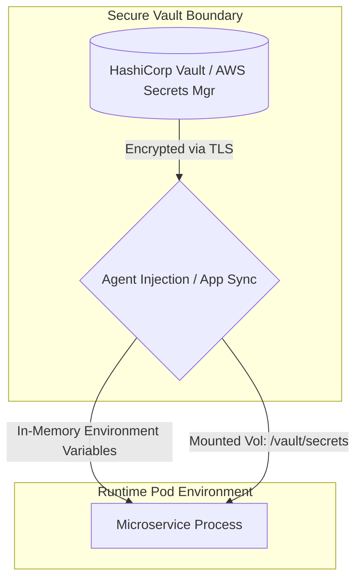

### Core Microservices Pattern & Architectural Intent

Externalized Configuration and Centralized Configuration Management extracts environment settings, feature flags, secret keys, and database credentials completely out of the deployment artifact, allowing runtime behaviors to be altered without rebuilding the microservice image.

- **Video Reference:** [Externalized Configuration Explained](https://www.youtube.com/watch?v=SvjdJoNPcHs)

---

### Production-Grade Implementation & Data Mechanics



#### Runtime Resolution Mechanics

**Bootstrap Phase:** At startup, a microservice queries a centralized configuration server (e.g., HashiCorp Vault, Spring Cloud Config, or AWS Secrets Manager) via encrypted HTTP/2 or gRPC, passing its IAM/service account identity token to pull localized configuration profiles.

**Push vs. Pull Dynamic Reloading:** High-signal systems utilize a persistent connection stream (WebSockets or long-polling) to notify application configuration managers when a key updates. The application then reloads the values in-memory without initiating a process restart.

#### State and Security Mechanics

Production secrets must never sit unencrypted on disk. Secrets are injected at runtime directly into **ephemeral in-memory environment variables** or temporary virtual filesystems (`tmpfs`) that never touch persistent host storage.

See also: [Sidecar Integration Pattern](/microservices/sidecar-integration-pattern/), [Declarative Container Orchestration (Kubernetes)](/microservices/declarative-container-orchestration-kubernetes/), and [Cloud Secret Management & Envelope Encryption](/security-architecture/cloud-secrets-envelope-encryption/).

---

### Config vs. Secret Separation Model

| Category | Examples | Storage | Rotation |
| :--- | :--- | :--- | :--- |
| **Non-sensitive config** | Feature flags, log levels, pool sizes | GitOps → Kubernetes ConfigMap | Git commit + ArgoCD sync |
| **Sensitive secrets** | DB passwords, API keys, TLS certs | Vault / AWS Secrets Manager | Vault sidecar auto-rotation |
| **Environment overrides** | `dev` vs `prod` endpoints | Profile-specific YAML in config server | Per-environment namespace |
| **Runtime toggles** | Kill switches, canary percentages | Feature flag service (LaunchDarkly, Unleash) | Push stream to app cache |

---

### Critical System Design Trade-offs & Operational Realities

#### Network & Latency Impact

Relying on an external network call during startup extends container initialization times. If a configuration server is slow, scaling out microservice instances during an ongoing traffic spike can lead to **delayed cold starts**.

#### Data Consistency & Isolation

Dynamic runtime changes introduce **configuration drift**. If a database connection string or feature flag changes, different instances of the same microservice might run with mismatched properties for a short period before all local caches synchronize.

#### Failure Modes & Cascading Risk

If the centralized configuration management cluster undergoes an outage and an auto-scaling event triggers, newly spawned containers will fail to initialize and crash immediately. Central configuration engines must be backed by multi-region replicas and **local client-side fallback caches**.

| Failure Mode | Symptom | Mitigation |
| :--- | :--- | :--- |
| **Secrets in Git** | Credential leak; compliance breach | GitOps for config only; vault for secrets |
| **Secrets baked in image** | Immutable credential rotation | Runtime injection via agent/sidecar |
| **Config server outage** | New pods crash-loop on scale-out | Local fallback cache; multi-region vault |
| **Drift window** | Split-brain behavior across replicas | Versioned config + broadcast reload |
| **Slow bootstrap** | HPA scale-up misses traffic spike | Pre-warm secrets; init container caching |

---

### GitOps + Vault Architecture

```text
  Non-sensitive                    Sensitive
  ┌──────────────┐                ┌──────────────┐
  │ Git repo     │──ArgoCD──►     │ Vault cluster │
  │ (ConfigMaps) │   ConfigMap    │ (secrets)     │
  └──────────────┘                └───────┬───────┘
                                          │ sidecar inject
                                          ▼
                                   Pod (tmpfs mount)
                                   App reads at runtime
```

---

### Interview Failure Modes & Pro-Tips

#### The "Junior" Mistake

Committing configuration files containing hardcoded production passwords or API tokens directly into Git repositories, or baking production config profiles directly into compiled Docker images.

#### The "Senior" Counter-Measure

Propose an architectural model based on **Strict Separation of Concerns**. Keep non-sensitive settings managed inside declarative source control (using GitOps tools like ArgoCD linked to Kubernetes ConfigMaps), while isolating sensitive credentials completely within dedicated secret stores (like HashiCorp Vault). Use **sidecar patterns** to handle automated, transparent secret rotations without requiring any application-level downtime.

```text
  Twelve-factor config rules:

    ✓ Config in environment (not in JAR/image)
    ✓ Secrets in vault (never in Git)
    ✓ ConfigMaps for non-sensitive (GitOps audited)
    ✓ tmpfs / in-memory for secret materialization
    ✓ Sidecar rotation (no app restart on cert rollover)
```

---
