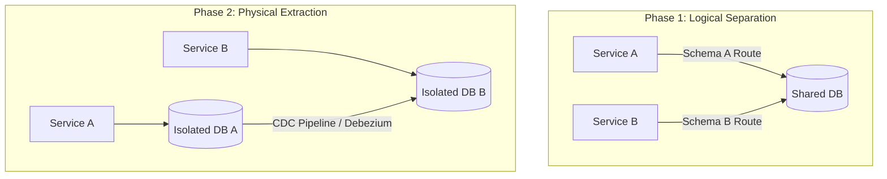

### Core Microservices Pattern & Architectural Intent

Monolithic Database Migration to Database-per-Service breaks apart a shared database anti-pattern by decoupling database schemas along bounded contexts, removing data-layer coupling that causes deployment dependencies and resource contention.

- **Video Reference:** [Monolithic Database Decomposition Explained](https://www.youtube.com/watch?v=126ALse1rWA)

---

### Production-Grade Implementation & Data Mechanics



#### Runtime Execution Path & Migration Mechanics

**Logical Separation:** Before physically splitting databases, developers isolate code domains within the application layer by assigning distinct database users/roles to dedicated logical schemas (or namespaces) inside the single database cluster.

**Physical Migration & Replication:** Physical migration uses Change Data Capture (CDC) via the database replication log (e.g., AWS DMS, Debezium parsing PostgreSQL WAL). The new microservice reads and writes to its new target engine while the replication pipeline syncs legacy tables in real-time until cutover.

**Data Mechanics:** View-layer proxies or temporary API-forwarding wrappers ensure that any code path still needing access to migrated tables routes through an explicit network contract rather than direct database joins.

See also: [Database Per Microservice](/microservices/database-per-microservice/), [Strangler Fig Application Pattern](/microservices/strangler-fig-application-pattern/), and [Saga Pattern](/microservices/saga-pattern-distributed-transactions/).

---

### Five-Phase Migration Strategy

| Phase | Action | Rollback capability |
| :--- | :--- | :--- |
| **1 — Logical schemas** | Separate DB users/roles per bounded context | Revert code paths only |
| **2 — CDC mirror** | Stream WAL changes to new target DB | Stop CDC; old DB is source of truth |
| **3 — Read flip** | Route reads to new service/DB | Revert read routing via feature flag |
| **4 — Write flip** | Route writes to new service; reverse-sync to legacy | Reverse CDC keeps legacy as fallback |
| **5 — Decommission** | Drop legacy tables after stabilization window | Requires validated data parity audit |

---

### Critical System Design Trade-offs & Operational Realities

#### Network & Latency Impact

Splitting databases replaces in-memory ACID foreign-key constraints with network hops. Queries that once relied on a simple local `JOIN` are forced to execute distributed application-layer joins or pull data from event-driven read-replicas.

#### Data Consistency & Isolation

Transactions shift from immediate ACID isolation to **eventual consistency**. Referential integrity can no longer be enforced by the database engine; instead, applications must manage dangling references (e.g., handling an Order record whose matching `customer_id` was deleted in another service).

#### Failure Modes & Cascading Risk

**Replication Lag During Cutover:** If the CDC pipeline falls behind right before system cutover, data updates can be dropped, causing split-brain scenarios where both old and new databases contain conflicting records.

| Failure Mode | Symptom | Mitigation |
| :--- | :--- | :--- |
| **CDC lag at cutover** | Conflicting records in old + new DB | Lag gate: cutover only when lag < threshold |
| **Big-bang dump/restore** | Hours of downtime; no rollback | Phased CDC migration only |
| **Orphaned foreign keys** | Orders referencing deleted customers | Saga compensation; soft-delete contracts |
| **Cross-schema JOIN remnant** | Hidden coupling blocks extraction | API proxy replaces every cross-schema query |
| **Dual-write divergence** | Both DBs disagree on state | Reconciliation job + idempotent sync |

---

### Cutover Gate & Lag Monitoring

```text
  Pre-cutover checklist:
    ✓ CDC replication lag < 500ms for 24h
    ✓ Row-count parity audit (old vs new)
    ✓ Hash sample validation on critical tables
    ✓ Feature flag ready for instant read/write revert
    ✓ Reverse-sync pipeline tested (new → old)

  Cutover sequence:
    1. Pause writes (brief) OR dual-write window
    2. Verify lag = 0
    3. Flip write path to new DB
    4. Monitor error rates for 48h
    5. Decommission legacy tables
```

---

### Interview Failure Modes & Pro-Tips

#### The "Junior" Mistake

Proposing a **"big-bang" offline migration** window to run a massive database dump and restore, which introduces significant production downtime and offers no safe rollback path.

#### The "Senior" Counter-Measure

Outline a **multi-phase migration strategy**: 1) Extract logical schemas, 2) Dual-write or use CDC to mirror data to the new database engine, 3) Change read paths to the new service, 4) Flip write paths to the new service, keeping the old database synchronized in reverse as a fallback, and 5) Drop the legacy tables once the system stabilizes.

```text
  Replace this:                    With this:
  pg_dump → restore → pray         logical schemas → CDC mirror
                                   → read flip → write flip
                                   → reverse sync → decommission
```

---
