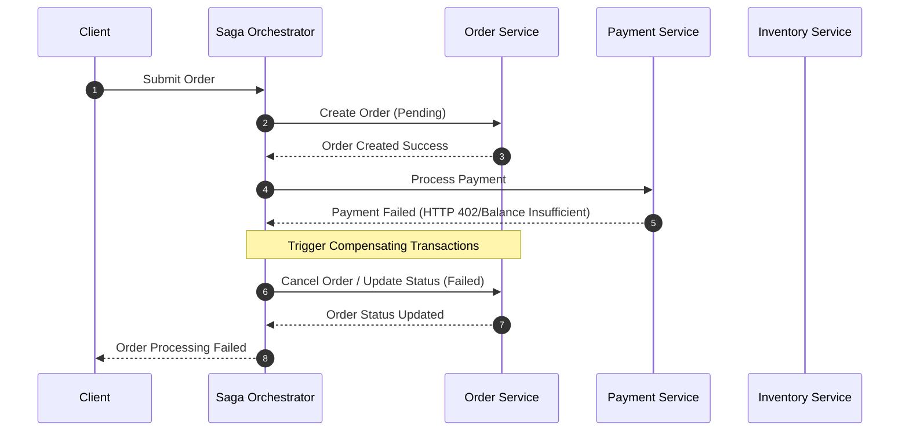

### Core Microservices Pattern & Architectural Intent

The Saga Pattern (Orchestration vs. Choreography) manages distributed transactions across multiple independent microservices databases to ensure eventual data consistency without locking database rows, eliminating the risk of distributed deadlocks inherent in two-phase commit (2PC) protocols.

- **Video Reference:** [Saga Pattern Explained](https://www.youtube.com/watch?v=dJI2saoM5_k)

---

### Production-Grade Implementation & Data Mechanics



#### Runtime Execution Path & Wire Protocols

**Choreography (Event-Driven):** Services publish events asynchronously (via Kafka or RabbitMQ AMQP) when they complete their local transaction. Neighboring services listen to these events and execute their local tasks. No central coordinator exists.

**Orchestration (Command-Driven):** A central Saga Orchestrator service sends direct commands via gRPC or HTTP/2 to target microservices. The orchestrator tracks state transitions inside a state-machine engine (e.g., Temporal, AWS Step Functions).

**Coordination & State Mechanics:**

* **Compensating Transactions:** If step $N$ fails (e.g., payment rejected), the system must explicitly fire backwards-looking compensating updates for steps $1$ to $N-1$ (e.g., reversing an inventory hold) to restore backward balance. These actions must be designed to be completely idempotent.

See also: [Transactional Outbox Pattern](/database-handbook/transactional-outbox-pattern/) for atomic state-machine persistence in the orchestrator layer.

---

### Choreography vs. Orchestration Comparison

| Dimension | Choreography | Orchestration |
| :--- | :--- | :--- |
| **Coordination** | Decentralized — services react to events | Centralized — orchestrator drives commands |
| **Visibility** | Hard to trace end-to-end flow across event mesh | Single state machine with full saga timeline |
| **Coupling** | Loose — services only know their neighbors | Tighter — orchestrator knows all participants |
| **Failure handling** | Each service must know its compensating event | Orchestrator explicitly sequences compensations |
| **Best fit** | Simple linear flows, mature event infrastructure | Complex branching, timeouts, human-in-the-loop |

---

### Critical System Design Trade-offs & Operational Realities

#### Network & Latency Impact

Choreography increases event mesh serialization overhead and trace complexity. Orchestration introduces a centralized network bottleneck; every transactional state change requires an extra synchronous or asynchronous round-trip to the orchestrator's state store.

#### Data Consistency & Isolation

Lacks the "Isolation" property of ACID. Local changes are immediately visible to other queries before the entire Saga is finalized. This leads to dirty reads or lost updates if concurrent users query or modify state mid-Saga. Mitigation requires **semantic locking** (e.g., setting an entity status to `PENDING_APPROVAL`).

#### Failure Modes & Cascading Risk

If a compensating transaction fails due to a network drop or target service outage, the system gets stuck in a half-baked state. This requires persistent retry loops with exponential backoff and eventual escalation to an out-of-band operational alert dashboard.

| Failure Mode | Symptom | Mitigation |
| :--- | :--- | :--- |
| **Compensation failure** | Saga stuck mid-rollback; orphaned holds/charges | Persistent retry queue + ops escalation dashboard |
| **Missing isolation** | Dirty reads on `PENDING` entities | Semantic status locks; reject concurrent mutations |
| **Orchestrator state loss** | Lost saga progress; duplicate side effects | Durable state store + transactional outbox on orchestrator |
| **Choreography trace blindness** | Cannot reconstruct failure path | Correlation IDs + distributed tracing across events |
| **Non-idempotent compensation** | Double credit memos or duplicate releases | Idempotency keys on every compensating command |

---

### Interview Failure Modes & Pro-Tips

#### The "Junior" Mistake

Believing that if a step fails, the Saga engine can automatically issue a database "rollback" across service boundaries.

#### The "Senior" Counter-Measure

Point out that **compensation is not a database rollback**; it is a forward-moving counter-transaction that leaves an audit trail (e.g., issuing a credit memo to reverse a charge). Emphasize using the **Outbox Pattern** inside the Saga Orchestrator itself to ensure its state machine transitions are written to disk and published to the message broker atomically.

```text
  Saga Step N fails
        │
        ▼
  Compensate N-1 ──► Compensate N-2 ──► ... ──► Compensate 1
        │                  │                         │
        ▼                  ▼                         ▼
  Credit memo         Release inventory hold    Cancel order (FAILED)
  (not DELETE)        (not ROLLBACK txn)        (audit trail retained)
```

---
