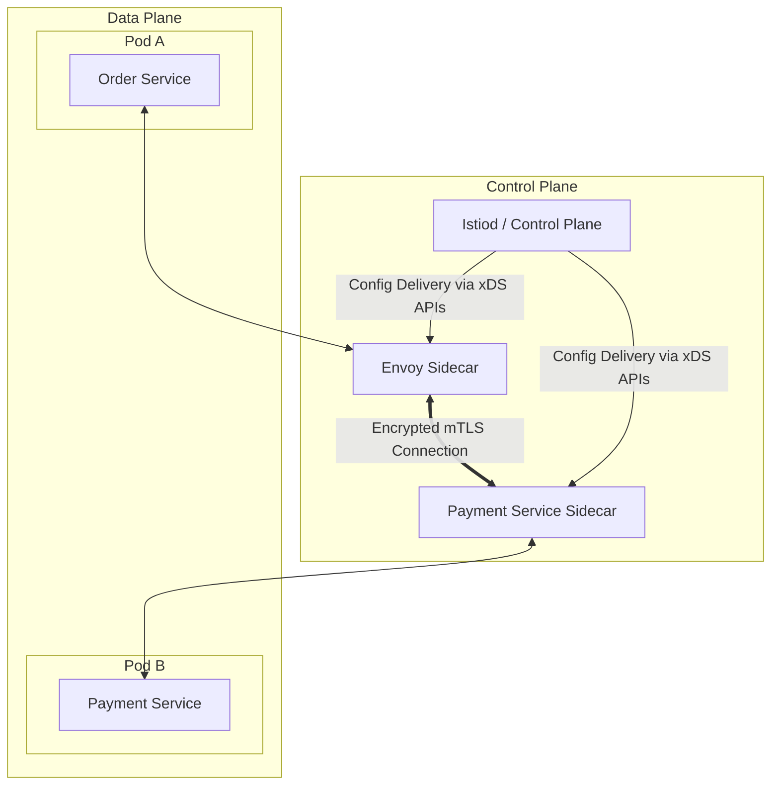

### Core Microservices Pattern & Architectural Intent

Service Mesh (Data Plane vs. Control Plane) builds a dedicated infrastructure layer over the entire distributed topology, centralizing traffic management, load balancing, security policies, and observability configurations across thousands of distinct microservices.

- **Video Reference:** [Service Mesh Explained](https://www.youtube.com/watch?v=6DQzFUDkQB8)

---

### Production-Grade Implementation & Data Mechanics



#### Data Plane vs. Control Plane Mechanics

**The Data Plane:** Composed of high-performance sidecar proxies (e.g., Envoy) deployed alongside microservices. These handle routing, retries, circuit breaking, and metrics collection directly on the hot path.

**The Control Plane:** A centralized coordinator (e.g., Istiod) that runs out-of-band. It translates declarative YAML configurations into runtime operational rules and distributes them to data plane proxies using streaming **xDS gRPC APIs**.

**State Management:** The control plane watches the core platform service registry (e.g., Kubernetes API server) to dynamically update endpoint routing states inside the data plane without requiring service restarts.

See also: [Sidecar Integration Pattern](/microservices/sidecar-integration-pattern/), [Circuit Breaker Pattern](/microservices/circuit-breaker-pattern/), [Dynamic Service Discovery & Registry](/microservices/dynamic-service-discovery-registry/), and [Zero-Trust mTLS](/security-architecture/zero-trust-mtls/).

---

### Control Plane xDS API Surface

| xDS API | Delivers | Example policy |
| :--- | :--- | :--- |
| **LDS** (Listener) | Inbound/outbound listener config | Port 15001 intercept |
| **RDS** (Route) | HTTP route tables | Weighted canary split |
| **CDS** (Cluster) | Upstream endpoint clusters | Payment service endpoints |
| **EDS** (Endpoint) | Live pod IP list | K8s endpoint watch updates |
| **SDS** (Secret) | TLS certificates | mTLS cert rotation |

---

### Critical System Design Trade-offs & Operational Realities

#### Network & Latency Impact

While individual sidecar hops add minimal delay, the collective impact across a long microservice call chain can add noticeable latency. The control plane also creates a massive configuration distribution footprint—pushing updates to thousands of sidecars simultaneously during a cluster scaling event can saturate the network.

#### Data Consistency & Isolation

Strong isolation. Telemetry, access control policies, and routing modifications take effect asynchronously across the mesh without requiring service redeployments, though there may be slight propagation delays before rules align cluster-wide.

#### Failure Modes & Cascading Risk

**Control Plane Disconnection:** If a sidecar proxy loses connection to the control plane, it continues routing based on its last cached state. However, it cannot discover newly scaled pods, which can lead to traffic imbalances and localized timeouts during cluster changes.

| Failure Mode | Symptom | Mitigation |
| :--- | :--- | :--- |
| **CP disconnect** | Stale endpoints after scale-out | CP HA replicas; proxy last-known-good with TTL alerts |
| **xDS push storm** | Network saturation on deploy | Incremental xDS; staged rollout of config |
| **Chain latency amplification** | P99 grows with hop count | Reduce sync chains; ambient mesh for L4 policies |
| **Mesh on small cluster** | Ops overhead > benefit | Defer mesh until N services / compliance need |
| **Policy propagation lag** | Brief window of old routing rules | Canary config validation before global push |

---

### Sidecar Mesh vs. Ambient Mesh

```text
  Classic Sidecar Mesh                Ambient / Proxyless Mesh
  ┌─────┐ ┌─────┐                    ┌─────┐      ┌─────┐
  │ App │ │Envoy│ per pod              │ App │      │ App │
  └─────┘ └─────┘                      └──┬──┘      └──┬──┘
       2 containers/pod                       │            │
                                              ▼            ▼
                                         Node-level ztunnel / eBPF
                                         (shared proxy layer)
                                              │
                                         Istiod control plane
```

**Ambient Mesh** (Istio) and **eBPF-driven** networking (Cilium) move L4 mTLS and policy enforcement to a shared node-level proxy—eliminating per-pod sidecar CPU/memory overhead while retaining centralized policy via the control plane.

---

### Interview Failure Modes & Pro-Tips

#### The "Junior" Mistake

Defaulting to a heavy service mesh for small clusters with minimal services, adding immense operational complexity, resource costs, and latency before the organization actually needs it.

#### The "Senior" Counter-Measure

Propose **Ambient Mesh or Proxyless Service Mesh** alternatives. Explain how moving mesh features to node-level shared proxies (e.g., eBPF-driven networking or Istio Ambient mode) eliminates sidecar injection overhead, significantly lowering cluster compute costs and latency penalties while retaining centralized control plane benefits.

```text
  When to adopt a service mesh:

    ✓ Adopt: 50+ services, mandatory mTLS, unified observability policy
    ✓ Defer: <10 services, team can manage libraries (Resilience4j)
    ✓ Consider ambient: Large clusters, sidecar cost is measurable
    ✓ Always: Run CP in HA; monitor xDS push latency and proxy CP connectivity
```

---
