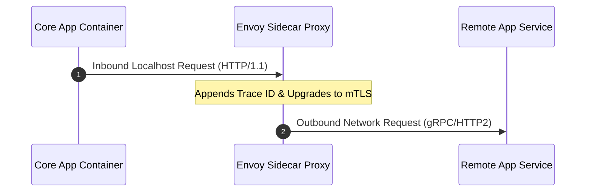

### Core Microservices Pattern & Architectural Intent

The Sidecar Pattern deploys a peripheral utility component alongside a core application container within the same atomic scheduling unit (e.g., a Kubernetes Pod), isolating operational concerns like mutual TLS (mTLS), distributed tracing, and log shipping from the primary business logic.

- **Video Reference:** [Sidecar Pattern Explained](https://www.youtube.com/watch?v=E7kXoO9Z0NA)

---

### Production-Grade Implementation & Data Mechanics



#### Runtime Execution Path & Networking

The sidecar container shares the same **network namespace**, storage volumes, and IP address as the application container.

Inbound and outbound application traffic is intercepted transparently via **Linux kernel iptables rules**, forcing all network I/O through the sidecar proxy (e.g., Envoy).

#### Coordination & Security Mechanics

**mTLS Interception:** The sidecar manages cryptographic keys and certificates, handling the heavy TLS handshake and encryption/decryption routines out-of-band.

**Trace Propagation:** The application container only needs to pass along incoming HTTP/gRPC tracing headers. The sidecar extracts these headers and pushes execution spans directly to the telemetry backend.

See also: [Service Mesh Architecture](/microservices/service-mesh-architecture/), [Distributed Tracing & Log Aggregation](/microservices/distributed-tracing-log-aggregation/), and [Externalized Configuration Management](/microservices/externalized-configuration-management/).

---

### Common Sidecar Use Cases

| Sidecar type | Examples | Concern offloaded |
| :--- | :--- | :--- |
| **Proxy** | Envoy, Linkerd-proxy | mTLS, retries, circuit breaking |
| **Log shipper** | Fluent Bit, Vector | stdout → OpenSearch/Loki |
| **Secret agent** | Vault Agent | Cert/secret rotation into tmpfs |
| **Config sync** | Consul Template | Dynamic config file rendering |

---

### Critical System Design Trade-offs & Operational Realities

#### Network & Latency Impact

Every request hits a minimum of two additional loopback hops (App → Local Sidecar → Wire → Remote Sidecar → Remote App). This introduces sub-millisecond p99 latency inflation and increases CPU consumption due to duplicate packet serialization and parsing within the same node.

#### Data Consistency & Isolation

High operational isolation. If the sidecar proxy panics or exhausts its memory, the application container loses external network access but its internal memory state remains intact.

#### Failure Modes & Cascading Risk

**Startup Race Conditions:** If the core application container initializes faster than the network-handling sidecar, early database connections or external API calls during startup will instantly fail, causing container crash loops.

| Failure Mode | Symptom | Mitigation |
| :--- | :--- | :--- |
| **Startup race** | App crash-loops before proxy ready | `initContainers` + K8s 1.28+ sidecar lifecycle |
| **Sidecar OOM** | App loses all egress connectivity | Separate cgroup limits; sidecar resource caps |
| **Loopback latency** | P99 inflation on hot paths | Accept trade-off or use eBPF/Cilium bypass for L7 |
| **Sidecar in app binary** | Language lock-in; no mesh upgrade | Keep sidecar as separate container only |
| **iptables misconfig** | Traffic bypasses proxy (no mTLS) | CNI validation; mesh conformance tests |

---

### Kubernetes Startup Sequencing

```yaml
# initContainer ensures Envoy config is loaded before app starts
initContainers:
  - name: istio-init
    image: istio/proxyv2
    # Programs iptables redirect rules

# K8s 1.28+: mark sidecar container with restartPolicy: Always
# and startupProbe so app waits for proxy readiness
containers:
  - name: istio-proxy
    startupProbe:
      httpGet:
        path: /healthz/ready
        port: 15021
  - name: order-service
    # Starts only after sidecar passes startupProbe (with native sidecar containers)
```

---

### Request Path Through Sidecars

```text
  Local Pod                          Remote Pod
  ┌─────────┐   localhost   ┌─────────┐         ┌─────────┐   localhost   ┌─────────┐
  │   App   │ ────────────► │  Envoy  │ ─mTLS─► │  Envoy  │ ────────────► │   App   │
  └─────────┘               └─────────┘         └─────────┘               └─────────┘
       │                          │                    │
       │  plain HTTP/gRPC         │  encrypted wire    │  plain HTTP/gRPC
       └──────────────────────────┴────────────────────┘
```

---

### Interview Failure Modes & Pro-Tips

#### The "Junior" Mistake

Believing that adding a sidecar reduces resource overhead, or embedding sidecar binaries inside the application code artifact, breaking language-agnostic modularity.

#### The "Senior" Counter-Measure

Call out **Container Startup Sequencing**. Explain how to leverage Kubernetes native `initContainers` with container lifecycle sidecar behavior (introduced in Kubernetes 1.28+) to ensure proxies are fully initialized, healthy, and routing traffic before the main application code execution begins.

```text
  Sidecar design principles:

    ✓ Separate container (not embedded in app JAR/binary)
    ✓ Shared network namespace (same Pod IP)
    ✓ iptables/eBPF transparent intercept
    ✓ initContainer + startupProbe ordering
    ✓ App code unaware of mTLS (proxy handles crypto)
```

---
