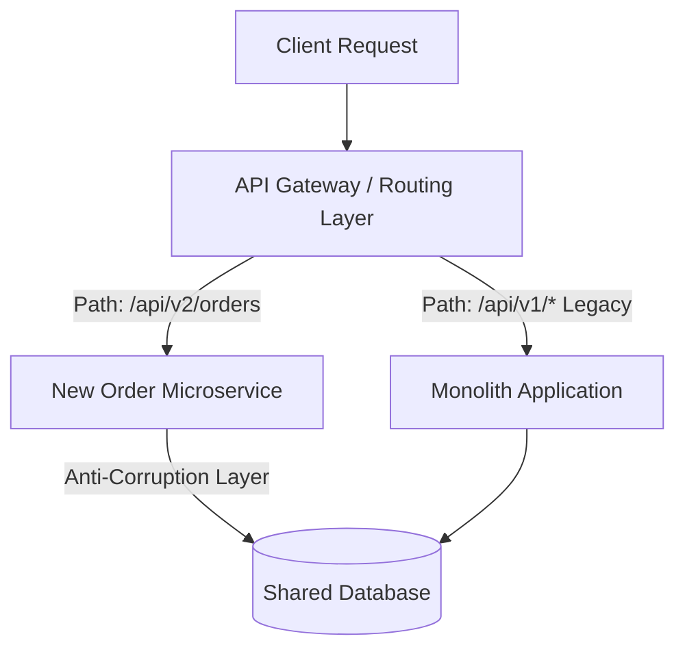

### Core Microservices Pattern & Architectural Intent

The Strangler Fig Application Pattern systematically deconstructs a monolithic codebase by migrating bounded contexts into independent microservices one piece at a time, routing traffic away from legacy systems at the network edge until the monolith is safely phased out.

- **Video Reference:** [Strangler Fig Pattern Explained](https://www.youtube.com/watch?v=xuOJF3w4vQQ)

---

### Production-Grade Implementation & Data Mechanics



#### Runtime Execution Path & Routing Mechanics

An API Gateway or reverse proxy (e.g., Envoy, Nginx) sits in front of both the legacy monolith and the new microservices. Traffic is migrated incrementally by updating **path-based routing rules** (e.g., redirecting `/api/v1/orders` to the new service).

When extracting data from a shared database, an **Anti-Corruption Layer (ACL)** is implemented in the new service to translate legacy data structures into clean domain models, protecting the new architecture from legacy tech debt.

#### State & Migration Synchronization

If a shared database cannot be split immediately, database-level triggers or **dual-writing** techniques are used to keep data mirrored between old and new tables until the migration is validated.

See also: [API Gateway & BFF Pattern](/microservices/api-gateway-bff-pattern/), [Database Per Microservice](/microservices/database-per-microservice/), and [Monolithic Database Decomposition](/microservices/monolithic-database-decomposition/).

---

### Strangler Migration Phases

| Phase | Routing | Data state | Risk profile |
| :--- | :--- | :--- | :--- |
| **1 — Facade only** | All traffic → monolith | Single shared DB | Low; gateway is pass-through |
| **2 — Read extraction** | New paths for read-heavy domains | Shared DB + ACL translation | Low–medium; no write split yet |
| **3 — Write extraction** | Writes routed to new service | Dual-write or trigger sync | High; race conditions possible |
| **4 — Data split** | Full domain on microservice | Dedicated per-service DB | Medium; cut over with validation |
| **5 — Decommission** | Monolith paths removed | Legacy DB archived | Low; monolith retired |

---

### Critical System Design Trade-offs & Operational Realities

#### Network & Latency Impact

During the migration phase, the system often experiences a **performance penalty**. The new service may need to call back into the monolith to fetch unmigrated data, adding network hops and serialization overhead to previously fast, in-memory function calls.

#### Data Consistency & Isolation

Running a split-state architecture where both the monolith and new services modify related data creates a high risk of **race conditions and data corruption**. This requires clear data ownership boundaries throughout the migration process.

#### Failure Modes & Cascading Risk

If the fallback connections between the new microservice and the monolith lack proper circuit breakers, performance degradations in the legacy monolith can easily cascade and bring down the newly migrated microservice.

| Failure Mode | Symptom | Mitigation |
| :--- | :--- | :--- |
| **Monolith callback cascade** | New service 503s when legacy slows | Circuit breakers on ACL/monolith calls |
| **Dual-write divergence** | Old and new tables disagree | Reconciliation job; idempotent sync |
| **Premature path cutover** | Missing data on new service | Feature flags; canary traffic percentage |
| **ACL leakage** | Legacy models pollute new domain | Strict translation boundary; no passthrough |
| **Big-bang rewrite** | Full outage on deploy | Incremental strangler phases only |

---

### Traffic Migration & Rollback Flow

```text
  Feature flag: orders_v2_enabled = 5% canary
        │
        ▼
  API Gateway ──5%──► Order Microservice (v2)
        │
        └──95%──► Monolith (v1 legacy)
        │
  Anomaly detected (error rate / latency)
        │
        ▼
  Flip flag → 0% ── instant rollback, no redeploy
```

---

### Interview Failure Modes & Pro-Tips

#### The "Junior" Mistake

Suggesting a **"big bang" migration** where the entire monolith is rewritten from scratch and deployed all at once, which carries an incredibly high risk of project failure in production environments.

#### The "Senior" Counter-Measure

Advocate for a disciplined, domain-driven approach using the Strangler Fig Pattern. Start by extracting **simple, read-heavy, or non-critical domains** (such as a notification service) to validate the new infrastructure and CI/CD pipelines before tackling core transaction engines. Use **feature flags** to quickly roll back traffic if any performance anomalies appear.

```text
  Recommended extraction order:
    1. Notifications / email / audit logs     (read-heavy, low risk)
    2. User preferences / static config       (bounded, few dependencies)
    3. Catalog / search                       (read-heavy, cacheable)
    4. Core transactions (orders, payments) (last — highest blast radius)
```

---
