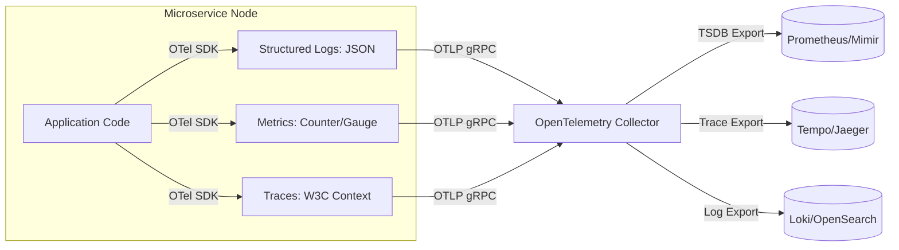

### Core Microservices Pattern & Architectural Intent

The Three Pillars of Observability (Metrics, Logs, and Distributed Tracing) provides an integrated monitoring framework that translates disparate distributed data points into structured operational insights, allowing engineers to quickly pinpoint root causes across network and infrastructure layers.

- **Video Reference:** [Three Pillars of Observability Explained](https://www.youtube.com/watch?v=pq9WUeKSjTM)

---

### Production-Grade Implementation & Data Mechanics



#### The Three Pillars Mechanics

**Metrics (Numeric Summaries):** Aggregated counters, gauges, and histograms (e.g., request count, error rates, CPU usage) shipped via pull or push protocols (OTLP/gRPC) to Time Series Databases (TSDBs).

**Logs (Contextual Events):** Structured JSON strings detailing specific localized execution details, tagged with context attributes.

**Traces (End-to-End Pathways):** A collection of structured Spans linked together by a parent `trace_id` that tracks a transaction's journey across service boundaries.

#### Coordination & Exporters

The **OpenTelemetry (OTel) SDK** handles memory buffers for telemetry data out-of-band, batching and exporting it to an OpenTelemetry Collector daemon over low-overhead gRPC connections to avoid blocking application threads.

See also: [Distributed Tracing & Log Aggregation](/microservices/distributed-tracing-log-aggregation/) and [Service Mesh Architecture](/microservices/service-mesh-architecture/).

---

### Pillar Comparison & Primary Use Cases

| Pillar | Data shape | Best for | Typical backend |
| :--- | :--- | :--- | :--- |
| **Metrics** | Time-series numeric aggregates | Alerting, SLO dashboards, capacity planning | Prometheus, Mimir, Datadog |
| **Logs** | Discrete structured events | Error messages, audit trails, debug context | Loki, OpenSearch, Splunk |
| **Traces** | Span trees with parent links | Latency breakdown, dependency mapping | Tempo, Jaeger, Zipkin |

---

### RED & USE Monitoring Methods

| Method | Applies to | Key signals |
| :--- | :--- | :--- |
| **RED** (services) | Request-driven microservices | **R**ate, **E**rrors, **D**uration |
| **USE** (resources) | Nodes, disks, CPUs | **U**tilization, **S**aturation, **E**rrors |

---

### Critical System Design Trade-offs & Operational Realities

#### Network & Latency Impact

Metrics have a negligible impact on latency since they are simple counters updated in memory. Traces and logs, however, require string allocation and structural serialization, which can consume significant network bandwidth and storage IOPS if not carefully managed.

#### Data Consistency & Isolation

Telemetry pipelines must run **completely separate** from the application hot path. If a metric system drops packets or goes offline, application processing must continue unaffected.

#### Failure Modes & Cascading Risk

**Telemetry Buffer Overflows:** Under high traffic spikes, if the local OTel memory buffer fills up and is configured to block on new data rather than drop packets, it will degrade application thread pools and trigger severe cascading slowdowns.

| Failure Mode | Symptom | Mitigation |
| :--- | :--- | :--- |
| **Blocking OTel export** | App threads stall on full buffer | Drop-on-pressure; async batch export |
| **100% trace/log capture** | Storage cost exceeds app cost | Head/tail sampling policies |
| **Uncorrelated signals** | Cannot pivot metric → trace → log | Unified `trace_id`, `service.name` tags |
| **Alert on infra noise** | Pager fatigue; missed real incidents | SLO-based alerts on user-impacting symptoms |
| **Collector single point** | Telemetry loss on collector outage | Collector HA; agent local retry queue |

---

### Correlated Telemetry Architecture

```text
  Prometheus alert: error_rate > 1% on order-service
        │
        ▼ (click trace_id from exemplar)
  Jaeger/Tempo: slow span on payment-service call
        │
        ▼ (click trace_id)
  Loki: "Payment service timeout after 2000ms" log line

  Shared metadata on every signal:
    service.name, deployment.environment, trace_id, span_id
```

---

### Head vs. Tail Sampling

| Strategy | When decision is made | Trade-off |
| :--- | :--- | :--- |
| **Head sampling** | At trace start (e.g., 1% random) | Cheap; may drop rare failures |
| **Tail sampling** | After trace completes | Retains all errors/high-latency; needs collector buffer |

Production systems combine both: low head-sample rate for volume control + tail sampling to retain 100% of anomalous traces.

---

### Interview Failure Modes & Pro-Tips

#### The "Junior" Mistake

Assuming that adding comprehensive observability means collecting 100% of logs and traces at all times, without considering the massive infrastructure costs and network overhead that can easily dwarf the cost of running the actual application.

#### The "Senior" Counter-Measure

Design a unified **Correlated Telemetry Architecture**. Detail how to embed identical metadata tags (`service.name`, `environment`, `trace_id`) across all three pillars. This allows an engineer to click an anomaly on a Prometheus metric dashboard, instantly drill down to the exact failed Jaeger trace span, and immediately view the correlated Loki application logs for that specific network call. Combine this with strict **Head/Tail Sampling** policies to optimize storage costs.

```text
  Observability stack checklist:

    ✓ OTel SDK in every service (single instrumentation layer)
    ✓ Collector HA with tail sampling processor
    ✓ Exemplars on histograms (link metrics → traces)
    ✓ trace_id in every structured log line
    ✓ SLO alerts (not CPU threshold alerts)
    ✓ Drop-on-pressure export (never block app threads)
```

---
