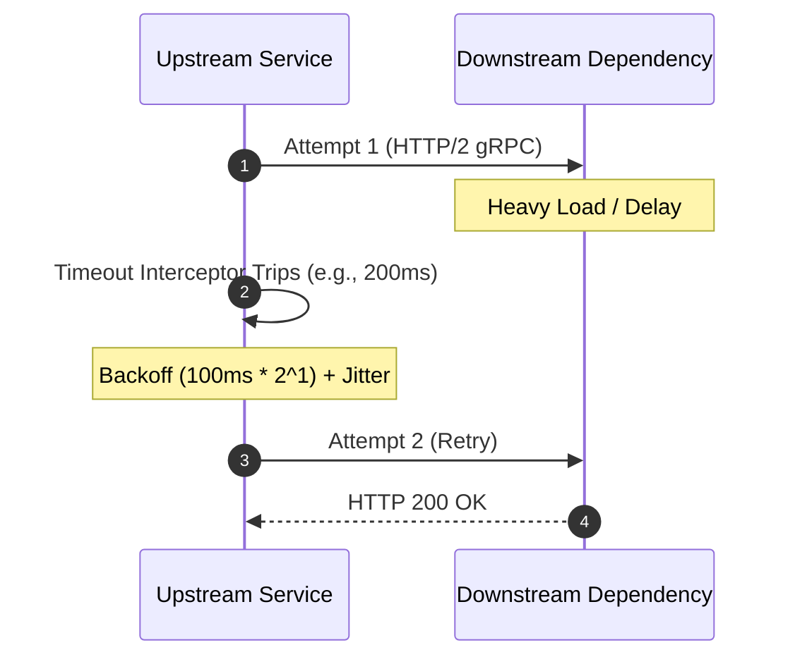

### Core Microservices Pattern & Architectural Intent

Transient Fault Handling via Timeouts, Retries, and Exponential Backoff injects defensive policies into network call clients, preventing minor network drops or temporary downstream slowdowns from turning into permanent application errors.

- **Video Reference:** [Transient Fault Handling Explained](https://www.youtube.com/watch?v=RfPNuaj5Ax0)

---

### Production-Grade Implementation & Data Mechanics



#### Runtime Execution Path & Client Interceptors

Outbound HTTP/gRPC client wrappers inject an **execution deadline (Timeout)**. If the downstream service fails to reply within that window, an interceptor cancels the connection.

If a transient error code is returned (e.g., HTTP 429 Too Many Requests, HTTP 503, or gRPC `UNAVAILABLE`), the retry engine calculates the next wait time using an **Exponential Backoff** formula:

$$\text{Wait Time} = \text{Base Delay} \times 2^{\text{attempt}}$$

#### Coordination & Randomization Mechanics

**Full Jitter:** To prevent all failing clients from retrying at the exact same millisecond and overwhelming the downstream service again, a random jitter factor is added to the backoff equation:

$$\text{Sleep} = \text{Random}(0, \text{Wait Time})$$

See also: [Circuit Breaker Pattern](/microservices/circuit-breaker-pattern/), [Bulkhead Isolation Pattern](/microservices/bulkhead-isolation-pattern/), and [Microservices Communication Topologies](/microservices/microservices-communication-topologies/).

---

### Retry-Eligible vs Non-Retryable Operations

| Operation type | Retry safe? | Requirement |
| :--- | :--- | :--- |
| **Idempotent GET** | Yes | Bounded retries + backoff |
| **Idempotent PUT with key** | Yes | Same resource key on retry |
| **POST charge/payment** | Only with idempotency key | `Idempotency-Key` header + server dedup |
| **Non-idempotent POST** | No | Fail fast; surface error to caller |
| **gRPC streaming** | Context-dependent | Cancel via deadline propagation |

---

### Critical System Design Trade-offs & Operational Realities

#### Network & Latency Impact

Improper retry configurations can cause severe **traffic amplification**. If an upstream service retries every failed call 3 times under heavy load, it effectively quadruples the total traffic hitting an already struggling downstream service.

#### Data Consistency & Isolation

Retrying a non-idempotent write operation (like a POST request to charge a credit card) can easily lead to duplicate records or double charges if the first request actually succeeded but its response was lost due to a network timeout.

#### Failure Modes & Cascading Risk

**Retry Storms:** When a core service slows down, hundreds of upstream instances retrying simultaneously can create a retry storm that locks up the database and prevents the system from recovering.

| Failure Mode | Symptom | Mitigation |
| :--- | :--- | :--- |
| **Retry storm** | Downstream never recovers | Exponential backoff + full jitter |
| **Infinite retry loop** | Thread pool exhaustion | Max attempt cap + circuit breaker |
| **Long client timeout** | Upstream threads blocked | Short per-hop timeout < parent deadline |
| **Double charge on retry** | Duplicate side effects | Idempotency keys on writes |
| **No retry budget** | Retries dominate traffic mix | Token-bucket retry budget (e.g., ≤10%) |

---

### Timeout Budget Propagation

```text
  Edge gateway deadline: 3000ms total
        │
        ├── Order service call:     800ms budget
        ├── Inventory service call: 600ms budget
        └── Payment service call:   1200ms budget
              (remaining = parent deadline - elapsed)

  gRPC: context.withDeadline() passed on every outbound stub call
  HTTP: shorter child timeout always < parent timeout
```

When the edge deadline expires, all in-flight downstream calls cancel immediately — freeing threads and connection slots.

---

### Retry Budget (Token Bucket)

```text
  Total outbound calls last 60s: 10,000
  Retry budget cap: 10% → max 1,000 retries allowed

  Retry attempt arrives:
    ├── budget remaining > 0  → allow retry with backoff
    └── budget exhausted      → fail fast (no retry)
```

Retry budgets prevent retries from becoming the dominant traffic type during an outage.

---

### Interview Failure Modes & Pro-Tips

#### The "Junior" Mistake

Adding infinite or static retry loops without backoff or jitter, or placing long timeout windows on client calls that risk exhausting upstream worker threads under load.

#### The "Senior" Counter-Measure

Implement **Token-Bucket Retry Budgets**. Propose a design where a service tracking client calls only allows retries if they make up less than 10% of total system traffic. If this budget is exhausted, the client fails fast immediately. Combine this with passing explicit **gRPC Request Deadlines** down the entire call chain, ensuring that if an edge gateway timeout is reached, all downstream sub-requests instantly cancel to save cluster compute resources.

```text
  Resilience client stack:

    1. Deadline propagation (gRPC context / HTTP timeout chain)
    2. Per-hop timeout < parent remaining budget
    3. Retry only on transient codes (429, 503, UNAVAILABLE)
    4. Exponential backoff + full jitter
    5. Max attempts cap (e.g., 3)
    6. Retry budget token bucket
    7. Circuit breaker when failure rate sustained
```

---
