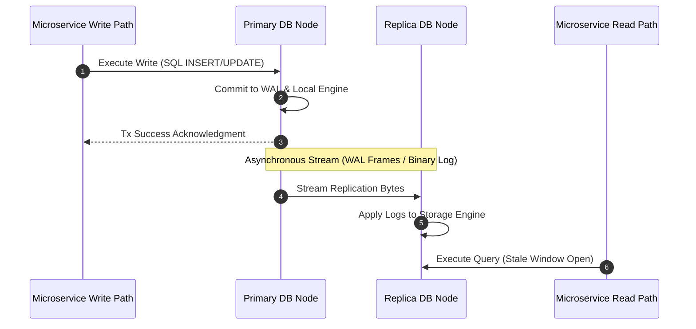

### Core Microservices Pattern & Architectural Intent

Database Replication Topologies (Primary-Replica Asynchronous Replication vs. Multi-Leader/Peer-to-Peer Replication) scales read-heavy or globally distributed microservice storage layers by distributing data across multiple hardware nodes, decoupling horizontal read capacity from write capacity.

- **Video Reference:** [Database Replication Explained](https://www.youtube.com/watch?v=2I3-lbnMXec)

---

### Production-Grade Implementation & Data Mechanics



#### Runtime Execution Path & Wire Protocols

**Log-Structured Transport:** The primary node serializes data modifications into an append-only Write-Ahead Log (WAL) or binary log. These log frames are streamed asynchronously over persistent TCP sockets to replica nodes using native database wire protocols.

**Replica Processing:** Replica nodes read the incoming stream, parse the sequential log entries, and re-apply the changes to their local storage engines to match the primary node's state.

#### Coordination & Routing Mechanics

Microservice connection pools use separate drivers or routing keys to divide traffic: **write operations** route to the primary node pool, while **read operations** are distributed across a pool of replicas using round-robin or least-connections load balancing.

See also: [Replication Lag & Read-Replica Topology](/system-fundamentals/replication-lag-read-replica-topology/) and [Database Per Microservice](/microservices/database-per-microservice/).

---

### Replication Topology Comparison

| Topology | Write scaling | Read scaling | Consistency | Complexity |
| :--- | :--- | :--- | :--- | :--- |
| **Primary-replica (async)** | Single primary | Horizontal replicas | Eventual on reads | Low |
| **Primary-replica (sync)** | Single primary | Horizontal replicas | Strong on committed writes | Medium (write latency) |
| **Multi-leader / peer-to-peer** | Multi-node writes | Multi-node reads | Conflict resolution required | High |

---

### Critical System Design Trade-offs & Operational Realities

#### Network & Latency Impact

Write path latencies remain low because they don't wait for replica confirmations. The trade-off is shifted to the read path, which must tolerate **replication lag**—the time window between a write on the primary and its appearance on a replica.

#### Data Consistency & Isolation

The system is **eventually consistent**. This creates a risk of violating **read-your-writes** consistency. If a user mutates state via the primary and immediately refreshes their view, a subsequent read hitting a lagging replica will show stale data, leading to a confusing user experience.

#### Failure Modes & Cascading Risk

**Split-Brain Scenarios:** During a network partition, if a health-check system mistakenly assumes the primary node is dead and promotes a replica while the old primary is still accepting writes, the database enters a split-brain state. Reconciling these divergent, conflicting log histories requires manual intervention or complex data loss reconciliation algorithms.

| Failure Mode | Symptom | Mitigation |
| :--- | :--- | :--- |
| **Replication lag** | Stale reads after user write | Sticky routing to primary post-write |
| **Split-brain promotion** | Divergent primaries accepting writes | Quorum failover (etcd/Patroni); fencing old primary |
| **Replica scales writes myth** | Write bottleneck unchanged | Replicas offload reads only |
| **Multi-leader conflicts** | Last-writer-wins data loss | CRDTs, vector clocks, or single-leader per shard |
| **Cascading replica overload** | Failover redistributes read storm | Per-replica capacity headroom; autoscale replicas |

---

### Sticky Routing / Read-Your-Writes Strategy

```text
  User executes WRITE → primary
        │
        ▼
  Set session flag: pin_reads_to_primary_until = now + 5s
        │
        ▼
  Subsequent READs from same session:
    ├── within 5s window  → route to PRIMARY
    └── after window      → route to replica pool (round-robin)

  All other users' reads → replica pool (preserves read capacity)
```

This guarantees the author sees their own mutation without forcing all global reads onto the primary.

---

### Interview Failure Modes & Pro-Tips

#### The "Junior" Mistake

Claiming that adding read replicas scales both read and write operations infinitely, or assuming that multi-leader write setups handle concurrent record modifications automatically without data overwrites.

#### The "Senior" Counter-Measure

Propose a **Sticky Routing / Contextual Consistency** strategy. To guarantee a user can read their own writes, route read requests to the primary database node for a brief window (e.g., 5 seconds) immediately after that user performs a write command. For all other standard, non-authoritative operations, fall back to load-balanced replicas to preserve system capacity.

```text
  Replication scaling truths:

    ✓ Replicas scale READ throughput (not writes)
    ✓ Async replication = replication lag is guaranteed
    ✓ Multi-leader needs explicit conflict resolution
    ✓ Failover requires quorum + fencing to prevent split-brain
    ✓ Session pinning solves read-your-writes without killing replica utility
```

---
