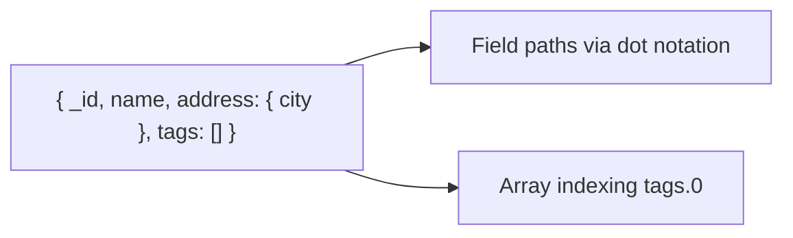

## Executive Summary

MongoDB stores **BSON** documents (binary JSON). Every document requires an **`_id`** field (auto-generated `ObjectId` if omitted). Documents support nested objects, arrays, and rich types beyond JSON.

---

## Core Concepts

| BSON Type | Notes |
| :--- | :--- |
| `ObjectId` | 12-byte ID — 4-byte timestamp + machine + pid + counter |
| `String` | UTF-8 |
| `Int32` / `Int64` / `Double` / `Decimal128` | Use `Decimal128` for money |
| `Date` | UTC milliseconds since epoch |
| `BinData` | Binary blobs |
| `Array` | Ordered; multikey indexes apply |
| `Document` | Nested sub-documents |
| `Null` / `Undefined` | `Undefined` deprecated — avoid |
| `Regex` | Pattern matching in queries |



---

## Quick Reference

| Operation | Syntax |
| :--- | :--- |
| Field access | `doc.address.city` or `"address.city"` in queries |
| Array element | `"tags.0"`, `"tags.-1"` (positional update) |
| Array match any | `"tags": "mongodb"` |
| Array match all | `{ tags: { $all: ["a", "b"] } }` |
| Exists check | `{ field: { $exists: true } }` |
| Type check | `{ field: { $type: "string" } }` |

| Limit | Value |
| :--- | :--- |
| Max document size | 16 MB |
| Max nesting depth | 100 levels |
| Field name | Cannot start with `$` (reserved) |

---

## Snippets

```javascript
// ObjectId inspection
ObjectId("507f1f77bcf86cd799439011").getTimestamp()

// Insert with explicit _id
db.users.insertOne({
  _id: "user-42",
  email: "a@example.com",
  profile: { name: "Ada", roles: ["admin"] },
  createdAt: new Date()
})

// Update nested field
db.users.updateOne(
  { _id: "user-42" },
  { $set: { "profile.name": "Ada Lovelace" } }
)

// Array operators
db.users.updateOne(
  { _id: "user-42" },
  { $push: { "profile.roles": "editor" } }
)
```

---

## Common Gotchas

- `_id` is immutable — delete and re-insert to change it.
- Duplicate keys in a single document are invalid BSON (last wins in some parsers — don't rely on it).
- `ObjectId` is not guaranteed globally unique under extreme clock skew — use UUID if required.
- 16 MB limit includes field names and BSON overhead — large blobs belong in GridFS or object storage.

---

<!-- interview-answers:start -->

# Interview Answers (Top 150)

## When is GridFS still justified versus object storage for large blobs?

### Short Answer
For this question, the architecturally correct answer is treating WiredTiger as a cache-and-checkpoint system where working-set fit decides tail latency for: When is GridFS still justified versus object storage for large blobs.

### Detailed Explanation
When effective cache fit degrades, read latency and I/O waits climb sharply, and checkpoint cadence becomes visible in p99 for: When is GridFS still justified versus object storage for large blobs.

### Internal Working
MVCC history, eviction pressure, and journal/checkpoint interplay explain most storage-engine performance cliffs for: When is GridFS still justified versus object storage for large blobs.

### Production Notes
You justify it by proving p95/p99 behavior under realistic cardinality using cache dirty/used ratios, eviction throughput, and checkpoint duration trendlines for: When is GridFS still justified versus object storage for large blobs.

### Common Mistakes
Teams often tune one knob without accounting for index write amplification or long readers pinning history for: When is GridFS still justified versus object storage for large blobs.

### Follow-up Questions
Which metric proves the bottleneck in: When is GridFS still justified versus object storage for large blobs is cache pressure versus checkpoint writeback?

---
<!-- interview-answers:end -->

---

## See Also

- [Next: Collections](/mongodb-cheatsheet/01-fundamentals/collections/)
- [MongoDB Handbook Index](/mongodb-cheatsheet/)
- [Top 150 Interview Questions](/mongodb-cheatsheet/06-interview-guide/top-150-interview-questions/)
