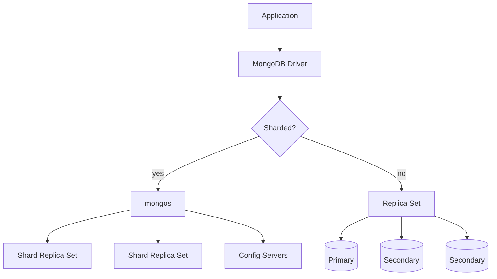

## Quick Revision

- **mongod** stores data; **mongos** routes in sharded clusters; **config servers** hold chunk metadata.
- Production = replica set minimum; sharding when single replica set saturates.

## Executive Summary

**MongoDB** is a document database built around **mongod** (data node), **mongos** (query router for sharded clusters), and optional **config servers**. Storage defaults to **WiredTiger** with document-level locking, compression, and checkpoint-based durability.

---

## Core Concepts



| Component | Role |
| :--- | :--- |
| **mongod** | Stores data; primary or secondary in a replica set |
| **mongos** | Routes queries to correct shard(s); no data storage |
| **Config servers** | Metadata for sharded cluster (chunk ranges, balancer state) |
| **WiredTiger** | Default storage engine — B-tree indexes, document-level locks |
| **oplog** | Capped collection on primary; replication + change streams source |
| **Journal** | Write-ahead log for crash recovery (checkpoints every ~60s) |

---

## Quick Reference

| Deployment | Use when |
| :--- | :--- |
| **Standalone** | Dev only — no HA |
| **Replica set** | Production HA, read scaling, automatic failover |
| **Sharded cluster** | Dataset or write throughput exceeds single node |

For **read concern**, **write concern**, and **read preference**, see [Replication](/mongodb-cheatsheet/02-core-mongodb/replication/).

---

## Snippets

```javascript
// Connection strings
mongodb://host1:27017,host2:27017,host3:27017/mydb?replicaSet=rs0
mongodb+srv://cluster.mongodb.net/mydb   // Atlas SRV

// Read preference (driver)
MongoClientSettings.builder()
  .readPreference(ReadPreference.secondaryPreferred())
  .build();
```

```yaml
# replica set member roles (rs.conf())
members:
  - { _id: 0, host: "host1:27017", priority: 2 }   # primary candidate
  - { _id: 1, host: "host2:27017", priority: 1 }
  - { _id: 2, host: "host3:27017", arbiterOnly: true }  # voting only
```

---

## Common Gotchas

- Standalone `mongod` cannot become a replica set member without `rs.initiate()`.
- Arbiters do not hold data — never use them as the only secondary for reads.
- Sharding requires a **shard key** chosen up front; changing it is a major migration.
- `local` read concern on secondaries can return rolled-back writes after failover.

---

<!-- interview-answers:start -->

# Interview Answers (Top 150)

## How do mongod, mongos, and config servers divide responsibility in a sharded deployment?

### Short Answer
For this question, the architecturally correct answer is choosing a shard key that preserves query targeting and distributes writes, not just one that looks high-cardinality, for: How do mongod, mongos, and config servers divide responsibility in a sharded deployment.

### Detailed Explanation
In MongoDB sharding, the wrong leading key creates hot chunks, scatter-gather queries, or jumbo chunks, so key choice must follow real filters and time-skew behavior for: How do mongod, mongos, and config servers divide responsibility in a sharded deployment.

### Internal Working
`mongos` routes via config metadata and chunk ranges, so shard-key entropy and monotonicity directly control migration pressure and balancer load for: How do mongod, mongos, and config servers divide responsibility in a sharded deployment.

### Production Notes
You justify it by proving p95/p99 behavior under realistic cardinality by load-testing chunk distribution, migration rate, and per-shard opcounters before production for: How do mongod, mongos, and config servers divide responsibility in a sharded deployment.

### Common Mistakes
Teams often choose hashed keys that break range locality or ranged keys that hotspot writes because they skipped workload replay for: How do mongod, mongos, and config servers divide responsibility in a sharded deployment.

### Follow-up Questions
How would you prove shard targeting percentage, not just throughput, for: How do mongod, mongos, and config servers divide responsibility in a sharded deployment before launch?

---
## Why is a standalone mongod unsuitable for production high availability?

### Short Answer
The production-grade answer is modeling to dominant read/write paths, then embedding only where growth is bounded for: Why is a standalone mongod unsuitable for production high availability.

### Detailed Explanation
Schema-first decisions in MongoDB should be query-first in practice, so colocate fields that are read together and externalize unbounded fan-out to references or buckets for: Why is a standalone mongod unsuitable for production high availability.

### Internal Working
Document growth, index fan-out, and update locality decide the true cost profile internally, which is why embedding works best when mutation scope stays narrow for: Why is a standalone mongod unsuitable for production high availability.

### Production Notes
You justify it by minimizing cross-shard work and rollback risk by replaying realistic tenant skew, cardinality growth, and migration paths before freezing the model for: Why is a standalone mongod unsuitable for production high availability.

### Common Mistakes
A common mistake is copying relational normalization or, conversely, embedding unbounded arrays until 16 MB limits and write amplification appear for: Why is a standalone mongod unsuitable for production high availability.

### Follow-up Questions
What cardinality limit, migration trigger, and fallback model would you define up front to keep: Why is a standalone mongod unsuitable for production high availability safe over 3 years?

---
## When would you split one logical domain across multiple MongoDB databases?

### Short Answer
For this question, the architecturally correct answer is modeling to dominant read/write paths, then embedding only where growth is bounded for: When would you split one logical domain across multiple MongoDB databases.

### Detailed Explanation
Schema-first decisions in MongoDB should be query-first in practice, so colocate fields that are read together and externalize unbounded fan-out to references or buckets for: When would you split one logical domain across multiple MongoDB databases.

### Internal Working
Document growth, index fan-out, and update locality decide the true cost profile internally, which is why embedding works best when mutation scope stays narrow for: When would you split one logical domain across multiple MongoDB databases.

### Production Notes
You justify it by proving p95/p99 behavior under realistic cardinality by replaying realistic tenant skew, cardinality growth, and migration paths before freezing the model for: When would you split one logical domain across multiple MongoDB databases.

### Common Mistakes
A common mistake is copying relational normalization or, conversely, embedding unbounded arrays until 16 MB limits and write amplification appear for: When would you split one logical domain across multiple MongoDB databases.

### Follow-up Questions
What cardinality limit, migration trigger, and fallback model would you define up front to keep: When would you split one logical domain across multiple MongoDB databases safe over 3 years?

---
## What coupling appears when microservices share one MongoDB database versus database-per-service?

### Short Answer
The senior-level decision is modeling to dominant read/write paths, then embedding only where growth is bounded for: What coupling appears when microservices share one MongoDB database versus database-per-service.

### Detailed Explanation
Schema-first decisions in MongoDB should be query-first in practice, so colocate fields that are read together and externalize unbounded fan-out to references or buckets for: What coupling appears when microservices share one MongoDB database versus database-per-service.

### Internal Working
Document growth, index fan-out, and update locality decide the true cost profile internally, which is why embedding works best when mutation scope stays narrow for: What coupling appears when microservices share one MongoDB database versus database-per-service.

### Production Notes
You justify it by balancing latency, durability, and operational toil by replaying realistic tenant skew, cardinality growth, and migration paths before freezing the model for: What coupling appears when microservices share one MongoDB database versus database-per-service.

### Common Mistakes
A common mistake is copying relational normalization or, conversely, embedding unbounded arrays until 16 MB limits and write amplification appear for: What coupling appears when microservices share one MongoDB database versus database-per-service.

### Follow-up Questions
What cardinality limit, migration trigger, and fallback model would you define up front to keep: What coupling appears when microservices share one MongoDB database versus database-per-service safe over 3 years?

---
## What risks does exposing mongod directly to the internet create?

### Short Answer
For this question, the architecturally correct answer is implementing layered controls: private connectivity, least-privilege roles, TLS, and managed secrets for: What risks does exposing mongod directly to the internet create.

### Detailed Explanation
MongoDB security is defense-in-depth; network isolation and RBAC boundaries limit blast radius, while encryption and audit trails satisfy compliance for: What risks does exposing mongod directly to the internet create.

### Internal Working
Authn/authz, transport encryption, and optional client-side field encryption each protect different threat surfaces for: What risks does exposing mongod directly to the internet create.

### Production Notes
You justify it by proving p95/p99 behavior under realistic cardinality with role reviews, credential rotation drills, network path validation, and audit evidence retention for: What risks does exposing mongod directly to the internet create.

### Common Mistakes
Common failures include internet-exposed endpoints, static credentials in config files, and broad admin roles for applications in: What risks does exposing mongod directly to the internet create.

### Follow-up Questions
Which control in: What risks does exposing mongod directly to the internet create gives the largest blast-radius reduction right now: network, RBAC, or key management?

---
<!-- interview-answers:end -->

---

## See Also

- [Previous: Atlas Basics](/mongodb-cheatsheet/01-fundamentals/atlas-basics/)
- [Next: Storage Engine](/mongodb-cheatsheet/02-core-mongodb/storage-engine/)
- [MongoDB Handbook Index](/mongodb-cheatsheet/)
- [Top 150 Interview Questions](/mongodb-cheatsheet/06-interview-guide/top-150-interview-questions/)
