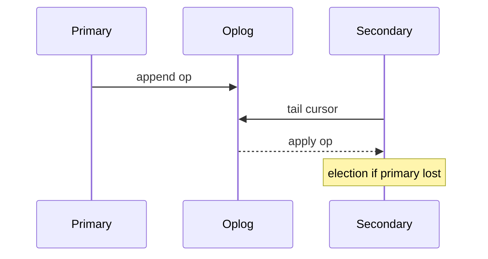
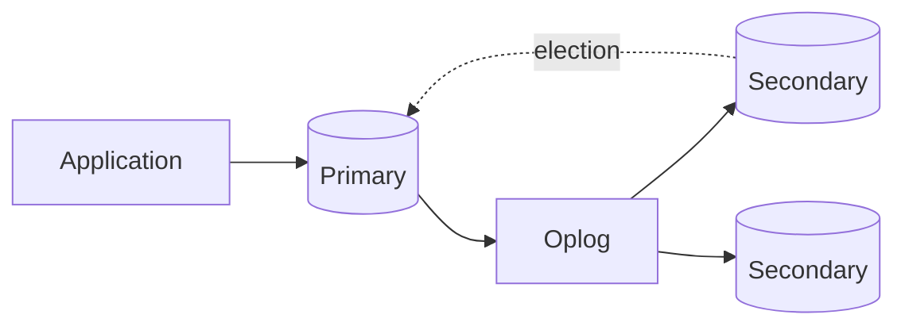

## Quick Revision

- One **primary** accepts writes; **secondaries** tail the **oplog**.
- Use `w: "majority"` for durability; understand rollback after failover.
- **Read concern** and **read preference** control staleness vs latency.

## Executive Summary

A **replica set** is 3+ `mongod` nodes (or 2 data nodes + arbiter — discouraged for prod). One **primary** accepts writes; **secondaries** replicate via the **oplog**. Automatic failover elects a new primary on failure.

---

## Core Concepts





| Term | Meaning |
| :--- | :--- |
| **Primary** | All writes; builds oplog entries |
| **Secondary** | Applies oplog — can serve reads |
| **Arbiter** | Votes only — no data |
| **Priority** | Influences election winner |
| **Hidden** | Replicates but not visible to clients |
| **Delayed** | Lagging secondary for point-in-time recovery |
| **Rollback** | Primary steps down with un-replicated writes |

---

## Quick Reference

```javascript
// Initiate replica set
rs.initiate({
  _id: "rs0",
  members: [
    { _id: 0, host: "mongo1:27017", priority: 2 },
    { _id: 1, host: "mongo2:27017", priority: 1 },
    { _id: 2, host: "mongo3:27017", priority: 1 }
  ]
})

rs.status()
rs.conf()
rs.stepDown(60)           // primary yields for maintenance
rs.add("mongo4:27017")
rs.remove("mongo4:27017")

// Oplog sizing
use local
db.oplog.rs.stats()
```

| Read preference | Behavior |
| :--- | :--- |
| `primary` | Default — always primary |
| `primaryPreferred` | Primary, else secondary |
| `secondary` | Secondaries only — may be stale |
| `secondaryPreferred` | Secondary, else primary |
| `nearest` | Lowest latency member |


| Read concern | Behavior |
| :--- | :--- |
| `local` | Return latest local data (may be rolled back) |
| `majority` | Data acknowledged by majority of nodes |
| `linearizable` | Strongest — single-document linearizability |

| Write concern | Behavior |
| :--- | :--- |
| `{ w: 1 }` | Primary ack only |
| `{ w: "majority" }` | Majority replica ack — durable default for prod |
| `{ j: true }` | Journal flush before ack (see [Storage Engine](/mongodb-cheatsheet/02-core-mongodb/storage-engine/)) |

---

## Snippets

```javascript
// Driver connection with read preference
// mongodb://mongo1,mongo2,mongo3/mydb?replicaSet=rs0&readPreference=secondaryPreferred

// Change streams (require replica set)
const cs = db.orders.watch([{ $match: { operationType: "insert" } }])

// Write concern for durability
db.orders.insertOne(
  { orderId: "O1" },
  { writeConcern: { w: "majority", j: true } }
)
```

---

## Common Gotchas

- Writes not replicated to majority can be **rolled back** after failover — use `w: "majority"`.
- Read from secondaries without `readConcern: "majority"` may return stale data.
- Arbiters break tie votes but provide no data redundancy — prefer 3 full data nodes.
- Oplog too small — secondaries fall off and need full resync.

---

<!-- interview-answers:start -->

# Interview Answers (Top 150)

## What deployment topology would you propose for read-heavy analytics alongside write-heavy OLTP?

### Short Answer
The production-grade answer is modeling to dominant read/write paths, then embedding only where growth is bounded for: What deployment topology would you propose for read-heavy analytics alongside write-heavy OLTP.

### Detailed Explanation
Schema-first decisions in MongoDB should be query-first in practice, so colocate fields that are read together and externalize unbounded fan-out to references or buckets for: What deployment topology would you propose for read-heavy analytics alongside write-heavy OLTP.

### Internal Working
Document growth, index fan-out, and update locality decide the true cost profile internally, which is why embedding works best when mutation scope stays narrow for: What deployment topology would you propose for read-heavy analytics alongside write-heavy OLTP.

### Production Notes
You justify it by minimizing cross-shard work and rollback risk by replaying realistic tenant skew, cardinality growth, and migration paths before freezing the model for: What deployment topology would you propose for read-heavy analytics alongside write-heavy OLTP.

### Common Mistakes
A common mistake is copying relational normalization or, conversely, embedding unbounded arrays until 16 MB limits and write amplification appear for: What deployment topology would you propose for read-heavy analytics alongside write-heavy OLTP.

### Follow-up Questions
What cardinality limit, migration trigger, and fallback model would you define up front to keep: What deployment topology would you propose for read-heavy analytics alongside write-heavy OLTP safe over 3 years?

---
## How do change streams fit into event-driven architectures compared to polling?

### Short Answer
The senior-level decision is modeling to dominant read/write paths, then embedding only where growth is bounded for: How do change streams fit into event-driven architectures compared to polling.

### Detailed Explanation
Schema-first decisions in MongoDB should be query-first in practice, so colocate fields that are read together and externalize unbounded fan-out to references or buckets for: How do change streams fit into event-driven architectures compared to polling.

### Internal Working
Document growth, index fan-out, and update locality decide the true cost profile internally, which is why embedding works best when mutation scope stays narrow for: How do change streams fit into event-driven architectures compared to polling.

### Production Notes
You justify it by balancing latency, durability, and operational toil by replaying realistic tenant skew, cardinality growth, and migration paths before freezing the model for: How do change streams fit into event-driven architectures compared to polling.

### Common Mistakes
A common mistake is copying relational normalization or, conversely, embedding unbounded arrays until 16 MB limits and write amplification appear for: How do change streams fit into event-driven architectures compared to polling.

### Follow-up Questions
What cardinality limit, migration trigger, and fallback model would you define up front to keep: How do change streams fit into event-driven architectures compared to polling safe over 3 years?

---
## What read routing architecture uses secondaryPreferred without violating freshness SLAs?

### Short Answer
The senior-level decision is explicitly defining durability and freshness semantics with write concern, read concern, and read preference for: What read routing architecture uses secondaryPreferred without violating freshness SLAs.

### Detailed Explanation
Replica-set correctness is an SLA decision: critical writes need majority durability, while read routing must document tolerated staleness under elections for: What read routing architecture uses secondaryPreferred without violating freshness SLAs.

### Internal Working
Elections, oplog apply lag, and term changes can surface transient errors or rollbacks, so client retry behavior is part of database design for: What read routing architecture uses secondaryPreferred without violating freshness SLAs.

### Production Notes
You justify it by balancing latency, durability, and operational toil by validating failover drills, lag budgets, and rollback handling using production-like traffic for: What read routing architecture uses secondaryPreferred without violating freshness SLAs.

### Common Mistakes
A frequent failure mode is assuming defaults are safe for money or identity workflows without proving election-time behavior for: What read routing architecture uses secondaryPreferred without violating freshness SLAs.

### Follow-up Questions
Which operations in: What read routing architecture uses secondaryPreferred without violating freshness SLAs must be monotonic, and how does your client contract enforce that?

---
## What symptoms indicate the oplog is too small for maintenance catch-up?

### Short Answer
The senior-level decision is explicitly defining durability and freshness semantics with write concern, read concern, and read preference for: What symptoms indicate the oplog is too small for maintenance catch-up.

### Detailed Explanation
Replica-set correctness is an SLA decision: critical writes need majority durability, while read routing must document tolerated staleness under elections for: What symptoms indicate the oplog is too small for maintenance catch-up.

### Internal Working
Elections, oplog apply lag, and term changes can surface transient errors or rollbacks, so client retry behavior is part of database design for: What symptoms indicate the oplog is too small for maintenance catch-up.

### Production Notes
You justify it by balancing latency, durability, and operational toil by validating failover drills, lag budgets, and rollback handling using production-like traffic for: What symptoms indicate the oplog is too small for maintenance catch-up.

### Common Mistakes
A frequent failure mode is assuming defaults are safe for money or identity workflows without proving election-time behavior for: What symptoms indicate the oplog is too small for maintenance catch-up.

### Follow-up Questions
Which operations in: What symptoms indicate the oplog is too small for maintenance catch-up must be monotonic, and how does your client contract enforce that?

---
## What is rollback after failover and how do clients detect rolled-back writes?

### Short Answer
For this question, the architecturally correct answer is explicitly defining durability and freshness semantics with write concern, read concern, and read preference for: What is rollback after failover and how do clients detect rolled-back writes.

### Detailed Explanation
Replica-set correctness is an SLA decision: critical writes need majority durability, while read routing must document tolerated staleness under elections for: What is rollback after failover and how do clients detect rolled-back writes.

### Internal Working
Elections, oplog apply lag, and term changes can surface transient errors or rollbacks, so client retry behavior is part of database design for: What is rollback after failover and how do clients detect rolled-back writes.

### Production Notes
You justify it by proving p95/p99 behavior under realistic cardinality by validating failover drills, lag budgets, and rollback handling using production-like traffic for: What is rollback after failover and how do clients detect rolled-back writes.

### Common Mistakes
A frequent failure mode is assuming defaults are safe for money or identity workflows without proving election-time behavior for: What is rollback after failover and how do clients detect rolled-back writes.

### Follow-up Questions
Which operations in: What is rollback after failover and how do clients detect rolled-back writes must be monotonic, and how does your client contract enforce that?

---
## How do you troubleshoot write concern timeouts under cross-region replication?

### Short Answer
The production-grade answer is explicitly defining durability and freshness semantics with write concern, read concern, and read preference for: How do you troubleshoot write concern timeouts under cross-region replication.

### Detailed Explanation
Replica-set correctness is an SLA decision: critical writes need majority durability, while read routing must document tolerated staleness under elections for: How do you troubleshoot write concern timeouts under cross-region replication.

### Internal Working
Elections, oplog apply lag, and term changes can surface transient errors or rollbacks, so client retry behavior is part of database design for: How do you troubleshoot write concern timeouts under cross-region replication.

### Production Notes
You justify it by minimizing cross-shard work and rollback risk by validating failover drills, lag budgets, and rollback handling using production-like traffic for: How do you troubleshoot write concern timeouts under cross-region replication.

### Common Mistakes
A frequent failure mode is assuming defaults are safe for money or identity workflows without proving election-time behavior for: How do you troubleshoot write concern timeouts under cross-region replication.

### Follow-up Questions
Which operations in: How do you troubleshoot write concern timeouts under cross-region replication must be monotonic, and how does your client contract enforce that?

---
## How does read preference nearest reduce latency at consistency cost?

### Short Answer
The practical MongoDB answer is modeling to dominant read/write paths, then embedding only where growth is bounded for: How does read preference nearest reduce latency at consistency cost.

### Detailed Explanation
Schema-first decisions in MongoDB should be query-first in practice, so colocate fields that are read together and externalize unbounded fan-out to references or buckets for: How does read preference nearest reduce latency at consistency cost.

### Internal Working
Document growth, index fan-out, and update locality decide the true cost profile internally, which is why embedding works best when mutation scope stays narrow for: How does read preference nearest reduce latency at consistency cost.

### Production Notes
You justify it by aligning schema, index, and topology to the access pattern by replaying realistic tenant skew, cardinality growth, and migration paths before freezing the model for: How does read preference nearest reduce latency at consistency cost.

### Common Mistakes
A common mistake is copying relational normalization or, conversely, embedding unbounded arrays until 16 MB limits and write amplification appear for: How does read preference nearest reduce latency at consistency cost.

### Follow-up Questions
What cardinality limit, migration trigger, and fallback model would you define up front to keep: How does read preference nearest reduce latency at consistency cost safe over 3 years?

---
## How do you tune oplog size for write bursts without wasting disk?

### Short Answer
The practical MongoDB answer is explicitly defining durability and freshness semantics with write concern, read concern, and read preference for: How do you tune oplog size for write bursts without wasting disk.

### Detailed Explanation
Replica-set correctness is an SLA decision: critical writes need majority durability, while read routing must document tolerated staleness under elections for: How do you tune oplog size for write bursts without wasting disk.

### Internal Working
Elections, oplog apply lag, and term changes can surface transient errors or rollbacks, so client retry behavior is part of database design for: How do you tune oplog size for write bursts without wasting disk.

### Production Notes
You justify it by aligning schema, index, and topology to the access pattern by validating failover drills, lag budgets, and rollback handling using production-like traffic for: How do you tune oplog size for write bursts without wasting disk.

### Common Mistakes
A frequent failure mode is assuming defaults are safe for money or identity workflows without proving election-time behavior for: How do you tune oplog size for write bursts without wasting disk.

### Follow-up Questions
Which operations in: How do you tune oplog size for write bursts without wasting disk must be monotonic, and how does your client contract enforce that?

---
## How does `w: "majority"` prevent data loss during primary failover?

### Short Answer
For this question, the architecturally correct answer is explicitly defining durability and freshness semantics with write concern, read concern, and read preference for: How does `w: "majority"` prevent data loss during primary failover.

### Detailed Explanation
Replica-set correctness is an SLA decision: critical writes need majority durability, while read routing must document tolerated staleness under elections for: How does `w: "majority"` prevent data loss during primary failover.

### Internal Working
Elections, oplog apply lag, and term changes can surface transient errors or rollbacks, so client retry behavior is part of database design for: How does `w: "majority"` prevent data loss during primary failover.

### Production Notes
You justify it by proving p95/p99 behavior under realistic cardinality by validating failover drills, lag budgets, and rollback handling using production-like traffic for: How does `w: "majority"` prevent data loss during primary failover.

### Common Mistakes
A frequent failure mode is assuming defaults are safe for money or identity workflows without proving election-time behavior for: How does `w: "majority"` prevent data loss during primary failover.

### Follow-up Questions
Which operations in: How does `w: "majority"` prevent data loss during primary failover must be monotonic, and how does your client contract enforce that?

---
## When is `readConcern: "majority"` required for read-your-writes across failover?

### Short Answer
The production-grade answer is explicitly defining durability and freshness semantics with write concern, read concern, and read preference for: When is `readConcern: "majority"` required for read-your-writes across failover.

### Detailed Explanation
Replica-set correctness is an SLA decision: critical writes need majority durability, while read routing must document tolerated staleness under elections for: When is `readConcern: "majority"` required for read-your-writes across failover.

### Internal Working
Elections, oplog apply lag, and term changes can surface transient errors or rollbacks, so client retry behavior is part of database design for: When is `readConcern: "majority"` required for read-your-writes across failover.

### Production Notes
You justify it by minimizing cross-shard work and rollback risk by validating failover drills, lag budgets, and rollback handling using production-like traffic for: When is `readConcern: "majority"` required for read-your-writes across failover.

### Common Mistakes
A frequent failure mode is assuming defaults are safe for money or identity workflows without proving election-time behavior for: When is `readConcern: "majority"` required for read-your-writes across failover.

### Follow-up Questions
Which operations in: When is `readConcern: "majority"` required for read-your-writes across failover must be monotonic, and how does your client contract enforce that?

---
## What is linearizable read concern and when is it worth the latency cost?

### Short Answer
The senior-level decision is explicitly defining durability and freshness semantics with write concern, read concern, and read preference for: What is linearizable read concern and when is it worth the latency cost.

### Detailed Explanation
Replica-set correctness is an SLA decision: critical writes need majority durability, while read routing must document tolerated staleness under elections for: What is linearizable read concern and when is it worth the latency cost.

### Internal Working
Elections, oplog apply lag, and term changes can surface transient errors or rollbacks, so client retry behavior is part of database design for: What is linearizable read concern and when is it worth the latency cost.

### Production Notes
You justify it by balancing latency, durability, and operational toil by validating failover drills, lag budgets, and rollback handling using production-like traffic for: What is linearizable read concern and when is it worth the latency cost.

### Common Mistakes
A frequent failure mode is assuming defaults are safe for money or identity workflows without proving election-time behavior for: What is linearizable read concern and when is it worth the latency cost.

### Follow-up Questions
Which operations in: What is linearizable read concern and when is it worth the latency cost must be monotonic, and how does your client contract enforce that?

---
## What failure modes do arbiters introduce in a three-node replica set?

### Short Answer
For this question, the architecturally correct answer is explicitly defining durability and freshness semantics with write concern, read concern, and read preference for: What failure modes do arbiters introduce in a three-node replica set.

### Detailed Explanation
Replica-set correctness is an SLA decision: critical writes need majority durability, while read routing must document tolerated staleness under elections for: What failure modes do arbiters introduce in a three-node replica set.

### Internal Working
Elections, oplog apply lag, and term changes can surface transient errors or rollbacks, so client retry behavior is part of database design for: What failure modes do arbiters introduce in a three-node replica set.

### Production Notes
You justify it by proving p95/p99 behavior under realistic cardinality by validating failover drills, lag budgets, and rollback handling using production-like traffic for: What failure modes do arbiters introduce in a three-node replica set.

### Common Mistakes
A frequent failure mode is assuming defaults are safe for money or identity workflows without proving election-time behavior for: What failure modes do arbiters introduce in a three-node replica set.

### Follow-up Questions
Which operations in: What failure modes do arbiters introduce in a three-node replica set must be monotonic, and how does your client contract enforce that?

---
## How do hidden and delayed secondaries support backup and forensic reads?

### Short Answer
The production-grade answer is defining recovery objectives first, then selecting backup granularity and restore validation for: How do hidden and delayed secondaries support backup and forensic reads.

### Detailed Explanation
Reliable MongoDB DR plans include PITR/window choices, immutable backups, and rehearsed restore cutover checks against application invariants for: How do hidden and delayed secondaries support backup and forensic reads.

### Internal Working
Backup correctness depends on consistent snapshots of replica-set or sharded metadata, not just collection files, for: How do hidden and delayed secondaries support backup and forensic reads.

### Production Notes
You justify it by minimizing cross-shard work and rollback risk by regularly running restore drills, data-integrity checks, and rollback plans on isolated environments for: How do hidden and delayed secondaries support backup and forensic reads.

### Common Mistakes
A dangerous mistake is treating backup success logs as recovery proof without query-level validation for: How do hidden and delayed secondaries support backup and forensic reads.

### Follow-up Questions
How will you prove RPO/RTO and data correctness under: How do hidden and delayed secondaries support backup and forensic reads before declaring recovery complete?

---
## What write concern settings would you mandate for payment ledger updates?

### Short Answer
For this question, the architecturally correct answer is explicitly defining durability and freshness semantics with write concern, read concern, and read preference for: What write concern settings would you mandate for payment ledger updates.

### Detailed Explanation
Replica-set correctness is an SLA decision: critical writes need majority durability, while read routing must document tolerated staleness under elections for: What write concern settings would you mandate for payment ledger updates.

### Internal Working
Elections, oplog apply lag, and term changes can surface transient errors or rollbacks, so client retry behavior is part of database design for: What write concern settings would you mandate for payment ledger updates.

### Production Notes
You justify it by proving p95/p99 behavior under realistic cardinality by validating failover drills, lag budgets, and rollback handling using production-like traffic for: What write concern settings would you mandate for payment ledger updates.

### Common Mistakes
A frequent failure mode is assuming defaults are safe for money or identity workflows without proving election-time behavior for: What write concern settings would you mandate for payment ledger updates.

### Follow-up Questions
Which operations in: What write concern settings would you mandate for payment ledger updates must be monotonic, and how does your client contract enforce that?

---
## How do you test failover without corrupting idempotent downstream consumers?

### Short Answer
The practical MongoDB answer is explicitly defining durability and freshness semantics with write concern, read concern, and read preference for: How do you test failover without corrupting idempotent downstream consumers.

### Detailed Explanation
Replica-set correctness is an SLA decision: critical writes need majority durability, while read routing must document tolerated staleness under elections for: How do you test failover without corrupting idempotent downstream consumers.

### Internal Working
Elections, oplog apply lag, and term changes can surface transient errors or rollbacks, so client retry behavior is part of database design for: How do you test failover without corrupting idempotent downstream consumers.

### Production Notes
You justify it by aligning schema, index, and topology to the access pattern by validating failover drills, lag budgets, and rollback handling using production-like traffic for: How do you test failover without corrupting idempotent downstream consumers.

### Common Mistakes
A frequent failure mode is assuming defaults are safe for money or identity workflows without proving election-time behavior for: How do you test failover without corrupting idempotent downstream consumers.

### Follow-up Questions
Which operations in: How do you test failover without corrupting idempotent downstream consumers must be monotonic, and how does your client contract enforce that?

---
## What happens to in-flight writes during a stepped-down primary?

### Short Answer
For this question, the architecturally correct answer is modeling to dominant read/write paths, then embedding only where growth is bounded for: What happens to in-flight writes during a stepped-down primary.

### Detailed Explanation
Schema-first decisions in MongoDB should be query-first in practice, so colocate fields that are read together and externalize unbounded fan-out to references or buckets for: What happens to in-flight writes during a stepped-down primary.

### Internal Working
Document growth, index fan-out, and update locality decide the true cost profile internally, which is why embedding works best when mutation scope stays narrow for: What happens to in-flight writes during a stepped-down primary.

### Production Notes
You justify it by proving p95/p99 behavior under realistic cardinality by replaying realistic tenant skew, cardinality growth, and migration paths before freezing the model for: What happens to in-flight writes during a stepped-down primary.

### Common Mistakes
A common mistake is copying relational normalization or, conversely, embedding unbounded arrays until 16 MB limits and write amplification appear for: What happens to in-flight writes during a stepped-down primary.

### Follow-up Questions
What cardinality limit, migration trigger, and fallback model would you define up front to keep: What happens to in-flight writes during a stepped-down primary safe over 3 years?

---
## How does replica set member priority influence planned maintenance windows?

### Short Answer
The production-grade answer is explicitly defining durability and freshness semantics with write concern, read concern, and read preference for: How does replica set member priority influence planned maintenance windows.

### Detailed Explanation
Replica-set correctness is an SLA decision: critical writes need majority durability, while read routing must document tolerated staleness under elections for: How does replica set member priority influence planned maintenance windows.

### Internal Working
Elections, oplog apply lag, and term changes can surface transient errors or rollbacks, so client retry behavior is part of database design for: How does replica set member priority influence planned maintenance windows.

### Production Notes
You justify it by minimizing cross-shard work and rollback risk by validating failover drills, lag budgets, and rollback handling using production-like traffic for: How does replica set member priority influence planned maintenance windows.

### Common Mistakes
A frequent failure mode is assuming defaults are safe for money or identity workflows without proving election-time behavior for: How does replica set member priority influence planned maintenance windows.

### Follow-up Questions
Which operations in: How does replica set member priority influence planned maintenance windows must be monotonic, and how does your client contract enforce that?

---
## How do change streams guarantee resume tokens across brief disconnects?

### Short Answer
The practical MongoDB answer is modeling to dominant read/write paths, then embedding only where growth is bounded for: How do change streams guarantee resume tokens across brief disconnects.

### Detailed Explanation
Schema-first decisions in MongoDB should be query-first in practice, so colocate fields that are read together and externalize unbounded fan-out to references or buckets for: How do change streams guarantee resume tokens across brief disconnects.

### Internal Working
Document growth, index fan-out, and update locality decide the true cost profile internally, which is why embedding works best when mutation scope stays narrow for: How do change streams guarantee resume tokens across brief disconnects.

### Production Notes
You justify it by aligning schema, index, and topology to the access pattern by replaying realistic tenant skew, cardinality growth, and migration paths before freezing the model for: How do change streams guarantee resume tokens across brief disconnects.

### Common Mistakes
A common mistake is copying relational normalization or, conversely, embedding unbounded arrays until 16 MB limits and write amplification appear for: How do change streams guarantee resume tokens across brief disconnects.

### Follow-up Questions
What cardinality limit, migration trigger, and fallback model would you define up front to keep: How do change streams guarantee resume tokens across brief disconnects safe over 3 years?

---
## How would you validate majority write concern across three availability zones?

### Short Answer
The production-grade answer is choosing a shard key that preserves query targeting and distributes writes, not just one that looks high-cardinality, for: How would you validate majority write concern across three availability zones.

### Detailed Explanation
In MongoDB sharding, the wrong leading key creates hot chunks, scatter-gather queries, or jumbo chunks, so key choice must follow real filters and time-skew behavior for: How would you validate majority write concern across three availability zones.

### Internal Working
`mongos` routes via config metadata and chunk ranges, so shard-key entropy and monotonicity directly control migration pressure and balancer load for: How would you validate majority write concern across three availability zones.

### Production Notes
You justify it by minimizing cross-shard work and rollback risk by load-testing chunk distribution, migration rate, and per-shard opcounters before production for: How would you validate majority write concern across three availability zones.

### Common Mistakes
Teams often choose hashed keys that break range locality or ranged keys that hotspot writes because they skipped workload replay for: How would you validate majority write concern across three availability zones.

### Follow-up Questions
How would you prove shard targeting percentage, not just throughput, for: How would you validate majority write concern across three availability zones before launch?

---
## How does oplog retention window relate to delayed member lag configuration?

### Short Answer
The practical MongoDB answer is explicitly defining durability and freshness semantics with write concern, read concern, and read preference for: How does oplog retention window relate to delayed member lag configuration.

### Detailed Explanation
Replica-set correctness is an SLA decision: critical writes need majority durability, while read routing must document tolerated staleness under elections for: How does oplog retention window relate to delayed member lag configuration.

### Internal Working
Elections, oplog apply lag, and term changes can surface transient errors or rollbacks, so client retry behavior is part of database design for: How does oplog retention window relate to delayed member lag configuration.

### Production Notes
You justify it by aligning schema, index, and topology to the access pattern by validating failover drills, lag budgets, and rollback handling using production-like traffic for: How does oplog retention window relate to delayed member lag configuration.

### Common Mistakes
A frequent failure mode is assuming defaults are safe for money or identity workflows without proving election-time behavior for: How does oplog retention window relate to delayed member lag configuration.

### Follow-up Questions
Which operations in: How does oplog retention window relate to delayed member lag configuration must be monotonic, and how does your client contract enforce that?

---
## How do elections choose a new primary when priority values differ?

### Short Answer
The production-grade answer is explicitly defining durability and freshness semantics with write concern, read concern, and read preference for: How do elections choose a new primary when priority values differ.

### Detailed Explanation
Replica-set correctness is an SLA decision: critical writes need majority durability, while read routing must document tolerated staleness under elections for: How do elections choose a new primary when priority values differ.

### Internal Working
Elections, oplog apply lag, and term changes can surface transient errors or rollbacks, so client retry behavior is part of database design for: How do elections choose a new primary when priority values differ.

### Production Notes
You justify it by minimizing cross-shard work and rollback risk by validating failover drills, lag budgets, and rollback handling using production-like traffic for: How do elections choose a new primary when priority values differ.

### Common Mistakes
A frequent failure mode is assuming defaults are safe for money or identity workflows without proving election-time behavior for: How do elections choose a new primary when priority values differ.

### Follow-up Questions
Which operations in: How do elections choose a new primary when priority values differ must be monotonic, and how does your client contract enforce that?

---
## What oplog entry types appear for idempotent replays on secondaries?

### Short Answer
The senior-level decision is explicitly defining durability and freshness semantics with write concern, read concern, and read preference for: What oplog entry types appear for idempotent replays on secondaries.

### Detailed Explanation
Replica-set correctness is an SLA decision: critical writes need majority durability, while read routing must document tolerated staleness under elections for: What oplog entry types appear for idempotent replays on secondaries.

### Internal Working
Elections, oplog apply lag, and term changes can surface transient errors or rollbacks, so client retry behavior is part of database design for: What oplog entry types appear for idempotent replays on secondaries.

### Production Notes
You justify it by balancing latency, durability, and operational toil by validating failover drills, lag budgets, and rollback handling using production-like traffic for: What oplog entry types appear for idempotent replays on secondaries.

### Common Mistakes
A frequent failure mode is assuming defaults are safe for money or identity workflows without proving election-time behavior for: What oplog entry types appear for idempotent replays on secondaries.

### Follow-up Questions
Which operations in: What oplog entry types appear for idempotent replays on secondaries must be monotonic, and how does your client contract enforce that?

---
## How does `nearest` read preference interact with replica set tag sets?

### Short Answer
The production-grade answer is explicitly defining durability and freshness semantics with write concern, read concern, and read preference for: How does `nearest` read preference interact with replica set tag sets.

### Detailed Explanation
Replica-set correctness is an SLA decision: critical writes need majority durability, while read routing must document tolerated staleness under elections for: How does `nearest` read preference interact with replica set tag sets.

### Internal Working
Elections, oplog apply lag, and term changes can surface transient errors or rollbacks, so client retry behavior is part of database design for: How does `nearest` read preference interact with replica set tag sets.

### Production Notes
You justify it by minimizing cross-shard work and rollback risk by validating failover drills, lag budgets, and rollback handling using production-like traffic for: How does `nearest` read preference interact with replica set tag sets.

### Common Mistakes
A frequent failure mode is assuming defaults are safe for money or identity workflows without proving election-time behavior for: How does `nearest` read preference interact with replica set tag sets.

### Follow-up Questions
Which operations in: How does `nearest` read preference interact with replica set tag sets must be monotonic, and how does your client contract enforce that?

---
<!-- interview-answers:end -->

---

## See Also

- [Previous: Storage Engine](/mongodb-cheatsheet/02-core-mongodb/storage-engine/)
- [Next: Sharding](/mongodb-cheatsheet/02-core-mongodb/sharding/)
- [MongoDB Handbook Index](/mongodb-cheatsheet/)
- [Top 150 Interview Questions](/mongodb-cheatsheet/06-interview-guide/top-150-interview-questions/)
