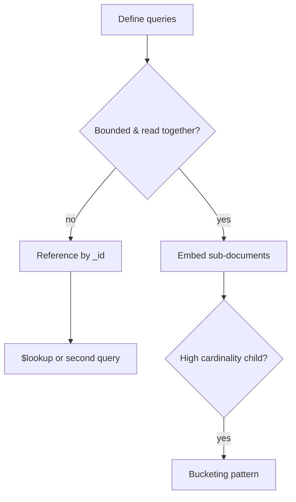

## Executive Summary

Model for **access patterns**, not normalization. **Embed** when data is read together and bounded; **reference** when unbounded, shared, or independently updated. The **16 MB document limit** is the hard ceiling.

---

## Core Concepts



| Pattern | When |
| :--- | :--- |
| **Embedded** | 1:few, always fetched together (order + line items) |
| **Referenced** | 1:many unbounded (user → all orders) |
| **Subset** | Embed last N comments, ref the rest |
| **Bucketing** | Group time-series events per hour/day document |
| **Extended reference** | Store frequently used fields + `_id` to avoid join |
| **Outlier** | Separate collection for unusually large variants |

---

## Quick Reference

```javascript
// Embedded order (typical e-commerce)
{
  _id: ObjectId("..."),
  customerId: "C1",
  items: [
    { sku: "A", qty: 2, price: Decimal128("9.99") }
  ],
  total: Decimal128("19.98"),
  status: "paid"
}

// Reference pattern
// orders: { _id, customerId, ... }
// customers: { _id, email, ... }

// Bucketing: one doc per sensor per day
{
  sensorId: "S1",
  date: ISODate("2026-06-30"),
  readings: [
    { t: ISODate("...T10:00:00Z"), v: 42.1 },
    { t: ISODate("...T10:01:00Z"), v: 42.3 }
  ]
}
```

---

## Snippets

```javascript
// Polymorphic schema with discriminator
db.events.createIndex({ eventType: 1, ts: -1 })
// { eventType: "click", ts: ..., payload: { url: "..." } }
// { eventType: "purchase", ts: ..., payload: { orderId: "..." } }

// Schema validation at collection level
db.createCollection("users", {
  validator: {
    $jsonSchema: {
      bsonType: "object",
      required: ["email"],
      properties: { email: { bsonType: "string", pattern: "^.+@.+$" } }
    }
  }
})
```

---

## Common Gotchas

- Unbounded arrays (`comments`, `events`) will hit 16 MB — bucket or reference.
- Embedding duplicates data — updates must touch every copy or accept staleness.
- Shard key must align with query patterns — schema and sharding are coupled.
- Over-normalizing into many small collections increases round trips.

---

<!-- interview-answers:start -->

# Interview Answers (Top 150)

## When would you choose MongoDB's document model over a relational database for a greenfield product?

### Short Answer
The production-grade answer is modeling to dominant read/write paths, then embedding only where growth is bounded for: When would you choose MongoDB's document model over a relational database for a greenfield product.

### Detailed Explanation
Schema-first decisions in MongoDB should be query-first in practice, so colocate fields that are read together and externalize unbounded fan-out to references or buckets for: When would you choose MongoDB's document model over a relational database for a greenfield product.

### Internal Working
Document growth, index fan-out, and update locality decide the true cost profile internally, which is why embedding works best when mutation scope stays narrow for: When would you choose MongoDB's document model over a relational database for a greenfield product.

### Production Notes
You justify it by minimizing cross-shard work and rollback risk by replaying realistic tenant skew, cardinality growth, and migration paths before freezing the model for: When would you choose MongoDB's document model over a relational database for a greenfield product.

### Common Mistakes
A common mistake is copying relational normalization or, conversely, embedding unbounded arrays until 16 MB limits and write amplification appear for: When would you choose MongoDB's document model over a relational database for a greenfield product.

### Follow-up Questions
What cardinality limit, migration trigger, and fallback model would you define up front to keep: When would you choose MongoDB's document model over a relational database for a greenfield product safe over 3 years?

---
## How does embedding data change read latency versus normalizing into multiple collections?

### Short Answer
The senior-level decision is modeling to dominant read/write paths, then embedding only where growth is bounded for: How does embedding data change read latency versus normalizing into multiple collections.

### Detailed Explanation
Schema-first decisions in MongoDB should be query-first in practice, so colocate fields that are read together and externalize unbounded fan-out to references or buckets for: How does embedding data change read latency versus normalizing into multiple collections.

### Internal Working
Document growth, index fan-out, and update locality decide the true cost profile internally, which is why embedding works best when mutation scope stays narrow for: How does embedding data change read latency versus normalizing into multiple collections.

### Production Notes
You justify it by balancing latency, durability, and operational toil by replaying realistic tenant skew, cardinality growth, and migration paths before freezing the model for: How does embedding data change read latency versus normalizing into multiple collections.

### Common Mistakes
A common mistake is copying relational normalization or, conversely, embedding unbounded arrays until 16 MB limits and write amplification appear for: How does embedding data change read latency versus normalizing into multiple collections.

### Follow-up Questions
What cardinality limit, migration trigger, and fallback model would you define up front to keep: How does embedding data change read latency versus normalizing into multiple collections safe over 3 years?

---
## How does the 16 MB document limit influence schema design for comment threads or event streams?

### Short Answer
The senior-level decision is modeling to dominant read/write paths, then embedding only where growth is bounded for: How does the 16 MB document limit influence schema design for comment threads or event streams.

### Detailed Explanation
Schema-first decisions in MongoDB should be query-first in practice, so colocate fields that are read together and externalize unbounded fan-out to references or buckets for: How does the 16 MB document limit influence schema design for comment threads or event streams.

### Internal Working
Document growth, index fan-out, and update locality decide the true cost profile internally, which is why embedding works best when mutation scope stays narrow for: How does the 16 MB document limit influence schema design for comment threads or event streams.

### Production Notes
You justify it by balancing latency, durability, and operational toil by replaying realistic tenant skew, cardinality growth, and migration paths before freezing the model for: How does the 16 MB document limit influence schema design for comment threads or event streams.

### Common Mistakes
A common mistake is copying relational normalization or, conversely, embedding unbounded arrays until 16 MB limits and write amplification appear for: How does the 16 MB document limit influence schema design for comment threads or event streams.

### Follow-up Questions
What cardinality limit, migration trigger, and fallback model would you define up front to keep: How does the 16 MB document limit influence schema design for comment threads or event streams safe over 3 years?

---
## When is the bucketing pattern preferable to unbounded embedded arrays?

### Short Answer
The practical MongoDB answer is modeling to dominant read/write paths, then embedding only where growth is bounded for: When is the bucketing pattern preferable to unbounded embedded arrays.

### Detailed Explanation
Schema-first decisions in MongoDB should be query-first in practice, so colocate fields that are read together and externalize unbounded fan-out to references or buckets for: When is the bucketing pattern preferable to unbounded embedded arrays.

### Internal Working
Document growth, index fan-out, and update locality decide the true cost profile internally, which is why embedding works best when mutation scope stays narrow for: When is the bucketing pattern preferable to unbounded embedded arrays.

### Production Notes
You justify it by aligning schema, index, and topology to the access pattern by replaying realistic tenant skew, cardinality growth, and migration paths before freezing the model for: When is the bucketing pattern preferable to unbounded embedded arrays.

### Common Mistakes
A common mistake is copying relational normalization or, conversely, embedding unbounded arrays until 16 MB limits and write amplification appear for: When is the bucketing pattern preferable to unbounded embedded arrays.

### Follow-up Questions
What cardinality limit, migration trigger, and fallback model would you define up front to keep: When is the bucketing pattern preferable to unbounded embedded arrays safe over 3 years?

---
## How do schema design and shard key selection interact in a multi-tenant SaaS platform?

### Short Answer
For this question, the architecturally correct answer is choosing a shard key that preserves query targeting and distributes writes, not just one that looks high-cardinality, for: How do schema design and shard key selection interact in a multi-tenant SaaS platform.

### Detailed Explanation
In MongoDB sharding, the wrong leading key creates hot chunks, scatter-gather queries, or jumbo chunks, so key choice must follow real filters and time-skew behavior for: How do schema design and shard key selection interact in a multi-tenant SaaS platform.

### Internal Working
`mongos` routes via config metadata and chunk ranges, so shard-key entropy and monotonicity directly control migration pressure and balancer load for: How do schema design and shard key selection interact in a multi-tenant SaaS platform.

### Production Notes
You justify it by proving p95/p99 behavior under realistic cardinality by load-testing chunk distribution, migration rate, and per-shard opcounters before production for: How do schema design and shard key selection interact in a multi-tenant SaaS platform.

### Common Mistakes
Teams often choose hashed keys that break range locality or ranged keys that hotspot writes because they skipped workload replay for: How do schema design and shard key selection interact in a multi-tenant SaaS platform.

### Follow-up Questions
How would you prove shard targeting percentage, not just throughput, for: How do schema design and shard key selection interact in a multi-tenant SaaS platform before launch?

---
## How would you model a product catalog with variants that differ wildly in attributes?

### Short Answer
The production-grade answer is modeling to dominant read/write paths, then embedding only where growth is bounded for: How would you model a product catalog with variants that differ wildly in attributes.

### Detailed Explanation
Schema-first decisions in MongoDB should be query-first in practice, so colocate fields that are read together and externalize unbounded fan-out to references or buckets for: How would you model a product catalog with variants that differ wildly in attributes.

### Internal Working
Document growth, index fan-out, and update locality decide the true cost profile internally, which is why embedding works best when mutation scope stays narrow for: How would you model a product catalog with variants that differ wildly in attributes.

### Production Notes
You justify it by minimizing cross-shard work and rollback risk by replaying realistic tenant skew, cardinality growth, and migration paths before freezing the model for: How would you model a product catalog with variants that differ wildly in attributes.

### Common Mistakes
A common mistake is copying relational normalization or, conversely, embedding unbounded arrays until 16 MB limits and write amplification appear for: How would you model a product catalog with variants that differ wildly in attributes.

### Follow-up Questions
What cardinality limit, migration trigger, and fallback model would you define up front to keep: How would you model a product catalog with variants that differ wildly in attributes safe over 3 years?

---
## What CQRS patterns pair naturally with MongoDB as a read model store?

### Short Answer
For this question, the architecturally correct answer is modeling to dominant read/write paths, then embedding only where growth is bounded for: What CQRS patterns pair naturally with MongoDB as a read model store.

### Detailed Explanation
Schema-first decisions in MongoDB should be query-first in practice, so colocate fields that are read together and externalize unbounded fan-out to references or buckets for: What CQRS patterns pair naturally with MongoDB as a read model store.

### Internal Working
Document growth, index fan-out, and update locality decide the true cost profile internally, which is why embedding works best when mutation scope stays narrow for: What CQRS patterns pair naturally with MongoDB as a read model store.

### Production Notes
You justify it by proving p95/p99 behavior under realistic cardinality by replaying realistic tenant skew, cardinality growth, and migration paths before freezing the model for: What CQRS patterns pair naturally with MongoDB as a read model store.

### Common Mistakes
A common mistake is copying relational normalization or, conversely, embedding unbounded arrays until 16 MB limits and write amplification appear for: What CQRS patterns pair naturally with MongoDB as a read model store.

### Follow-up Questions
What cardinality limit, migration trigger, and fallback model would you define up front to keep: What CQRS patterns pair naturally with MongoDB as a read model store safe over 3 years?

---
## What polymorphism strategies avoid unmanageable index sprawl on event collections?

### Short Answer
The senior-level decision is deriving indexes from exact query shapes and ESR ordering, then proving docsExamined efficiency for: What polymorphism strategies avoid unmanageable index sprawl on event collections.

### Detailed Explanation
Index quality is measured by selectivity, sort support, and coverage tradeoffs versus write amplification, not by index count alone, for: What polymorphism strategies avoid unmanageable index sprawl on event collections.

### Internal Working
Planner behavior depends on prefix usability and cardinality estimates, so misplaced fields cause FETCH-heavy plans or full scans for: What polymorphism strategies avoid unmanageable index sprawl on event collections.

### Production Notes
You justify it by balancing latency, durability, and operational toil with continuous index hygiene reviews, explain baselines, and drop policies for stale indexes around: What polymorphism strategies avoid unmanageable index sprawl on event collections.

### Common Mistakes
Teams often over-index every slow query and silently degrade write throughput, memory, and checkpoint I/O for: What polymorphism strategies avoid unmanageable index sprawl on event collections.

### Follow-up Questions
What threshold in scanned/returned ratio should trigger redesign for: What polymorphism strategies avoid unmanageable index sprawl on event collections in your team?

---
## How do extended reference patterns balance embed and reference tradeoffs?

### Short Answer
The production-grade answer is modeling to dominant read/write paths, then embedding only where growth is bounded for: How do extended reference patterns balance embed and reference tradeoffs.

### Detailed Explanation
Schema-first decisions in MongoDB should be query-first in practice, so colocate fields that are read together and externalize unbounded fan-out to references or buckets for: How do extended reference patterns balance embed and reference tradeoffs.

### Internal Working
Document growth, index fan-out, and update locality decide the true cost profile internally, which is why embedding works best when mutation scope stays narrow for: How do extended reference patterns balance embed and reference tradeoffs.

### Production Notes
You justify it by minimizing cross-shard work and rollback risk by replaying realistic tenant skew, cardinality growth, and migration paths before freezing the model for: How do extended reference patterns balance embed and reference tradeoffs.

### Common Mistakes
A common mistake is copying relational normalization or, conversely, embedding unbounded arrays until 16 MB limits and write amplification appear for: How do extended reference patterns balance embed and reference tradeoffs.

### Follow-up Questions
What cardinality limit, migration trigger, and fallback model would you define up front to keep: How do extended reference patterns balance embed and reference tradeoffs safe over 3 years?

---
## How does document model versioning interact with blue/green application deploys?

### Short Answer
The production-grade answer is modeling to dominant read/write paths, then embedding only where growth is bounded for: How does document model versioning interact with blue/green application deploys.

### Detailed Explanation
Schema-first decisions in MongoDB should be query-first in practice, so colocate fields that are read together and externalize unbounded fan-out to references or buckets for: How does document model versioning interact with blue/green application deploys.

### Internal Working
Document growth, index fan-out, and update locality decide the true cost profile internally, which is why embedding works best when mutation scope stays narrow for: How does document model versioning interact with blue/green application deploys.

### Production Notes
You justify it by minimizing cross-shard work and rollback risk by replaying realistic tenant skew, cardinality growth, and migration paths before freezing the model for: How does document model versioning interact with blue/green application deploys.

### Common Mistakes
A common mistake is copying relational normalization or, conversely, embedding unbounded arrays until 16 MB limits and write amplification appear for: How does document model versioning interact with blue/green application deploys.

### Follow-up Questions
What cardinality limit, migration trigger, and fallback model would you define up front to keep: How does document model versioning interact with blue/green application deploys safe over 3 years?

---
## When does embedding outperform `$lookup` for read latency at scale?

### Short Answer
The senior-level decision is pushing selective `$match` and projection early, then containing fan-out stages for: When does embedding outperform `$lookup` for read latency at scale.

### Detailed Explanation
Aggregation pipelines stay fast when stage order protects index use and minimizes intermediate document width before `$lookup`, `$group`, or `$facet` for: When does embedding outperform `$lookup` for read latency at scale.

### Internal Working
The optimizer can reorder some stages, but blocking operators still dominate memory and spill behavior under skewed inputs for: When does embedding outperform `$lookup` for read latency at scale.

### Production Notes
You justify it by balancing latency, durability, and operational toil by inspecting stage-level execution stats, spill metrics, and cardinality explosions for: When does embedding outperform `$lookup` for read latency at scale.

### Common Mistakes
Typical mistakes are joining before filtering, missing foreign indexes, and normalizing data that should have been embedded for: When does embedding outperform `$lookup` for read latency at scale.

### Follow-up Questions
Which stage in: When does embedding outperform `$lookup` for read latency at scale currently dominates runtime, and do you have evidence that schema change beats pipeline tuning?

---
## What application patterns avoid dual-write inconsistencies without distributed transactions?

### Short Answer
The senior-level decision is using multi-document transactions only where cross-document invariants are mandatory for: What application patterns avoid dual-write inconsistencies without distributed transactions.

### Detailed Explanation
Transactions provide atomicity and snapshot isolation, but they add lock lifetime, retry complexity, and oplog overhead, so model to single-document atomicity first for: What application patterns avoid dual-write inconsistencies without distributed transactions.

### Internal Working
On sharded clusters, commit coordination uses two-phase behavior and can abort on lifetime or conflict pressure, making long transactions operationally expensive for: What application patterns avoid dual-write inconsistencies without distributed transactions.

### Production Notes
You justify it by balancing latency, durability, and operational toil by keeping transactions short, indexed, and explicitly retried with idempotent semantics for: What application patterns avoid dual-write inconsistencies without distributed transactions.

### Common Mistakes
Common mistakes include using transactions to mask poor schema choices or allowing user flows to hold them open too long for: What application patterns avoid dual-write inconsistencies without distributed transactions.

### Follow-up Questions
What invariant in: What application patterns avoid dual-write inconsistencies without distributed transactions cannot be preserved by idempotent single-document updates?

---
<!-- interview-answers:end -->

---

## See Also

- [Previous: Transactions](/mongodb-cheatsheet/02-core-mongodb/transactions/)
- [Next: Indexes](/mongodb-cheatsheet/03-query-performance/indexes/)
- [MongoDB Handbook Index](/mongodb-cheatsheet/)
- [Top 150 Interview Questions](/mongodb-cheatsheet/06-interview-guide/top-150-interview-questions/)
