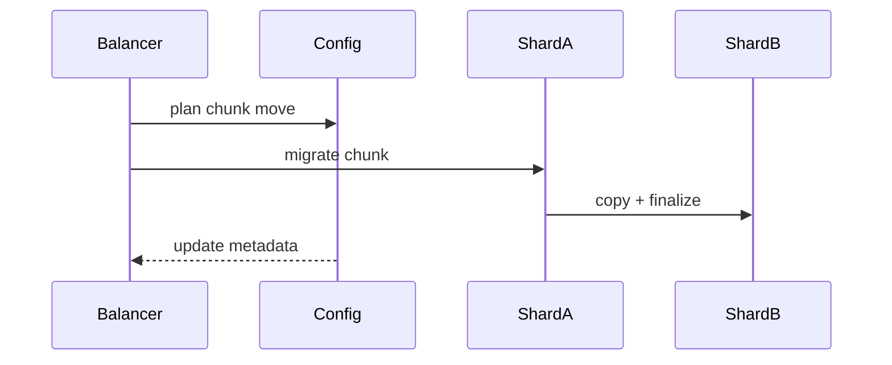
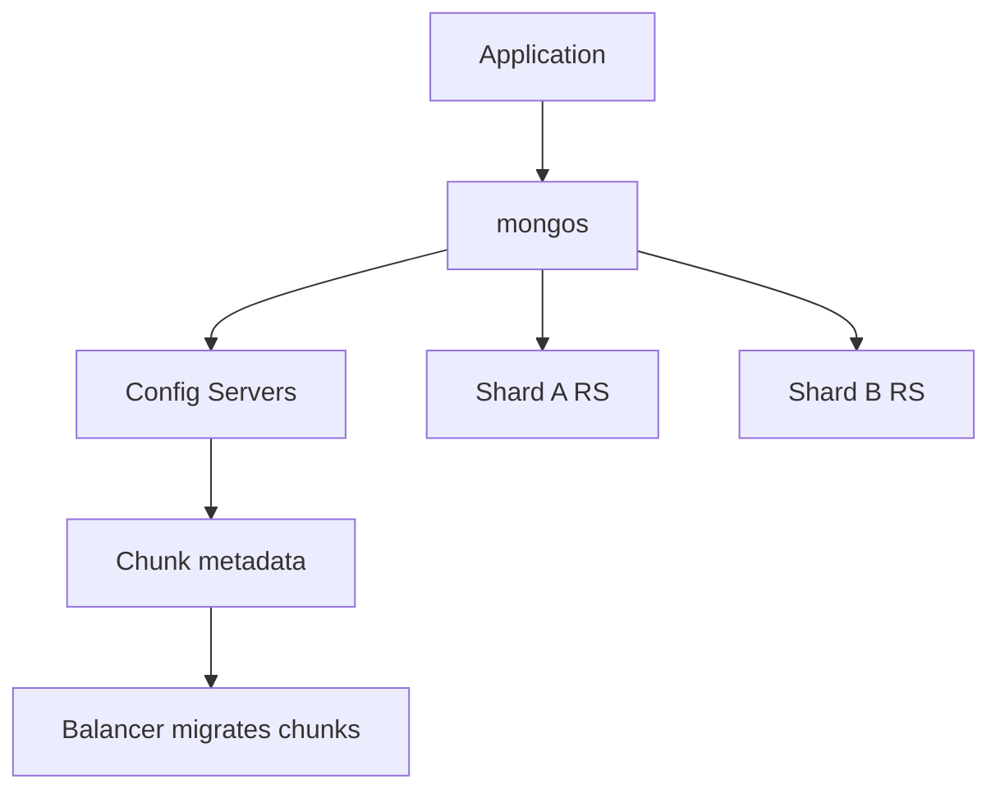

## Executive Summary

**Sharding** horizontally partitions data across shard replica sets. **mongos** routes queries; **config servers** store metadata. The **shard key** is immutable per document and drives distribution.

---

## Core Concepts





| Concept | Detail |
| :--- | :--- |
| **Shard key** | Indexed field(s) — determines chunk |
| **Chunk** | Range of shard key values (default 128 MB) |
| **Balancer** | Migrates chunks between shards |
| **Targeted query** | Includes shard key equality — single shard |
| **Scatter-gather** | No shard key — hits all shards |

---

## Quick Reference

```javascript
// Enable sharding on database
sh.enableSharding("ecommerce")

// Shard collection (choose key carefully!)
sh.shardCollection("ecommerce.orders", { customerId: "hashed" })
// or ranged: { region: 1, orderId: 1 }

sh.status()
db.orders.getShardDistribution()

// Zone sharding (geo / tenant isolation)
sh.addShardToZone("shardA", "EU")
sh.updateZoneKeyRange(
  "ecommerce.orders",
  { region: "EU", orderId: MinKey },
  { region: "EU", orderId: MaxKey },
  "EU"
)
```

| Shard key pattern | Pros | Cons |
| :--- | :--- | :--- |
| **Hashed** (`hashed`) | Even distribution | No range queries on key |
| **Ranged** (compound) | Range locality | Hot shard if monotonic (`_id`, timestamp) |
| **Compound** | Prefix targeting | Design complexity |

---

## Snippets

```javascript
// Good: high-cardinality prefix + hashed suffix
sh.shardCollection("logs.events", { tenantId: 1, _id: "hashed" })

// Bad: monotonic shard key — all writes to one chunk
// sh.shardCollection("events", { createdAt: 1 })  // hot spot

// Pre-split for bulk load
sh.splitAt("ecommerce.orders", { customerId: "M" })
sh.moveChunk("ecommerce.orders", { customerId: "A" }, "shardA")
```

---

## Common Gotchas

- Shard key cannot be changed without re-sharding migration (expensive).
- Unique indexes must **include the shard key** as a prefix.
- `$lookup` across shards works but is slower than co-located data.
- Jumbo chunks block balancer — monitor `sh.status()` and chunk sizes.

---

<!-- interview-answers:start -->

# Interview Answers (Top 150)

## What access-pattern mistakes force expensive scatter-gather queries on a sharded cluster?

### Short Answer
The practical MongoDB answer is choosing a shard key that preserves query targeting and distributes writes, not just one that looks high-cardinality, for: What access-pattern mistakes force expensive scatter-gather queries on a sharded cluster.

### Detailed Explanation
In MongoDB sharding, the wrong leading key creates hot chunks, scatter-gather queries, or jumbo chunks, so key choice must follow real filters and time-skew behavior for: What access-pattern mistakes force expensive scatter-gather queries on a sharded cluster.

### Internal Working
`mongos` routes via config metadata and chunk ranges, so shard-key entropy and monotonicity directly control migration pressure and balancer load for: What access-pattern mistakes force expensive scatter-gather queries on a sharded cluster.

### Production Notes
You justify it by aligning schema, index, and topology to the access pattern by load-testing chunk distribution, migration rate, and per-shard opcounters before production for: What access-pattern mistakes force expensive scatter-gather queries on a sharded cluster.

### Common Mistakes
Teams often choose hashed keys that break range locality or ranged keys that hotspot writes because they skipped workload replay for: What access-pattern mistakes force expensive scatter-gather queries on a sharded cluster.

### Follow-up Questions
How would you prove shard targeting percentage, not just throughput, for: What access-pattern mistakes force expensive scatter-gather queries on a sharded cluster before launch?

---
## How does zone sharding support data residency requirements across regions?

### Short Answer
The production-grade answer is choosing a shard key that preserves query targeting and distributes writes, not just one that looks high-cardinality, for: How does zone sharding support data residency requirements across regions.

### Detailed Explanation
In MongoDB sharding, the wrong leading key creates hot chunks, scatter-gather queries, or jumbo chunks, so key choice must follow real filters and time-skew behavior for: How does zone sharding support data residency requirements across regions.

### Internal Working
`mongos` routes via config metadata and chunk ranges, so shard-key entropy and monotonicity directly control migration pressure and balancer load for: How does zone sharding support data residency requirements across regions.

### Production Notes
You justify it by minimizing cross-shard work and rollback risk by load-testing chunk distribution, migration rate, and per-shard opcounters before production for: How does zone sharding support data residency requirements across regions.

### Common Mistakes
Teams often choose hashed keys that break range locality or ranged keys that hotspot writes because they skipped workload replay for: How does zone sharding support data residency requirements across regions.

### Follow-up Questions
How would you prove shard targeting percentage, not just throughput, for: How does zone sharding support data residency requirements across regions before launch?

---
## When is hashed versus ranged shard key correct for an order ID domain?

### Short Answer
The senior-level decision is choosing a shard key that preserves query targeting and distributes writes, not just one that looks high-cardinality, for: When is hashed versus ranged shard key correct for an order ID domain.

### Detailed Explanation
In MongoDB sharding, the wrong leading key creates hot chunks, scatter-gather queries, or jumbo chunks, so key choice must follow real filters and time-skew behavior for: When is hashed versus ranged shard key correct for an order ID domain.

### Internal Working
`mongos` routes via config metadata and chunk ranges, so shard-key entropy and monotonicity directly control migration pressure and balancer load for: When is hashed versus ranged shard key correct for an order ID domain.

### Production Notes
You justify it by balancing latency, durability, and operational toil by load-testing chunk distribution, migration rate, and per-shard opcounters before production for: When is hashed versus ranged shard key correct for an order ID domain.

### Common Mistakes
Teams often choose hashed keys that break range locality or ranged keys that hotspot writes because they skipped workload replay for: When is hashed versus ranged shard key correct for an order ID domain.

### Follow-up Questions
How would you prove shard targeting percentage, not just throughput, for: When is hashed versus ranged shard key correct for an order ID domain before launch?

---
## How does co-locating related data by shard key reduce cross-shard `$lookup` cost?

### Short Answer
The practical MongoDB answer is choosing a shard key that preserves query targeting and distributes writes, not just one that looks high-cardinality, for: How does co-locating related data by shard key reduce cross-shard `$lookup` cost.

### Detailed Explanation
In MongoDB sharding, the wrong leading key creates hot chunks, scatter-gather queries, or jumbo chunks, so key choice must follow real filters and time-skew behavior for: How does co-locating related data by shard key reduce cross-shard `$lookup` cost.

### Internal Working
`mongos` routes via config metadata and chunk ranges, so shard-key entropy and monotonicity directly control migration pressure and balancer load for: How does co-locating related data by shard key reduce cross-shard `$lookup` cost.

### Production Notes
You justify it by aligning schema, index, and topology to the access pattern by load-testing chunk distribution, migration rate, and per-shard opcounters before production for: How does co-locating related data by shard key reduce cross-shard `$lookup` cost.

### Common Mistakes
Teams often choose hashed keys that break range locality or ranged keys that hotspot writes because they skipped workload replay for: How does co-locating related data by shard key reduce cross-shard `$lookup` cost.

### Follow-up Questions
How would you prove shard targeting percentage, not just throughput, for: How does co-locating related data by shard key reduce cross-shard `$lookup` cost before launch?

---
## How would you isolate noisy-neighbor tenants on a shared sharded cluster?

### Short Answer
The production-grade answer is choosing a shard key that preserves query targeting and distributes writes, not just one that looks high-cardinality, for: How would you isolate noisy-neighbor tenants on a shared sharded cluster.

### Detailed Explanation
In MongoDB sharding, the wrong leading key creates hot chunks, scatter-gather queries, or jumbo chunks, so key choice must follow real filters and time-skew behavior for: How would you isolate noisy-neighbor tenants on a shared sharded cluster.

### Internal Working
`mongos` routes via config metadata and chunk ranges, so shard-key entropy and monotonicity directly control migration pressure and balancer load for: How would you isolate noisy-neighbor tenants on a shared sharded cluster.

### Production Notes
You justify it by minimizing cross-shard work and rollback risk by load-testing chunk distribution, migration rate, and per-shard opcounters before production for: How would you isolate noisy-neighbor tenants on a shared sharded cluster.

### Common Mistakes
Teams often choose hashed keys that break range locality or ranged keys that hotspot writes because they skipped workload replay for: How would you isolate noisy-neighbor tenants on a shared sharded cluster.

### Follow-up Questions
How would you prove shard targeting percentage, not just throughput, for: How would you isolate noisy-neighbor tenants on a shared sharded cluster before launch?

---
## How do unique indexes on sharded collections constrain schema evolution?

### Short Answer
The practical MongoDB answer is choosing a shard key that preserves query targeting and distributes writes, not just one that looks high-cardinality, for: How do unique indexes on sharded collections constrain schema evolution.

### Detailed Explanation
In MongoDB sharding, the wrong leading key creates hot chunks, scatter-gather queries, or jumbo chunks, so key choice must follow real filters and time-skew behavior for: How do unique indexes on sharded collections constrain schema evolution.

### Internal Working
`mongos` routes via config metadata and chunk ranges, so shard-key entropy and monotonicity directly control migration pressure and balancer load for: How do unique indexes on sharded collections constrain schema evolution.

### Production Notes
You justify it by aligning schema, index, and topology to the access pattern by load-testing chunk distribution, migration rate, and per-shard opcounters before production for: How do unique indexes on sharded collections constrain schema evolution.

### Common Mistakes
Teams often choose hashed keys that break range locality or ranged keys that hotspot writes because they skipped workload replay for: How do unique indexes on sharded collections constrain schema evolution.

### Follow-up Questions
How would you prove shard targeting percentage, not just throughput, for: How do unique indexes on sharded collections constrain schema evolution before launch?

---
## How do you remediate a hot shard created by a monotonic timestamp shard key?

### Short Answer
The production-grade answer is choosing a shard key that preserves query targeting and distributes writes, not just one that looks high-cardinality, for: How do you remediate a hot shard created by a monotonic timestamp shard key.

### Detailed Explanation
In MongoDB sharding, the wrong leading key creates hot chunks, scatter-gather queries, or jumbo chunks, so key choice must follow real filters and time-skew behavior for: How do you remediate a hot shard created by a monotonic timestamp shard key.

### Internal Working
`mongos` routes via config metadata and chunk ranges, so shard-key entropy and monotonicity directly control migration pressure and balancer load for: How do you remediate a hot shard created by a monotonic timestamp shard key.

### Production Notes
You justify it by minimizing cross-shard work and rollback risk by load-testing chunk distribution, migration rate, and per-shard opcounters before production for: How do you remediate a hot shard created by a monotonic timestamp shard key.

### Common Mistakes
Teams often choose hashed keys that break range locality or ranged keys that hotspot writes because they skipped workload replay for: How do you remediate a hot shard created by a monotonic timestamp shard key.

### Follow-up Questions
How would you prove shard targeting percentage, not just throughput, for: How do you remediate a hot shard created by a monotonic timestamp shard key before launch?

---
## What shard metadata issues cause mongos to return stale routing?

### Short Answer
For this question, the architecturally correct answer is choosing a shard key that preserves query targeting and distributes writes, not just one that looks high-cardinality, for: What shard metadata issues cause mongos to return stale routing.

### Detailed Explanation
In MongoDB sharding, the wrong leading key creates hot chunks, scatter-gather queries, or jumbo chunks, so key choice must follow real filters and time-skew behavior for: What shard metadata issues cause mongos to return stale routing.

### Internal Working
`mongos` routes via config metadata and chunk ranges, so shard-key entropy and monotonicity directly control migration pressure and balancer load for: What shard metadata issues cause mongos to return stale routing.

### Production Notes
You justify it by proving p95/p99 behavior under realistic cardinality by load-testing chunk distribution, migration rate, and per-shard opcounters before production for: What shard metadata issues cause mongos to return stale routing.

### Common Mistakes
Teams often choose hashed keys that break range locality or ranged keys that hotspot writes because they skipped workload replay for: What shard metadata issues cause mongos to return stale routing.

### Follow-up Questions
How would you prove shard targeting percentage, not just throughput, for: What shard metadata issues cause mongos to return stale routing before launch?

---
## What signs indicate the balancer is disabled or stuck?

### Short Answer
The senior-level decision is choosing a shard key that preserves query targeting and distributes writes, not just one that looks high-cardinality, for: What signs indicate the balancer is disabled or stuck.

### Detailed Explanation
In MongoDB sharding, the wrong leading key creates hot chunks, scatter-gather queries, or jumbo chunks, so key choice must follow real filters and time-skew behavior for: What signs indicate the balancer is disabled or stuck.

### Internal Working
`mongos` routes via config metadata and chunk ranges, so shard-key entropy and monotonicity directly control migration pressure and balancer load for: What signs indicate the balancer is disabled or stuck.

### Production Notes
You justify it by balancing latency, durability, and operational toil by load-testing chunk distribution, migration rate, and per-shard opcounters before production for: What signs indicate the balancer is disabled or stuck.

### Common Mistakes
Teams often choose hashed keys that break range locality or ranged keys that hotspot writes because they skipped workload replay for: What signs indicate the balancer is disabled or stuck.

### Follow-up Questions
How would you prove shard targeting percentage, not just throughput, for: What signs indicate the balancer is disabled or stuck before launch?

---
## How do hashed shard keys affect range query performance?

### Short Answer
The practical MongoDB answer is choosing a shard key that preserves query targeting and distributes writes, not just one that looks high-cardinality, for: How do hashed shard keys affect range query performance.

### Detailed Explanation
In MongoDB sharding, the wrong leading key creates hot chunks, scatter-gather queries, or jumbo chunks, so key choice must follow real filters and time-skew behavior for: How do hashed shard keys affect range query performance.

### Internal Working
`mongos` routes via config metadata and chunk ranges, so shard-key entropy and monotonicity directly control migration pressure and balancer load for: How do hashed shard keys affect range query performance.

### Production Notes
You justify it by aligning schema, index, and topology to the access pattern by load-testing chunk distribution, migration rate, and per-shard opcounters before production for: How do hashed shard keys affect range query performance.

### Common Mistakes
Teams often choose hashed keys that break range locality or ranged keys that hotspot writes because they skipped workload replay for: How do hashed shard keys affect range query performance.

### Follow-up Questions
How would you prove shard targeting percentage, not just throughput, for: How do hashed shard keys affect range query performance before launch?

---
## How would you load-test shard key distribution before production cutover?

### Short Answer
The production-grade answer is choosing a shard key that preserves query targeting and distributes writes, not just one that looks high-cardinality, for: How would you load-test shard key distribution before production cutover.

### Detailed Explanation
In MongoDB sharding, the wrong leading key creates hot chunks, scatter-gather queries, or jumbo chunks, so key choice must follow real filters and time-skew behavior for: How would you load-test shard key distribution before production cutover.

### Internal Working
`mongos` routes via config metadata and chunk ranges, so shard-key entropy and monotonicity directly control migration pressure and balancer load for: How would you load-test shard key distribution before production cutover.

### Production Notes
You justify it by minimizing cross-shard work and rollback risk by load-testing chunk distribution, migration rate, and per-shard opcounters before production for: How would you load-test shard key distribution before production cutover.

### Common Mistakes
Teams often choose hashed keys that break range locality or ranged keys that hotspot writes because they skipped workload replay for: How would you load-test shard key distribution before production cutover.

### Follow-up Questions
How would you prove shard targeting percentage, not just throughput, for: How would you load-test shard key distribution before production cutover before launch?

---
## What pre-split strategy avoids hot chunks during initial bulk load?

### Short Answer
The senior-level decision is choosing a shard key that preserves query targeting and distributes writes, not just one that looks high-cardinality, for: What pre-split strategy avoids hot chunks during initial bulk load.

### Detailed Explanation
In MongoDB sharding, the wrong leading key creates hot chunks, scatter-gather queries, or jumbo chunks, so key choice must follow real filters and time-skew behavior for: What pre-split strategy avoids hot chunks during initial bulk load.

### Internal Working
`mongos` routes via config metadata and chunk ranges, so shard-key entropy and monotonicity directly control migration pressure and balancer load for: What pre-split strategy avoids hot chunks during initial bulk load.

### Production Notes
You justify it by balancing latency, durability, and operational toil by load-testing chunk distribution, migration rate, and per-shard opcounters before production for: What pre-split strategy avoids hot chunks during initial bulk load.

### Common Mistakes
Teams often choose hashed keys that break range locality or ranged keys that hotspot writes because they skipped workload replay for: What pre-split strategy avoids hot chunks during initial bulk load.

### Follow-up Questions
How would you prove shard targeting percentage, not just throughput, for: What pre-split strategy avoids hot chunks during initial bulk load before launch?

---
## How would you segment tenant data in a shared cluster using roles and namespaces?

### Short Answer
The production-grade answer is modeling to dominant read/write paths, then embedding only where growth is bounded for: How would you segment tenant data in a shared cluster using roles and namespaces.

### Detailed Explanation
Schema-first decisions in MongoDB should be query-first in practice, so colocate fields that are read together and externalize unbounded fan-out to references or buckets for: How would you segment tenant data in a shared cluster using roles and namespaces.

### Internal Working
Document growth, index fan-out, and update locality decide the true cost profile internally, which is why embedding works best when mutation scope stays narrow for: How would you segment tenant data in a shared cluster using roles and namespaces.

### Production Notes
You justify it by minimizing cross-shard work and rollback risk by replaying realistic tenant skew, cardinality growth, and migration paths before freezing the model for: How would you segment tenant data in a shared cluster using roles and namespaces.

### Common Mistakes
A common mistake is copying relational normalization or, conversely, embedding unbounded arrays until 16 MB limits and write amplification appear for: How would you segment tenant data in a shared cluster using roles and namespaces.

### Follow-up Questions
What cardinality limit, migration trigger, and fallback model would you define up front to keep: How would you segment tenant data in a shared cluster using roles and namespaces safe over 3 years?

---
## What chunk size defaults affect migration frequency on sharded clusters?

### Short Answer
The senior-level decision is choosing a shard key that preserves query targeting and distributes writes, not just one that looks high-cardinality, for: What chunk size defaults affect migration frequency on sharded clusters.

### Detailed Explanation
In MongoDB sharding, the wrong leading key creates hot chunks, scatter-gather queries, or jumbo chunks, so key choice must follow real filters and time-skew behavior for: What chunk size defaults affect migration frequency on sharded clusters.

### Internal Working
`mongos` routes via config metadata and chunk ranges, so shard-key entropy and monotonicity directly control migration pressure and balancer load for: What chunk size defaults affect migration frequency on sharded clusters.

### Production Notes
You justify it by balancing latency, durability, and operational toil by load-testing chunk distribution, migration rate, and per-shard opcounters before production for: What chunk size defaults affect migration frequency on sharded clusters.

### Common Mistakes
Teams often choose hashed keys that break range locality or ranged keys that hotspot writes because they skipped workload replay for: What chunk size defaults affect migration frequency on sharded clusters.

### Follow-up Questions
How would you prove shard targeting percentage, not just throughput, for: What chunk size defaults affect migration frequency on sharded clusters before launch?

---
## How would you reshard a collection when business requirements invalidate the shard key?

### Short Answer
The practical MongoDB answer is choosing a shard key that preserves query targeting and distributes writes, not just one that looks high-cardinality, for: How would you reshard a collection when business requirements invalidate the shard key.

### Detailed Explanation
In MongoDB sharding, the wrong leading key creates hot chunks, scatter-gather queries, or jumbo chunks, so key choice must follow real filters and time-skew behavior for: How would you reshard a collection when business requirements invalidate the shard key.

### Internal Working
`mongos` routes via config metadata and chunk ranges, so shard-key entropy and monotonicity directly control migration pressure and balancer load for: How would you reshard a collection when business requirements invalidate the shard key.

### Production Notes
You justify it by aligning schema, index, and topology to the access pattern by load-testing chunk distribution, migration rate, and per-shard opcounters before production for: How would you reshard a collection when business requirements invalidate the shard key.

### Common Mistakes
Teams often choose hashed keys that break range locality or ranged keys that hotspot writes because they skipped workload replay for: How would you reshard a collection when business requirements invalidate the shard key.

### Follow-up Questions
How would you prove shard targeting percentage, not just throughput, for: How would you reshard a collection when business requirements invalidate the shard key before launch?

---
## How do write timestamps as shard keys create hotspot chunks?

### Short Answer
The practical MongoDB answer is choosing a shard key that preserves query targeting and distributes writes, not just one that looks high-cardinality, for: How do write timestamps as shard keys create hotspot chunks.

### Detailed Explanation
In MongoDB sharding, the wrong leading key creates hot chunks, scatter-gather queries, or jumbo chunks, so key choice must follow real filters and time-skew behavior for: How do write timestamps as shard keys create hotspot chunks.

### Internal Working
`mongos` routes via config metadata and chunk ranges, so shard-key entropy and monotonicity directly control migration pressure and balancer load for: How do write timestamps as shard keys create hotspot chunks.

### Production Notes
You justify it by aligning schema, index, and topology to the access pattern by load-testing chunk distribution, migration rate, and per-shard opcounters before production for: How do write timestamps as shard keys create hotspot chunks.

### Common Mistakes
Teams often choose hashed keys that break range locality or ranged keys that hotspot writes because they skipped workload replay for: How do write timestamps as shard keys create hotspot chunks.

### Follow-up Questions
How would you prove shard targeting percentage, not just throughput, for: How do write timestamps as shard keys create hotspot chunks before launch?

---
## How would you explain chunk migration impact to application owners before rebalancing?

### Short Answer
The production-grade answer is choosing a shard key that preserves query targeting and distributes writes, not just one that looks high-cardinality, for: How would you explain chunk migration impact to application owners before rebalancing.

### Detailed Explanation
In MongoDB sharding, the wrong leading key creates hot chunks, scatter-gather queries, or jumbo chunks, so key choice must follow real filters and time-skew behavior for: How would you explain chunk migration impact to application owners before rebalancing.

### Internal Working
`mongos` routes via config metadata and chunk ranges, so shard-key entropy and monotonicity directly control migration pressure and balancer load for: How would you explain chunk migration impact to application owners before rebalancing.

### Production Notes
You justify it by minimizing cross-shard work and rollback risk by load-testing chunk distribution, migration rate, and per-shard opcounters before production for: How would you explain chunk migration impact to application owners before rebalancing.

### Common Mistakes
Teams often choose hashed keys that break range locality or ranged keys that hotspot writes because they skipped workload replay for: How would you explain chunk migration impact to application owners before rebalancing.

### Follow-up Questions
How would you prove shard targeting percentage, not just throughput, for: How would you explain chunk migration impact to application owners before rebalancing before launch?

---
<!-- interview-answers:end -->

---

## See Also

- [Previous: Replication](/mongodb-cheatsheet/02-core-mongodb/replication/)
- [Next: Transactions](/mongodb-cheatsheet/02-core-mongodb/transactions/)
- [MongoDB Handbook Index](/mongodb-cheatsheet/)
- [Top 150 Interview Questions](/mongodb-cheatsheet/06-interview-guide/top-150-interview-questions/)
