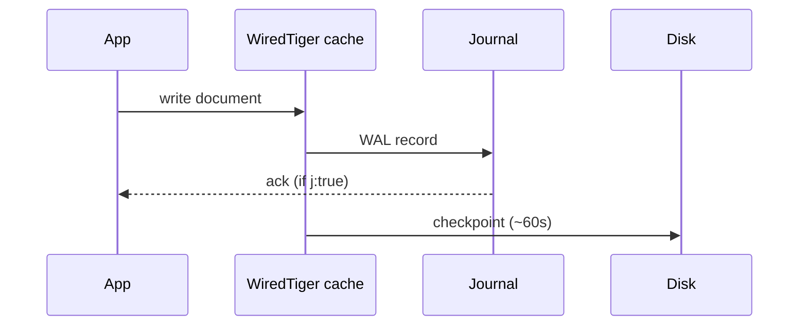
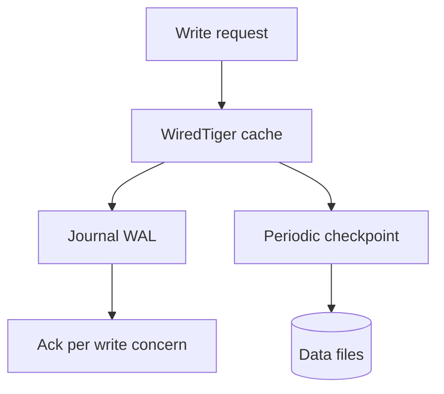

## Quick Revision

- **WiredTiger** is the default storage engine — B-tree indexes, document-level locking, MVCC.
- Writes go to cache → journal (WAL) → checkpoint to disk (~60s default).
- Cache default ≈ 50% RAM minus 1 GB; page faults signal working-set pressure.

## Core Concepts

| Component | Role |
| :--- | :--- |
| **Cache** | In-memory buffer for indexes and data pages |
| **Journal** | Write-ahead log for crash recovery between checkpoints |
| **Checkpoint** | Consistent on-disk snapshot of cached data |
| **MVCC** | Readers see snapshot; writers don't block readers on different docs |
| **Compression** | snappy (default), zlib, zstd for data and indexes |

## Internal Working

**Write path:** Document update in cache → journal record → ack when journal flushed (if `j: true`) → checkpoint persists dirty pages.

**Read path:** Index B-tree lookup → fetch document from cache or disk → return snapshot per read concern.

## Architecture

WiredTiger replaced MMAPv1 (removed). All production deployments use document-level concurrency — not collection-level locks.

## Design Tradeoffs

| Choice | Trade-off |
| :--- | :--- |
| Larger cache | Fewer disk reads; less RAM for OS and connections |
| `j: true` | Durability vs write latency |
| zstd compression | CPU cost vs disk and I/O savings |
| Frequent checkpoints | Faster recovery vs I/O burst |

## Production Patterns

- Monitor **cache usage** and **eviction** metrics — sustained evictions = undersized RAM.
- Size RAM so **working set + indexes** fit comfortably; see [Capacity Planning](/mongodb-cheatsheet/04-production-operations/capacity-planning/).
- Align `j: true` with `w: "majority"` for financial-grade durability.

## Scalability

Storage engine is per-shard; each replica set member has independent WiredTiger cache.

## Reliability

Journal + checkpoints enable crash recovery without full resync. Replication durability is separate — see [Replication](/mongodb-cheatsheet/02-core-mongodb/replication/).

## Observability

`db.serverStatus().wiredTiger`, `cache_used_percent`, `pages read into cache`, `pages written from cache`.

## Troubleshooting

| Symptom | Check |
| :--- | :--- |
| High page faults | Working set > RAM — [Capacity Planning](/mongodb-cheatsheet/04-production-operations/capacity-planning/) |
| Write latency spikes | Journal flush, checkpoint I/O, disk saturation |
| Cache full + evictions | RAM sizing or query/index bloat |

## Common Mistakes

- Ignoring checkpoint I/O on shared disks during peak writes.
- Tuning only queries when RAM cannot hold working set.

## Architect Notes

Storage engine behavior explains why **RAM sizing** and **write concern** are architectural decisions, not DBA afterthoughts.

<!-- interview-answers:start -->

# Interview Answers (Top 150)

## What disk I/O patterns suggest checkpoint storms on WiredTiger?

### Short Answer
For this question, the architecturally correct answer is treating WiredTiger as a cache-and-checkpoint system where working-set fit decides tail latency for: What disk I/O patterns suggest checkpoint storms on WiredTiger.

### Detailed Explanation
When effective cache fit degrades, read latency and I/O waits climb sharply, and checkpoint cadence becomes visible in p99 for: What disk I/O patterns suggest checkpoint storms on WiredTiger.

### Internal Working
MVCC history, eviction pressure, and journal/checkpoint interplay explain most storage-engine performance cliffs for: What disk I/O patterns suggest checkpoint storms on WiredTiger.

### Production Notes
You justify it by proving p95/p99 behavior under realistic cardinality using cache dirty/used ratios, eviction throughput, and checkpoint duration trendlines for: What disk I/O patterns suggest checkpoint storms on WiredTiger.

### Common Mistakes
Teams often tune one knob without accounting for index write amplification or long readers pinning history for: What disk I/O patterns suggest checkpoint storms on WiredTiger.

### Follow-up Questions
Which metric proves the bottleneck in: What disk I/O patterns suggest checkpoint storms on WiredTiger is cache pressure versus checkpoint writeback?

---
## How does WiredTiger cache sizing affect p99 read latency?

### Short Answer
The practical MongoDB answer is treating WiredTiger as a cache-and-checkpoint system where working-set fit decides tail latency for: How does WiredTiger cache sizing affect p99 read latency.

### Detailed Explanation
When effective cache fit degrades, read latency and I/O waits climb sharply, and checkpoint cadence becomes visible in p99 for: How does WiredTiger cache sizing affect p99 read latency.

### Internal Working
MVCC history, eviction pressure, and journal/checkpoint interplay explain most storage-engine performance cliffs for: How does WiredTiger cache sizing affect p99 read latency.

### Production Notes
You justify it by aligning schema, index, and topology to the access pattern using cache dirty/used ratios, eviction throughput, and checkpoint duration trendlines for: How does WiredTiger cache sizing affect p99 read latency.

### Common Mistakes
Teams often tune one knob without accounting for index write amplification or long readers pinning history for: How does WiredTiger cache sizing affect p99 read latency.

### Follow-up Questions
Which metric proves the bottleneck in: How does WiredTiger cache sizing affect p99 read latency is cache pressure versus checkpoint writeback?

---
## What compression settings trade CPU for disk I/O on write-heavy workloads?

### Short Answer
For this question, the architecturally correct answer is treating WiredTiger as a cache-and-checkpoint system where working-set fit decides tail latency for: What compression settings trade CPU for disk I/O on write-heavy workloads.

### Detailed Explanation
When effective cache fit degrades, read latency and I/O waits climb sharply, and checkpoint cadence becomes visible in p99 for: What compression settings trade CPU for disk I/O on write-heavy workloads.

### Internal Working
MVCC history, eviction pressure, and journal/checkpoint interplay explain most storage-engine performance cliffs for: What compression settings trade CPU for disk I/O on write-heavy workloads.

### Production Notes
You justify it by proving p95/p99 behavior under realistic cardinality using cache dirty/used ratios, eviction throughput, and checkpoint duration trendlines for: What compression settings trade CPU for disk I/O on write-heavy workloads.

### Common Mistakes
Teams often tune one knob without accounting for index write amplification or long readers pinning history for: What compression settings trade CPU for disk I/O on write-heavy workloads.

### Follow-up Questions
Which metric proves the bottleneck in: What compression settings trade CPU for disk I/O on write-heavy workloads is cache pressure versus checkpoint writeback?

---
## How do write-heavy indexes on high-cardinality fields impact checkpoint I/O?

### Short Answer
The production-grade answer is deriving indexes from exact query shapes and ESR ordering, then proving docsExamined efficiency for: How do write-heavy indexes on high-cardinality fields impact checkpoint I/O.

### Detailed Explanation
Index quality is measured by selectivity, sort support, and coverage tradeoffs versus write amplification, not by index count alone, for: How do write-heavy indexes on high-cardinality fields impact checkpoint I/O.

### Internal Working
Planner behavior depends on prefix usability and cardinality estimates, so misplaced fields cause FETCH-heavy plans or full scans for: How do write-heavy indexes on high-cardinality fields impact checkpoint I/O.

### Production Notes
You justify it by minimizing cross-shard work and rollback risk with continuous index hygiene reviews, explain baselines, and drop policies for stale indexes around: How do write-heavy indexes on high-cardinality fields impact checkpoint I/O.

### Common Mistakes
Teams often over-index every slow query and silently degrade write throughput, memory, and checkpoint I/O for: How do write-heavy indexes on high-cardinality fields impact checkpoint I/O.

### Follow-up Questions
What threshold in scanned/returned ratio should trigger redesign for: How do write-heavy indexes on high-cardinality fields impact checkpoint I/O in your team?

---
## How does journal durability (`j: true`) complement replication?

### Short Answer
The production-grade answer is explicitly defining durability and freshness semantics with write concern, read concern, and read preference for: How does journal durability (`j: true`) complement replication.

### Detailed Explanation
Replica-set correctness is an SLA decision: critical writes need majority durability, while read routing must document tolerated staleness under elections for: How does journal durability (`j: true`) complement replication.

### Internal Working
Elections, oplog apply lag, and term changes can surface transient errors or rollbacks, so client retry behavior is part of database design for: How does journal durability (`j: true`) complement replication.

### Production Notes
You justify it by minimizing cross-shard work and rollback risk by validating failover drills, lag budgets, and rollback handling using production-like traffic for: How does journal durability (`j: true`) complement replication.

### Common Mistakes
A frequent failure mode is assuming defaults are safe for money or identity workflows without proving election-time behavior for: How does journal durability (`j: true`) complement replication.

### Follow-up Questions
Which operations in: How does journal durability (`j: true`) complement replication must be monotonic, and how does your client contract enforce that?

---
## How does WiredTiger MVCC allow concurrent readers during writer activity?

### Short Answer
The practical MongoDB answer is treating WiredTiger as a cache-and-checkpoint system where working-set fit decides tail latency for: How does WiredTiger MVCC allow concurrent readers during writer activity.

### Detailed Explanation
When effective cache fit degrades, read latency and I/O waits climb sharply, and checkpoint cadence becomes visible in p99 for: How does WiredTiger MVCC allow concurrent readers during writer activity.

### Internal Working
MVCC history, eviction pressure, and journal/checkpoint interplay explain most storage-engine performance cliffs for: How does WiredTiger MVCC allow concurrent readers during writer activity.

### Production Notes
You justify it by aligning schema, index, and topology to the access pattern using cache dirty/used ratios, eviction throughput, and checkpoint duration trendlines for: How does WiredTiger MVCC allow concurrent readers during writer activity.

### Common Mistakes
Teams often tune one knob without accounting for index write amplification or long readers pinning history for: How does WiredTiger MVCC allow concurrent readers during writer activity.

### Follow-up Questions
Which metric proves the bottleneck in: How does WiredTiger MVCC allow concurrent readers during writer activity is cache pressure versus checkpoint writeback?

---
## What checkpoint frequency tradeoffs affect crash recovery time?

### Short Answer
For this question, the architecturally correct answer is treating WiredTiger as a cache-and-checkpoint system where working-set fit decides tail latency for: What checkpoint frequency tradeoffs affect crash recovery time.

### Detailed Explanation
When effective cache fit degrades, read latency and I/O waits climb sharply, and checkpoint cadence becomes visible in p99 for: What checkpoint frequency tradeoffs affect crash recovery time.

### Internal Working
MVCC history, eviction pressure, and journal/checkpoint interplay explain most storage-engine performance cliffs for: What checkpoint frequency tradeoffs affect crash recovery time.

### Production Notes
You justify it by proving p95/p99 behavior under realistic cardinality using cache dirty/used ratios, eviction throughput, and checkpoint duration trendlines for: What checkpoint frequency tradeoffs affect crash recovery time.

### Common Mistakes
Teams often tune one knob without accounting for index write amplification or long readers pinning history for: What checkpoint frequency tradeoffs affect crash recovery time.

### Follow-up Questions
Which metric proves the bottleneck in: What checkpoint frequency tradeoffs affect crash recovery time is cache pressure versus checkpoint writeback?

---
<!-- interview-answers:end -->

---

## See Also

- [Previous: Architecture](/mongodb-cheatsheet/02-core-mongodb/architecture/)
- [Next: Replication](/mongodb-cheatsheet/02-core-mongodb/replication/)
- [MongoDB Handbook Index](/mongodb-cheatsheet/)
- [Top 150 Interview Questions](/mongodb-cheatsheet/06-interview-guide/top-150-interview-questions/)
