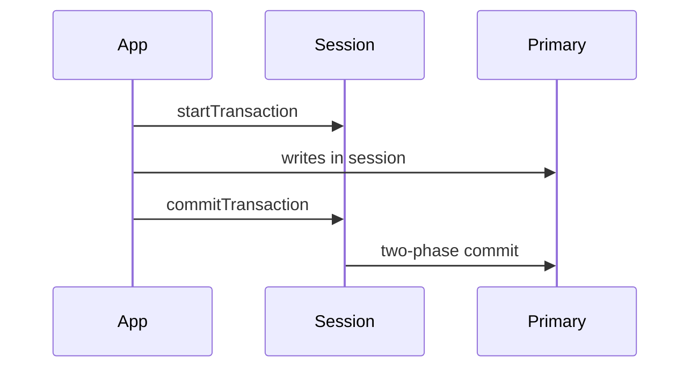

## Executive Summary

Multi-document **ACID transactions** (4.0+ on replica sets, 4.2+ sharded) use **sessions** with snapshot isolation. Prefer single-document atomicity when possible — transactions add latency and oplog overhead.

---

## Core Concepts

| Scope | Atomicity |
| :--- | :--- |
| Single document | Always atomic (including embedded arrays) |
| Multi-document | Transaction required |
| Multi-collection | Same transaction (same replica set / cluster) |
| Cross-shard | Supported 4.2+ with performance cost |



---

## Quick Reference

```javascript
// Shell
session = db.getMongo().startSession()
session.startTransaction({ readConcern: { level: "snapshot" }, writeConcern: { w: "majority" } })
try {
  const orders = session.getDatabase("shop").orders
  const inventory = session.getDatabase("shop").inventory
  orders.insertOne({ orderId: "O1", sku: "X", qty: 1 })
  const r = inventory.updateOne({ sku: "X", qty: { $gte: 1 } }, { $inc: { qty: -1 } })
  if (r.modifiedCount !== 1) throw new Error("insufficient stock")
  session.commitTransaction()
} catch (e) {
  session.abortTransaction()
  throw e
} finally {
  session.endSession()
}
```

---

## Snippets

```java
// Java driver
try (ClientSession session = client.startSession()) {
  session.withTransaction(() -> {
    orders.insertOne(session, new Document("orderId", "O1"));
    inventory.updateOne(session,
        Filters.eq("sku", "X"),
        Updates.inc("qty", -1));
    return null;
  });
}
```

```javascript
// Retryable writes (idempotent with retryWrites=true in URI)
// insertOne, updateOne, deleteOne, replaceOne auto-retry on transient errors
mongodb://host/mydb?retryWrites=true&w=majority
```

---

## Common Gotchas

- Default transaction limit: **60 second** lifetime — configure `transactionLifetimeLimitSeconds`.
- Collections must exist before transaction includes them (or create in prior txn).
- Index/catalog changes inside transactions are restricted.
- High-contention workloads — design for document-level atomicity instead of long transactions.

---

<!-- interview-answers:start -->

# Interview Answers (Top 150)

## How do multi-document transactions change oplog volume and replication lag characteristics?

### Short Answer
The practical MongoDB answer is explicitly defining durability and freshness semantics with write concern, read concern, and read preference for: How do multi-document transactions change oplog volume and replication lag characteristics.

### Detailed Explanation
Replica-set correctness is an SLA decision: critical writes need majority durability, while read routing must document tolerated staleness under elections for: How do multi-document transactions change oplog volume and replication lag characteristics.

### Internal Working
Elections, oplog apply lag, and term changes can surface transient errors or rollbacks, so client retry behavior is part of database design for: How do multi-document transactions change oplog volume and replication lag characteristics.

### Production Notes
You justify it by aligning schema, index, and topology to the access pattern by validating failover drills, lag budgets, and rollback handling using production-like traffic for: How do multi-document transactions change oplog volume and replication lag characteristics.

### Common Mistakes
A frequent failure mode is assuming defaults are safe for money or identity workflows without proving election-time behavior for: How do multi-document transactions change oplog volume and replication lag characteristics.

### Follow-up Questions
Which operations in: How do multi-document transactions change oplog volume and replication lag characteristics must be monotonic, and how does your client contract enforce that?

---
## What architect-level risks exist when using MongoDB as a system of record for financial balances?

### Short Answer
The senior-level decision is modeling to dominant read/write paths, then embedding only where growth is bounded for: What architect-level risks exist when using MongoDB as a system of record for financial balances.

### Detailed Explanation
Schema-first decisions in MongoDB should be query-first in practice, so colocate fields that are read together and externalize unbounded fan-out to references or buckets for: What architect-level risks exist when using MongoDB as a system of record for financial balances.

### Internal Working
Document growth, index fan-out, and update locality decide the true cost profile internally, which is why embedding works best when mutation scope stays narrow for: What architect-level risks exist when using MongoDB as a system of record for financial balances.

### Production Notes
You justify it by balancing latency, durability, and operational toil by replaying realistic tenant skew, cardinality growth, and migration paths before freezing the model for: What architect-level risks exist when using MongoDB as a system of record for financial balances.

### Common Mistakes
A common mistake is copying relational normalization or, conversely, embedding unbounded arrays until 16 MB limits and write amplification appear for: What architect-level risks exist when using MongoDB as a system of record for financial balances.

### Follow-up Questions
What cardinality limit, migration trigger, and fallback model would you define up front to keep: What architect-level risks exist when using MongoDB as a system of record for financial balances safe over 3 years?

---
## What `currentOp` fields identify a long-running transaction blocking others?

### Short Answer
The senior-level decision is using multi-document transactions only where cross-document invariants are mandatory for: What `currentOp` fields identify a long-running transaction blocking others.

### Detailed Explanation
Transactions provide atomicity and snapshot isolation, but they add lock lifetime, retry complexity, and oplog overhead, so model to single-document atomicity first for: What `currentOp` fields identify a long-running transaction blocking others.

### Internal Working
On sharded clusters, commit coordination uses two-phase behavior and can abort on lifetime or conflict pressure, making long transactions operationally expensive for: What `currentOp` fields identify a long-running transaction blocking others.

### Production Notes
You justify it by balancing latency, durability, and operational toil by keeping transactions short, indexed, and explicitly retried with idempotent semantics for: What `currentOp` fields identify a long-running transaction blocking others.

### Common Mistakes
Common mistakes include using transactions to mask poor schema choices or allowing user flows to hold them open too long for: What `currentOp` fields identify a long-running transaction blocking others.

### Follow-up Questions
What invariant in: What `currentOp` fields identify a long-running transaction blocking others cannot be preserved by idempotent single-document updates?

---
## What transaction errors appear when collections don't exist before commit?

### Short Answer
For this question, the architecturally correct answer is using multi-document transactions only where cross-document invariants are mandatory for: What transaction errors appear when collections don't exist before commit.

### Detailed Explanation
Transactions provide atomicity and snapshot isolation, but they add lock lifetime, retry complexity, and oplog overhead, so model to single-document atomicity first for: What transaction errors appear when collections don't exist before commit.

### Internal Working
On sharded clusters, commit coordination uses two-phase behavior and can abort on lifetime or conflict pressure, making long transactions operationally expensive for: What transaction errors appear when collections don't exist before commit.

### Production Notes
You justify it by proving p95/p99 behavior under realistic cardinality by keeping transactions short, indexed, and explicitly retried with idempotent semantics for: What transaction errors appear when collections don't exist before commit.

### Common Mistakes
Common mistakes include using transactions to mask poor schema choices or allowing user flows to hold them open too long for: What transaction errors appear when collections don't exist before commit.

### Follow-up Questions
What invariant in: What transaction errors appear when collections don't exist before commit cannot be preserved by idempotent single-document updates?

---
## How do retryable writes interact with idempotent application logic?

### Short Answer
The practical MongoDB answer is explicitly defining durability and freshness semantics with write concern, read concern, and read preference for: How do retryable writes interact with idempotent application logic.

### Detailed Explanation
Replica-set correctness is an SLA decision: critical writes need majority durability, while read routing must document tolerated staleness under elections for: How do retryable writes interact with idempotent application logic.

### Internal Working
Elections, oplog apply lag, and term changes can surface transient errors or rollbacks, so client retry behavior is part of database design for: How do retryable writes interact with idempotent application logic.

### Production Notes
You justify it by aligning schema, index, and topology to the access pattern by validating failover drills, lag budgets, and rollback handling using production-like traffic for: How do retryable writes interact with idempotent application logic.

### Common Mistakes
A frequent failure mode is assuming defaults are safe for money or identity workflows without proving election-time behavior for: How do retryable writes interact with idempotent application logic.

### Follow-up Questions
Which operations in: How do retryable writes interact with idempotent application logic must be monotonic, and how does your client contract enforce that?

---
## What two-phase commit steps occur on multi-shard transaction commit?

### Short Answer
The senior-level decision is choosing a shard key that preserves query targeting and distributes writes, not just one that looks high-cardinality, for: What two-phase commit steps occur on multi-shard transaction commit.

### Detailed Explanation
In MongoDB sharding, the wrong leading key creates hot chunks, scatter-gather queries, or jumbo chunks, so key choice must follow real filters and time-skew behavior for: What two-phase commit steps occur on multi-shard transaction commit.

### Internal Working
`mongos` routes via config metadata and chunk ranges, so shard-key entropy and monotonicity directly control migration pressure and balancer load for: What two-phase commit steps occur on multi-shard transaction commit.

### Production Notes
You justify it by balancing latency, durability, and operational toil by load-testing chunk distribution, migration rate, and per-shard opcounters before production for: What two-phase commit steps occur on multi-shard transaction commit.

### Common Mistakes
Teams often choose hashed keys that break range locality or ranged keys that hotspot writes because they skipped workload replay for: What two-phase commit steps occur on multi-shard transaction commit.

### Follow-up Questions
How would you prove shard targeting percentage, not just throughput, for: What two-phase commit steps occur on multi-shard transaction commit before launch?

---
## How long can transactions run before `transactionLifetimeLimitSeconds` aborts them?

### Short Answer
The practical MongoDB answer is using multi-document transactions only where cross-document invariants are mandatory for: How long can transactions run before `transactionLifetimeLimitSeconds` aborts them.

### Detailed Explanation
Transactions provide atomicity and snapshot isolation, but they add lock lifetime, retry complexity, and oplog overhead, so model to single-document atomicity first for: How long can transactions run before `transactionLifetimeLimitSeconds` aborts them.

### Internal Working
On sharded clusters, commit coordination uses two-phase behavior and can abort on lifetime or conflict pressure, making long transactions operationally expensive for: How long can transactions run before `transactionLifetimeLimitSeconds` aborts them.

### Production Notes
You justify it by aligning schema, index, and topology to the access pattern by keeping transactions short, indexed, and explicitly retried with idempotent semantics for: How long can transactions run before `transactionLifetimeLimitSeconds` aborts them.

### Common Mistakes
Common mistakes include using transactions to mask poor schema choices or allowing user flows to hold them open too long for: How long can transactions run before `transactionLifetimeLimitSeconds` aborts them.

### Follow-up Questions
What invariant in: How long can transactions run before `transactionLifetimeLimitSeconds` aborts them cannot be preserved by idempotent single-document updates?

---
## When are multi-document transactions an anti-pattern for high-throughput domains?

### Short Answer
The senior-level decision is using multi-document transactions only where cross-document invariants are mandatory for: When are multi-document transactions an anti-pattern for high-throughput domains.

### Detailed Explanation
Transactions provide atomicity and snapshot isolation, but they add lock lifetime, retry complexity, and oplog overhead, so model to single-document atomicity first for: When are multi-document transactions an anti-pattern for high-throughput domains.

### Internal Working
On sharded clusters, commit coordination uses two-phase behavior and can abort on lifetime or conflict pressure, making long transactions operationally expensive for: When are multi-document transactions an anti-pattern for high-throughput domains.

### Production Notes
You justify it by balancing latency, durability, and operational toil by keeping transactions short, indexed, and explicitly retried with idempotent semantics for: When are multi-document transactions an anti-pattern for high-throughput domains.

### Common Mistakes
Common mistakes include using transactions to mask poor schema choices or allowing user flows to hold them open too long for: When are multi-document transactions an anti-pattern for high-throughput domains.

### Follow-up Questions
What invariant in: When are multi-document transactions an anti-pattern for high-throughput domains cannot be preserved by idempotent single-document updates?

---
<!-- interview-answers:end -->

---

## See Also

- [Previous: Sharding](/mongodb-cheatsheet/02-core-mongodb/sharding/)
- [Next: Schema Design](/mongodb-cheatsheet/02-core-mongodb/schema-design/)
- [MongoDB Handbook Index](/mongodb-cheatsheet/)
- [Top 150 Interview Questions](/mongodb-cheatsheet/06-interview-guide/top-150-interview-questions/)
