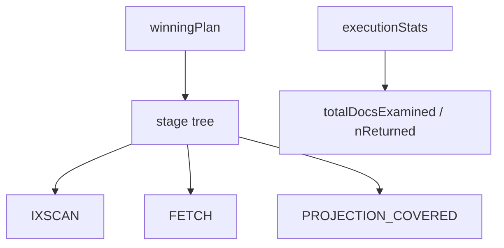

## Quick Revision

- Always use **`explain("executionStats")`** in production tuning.
- Compare **`totalDocsExamined`** to **`nReturned`** — ratio near 1 is ideal.
- Inspect **`winningPlan`** stages: IXSCAN → FETCH vs PROJECTION_COVERED.

## Core Concepts

| Field / stage | Meaning |
| :--- | :--- |
| `winningPlan` | Selected execution tree |
| `rejectedPlans` | Alternatives the planner discarded |
| `executionStats.nReturned` | Documents returned |
| `totalDocsExamined` | Documents scanned |
| `totalKeysExamined` | Index keys scanned |
| `executionTimeMillis` | Server-side time |
| `COLLSCAN` | Collection scan |
| `IXSCAN` | Index scan |
| `FETCH` | Load full document after index |
| `PROJECTION_COVERED` | Index-only result |

## Internal Working



```javascript
db.orders.find({ status: "open" }).sort({ createdAt: -1 }).explain("executionStats")
```

Read `queryPlanner.winningPlan.inputStage` recursively for stage tree. High `totalDocsExamined` with low `nReturned` = wrong or missing index.

## Architecture

Explain on **mongos** for sharded queries shows merge stages and per-shard plans.

## Production Patterns

- Baseline explains before/after index changes.
- Atlas explains integrate with Performance Advisor suggestions.

## Observability

Store explains for regression comparison during schema migrations.

## Troubleshooting

| Pattern | Likely fix |
| :--- | :--- |
| COLLSCAN + high docsExamined | Add compound index (ESR) |
| IXSCAN + high FETCH | Add projection to index (covered query) |
| SORT stage + high memory | Index must support sort order |
| SHARDING_FILTER missing | Query not targeted — add shard key |

## Common Mistakes

- Using `explain()` without `executionStats` — no actual counts.
- Judging staging explains on empty collections.

## Architect Notes

Explain output is the **contract** between application queries and ops — automate checks in CI for critical paths where feasible.

<!-- interview-answers:start -->

# Interview Answers (Top 150)

## How would you debug a query that regressed after a deployment with no index change?

### Short Answer
The practical MongoDB answer is deriving indexes from exact query shapes and ESR ordering, then proving docsExamined efficiency for: How would you debug a query that regressed after a deployment with no index change.

### Detailed Explanation
Index quality is measured by selectivity, sort support, and coverage tradeoffs versus write amplification, not by index count alone, for: How would you debug a query that regressed after a deployment with no index change.

### Internal Working
Planner behavior depends on prefix usability and cardinality estimates, so misplaced fields cause FETCH-heavy plans or full scans for: How would you debug a query that regressed after a deployment with no index change.

### Production Notes
You justify it by aligning schema, index, and topology to the access pattern with continuous index hygiene reviews, explain baselines, and drop policies for stale indexes around: How would you debug a query that regressed after a deployment with no index change.

### Common Mistakes
Teams often over-index every slow query and silently degrade write throughput, memory, and checkpoint I/O for: How would you debug a query that regressed after a deployment with no index change.

### Follow-up Questions
What threshold in scanned/returned ratio should trigger redesign for: How would you debug a query that regressed after a deployment with no index change in your team?

---
## What explains COLLSCAN on a collection you believed was indexed?

### Short Answer
The senior-level decision is deriving indexes from exact query shapes and ESR ordering, then proving docsExamined efficiency for: What explains COLLSCAN on a collection you believed was indexed.

### Detailed Explanation
Index quality is measured by selectivity, sort support, and coverage tradeoffs versus write amplification, not by index count alone, for: What explains COLLSCAN on a collection you believed was indexed.

### Internal Working
Planner behavior depends on prefix usability and cardinality estimates, so misplaced fields cause FETCH-heavy plans or full scans for: What explains COLLSCAN on a collection you believed was indexed.

### Production Notes
You justify it by balancing latency, durability, and operational toil with continuous index hygiene reviews, explain baselines, and drop policies for stale indexes around: What explains COLLSCAN on a collection you believed was indexed.

### Common Mistakes
Teams often over-index every slow query and silently degrade write throughput, memory, and checkpoint I/O for: What explains COLLSCAN on a collection you believed was indexed.

### Follow-up Questions
What threshold in scanned/returned ratio should trigger redesign for: What explains COLLSCAN on a collection you believed was indexed in your team?

---
## How do you use explain output to decide between a new compound index and a covered query rewrite?

### Short Answer
The practical MongoDB answer is deriving indexes from exact query shapes and ESR ordering, then proving docsExamined efficiency for: How do you use explain output to decide between a new compound index and a covered query rewrite.

### Detailed Explanation
Index quality is measured by selectivity, sort support, and coverage tradeoffs versus write amplification, not by index count alone, for: How do you use explain output to decide between a new compound index and a covered query rewrite.

### Internal Working
Planner behavior depends on prefix usability and cardinality estimates, so misplaced fields cause FETCH-heavy plans or full scans for: How do you use explain output to decide between a new compound index and a covered query rewrite.

### Production Notes
You justify it by aligning schema, index, and topology to the access pattern with continuous index hygiene reviews, explain baselines, and drop policies for stale indexes around: How do you use explain output to decide between a new compound index and a covered query rewrite.

### Common Mistakes
Teams often over-index every slow query and silently degrade write throughput, memory, and checkpoint I/O for: How do you use explain output to decide between a new compound index and a covered query rewrite.

### Follow-up Questions
What threshold in scanned/returned ratio should trigger redesign for: How do you use explain output to decide between a new compound index and a covered query rewrite in your team?

---
## What `executionStats` ratio triggers an index creation ticket in your team?

### Short Answer
For this question, the architecturally correct answer is deriving indexes from exact query shapes and ESR ordering, then proving docsExamined efficiency for: What `executionStats` ratio triggers an index creation ticket in your team.

### Detailed Explanation
Index quality is measured by selectivity, sort support, and coverage tradeoffs versus write amplification, not by index count alone, for: What `executionStats` ratio triggers an index creation ticket in your team.

### Internal Working
Planner behavior depends on prefix usability and cardinality estimates, so misplaced fields cause FETCH-heavy plans or full scans for: What `executionStats` ratio triggers an index creation ticket in your team.

### Production Notes
You justify it by proving p95/p99 behavior under realistic cardinality with continuous index hygiene reviews, explain baselines, and drop policies for stale indexes around: What `executionStats` ratio triggers an index creation ticket in your team.

### Common Mistakes
Teams often over-index every slow query and silently degrade write throughput, memory, and checkpoint I/O for: What `executionStats` ratio triggers an index creation ticket in your team.

### Follow-up Questions
What threshold in scanned/returned ratio should trigger redesign for: What `executionStats` ratio triggers an index creation ticket in your team in your team?

---
<!-- interview-answers:end -->

---

## See Also

- [Previous: Query Optimization](/mongodb-cheatsheet/03-query-performance/query-optimization/)
- [Next: Performance](/mongodb-cheatsheet/04-production-operations/performance/)
- [MongoDB Handbook Index](/mongodb-cheatsheet/)
- [Top 150 Interview Questions](/mongodb-cheatsheet/06-interview-guide/top-150-interview-questions/)
