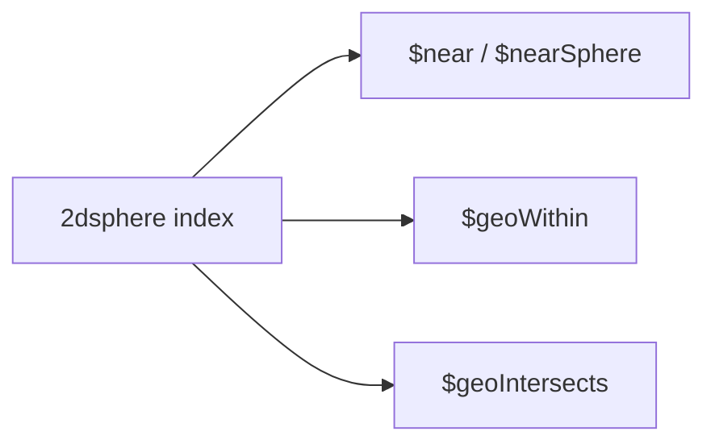

## Executive Summary

MongoDB supports **GeoJSON** geometries on **2dsphere** indexes (spherical earth). Legacy **2d** indexes use flat coordinates — prefer 2dsphere for new work.

---

## Core Concepts

| GeoJSON type | Use |
| :--- | :--- |
| `Point` | Single lat/lng `[longitude, latitude]` |
| `LineString` | Path |
| `Polygon` | Area — first ring is exterior |
| `MultiPoint` / `MultiPolygon` | Collections |



---

## Quick Reference

```javascript
// Index
db.places.createIndex({ location: "2dsphere" })

// Insert GeoJSON Point (note: lng first!)
db.places.insertOne({
  name: "HQ",
  location: { type: "Point", coordinates: [-122.4194, 37.7749] }
})

// Near — sorted by distance (meters on sphere)
db.places.find({
  location: {
    $near: {
      $geometry: { type: "Point", coordinates: [-122.4, 37.77] },
      $maxDistance: 5000
    }
  }
})

// Within polygon
db.places.find({
  location: {
    $geoWithin: {
      $geometry: {
        type: "Polygon",
        coordinates: [[
          [-122.5, 37.7], [-122.3, 37.7], [-122.3, 37.9], [-122.5, 37.9], [-122.5, 37.7]
        ]]
      }
    }
  }
})

// $geoIntersects
db.regions.find({
  boundary: {
    $geoIntersects: {
      $geometry: { type: "Point", coordinates: [-122.42, 37.78] }
    }
  }
})
```

---

## Snippets

```javascript
// Aggregation: distance field
db.places.aggregate([
  { $geoNear: {
      near: { type: "Point", coordinates: [-122.4, 37.77] },
      distanceField: "distMeters",
      spherical: true,
      maxDistance: 10000
  }},
  { $limit: 20 }
])

// 2d legacy (flat plane — deprecated for new apps)
db.legacy.createIndex({ loc: "2d" })
```

---

## Common Gotchas

- Coordinates are **`[longitude, latitude]`** — opposite of common "lat,lng" habit.
- Polygons must be closed (first point equals last) and follow right-hand rule for holes.
- `$near` requires a geospatial index; `$geoWithin` can use `$centerSphere` without GeoJSON.
- Cross-dateline and polar polygons need careful validation.

---

<!-- interview-answers:start -->

# Interview Answers (Top 150)

## How would you debug geospatial queries returning empty results for valid coordinates?

### Short Answer
The practical MongoDB answer is modeling to dominant read/write paths, then embedding only where growth is bounded for: How would you debug geospatial queries returning empty results for valid coordinates.

### Detailed Explanation
Schema-first decisions in MongoDB should be query-first in practice, so colocate fields that are read together and externalize unbounded fan-out to references or buckets for: How would you debug geospatial queries returning empty results for valid coordinates.

### Internal Working
Document growth, index fan-out, and update locality decide the true cost profile internally, which is why embedding works best when mutation scope stays narrow for: How would you debug geospatial queries returning empty results for valid coordinates.

### Production Notes
You justify it by aligning schema, index, and topology to the access pattern by replaying realistic tenant skew, cardinality growth, and migration paths before freezing the model for: How would you debug geospatial queries returning empty results for valid coordinates.

### Common Mistakes
A common mistake is copying relational normalization or, conversely, embedding unbounded arrays until 16 MB limits and write amplification appear for: How would you debug geospatial queries returning empty results for valid coordinates.

### Follow-up Questions
What cardinality limit, migration trigger, and fallback model would you define up front to keep: How would you debug geospatial queries returning empty results for valid coordinates safe over 3 years?

---
<!-- interview-answers:end -->

---

## See Also

- [Previous: Text Search](/mongodb-cheatsheet/03-query-performance/text-search/)
- [Next: Aggregation Pipeline](/mongodb-cheatsheet/03-query-performance/aggregation-pipeline/)
- [MongoDB Handbook Index](/mongodb-cheatsheet/)
- [Top 150 Interview Questions](/mongodb-cheatsheet/06-interview-guide/top-150-interview-questions/)
