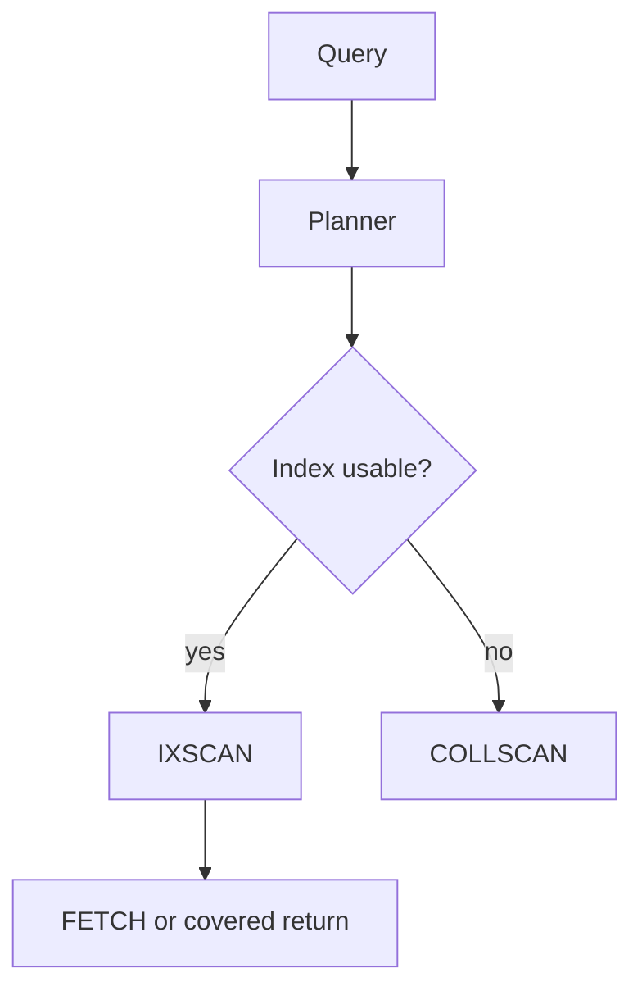

## Quick Revision

- Put **equality** fields first in compound indexes (**ESR**: Equality, Sort, Range).
- Prefer **IXSCAN** over **COLLSCAN**; aim `totalDocsExamined` ≈ `nReturned`.
- In aggregation, place **`$match`** and **`$sort`** early; index **`$lookup`** `foreignField`.

## Core Concepts

| Concept | Guidance |
| :--- | :--- |
| **Query planner** | Chooses winning plan; may use index intersection sparingly |
| **Covered query** | All filter + projection fields in index — no FETCH |
| **COLLSCAN** | Full collection scan — acceptable only on tiny collections |
| **IXSCAN** | Index scan — expected for hot paths |
| **Plan cache** | Reuses plans; `$planCacheStats` for diagnostics |

## Internal Working

Planner evaluates indexes against filter, sort, and projection. Rejected plans appear in `explain("executionStats").queryPlanner.rejectedPlans`.

Compound index `{ a: 1, b: 1, c: 1 }` supports `{a}`, `{a,b}`, `{a,b,c}` prefixes — not `{b}` alone.

## Architecture

Query shape and schema are coupled — embed to avoid `$lookup`; reference when unbounded. See [Schema Design](/mongodb-cheatsheet/02-core-mongodb/schema-design/).

## Design Tradeoffs

| Choice | Trade-off |
| :--- | :--- |
| Many single-field indexes | Flexibility vs write amplification and RAM |
| One compound index | Fast for one pattern; useless for others |
| `$lookup` | Server-side join vs extra round trips |

## Production Patterns

- Run [Explain Plan](/mongodb-cheatsheet/03-query-performance/explain-plan/) on top 10 slow queries monthly.
- Hide unused indexes before drop (`hideIndex`) — validate in staging.
- Pagination: range on indexed field, not large `skip`.

## Scalability

Scatter-gather on sharded collections hits all shards — include shard key equality when possible. See [Sharding](/mongodb-cheatsheet/02-core-mongodb/sharding/).

## Reliability

Index builds on large collections — monitor load; use rolling builds in Atlas.

## Observability

Profiler, `db.currentOp()`, Atlas Performance Advisor, `$indexStats`.

## Troubleshooting

See [Troubleshooting — Slow Queries](/mongodb-cheatsheet/04-production-operations/troubleshooting/#slow-queries).

## Common Mistakes

- Leading wildcard regex (`/.*foo/`) — cannot use index.
- `$where` / `$function` — disables index use.
- `$lookup` without index on `foreignField`.

## Architect Notes

Index design is **access-pattern design** — gather queries before schema freeze.

<!-- interview-answers:start -->

# Interview Answers (Top 150)

## How do you troubleshoot `$lookup` performing COLLSCAN on the foreign collection?

### Short Answer
The practical MongoDB answer is deriving indexes from exact query shapes and ESR ordering, then proving docsExamined efficiency for: How do you troubleshoot `$lookup` performing COLLSCAN on the foreign collection.

### Detailed Explanation
Index quality is measured by selectivity, sort support, and coverage tradeoffs versus write amplification, not by index count alone, for: How do you troubleshoot `$lookup` performing COLLSCAN on the foreign collection.

### Internal Working
Planner behavior depends on prefix usability and cardinality estimates, so misplaced fields cause FETCH-heavy plans or full scans for: How do you troubleshoot `$lookup` performing COLLSCAN on the foreign collection.

### Production Notes
You justify it by aligning schema, index, and topology to the access pattern with continuous index hygiene reviews, explain baselines, and drop policies for stale indexes around: How do you troubleshoot `$lookup` performing COLLSCAN on the foreign collection.

### Common Mistakes
Teams often over-index every slow query and silently degrade write throughput, memory, and checkpoint I/O for: How do you troubleshoot `$lookup` performing COLLSCAN on the foreign collection.

### Follow-up Questions
What threshold in scanned/returned ratio should trigger redesign for: How do you troubleshoot `$lookup` performing COLLSCAN on the foreign collection in your team?

---
## When does index intersection help and when should you avoid relying on it?

### Short Answer
The production-grade answer is deriving indexes from exact query shapes and ESR ordering, then proving docsExamined efficiency for: When does index intersection help and when should you avoid relying on it.

### Detailed Explanation
Index quality is measured by selectivity, sort support, and coverage tradeoffs versus write amplification, not by index count alone, for: When does index intersection help and when should you avoid relying on it.

### Internal Working
Planner behavior depends on prefix usability and cardinality estimates, so misplaced fields cause FETCH-heavy plans or full scans for: When does index intersection help and when should you avoid relying on it.

### Production Notes
You justify it by minimizing cross-shard work and rollback risk with continuous index hygiene reviews, explain baselines, and drop policies for stale indexes around: When does index intersection help and when should you avoid relying on it.

### Common Mistakes
Teams often over-index every slow query and silently degrade write throughput, memory, and checkpoint I/O for: When does index intersection help and when should you avoid relying on it.

### Follow-up Questions
What threshold in scanned/returned ratio should trigger redesign for: When does index intersection help and when should you avoid relying on it in your team?

---
## What projection changes turn an IXSCAN+FETCH into a covered query?

### Short Answer
The practical MongoDB answer is deriving indexes from exact query shapes and ESR ordering, then proving docsExamined efficiency for: What projection changes turn an IXSCAN+FETCH into a covered query.

### Detailed Explanation
Index quality is measured by selectivity, sort support, and coverage tradeoffs versus write amplification, not by index count alone, for: What projection changes turn an IXSCAN+FETCH into a covered query.

### Internal Working
Planner behavior depends on prefix usability and cardinality estimates, so misplaced fields cause FETCH-heavy plans or full scans for: What projection changes turn an IXSCAN+FETCH into a covered query.

### Production Notes
You justify it by aligning schema, index, and topology to the access pattern with continuous index hygiene reviews, explain baselines, and drop policies for stale indexes around: What projection changes turn an IXSCAN+FETCH into a covered query.

### Common Mistakes
Teams often over-index every slow query and silently degrade write throughput, memory, and checkpoint I/O for: What projection changes turn an IXSCAN+FETCH into a covered query.

### Follow-up Questions
What threshold in scanned/returned ratio should trigger redesign for: What projection changes turn an IXSCAN+FETCH into a covered query in your team?

---
## What regex patterns can use indexes and which force COLLSCAN?

### Short Answer
The senior-level decision is deriving indexes from exact query shapes and ESR ordering, then proving docsExamined efficiency for: What regex patterns can use indexes and which force COLLSCAN.

### Detailed Explanation
Index quality is measured by selectivity, sort support, and coverage tradeoffs versus write amplification, not by index count alone, for: What regex patterns can use indexes and which force COLLSCAN.

### Internal Working
Planner behavior depends on prefix usability and cardinality estimates, so misplaced fields cause FETCH-heavy plans or full scans for: What regex patterns can use indexes and which force COLLSCAN.

### Production Notes
You justify it by balancing latency, durability, and operational toil with continuous index hygiene reviews, explain baselines, and drop policies for stale indexes around: What regex patterns can use indexes and which force COLLSCAN.

### Common Mistakes
Teams often over-index every slow query and silently degrade write throughput, memory, and checkpoint I/O for: What regex patterns can use indexes and which force COLLSCAN.

### Follow-up Questions
What threshold in scanned/returned ratio should trigger redesign for: What regex patterns can use indexes and which force COLLSCAN in your team?

---
## What `$expr` queries complicate index use and how do you refactor them?

### Short Answer
For this question, the architecturally correct answer is deriving indexes from exact query shapes and ESR ordering, then proving docsExamined efficiency for: What `$expr` queries complicate index use and how do you refactor them.

### Detailed Explanation
Index quality is measured by selectivity, sort support, and coverage tradeoffs versus write amplification, not by index count alone, for: What `$expr` queries complicate index use and how do you refactor them.

### Internal Working
Planner behavior depends on prefix usability and cardinality estimates, so misplaced fields cause FETCH-heavy plans or full scans for: What `$expr` queries complicate index use and how do you refactor them.

### Production Notes
You justify it by proving p95/p99 behavior under realistic cardinality with continuous index hygiene reviews, explain baselines, and drop policies for stale indexes around: What `$expr` queries complicate index use and how do you refactor them.

### Common Mistakes
Teams often over-index every slow query and silently degrade write throughput, memory, and checkpoint I/O for: What `$expr` queries complicate index use and how do you refactor them.

### Follow-up Questions
What threshold in scanned/returned ratio should trigger redesign for: What `$expr` queries complicate index use and how do you refactor them in your team?

---
<!-- interview-answers:end -->

---

## See Also

- [Previous: Aggregation Pipeline](/mongodb-cheatsheet/03-query-performance/aggregation-pipeline/)
- [Next: Explain Plan](/mongodb-cheatsheet/03-query-performance/explain-plan/)
- [MongoDB Handbook Index](/mongodb-cheatsheet/)
- [Top 150 Interview Questions](/mongodb-cheatsheet/06-interview-guide/top-150-interview-questions/)
