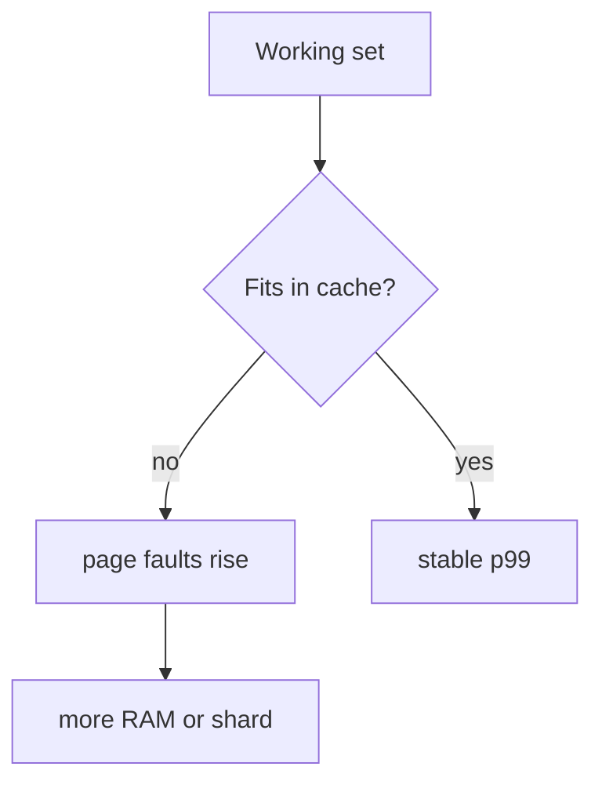

## Quick Revision

- **Working set** = hot data + indexes accessed frequently — should fit in RAM.
- WiredTiger cache ≈ **50% RAM − 1 GB** by default.
- Shard when single replica set saturates **CPU, disk I/O, or working set**.

## Core Concepts

| Dimension | Rule of thumb |
| :--- | :--- |
| RAM | Working set + indexes + 25% headroom |
| Storage | Data + indexes + oplog + journals + 30% free |
| Connections | `maxPoolSize × app_instances` < mongod limit |
| Shards | When vertical scale exhausted or write throughput bound |

## Internal Working

Page faults (`serverStatus.wiredTiger.cache`) indicate working set overflow — latency climbs before OOM.

## Production Patterns

- Growth model: data GB/month × retention × replication factor.
- Pre-split chunks before bulk load on sharded collections.
- Atlas cluster tier upgrades vs horizontal sharding decision tree.

## Scalability

| Signal | Action |
| :--- | :--- |
| Sustained CPU > 70% | Scale tier or shard |
| Disk IOPS saturated | Faster disks or shard |
| Replication lag under write load | Scale primary or shard writes |
| Working set >> RAM | More RAM or archive cold data |

## Architect Notes

Capacity planning ties **schema** (document size), **indexes** (RAM), and **shard key** (distribution) — plan all three together.

<!-- interview-answers:start -->

# Interview Answers (Top 150)

## What signals indicate a workload has outgrown a single replica set before ops teams admit it?

### Short Answer
For this question, the architecturally correct answer is explicitly defining durability and freshness semantics with write concern, read concern, and read preference for: What signals indicate a workload has outgrown a single replica set before ops teams admit it.

### Detailed Explanation
Replica-set correctness is an SLA decision: critical writes need majority durability, while read routing must document tolerated staleness under elections for: What signals indicate a workload has outgrown a single replica set before ops teams admit it.

### Internal Working
Elections, oplog apply lag, and term changes can surface transient errors or rollbacks, so client retry behavior is part of database design for: What signals indicate a workload has outgrown a single replica set before ops teams admit it.

### Production Notes
You justify it by proving p95/p99 behavior under realistic cardinality by validating failover drills, lag budgets, and rollback handling using production-like traffic for: What signals indicate a workload has outgrown a single replica set before ops teams admit it.

### Common Mistakes
A frequent failure mode is assuming defaults are safe for money or identity workflows without proving election-time behavior for: What signals indicate a workload has outgrown a single replica set before ops teams admit it.

### Follow-up Questions
Which operations in: What signals indicate a workload has outgrown a single replica set before ops teams admit it must be monotonic, and how does your client contract enforce that?

---
## How would you blueprint shard count and replica set size in an ADR for a 3-year growth plan?

### Short Answer
The production-grade answer is choosing a shard key that preserves query targeting and distributes writes, not just one that looks high-cardinality, for: How would you blueprint shard count and replica set size in an ADR for a 3-year growth plan.

### Detailed Explanation
In MongoDB sharding, the wrong leading key creates hot chunks, scatter-gather queries, or jumbo chunks, so key choice must follow real filters and time-skew behavior for: How would you blueprint shard count and replica set size in an ADR for a 3-year growth plan.

### Internal Working
`mongos` routes via config metadata and chunk ranges, so shard-key entropy and monotonicity directly control migration pressure and balancer load for: How would you blueprint shard count and replica set size in an ADR for a 3-year growth plan.

### Production Notes
You justify it by minimizing cross-shard work and rollback risk by load-testing chunk distribution, migration rate, and per-shard opcounters before production for: How would you blueprint shard count and replica set size in an ADR for a 3-year growth plan.

### Common Mistakes
Teams often choose hashed keys that break range locality or ranged keys that hotspot writes because they skipped workload replay for: How would you blueprint shard count and replica set size in an ADR for a 3-year growth plan.

### Follow-up Questions
How would you prove shard targeting percentage, not just throughput, for: How would you blueprint shard count and replica set size in an ADR for a 3-year growth plan before launch?

---
## How do page faults manifest in latency and which metrics confirm cache pressure?

### Short Answer
The production-grade answer is treating WiredTiger as a cache-and-checkpoint system where working-set fit decides tail latency for: How do page faults manifest in latency and which metrics confirm cache pressure.

### Detailed Explanation
When effective cache fit degrades, read latency and I/O waits climb sharply, and checkpoint cadence becomes visible in p99 for: How do page faults manifest in latency and which metrics confirm cache pressure.

### Internal Working
MVCC history, eviction pressure, and journal/checkpoint interplay explain most storage-engine performance cliffs for: How do page faults manifest in latency and which metrics confirm cache pressure.

### Production Notes
You justify it by minimizing cross-shard work and rollback risk using cache dirty/used ratios, eviction throughput, and checkpoint duration trendlines for: How do page faults manifest in latency and which metrics confirm cache pressure.

### Common Mistakes
Teams often tune one knob without accounting for index write amplification or long readers pinning history for: How do page faults manifest in latency and which metrics confirm cache pressure.

### Follow-up Questions
Which metric proves the bottleneck in: How do page faults manifest in latency and which metrics confirm cache pressure is cache pressure versus checkpoint writeback?

---
## How do you benchmark working set size before hardware procurement?

### Short Answer
The practical MongoDB answer is modeling to dominant read/write paths, then embedding only where growth is bounded for: How do you benchmark working set size before hardware procurement.

### Detailed Explanation
Schema-first decisions in MongoDB should be query-first in practice, so colocate fields that are read together and externalize unbounded fan-out to references or buckets for: How do you benchmark working set size before hardware procurement.

### Internal Working
Document growth, index fan-out, and update locality decide the true cost profile internally, which is why embedding works best when mutation scope stays narrow for: How do you benchmark working set size before hardware procurement.

### Production Notes
You justify it by aligning schema, index, and topology to the access pattern by replaying realistic tenant skew, cardinality growth, and migration paths before freezing the model for: How do you benchmark working set size before hardware procurement.

### Common Mistakes
A common mistake is copying relational normalization or, conversely, embedding unbounded arrays until 16 MB limits and write amplification appear for: How do you benchmark working set size before hardware procurement.

### Follow-up Questions
What cardinality limit, migration trigger, and fallback model would you define up front to keep: How do you benchmark working set size before hardware procurement safe over 3 years?

---
## What storage growth model includes indexes and oplog for sharded deployments?

### Short Answer
The senior-level decision is choosing a shard key that preserves query targeting and distributes writes, not just one that looks high-cardinality, for: What storage growth model includes indexes and oplog for sharded deployments.

### Detailed Explanation
In MongoDB sharding, the wrong leading key creates hot chunks, scatter-gather queries, or jumbo chunks, so key choice must follow real filters and time-skew behavior for: What storage growth model includes indexes and oplog for sharded deployments.

### Internal Working
`mongos` routes via config metadata and chunk ranges, so shard-key entropy and monotonicity directly control migration pressure and balancer load for: What storage growth model includes indexes and oplog for sharded deployments.

### Production Notes
You justify it by balancing latency, durability, and operational toil by load-testing chunk distribution, migration rate, and per-shard opcounters before production for: What storage growth model includes indexes and oplog for sharded deployments.

### Common Mistakes
Teams often choose hashed keys that break range locality or ranged keys that hotspot writes because they skipped workload replay for: What storage growth model includes indexes and oplog for sharded deployments.

### Follow-up Questions
How would you prove shard targeting percentage, not just throughput, for: What storage growth model includes indexes and oplog for sharded deployments before launch?

---
<!-- interview-answers:end -->

---

## See Also

- [Previous: Backup Recovery](/mongodb-cheatsheet/04-production-operations/backup-recovery/)
- [Next: Mongodb Vs Postgresql](/mongodb-cheatsheet/05-comparisons/mongodb-vs-postgresql/)
- [MongoDB Handbook Index](/mongodb-cheatsheet/)
- [Top 150 Interview Questions](/mongodb-cheatsheet/06-interview-guide/top-150-interview-questions/)
