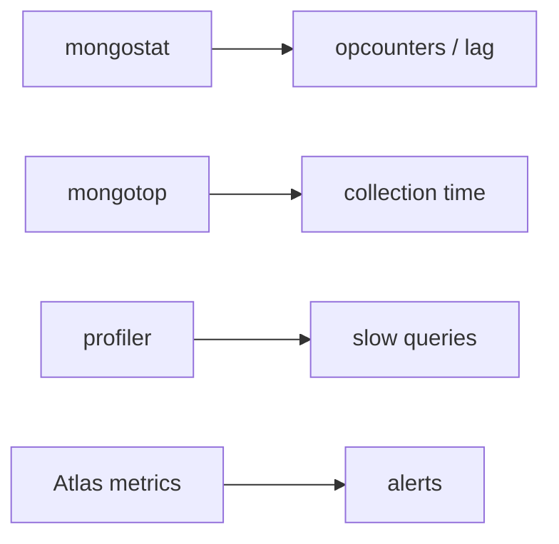

## Quick Revision

- **mongostat** — throughput, opcounters, replication lag columns.
- **mongotop** — per-collection read/write time.
- **Profiler** + Atlas **Performance Advisor** — slow query discovery.
- Alert on **replication lag**, **opcounters** anomalies, **cache pressure**.

## Core Concepts



| Tool | Use |
| :--- | :--- |
| `mongostat` | Live server metrics (5s interval typical) |
| `mongotop` | Collection-level latency breakdown |
| `db.setProfilingLevel(1, { slowms: 100 })` | Capture slow ops |
| `db.currentOp()` | In-flight operations |
| `$indexStats` | Index usage frequency |
| Atlas metrics | CPU, disk IOPS, connections, opcounters, lag |

## Production Patterns

```bash
mongostat --uri "mongodb://..." 5
mongotop --uri "mongodb://..." 5
```

```javascript
db.setProfilingLevel(1, { slowms: 100 })
db.system.profile.find().sort({ ts: -1 }).limit(5)
db.currentOp({ "active": true, "secs_running": { $gt: 3 } })
db.orders.aggregate([{ $indexStats: {} }])
```

## Observability

| Metric | Alert threshold (tune per SLO) |
| :--- | :--- |
| Replication lag | > 10–30s sustained |
| Connections | > 80% of `maxIncomingConnections` |
| Disk utilization | > 75% |
| Cache evictions | Sustained high rate |
| Queued readers/writers | Non-zero sustained |

## Reliability

Lag monitoring on all secondaries; **hidden** and **delayed** nodes need separate dashboards.

## Troubleshooting

Slow query triage → [Explain Plan](/mongodb-cheatsheet/03-query-performance/explain-plan/) → [Troubleshooting](/mongodb-cheatsheet/04-production-operations/troubleshooting/).

## Common Mistakes

- Profiling level 2 in production (full logging) — disk explosion.
- Monitoring primary only on sharded clusters — per-shard visibility required.

## Architect Notes

Observability stack should tie **query shape** (profiler) to **capacity** (mongostat) to **topology** (per-shard lag).

<!-- interview-answers:start -->

# Interview Answers (Top 150)

## How do you kill a runaway aggregation without impacting unrelated workloads?

### Short Answer
The production-grade answer is pushing selective `$match` and projection early, then containing fan-out stages for: How do you kill a runaway aggregation without impacting unrelated workloads.

### Detailed Explanation
Aggregation pipelines stay fast when stage order protects index use and minimizes intermediate document width before `$lookup`, `$group`, or `$facet` for: How do you kill a runaway aggregation without impacting unrelated workloads.

### Internal Working
The optimizer can reorder some stages, but blocking operators still dominate memory and spill behavior under skewed inputs for: How do you kill a runaway aggregation without impacting unrelated workloads.

### Production Notes
You justify it by minimizing cross-shard work and rollback risk by inspecting stage-level execution stats, spill metrics, and cardinality explosions for: How do you kill a runaway aggregation without impacting unrelated workloads.

### Common Mistakes
Typical mistakes are joining before filtering, missing foreign indexes, and normalizing data that should have been embedded for: How do you kill a runaway aggregation without impacting unrelated workloads.

### Follow-up Questions
Which stage in: How do you kill a runaway aggregation without impacting unrelated workloads currently dominates runtime, and do you have evidence that schema change beats pipeline tuning?

---
## What profiler settings are safe for intermittent slow-query capture in production?

### Short Answer
For this question, the architecturally correct answer is modeling to dominant read/write paths, then embedding only where growth is bounded for: What profiler settings are safe for intermittent slow-query capture in production.

### Detailed Explanation
Schema-first decisions in MongoDB should be query-first in practice, so colocate fields that are read together and externalize unbounded fan-out to references or buckets for: What profiler settings are safe for intermittent slow-query capture in production.

### Internal Working
Document growth, index fan-out, and update locality decide the true cost profile internally, which is why embedding works best when mutation scope stays narrow for: What profiler settings are safe for intermittent slow-query capture in production.

### Production Notes
You justify it by proving p95/p99 behavior under realistic cardinality by replaying realistic tenant skew, cardinality growth, and migration paths before freezing the model for: What profiler settings are safe for intermittent slow-query capture in production.

### Common Mistakes
A common mistake is copying relational normalization or, conversely, embedding unbounded arrays until 16 MB limits and write amplification appear for: What profiler settings are safe for intermittent slow-query capture in production.

### Follow-up Questions
What cardinality limit, migration trigger, and fallback model would you define up front to keep: What profiler settings are safe for intermittent slow-query capture in production safe over 3 years?

---
## What index hygiene process prevents unbounded index growth over years?

### Short Answer
For this question, the architecturally correct answer is deriving indexes from exact query shapes and ESR ordering, then proving docsExamined efficiency for: What index hygiene process prevents unbounded index growth over years.

### Detailed Explanation
Index quality is measured by selectivity, sort support, and coverage tradeoffs versus write amplification, not by index count alone, for: What index hygiene process prevents unbounded index growth over years.

### Internal Working
Planner behavior depends on prefix usability and cardinality estimates, so misplaced fields cause FETCH-heavy plans or full scans for: What index hygiene process prevents unbounded index growth over years.

### Production Notes
You justify it by proving p95/p99 behavior under realistic cardinality with continuous index hygiene reviews, explain baselines, and drop policies for stale indexes around: What index hygiene process prevents unbounded index growth over years.

### Common Mistakes
Teams often over-index every slow query and silently degrade write throughput, memory, and checkpoint I/O for: What index hygiene process prevents unbounded index growth over years.

### Follow-up Questions
What threshold in scanned/returned ratio should trigger redesign for: What index hygiene process prevents unbounded index growth over years in your team?

---
## What Atlas Performance Advisor suggestions do you auto-apply versus review?

### Short Answer
For this question, the architecturally correct answer is modeling to dominant read/write paths, then embedding only where growth is bounded for: What Atlas Performance Advisor suggestions do you auto-apply versus review.

### Detailed Explanation
Schema-first decisions in MongoDB should be query-first in practice, so colocate fields that are read together and externalize unbounded fan-out to references or buckets for: What Atlas Performance Advisor suggestions do you auto-apply versus review.

### Internal Working
Document growth, index fan-out, and update locality decide the true cost profile internally, which is why embedding works best when mutation scope stays narrow for: What Atlas Performance Advisor suggestions do you auto-apply versus review.

### Production Notes
You justify it by proving p95/p99 behavior under realistic cardinality by replaying realistic tenant skew, cardinality growth, and migration paths before freezing the model for: What Atlas Performance Advisor suggestions do you auto-apply versus review.

### Common Mistakes
A common mistake is copying relational normalization or, conversely, embedding unbounded arrays until 16 MB limits and write amplification appear for: What Atlas Performance Advisor suggestions do you auto-apply versus review.

### Follow-up Questions
What cardinality limit, migration trigger, and fallback model would you define up front to keep: What Atlas Performance Advisor suggestions do you auto-apply versus review safe over 3 years?

---
## How do you secure mongosh admin access in production break-glass scenarios?

### Short Answer
The production-grade answer is choosing a shard key that preserves query targeting and distributes writes, not just one that looks high-cardinality, for: How do you secure mongosh admin access in production break-glass scenarios.

### Detailed Explanation
In MongoDB sharding, the wrong leading key creates hot chunks, scatter-gather queries, or jumbo chunks, so key choice must follow real filters and time-skew behavior for: How do you secure mongosh admin access in production break-glass scenarios.

### Internal Working
`mongos` routes via config metadata and chunk ranges, so shard-key entropy and monotonicity directly control migration pressure and balancer load for: How do you secure mongosh admin access in production break-glass scenarios.

### Production Notes
You justify it by minimizing cross-shard work and rollback risk by load-testing chunk distribution, migration rate, and per-shard opcounters before production for: How do you secure mongosh admin access in production break-glass scenarios.

### Common Mistakes
Teams often choose hashed keys that break range locality or ranged keys that hotspot writes because they skipped workload replay for: How do you secure mongosh admin access in production break-glass scenarios.

### Follow-up Questions
How would you prove shard targeting percentage, not just throughput, for: How do you secure mongosh admin access in production break-glass scenarios before launch?

---
## How do mongostat opcounters help distinguish read versus write saturation?

### Short Answer
The production-grade answer is choosing a shard key that preserves query targeting and distributes writes, not just one that looks high-cardinality, for: How do mongostat opcounters help distinguish read versus write saturation.

### Detailed Explanation
In MongoDB sharding, the wrong leading key creates hot chunks, scatter-gather queries, or jumbo chunks, so key choice must follow real filters and time-skew behavior for: How do mongostat opcounters help distinguish read versus write saturation.

### Internal Working
`mongos` routes via config metadata and chunk ranges, so shard-key entropy and monotonicity directly control migration pressure and balancer load for: How do mongostat opcounters help distinguish read versus write saturation.

### Production Notes
You justify it by minimizing cross-shard work and rollback risk by load-testing chunk distribution, migration rate, and per-shard opcounters before production for: How do mongostat opcounters help distinguish read versus write saturation.

### Common Mistakes
Teams often choose hashed keys that break range locality or ranged keys that hotspot writes because they skipped workload replay for: How do mongostat opcounters help distinguish read versus write saturation.

### Follow-up Questions
How would you prove shard targeting percentage, not just throughput, for: How do mongostat opcounters help distinguish read versus write saturation before launch?

---
<!-- interview-answers:end -->

---

## See Also

- [Previous: Performance](/mongodb-cheatsheet/04-production-operations/performance/)
- [Next: Troubleshooting](/mongodb-cheatsheet/04-production-operations/troubleshooting/)
- [MongoDB Handbook Index](/mongodb-cheatsheet/)
- [Top 150 Interview Questions](/mongodb-cheatsheet/06-interview-guide/top-150-interview-questions/)
