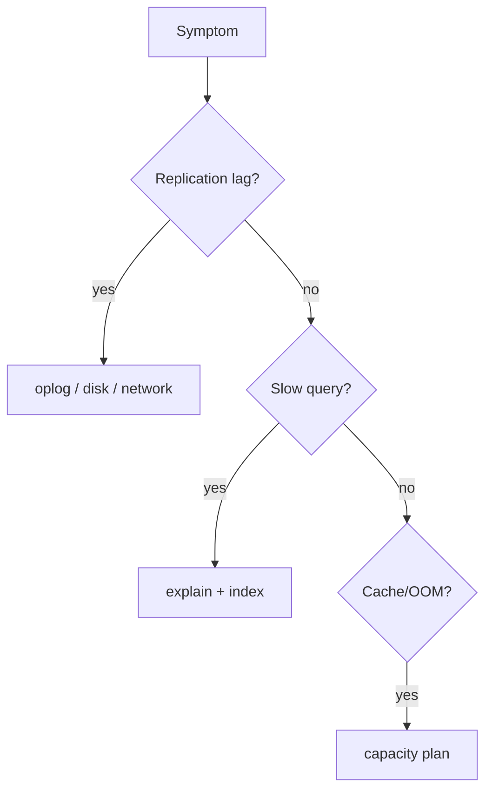

## Quick Revision

- **Replication lag** — disk, oplog size, write burst, network.
- **Slow queries** — explain first; index or reshape query.
- **Hot shard** — monotonic shard key; chunk imbalance.
- **OOM / page faults** — working set exceeds RAM.

## Troubleshooting

### Replication Lag {#replication-lag}

| Cause | Fix |
| :--- | :--- |
| Small oplog | Increase oplog; secondary resync if fallen off |
| Disk saturation | Faster disks; throttle writes |
| Large documents / bulk load | Batch off-peak; scale secondary |
| Network partition | Fix connectivity; verify heartbeat |

### Slow Queries {#slow-queries}

1. `explain("executionStats")` — COLLSCAN? high docsExamined?
2. Profiler / Atlas slow query log.
3. Add compound index (ESR) or covered projection.
4. See [Query Optimization](/mongodb-cheatsheet/03-query-performance/query-optimization/).

### Chunk Imbalance / Jumbo Chunks

- `sh.status()` — uneven chunk distribution.
- Monotonic shard key → single hot chunk.
- Jumbo chunks block balancer — split or reshard migration.

### OOM / Cache Pressure

- Page faults in `serverStatus.wiredTiger.cache`.
- Remedy: RAM, indexes, working set reduction — [Capacity Planning](/mongodb-cheatsheet/04-production-operations/capacity-planning/).

### Lock Contention

- Document-level locks rarely block; long transactions or catalog ops can.
- `db.currentOp()` for long-running ops; `db.killOp()`.

### Election Issues

- Even member count; arbiter-only secondaries don't hold data.
- Priority and network splits — check `rs.status()` and logs.

## Production Patterns

Maintain runbooks linked from on-call playbooks with metric thresholds from [Monitoring](/mongodb-cheatsheet/04-production-operations/monitoring/).

## Architect Notes

Most production incidents are **query + capacity + shard key** — not mysterious engine bugs.

<!-- interview-answers:start -->

# Interview Answers (Top 150)

## How do you triage sustained replication lag on one secondary while others stay current?

### Short Answer
The production-grade answer is explicitly defining durability and freshness semantics with write concern, read concern, and read preference for: How do you triage sustained replication lag on one secondary while others stay current.

### Detailed Explanation
Replica-set correctness is an SLA decision: critical writes need majority durability, while read routing must document tolerated staleness under elections for: How do you triage sustained replication lag on one secondary while others stay current.

### Internal Working
Elections, oplog apply lag, and term changes can surface transient errors or rollbacks, so client retry behavior is part of database design for: How do you triage sustained replication lag on one secondary while others stay current.

### Production Notes
You justify it by minimizing cross-shard work and rollback risk by validating failover drills, lag budgets, and rollback handling using production-like traffic for: How do you triage sustained replication lag on one secondary while others stay current.

### Common Mistakes
A frequent failure mode is assuming defaults are safe for money or identity workflows without proving election-time behavior for: How do you triage sustained replication lag on one secondary while others stay current.

### Follow-up Questions
Which operations in: How do you triage sustained replication lag on one secondary while others stay current must be monotonic, and how does your client contract enforce that?

---
## What steps isolate application slowness from database slowness in a replica set?

### Short Answer
The senior-level decision is explicitly defining durability and freshness semantics with write concern, read concern, and read preference for: What steps isolate application slowness from database slowness in a replica set.

### Detailed Explanation
Replica-set correctness is an SLA decision: critical writes need majority durability, while read routing must document tolerated staleness under elections for: What steps isolate application slowness from database slowness in a replica set.

### Internal Working
Elections, oplog apply lag, and term changes can surface transient errors or rollbacks, so client retry behavior is part of database design for: What steps isolate application slowness from database slowness in a replica set.

### Production Notes
You justify it by balancing latency, durability, and operational toil by validating failover drills, lag budgets, and rollback handling using production-like traffic for: What steps isolate application slowness from database slowness in a replica set.

### Common Mistakes
A frequent failure mode is assuming defaults are safe for money or identity workflows without proving election-time behavior for: What steps isolate application slowness from database slowness in a replica set.

### Follow-up Questions
Which operations in: What steps isolate application slowness from database slowness in a replica set must be monotonic, and how does your client contract enforce that?

---
## What causes jumbo chunks and how do they block the balancer?

### Short Answer
For this question, the architecturally correct answer is choosing a shard key that preserves query targeting and distributes writes, not just one that looks high-cardinality, for: What causes jumbo chunks and how do they block the balancer.

### Detailed Explanation
In MongoDB sharding, the wrong leading key creates hot chunks, scatter-gather queries, or jumbo chunks, so key choice must follow real filters and time-skew behavior for: What causes jumbo chunks and how do they block the balancer.

### Internal Working
`mongos` routes via config metadata and chunk ranges, so shard-key entropy and monotonicity directly control migration pressure and balancer load for: What causes jumbo chunks and how do they block the balancer.

### Production Notes
You justify it by proving p95/p99 behavior under realistic cardinality by load-testing chunk distribution, migration rate, and per-shard opcounters before production for: What causes jumbo chunks and how do they block the balancer.

### Common Mistakes
Teams often choose hashed keys that break range locality or ranged keys that hotspot writes because they skipped workload replay for: What causes jumbo chunks and how do they block the balancer.

### Follow-up Questions
How would you prove shard targeting percentage, not just throughput, for: What causes jumbo chunks and how do they block the balancer before launch?

---
## How would you handle a secondary that fell off the oplog and needs resync?

### Short Answer
The practical MongoDB answer is explicitly defining durability and freshness semantics with write concern, read concern, and read preference for: How would you handle a secondary that fell off the oplog and needs resync.

### Detailed Explanation
Replica-set correctness is an SLA decision: critical writes need majority durability, while read routing must document tolerated staleness under elections for: How would you handle a secondary that fell off the oplog and needs resync.

### Internal Working
Elections, oplog apply lag, and term changes can surface transient errors or rollbacks, so client retry behavior is part of database design for: How would you handle a secondary that fell off the oplog and needs resync.

### Production Notes
You justify it by aligning schema, index, and topology to the access pattern by validating failover drills, lag budgets, and rollback handling using production-like traffic for: How would you handle a secondary that fell off the oplog and needs resync.

### Common Mistakes
A frequent failure mode is assuming defaults are safe for money or identity workflows without proving election-time behavior for: How would you handle a secondary that fell off the oplog and needs resync.

### Follow-up Questions
Which operations in: How would you handle a secondary that fell off the oplog and needs resync must be monotonic, and how does your client contract enforce that?

---
## How would you troubleshoot elections flapping during network instability?

### Short Answer
The practical MongoDB answer is explicitly defining durability and freshness semantics with write concern, read concern, and read preference for: How would you troubleshoot elections flapping during network instability.

### Detailed Explanation
Replica-set correctness is an SLA decision: critical writes need majority durability, while read routing must document tolerated staleness under elections for: How would you troubleshoot elections flapping during network instability.

### Internal Working
Elections, oplog apply lag, and term changes can surface transient errors or rollbacks, so client retry behavior is part of database design for: How would you troubleshoot elections flapping during network instability.

### Production Notes
You justify it by aligning schema, index, and topology to the access pattern by validating failover drills, lag budgets, and rollback handling using production-like traffic for: How would you troubleshoot elections flapping during network instability.

### Common Mistakes
A frequent failure mode is assuming defaults are safe for money or identity workflows without proving election-time behavior for: How would you troubleshoot elections flapping during network instability.

### Follow-up Questions
Which operations in: How would you troubleshoot elections flapping during network instability must be monotonic, and how does your client contract enforce that?

---
## How would you investigate memory climbing until mongod is OOM-killed?

### Short Answer
The practical MongoDB answer is modeling to dominant read/write paths, then embedding only where growth is bounded for: How would you investigate memory climbing until mongod is OOM-killed.

### Detailed Explanation
Schema-first decisions in MongoDB should be query-first in practice, so colocate fields that are read together and externalize unbounded fan-out to references or buckets for: How would you investigate memory climbing until mongod is OOM-killed.

### Internal Working
Document growth, index fan-out, and update locality decide the true cost profile internally, which is why embedding works best when mutation scope stays narrow for: How would you investigate memory climbing until mongod is OOM-killed.

### Production Notes
You justify it by aligning schema, index, and topology to the access pattern by replaying realistic tenant skew, cardinality growth, and migration paths before freezing the model for: How would you investigate memory climbing until mongod is OOM-killed.

### Common Mistakes
A common mistake is copying relational normalization or, conversely, embedding unbounded arrays until 16 MB limits and write amplification appear for: How would you investigate memory climbing until mongod is OOM-killed.

### Follow-up Questions
What cardinality limit, migration trigger, and fallback model would you define up front to keep: How would you investigate memory climbing until mongod is OOM-killed safe over 3 years?

---
## What is your first-hour incident checklist for a primary that won't rejoin the replica set?

### Short Answer
The senior-level decision is explicitly defining durability and freshness semantics with write concern, read concern, and read preference for: What is your first-hour incident checklist for a primary that won't rejoin the replica set.

### Detailed Explanation
Replica-set correctness is an SLA decision: critical writes need majority durability, while read routing must document tolerated staleness under elections for: What is your first-hour incident checklist for a primary that won't rejoin the replica set.

### Internal Working
Elections, oplog apply lag, and term changes can surface transient errors or rollbacks, so client retry behavior is part of database design for: What is your first-hour incident checklist for a primary that won't rejoin the replica set.

### Production Notes
You justify it by balancing latency, durability, and operational toil by validating failover drills, lag budgets, and rollback handling using production-like traffic for: What is your first-hour incident checklist for a primary that won't rejoin the replica set.

### Common Mistakes
A frequent failure mode is assuming defaults are safe for money or identity workflows without proving election-time behavior for: What is your first-hour incident checklist for a primary that won't rejoin the replica set.

### Follow-up Questions
Which operations in: What is your first-hour incident checklist for a primary that won't rejoin the replica set must be monotonic, and how does your client contract enforce that?

---
<!-- interview-answers:end -->

---

## See Also

- [Previous: Monitoring](/mongodb-cheatsheet/04-production-operations/monitoring/)
- [Next: Backup Recovery](/mongodb-cheatsheet/04-production-operations/backup-recovery/)
- [MongoDB Handbook Index](/mongodb-cheatsheet/)
- [Top 150 Interview Questions](/mongodb-cheatsheet/06-interview-guide/top-150-interview-questions/)
