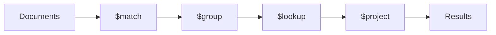

## Executive Summary

The **aggregation pipeline** processes documents through ordered **stages**. Each stage transforms the stream. Use `$match` early to leverage indexes; `$lookup` for server-side joins.

---

## Core Concepts



| Stage | Purpose |
| :--- | :--- |
| `$match` | Filter — like `find`; put first when possible |
| `$project` | Shape fields — include/exclude/compute |
| `$group` | `_id` + accumulators (`$sum`, `$avg`, `$push`) |
| `$sort` | Order results |
| `$limit` / `$skip` | Pagination |
| `$lookup` | Left outer join to another collection |
| `$unwind` | Flatten arrays — one doc per element |
| `$facet` | Parallel sub-pipelines |
| `$bucket` / `$bucketAuto` | Histogram grouping |
| `$merge` / `$out` | Write results to collection |

---

## Quick Reference — Accumulators

| Accumulator | Use |
| :--- | :--- |
| `$sum` | Total or count with `{ $sum: 1 }` |
| `$avg` | Average |
| `$min` / `$max` | Extremes |
| `$first` / `$last` | With `$sort` inside `$group` |
| `$push` / `$addToSet` | Collect values |
| `$mergeObjects` | Merge documents |

---

## Snippets

```javascript
// Revenue by category (last 30 days)
db.orders.aggregate([
  { $match: { createdAt: { $gte: new Date(Date.now() - 30*864e5) } } },
  { $group: {
      _id: "$category",
      revenue: { $sum: "$total" },
      count: { $sum: 1 }
  }},
  { $sort: { revenue: -1 } }
])

// $lookup (correlated subquery style)
db.orders.aggregate([
  { $lookup: {
      from: "customers",
      localField: "customerId",
      foreignField: "_id",
      as: "customer"
  }},
  { $unwind: "$customer" },
  { $project: { orderId: 1, "customer.email": 1, total: 1 } }
])

// $facet — page + total count in one round trip
db.products.aggregate([
  { $match: { inStock: true } },
  { $facet: {
      data: [{ $sort: { price: 1 } }, { $skip: 20 }, { $limit: 10 }],
      meta: [{ $count: "total" }]
  }}
])
```

---

## Common Gotchas

- `$lookup` without index on `foreignField` scans the foreign collection.
- `$group` with large cardinality `_id` can exhaust RAM — use `allowDiskUse: true`.
- 100 MB default in-memory limit per stage — Atlas/server config can raise it.
- `$where` and `$function` disable index use — avoid in hot paths.

---

## Related Topics

- [Previous: Indexes](/mongodb-cheatsheet/indexes/)
- [Next: TTL Index](/mongodb-cheatsheet/ttl-index/)
- [CRUD](/mongodb-cheatsheet/crud/)
- [MongoDB Cheatsheet Index](/mongodb-cheatsheet/)
