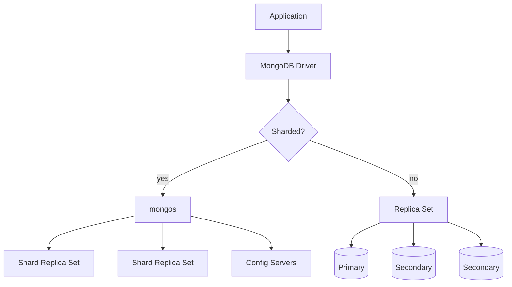

## Executive Summary

**MongoDB** is a document database built around **mongod** (data node), **mongos** (query router for sharded clusters), and optional **config servers**. Storage defaults to **WiredTiger** with document-level locking, compression, and checkpoint-based durability.

---

## Core Concepts



| Component | Role |
| :--- | :--- |
| **mongod** | Stores data; primary or secondary in a replica set |
| **mongos** | Routes queries to correct shard(s); no data storage |
| **Config servers** | Metadata for sharded cluster (chunk ranges, balancer state) |
| **WiredTiger** | Default storage engine — B-tree indexes, document-level locks |
| **oplog** | Capped collection on primary; replication + change streams source |
| **Journal** | Write-ahead log for crash recovery (checkpoints every ~60s) |

---

## Quick Reference

| Deployment | Use when |
| :--- | :--- |
| **Standalone** | Dev only — no HA |
| **Replica set** | Production HA, read scaling, automatic failover |
| **Sharded cluster** | Dataset or write throughput exceeds single node |

| Read concern | Behavior |
| :--- | :--- |
| `local` | Return latest local data (may be rolled back) |
| `majority` | Data acknowledged by majority of nodes |
| `linearizable` | Strongest — single-document linearizability |

| Write concern | Behavior |
| :--- | :--- |
| `{ w: 1 }` | Primary ack only |
| `{ w: "majority" }` | Majority replica ack — durable default for prod |
| `{ j: true }` | Journal flush before ack |

---

## Snippets

```javascript
// Connection strings
mongodb://host1:27017,host2:27017,host3:27017/mydb?replicaSet=rs0
mongodb+srv://cluster.mongodb.net/mydb   // Atlas SRV

// Read preference (driver)
MongoClientSettings.builder()
  .readPreference(ReadPreference.secondaryPreferred())
  .build();
```

```yaml
# replica set member roles (rs.conf())
members:
  - { _id: 0, host: "host1:27017", priority: 2 }   # primary candidate
  - { _id: 1, host: "host2:27017", priority: 1 }
  - { _id: 2, host: "host3:27017", arbiterOnly: true }  # voting only
```

---

## Common Gotchas

- Standalone `mongod` cannot become a replica set member without `rs.initiate()`.
- Arbiters do not hold data — never use them as the only secondary for reads.
- Sharding requires a **shard key** chosen up front; changing it is a major migration.
- `local` read concern on secondaries can return rolled-back writes after failover.

---

## Related Topics

- [Next: Documents](/mongodb-cheatsheet/documents/)
- [Replication](/mongodb-cheatsheet/replication/)
- [Sharding](/mongodb-cheatsheet/sharding/)
- [MongoDB Cheatsheet Index](/mongodb-cheatsheet/)
