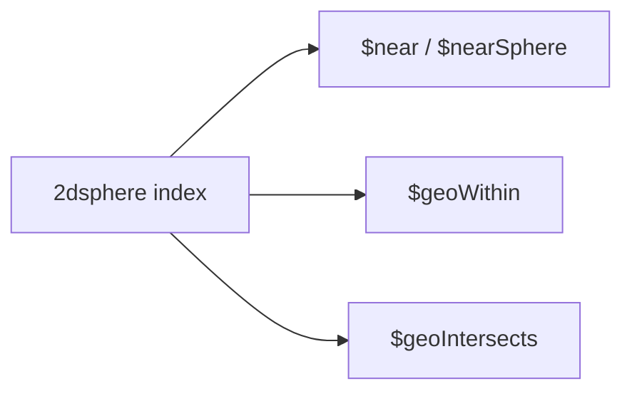

## Executive Summary

MongoDB supports **GeoJSON** geometries on **2dsphere** indexes (spherical earth). Legacy **2d** indexes use flat coordinates — prefer 2dsphere for new work.

---

## Core Concepts

| GeoJSON type | Use |
| :--- | :--- |
| `Point` | Single lat/lng `[longitude, latitude]` |
| `LineString` | Path |
| `Polygon` | Area — first ring is exterior |
| `MultiPoint` / `MultiPolygon` | Collections |



---

## Quick Reference

```javascript
// Index
db.places.createIndex({ location: "2dsphere" })

// Insert GeoJSON Point (note: lng first!)
db.places.insertOne({
  name: "HQ",
  location: { type: "Point", coordinates: [-122.4194, 37.7749] }
})

// Near — sorted by distance (meters on sphere)
db.places.find({
  location: {
    $near: {
      $geometry: { type: "Point", coordinates: [-122.4, 37.77] },
      $maxDistance: 5000
    }
  }
})

// Within polygon
db.places.find({
  location: {
    $geoWithin: {
      $geometry: {
        type: "Polygon",
        coordinates: [[
          [-122.5, 37.7], [-122.3, 37.7], [-122.3, 37.9], [-122.5, 37.9], [-122.5, 37.7]
        ]]
      }
    }
  }
})

// $geoIntersects
db.regions.find({
  boundary: {
    $geoIntersects: {
      $geometry: { type: "Point", coordinates: [-122.42, 37.78] }
    }
  }
})
```

---

## Snippets

```javascript
// Aggregation: distance field
db.places.aggregate([
  { $geoNear: {
      near: { type: "Point", coordinates: [-122.4, 37.77] },
      distanceField: "distMeters",
      spherical: true,
      maxDistance: 10000
  }},
  { $limit: 20 }
])

// 2d legacy (flat plane — deprecated for new apps)
db.legacy.createIndex({ loc: "2d" })
```

---

## Common Gotchas

- Coordinates are **`[longitude, latitude]`** — opposite of common "lat,lng" habit.
- Polygons must be closed (first point equals last) and follow right-hand rule for holes.
- `$near` requires a geospatial index; `$geoWithin` can use `$centerSphere` without GeoJSON.
- Cross-dateline and polar polygons need careful validation.

---

## Related Topics

- [Previous: Text Search](/mongodb-cheatsheet/text-search/)
- [Next: Replication](/mongodb-cheatsheet/replication/)
- [Indexes](/mongodb-cheatsheet/indexes/)
- [MongoDB Cheatsheet Index](/mongodb-cheatsheet/)
