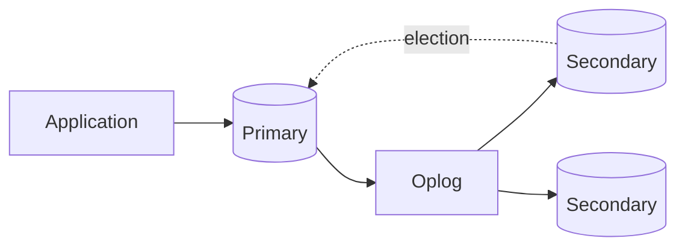

## Executive Summary

A **replica set** is 3+ `mongod` nodes (or 2 data nodes + arbiter — discouraged for prod). One **primary** accepts writes; **secondaries** replicate via the **oplog**. Automatic failover elects a new primary on failure.

---

## Core Concepts



| Term | Meaning |
| :--- | :--- |
| **Primary** | All writes; builds oplog entries |
| **Secondary** | Applies oplog — can serve reads |
| **Arbiter** | Votes only — no data |
| **Priority** | Influences election winner |
| **Hidden** | Replicates but not visible to clients |
| **Delayed** | Lagging secondary for point-in-time recovery |
| **Rollback** | Primary steps down with un-replicated writes |

---

## Quick Reference

```javascript
// Initiate replica set
rs.initiate({
  _id: "rs0",
  members: [
    { _id: 0, host: "mongo1:27017", priority: 2 },
    { _id: 1, host: "mongo2:27017", priority: 1 },
    { _id: 2, host: "mongo3:27017", priority: 1 }
  ]
})

rs.status()
rs.conf()
rs.stepDown(60)           // primary yields for maintenance
rs.add("mongo4:27017")
rs.remove("mongo4:27017")

// Oplog sizing
use local
db.oplog.rs.stats()
```

| Read preference | Behavior |
| :--- | :--- |
| `primary` | Default — always primary |
| `primaryPreferred` | Primary, else secondary |
| `secondary` | Secondaries only — may be stale |
| `secondaryPreferred` | Secondary, else primary |
| `nearest` | Lowest latency member |

---

## Snippets

```javascript
// Driver connection with read preference
// mongodb://mongo1,mongo2,mongo3/mydb?replicaSet=rs0&readPreference=secondaryPreferred

// Change streams (require replica set)
const cs = db.orders.watch([{ $match: { operationType: "insert" } }])

// Write concern for durability
db.orders.insertOne(
  { orderId: "O1" },
  { writeConcern: { w: "majority", j: true } }
)
```

---

## Common Gotchas

- Writes not replicated to majority can be **rolled back** after failover — use `w: "majority"`.
- Read from secondaries without `readConcern: "majority"` may return stale data.
- Arbiters break tie votes but provide no data redundancy — prefer 3 full data nodes.
- Oplog too small — secondaries fall off and need full resync.

---

## Related Topics

- [Previous: Geospatial](/mongodb-cheatsheet/geospatial/)
- [Next: Sharding](/mongodb-cheatsheet/sharding/)
- [Architecture](/mongodb-cheatsheet/architecture/)
- [Transactions](/mongodb-cheatsheet/transactions/)
- [MongoDB Cheatsheet Index](/mongodb-cheatsheet/)
