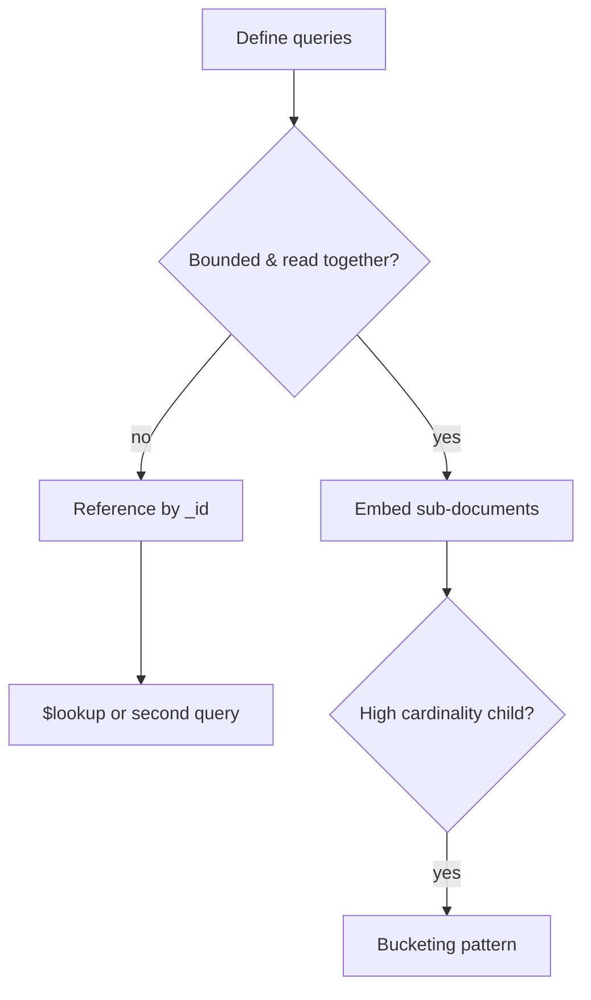

## Executive Summary

Model for **access patterns**, not normalization. **Embed** when data is read together and bounded; **reference** when unbounded, shared, or independently updated. The **16 MB document limit** is the hard ceiling.

---

## Core Concepts



| Pattern | When |
| :--- | :--- |
| **Embedded** | 1:few, always fetched together (order + line items) |
| **Referenced** | 1:many unbounded (user → all orders) |
| **Subset** | Embed last N comments, ref the rest |
| **Bucketing** | Group time-series events per hour/day document |
| **Extended reference** | Store frequently used fields + `_id` to avoid join |
| **Outlier** | Separate collection for unusually large variants |

---

## Quick Reference

```javascript
// Embedded order (typical e-commerce)
{
  _id: ObjectId("..."),
  customerId: "C1",
  items: [
    { sku: "A", qty: 2, price: Decimal128("9.99") }
  ],
  total: Decimal128("19.98"),
  status: "paid"
}

// Reference pattern
// orders: { _id, customerId, ... }
// customers: { _id, email, ... }

// Bucketing: one doc per sensor per day
{
  sensorId: "S1",
  date: ISODate("2026-06-30"),
  readings: [
    { t: ISODate("...T10:00:00Z"), v: 42.1 },
    { t: ISODate("...T10:01:00Z"), v: 42.3 }
  ]
}
```

---

## Snippets

```javascript
// Polymorphic schema with discriminator
db.events.createIndex({ eventType: 1, ts: -1 })
// { eventType: "click", ts: ..., payload: { url: "..." } }
// { eventType: "purchase", ts: ..., payload: { orderId: "..." } }

// Schema validation at collection level
db.createCollection("users", {
  validator: {
    $jsonSchema: {
      bsonType: "object",
      required: ["email"],
      properties: { email: { bsonType: "string", pattern: "^.+@.+$" } }
    }
  }
})
```

---

## Common Gotchas

- Unbounded arrays (`comments`, `events`) will hit 16 MB — bucket or reference.
- Embedding duplicates data — updates must touch every copy or accept staleness.
- Shard key must align with query patterns — schema and sharding are coupled.
- Over-normalizing into many small collections increases round trips.

---

## Related Topics

- [Previous: Transactions](/mongodb-cheatsheet/transactions/)
- [Next: Atlas Basics](/mongodb-cheatsheet/atlas-basics/)
- [Documents](/mongodb-cheatsheet/documents/)
- [Sharding](/mongodb-cheatsheet/sharding/)
- [MongoDB Cheatsheet Index](/mongodb-cheatsheet/)
