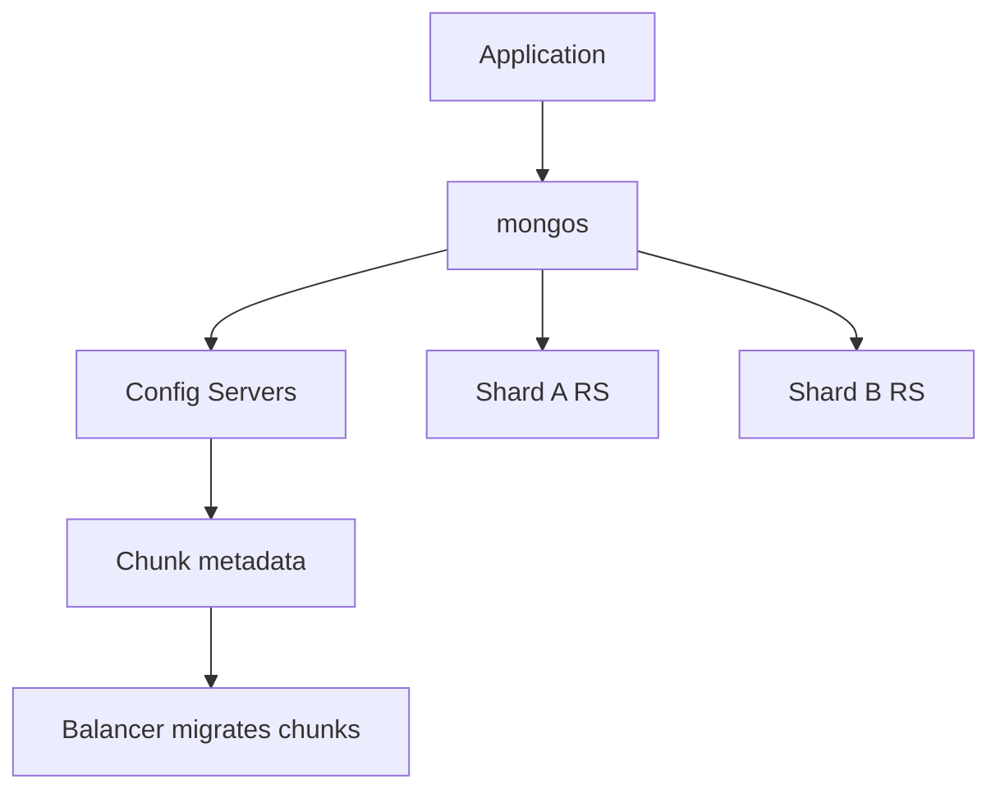

## Executive Summary

**Sharding** horizontally partitions data across shard replica sets. **mongos** routes queries; **config servers** store metadata. The **shard key** is immutable per document and drives distribution.

---

## Core Concepts



| Concept | Detail |
| :--- | :--- |
| **Shard key** | Indexed field(s) — determines chunk |
| **Chunk** | Range of shard key values (default 128 MB) |
| **Balancer** | Migrates chunks between shards |
| **Targeted query** | Includes shard key equality — single shard |
| **Scatter-gather** | No shard key — hits all shards |

---

## Quick Reference

```javascript
// Enable sharding on database
sh.enableSharding("ecommerce")

// Shard collection (choose key carefully!)
sh.shardCollection("ecommerce.orders", { customerId: "hashed" })
// or ranged: { region: 1, orderId: 1 }

sh.status()
db.orders.getShardDistribution()

// Zone sharding (geo / tenant isolation)
sh.addShardToZone("shardA", "EU")
sh.updateZoneKeyRange(
  "ecommerce.orders",
  { region: "EU", orderId: MinKey },
  { region: "EU", orderId: MaxKey },
  "EU"
)
```

| Shard key pattern | Pros | Cons |
| :--- | :--- | :--- |
| **Hashed** (`hashed`) | Even distribution | No range queries on key |
| **Ranged** (compound) | Range locality | Hot shard if monotonic (`_id`, timestamp) |
| **Compound** | Prefix targeting | Design complexity |

---

## Snippets

```javascript
// Good: high-cardinality prefix + hashed suffix
sh.shardCollection("logs.events", { tenantId: 1, _id: "hashed" })

// Bad: monotonic shard key — all writes to one chunk
// sh.shardCollection("events", { createdAt: 1 })  // hot spot

// Pre-split for bulk load
sh.splitAt("ecommerce.orders", { customerId: "M" })
sh.moveChunk("ecommerce.orders", { customerId: "A" }, "shardA")
```

---

## Common Gotchas

- Shard key cannot be changed without re-sharding migration (expensive).
- Unique indexes must **include the shard key** as a prefix.
- `$lookup` across shards works but is slower than co-located data.
- Jumbo chunks block balancer — monitor `sh.status()` and chunk sizes.

---

## Related Topics

- [Previous: Replication](/mongodb-cheatsheet/replication/)
- [Next: Transactions](/mongodb-cheatsheet/transactions/)
- [Architecture](/mongodb-cheatsheet/architecture/)
- [Performance](/mongodb-cheatsheet/performance/)
- [MongoDB Cheatsheet Index](/mongodb-cheatsheet/)
